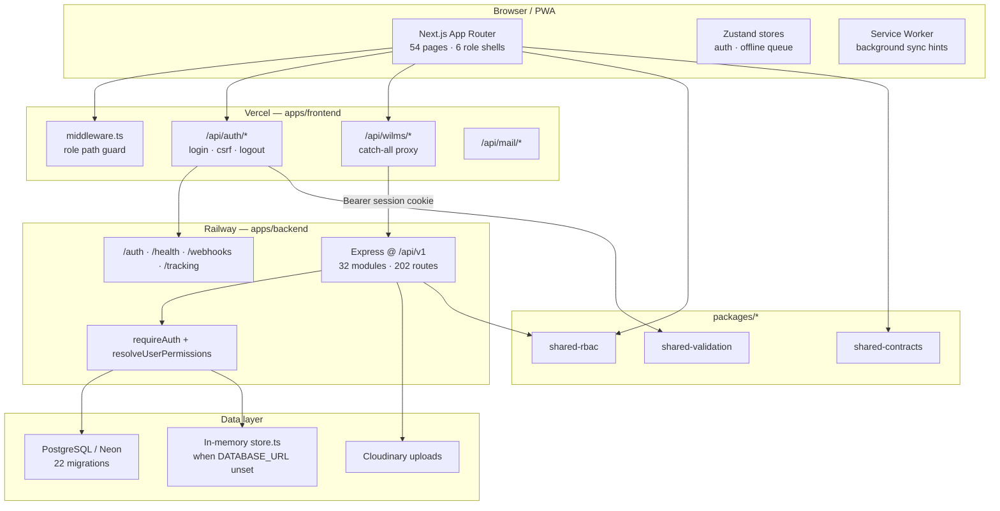
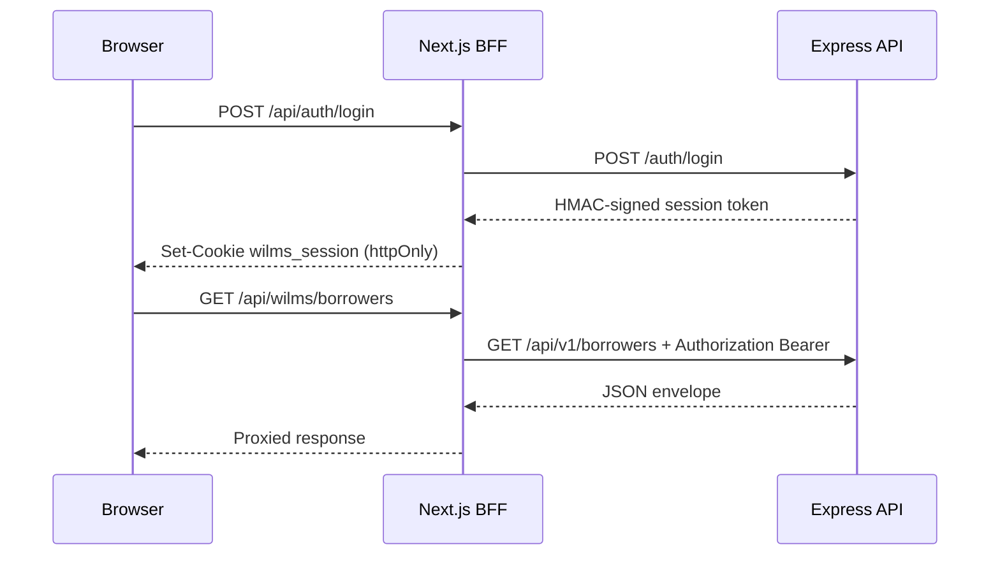

# WILMS — Stage 4.5 Architecture Review

**Audit stage:** 4.5 (Architecture Review)  
**Date:** 2026-07-10  
**Repository:** `e-mond/WILMS`  
**Git ref audited:** `main` @ `2fd3ea3` (includes Stage 4 report + remediation PR #81)  
**Method:** Static review of monorepo layout, module boundaries, BFF/auth/offline flows, shared packages, deployment workflows, and comparison against `docs/architecture/architecture.md`. Local execution of backend Vitest and `verify:api-integrity`. Unauthenticated production `/health` probe. **No code changes were made as part of this stage.**

---

## Executive summary

WILMS is a **npm workspaces monorepo** with a clear three-tier shape: **Next.js 14 BFF + UI** (Vercel), **Express API** (Railway), and **PostgreSQL** (Neon). Five shared packages (`@wilms/shared-rbac`, `shared-contracts`, `shared-validation`, `shared-types`, `shared-utils`) keep RBAC and domain enums aligned across tiers.

The backend follows a **vertical-slice** pattern (32 route modules → services → repositories/domain/infrastructure). The frontend uses **feature folders**, a **data-provider abstraction**, and a **same-origin BFF** (`/api/wilms/*`) so browser clients never hold API secrets.

**Strengths:** transaction-first financial modules with `runInTransaction` + idempotency; conservative offline payment ingest (conflict queue before ledger write); HMAC session tokens with DB session-version invalidation; automated CI gates including API integrity, bundle budgets, and smoke harnesses.

**Main architectural debt:**

1. **`isDatabaseEnabled()` dual persistence** — ~100+ references switch between in-memory `store.ts` and PostgreSQL; demo/local behavior can diverge from production.
2. **Hub coupling** — `settings/service.ts` and `groups/service.ts` are high fan-in/fan-out modules imported across auth, notifications, dashboard, and reports.
3. **Documentation drift** — `docs/architecture/architecture.md` describes a frontend-only monolith and omits BFF, backend, auditor role, and ~15 feature areas present in code.
4. **Offline expense asymmetry** — payments batch through `/sync/offline/batch` with approver review; expenses replay via direct API on reconnect (Stage 3 fix), bypassing the sync conflict pipeline.
5. **Production deploy lag** — live API still reports **v1.2.1 / 17 migrations** vs repo **v1.3.1 / 22 migrations**.

---

## 1. System topology



| Layer | Platform | Package version (repo) | Evidence |
|-------|----------|------------------------|----------|
| Frontend | Vercel | `1.3.1` | `package.json`, `next.config.mjs` |
| API | Railway | `1.3.1` | `apps/backend/package.json` |
| Production API (live) | Railway | **1.2.1** | `/health` 2026-07-10 |
| Database | Neon | 22 migration files | `apps/backend/src/db/migrations/` |

---

## 2. Backend architecture

### 2.1 Layer inventory

| Layer | Path | Count | Responsibility |
|-------|------|-------|----------------|
| HTTP | `apps/backend/src/http/` | 9 files | App factory, envelopes, pagination, errors |
| Modules | `apps/backend/src/modules/` | **32** `routes.ts`, **26** `service.ts` | Vertical domain slices |
| Repositories | `apps/backend/src/repositories/` | **23** files | Drizzle queries |
| Domain | `apps/backend/src/domain/` | **29** files | Pure financial/report logic |
| Infrastructure | `apps/backend/src/infrastructure/` | **41** files | Mail, SMS, uploads, audit, idempotency, permissions |
| DB | `apps/backend/src/db/` | 56 `pgTable`, 22 SQL migrations | Schema, client, persistence facade, seed |
| Middleware | `apps/backend/src/middleware/` | 8 files | Auth, RBAC, validation, rate limits |
| Verification | `apps/backend/src/verification/` | 40+ scripts | Smoke, cert, perf harnesses |

### 2.2 Module mount (post PR #81)

`apps/backend/src/http/app.ts`:

- **Public:** `/health`, `/tracking`, `/webhooks`, `/auth`
- **Business:** single mount at `/api/v1/*`
- **Legacy compat:** middleware rewrites non-public root paths → `/api/v1` (no duplicate router registration)

### 2.3 Typical request path

```
routes.ts → requireAuth / requirePermission → service.ts
  → repository (Drizzle) | domain/*.ts | infrastructure/*
  → runInTransaction / runWithIdempotency (financial writes)
  → sendData / sendPaginatedData
```

### 2.4 Permissions (post Stage 2 remediation)

| Component | Path | Role |
|-----------|------|------|
| Static matrix | `packages/shared-rbac` | Canonical `PERMISSION` × role map |
| API re-export | `infrastructure/permissions/matrix.ts` | Backend import path |
| DB resolver | `infrastructure/permissions/resolve-user-permissions.ts` | `user_roles` + overrides from DB |
| Middleware | `middleware/require-permission.ts` | Async `getRequestPermissions()` |

---

## 3. Frontend architecture

### 3.1 App Router & role shells

**54** `page.tsx` files under `apps/frontend/src/app/`:

| Route group | Purpose | Notable routes |
|-------------|---------|----------------|
| `(super-admin)/` | Full admin portal | loan-pools, communication-center, adjustments, risk-flags |
| `(collector)/` | Field operations | payment, reconciliation, admin-fee, expenses, group sheet |
| `(registration-officer)/` | Registration | `officer/register`, `officer/my-registrations` |
| `(approver)/` | Approvals | pending, reviewed, **`sync-conflicts`** |
| `(auditor)/` | Read-only audit | reports, audit-log *(not in architecture doc)* |
| `(auth)/` | Unauthenticated | login, OTP, password reset, onboarding |
| `/capture/[token]` | Photo capture | Token-gated registration photos |

**Middleware:** `apps/frontend/src/middleware.ts` → `lib/auth/middleware.ts` — session expiry + role-to-path mapping before render.

### 3.2 Feature modules

**~26** folders under `apps/frontend/src/features/` (doc lists 11). Naming diverges from doc:

| Documented | Actual folder |
|------------|---------------|
| `auth/` | `authentication/` |
| `borrower-approval/` | `approval-workflow/` |
| `financial-reports/` | `reports/` |
| — | `loan-pools/`, `communication-center/`, `expenses/`, `sync-conflicts/`, `device-management/`, `app-lock/`, `mobile/`, … |

Pattern per feature: `components/`, `hooks/`, schemas/utils colocated.

### 3.3 Data access strategy

| Mechanism | Path | Behavior |
|-----------|------|----------|
| `IDataProvider` | `data-provider/types.ts` | Single switch for all service interfaces |
| Webpack alias | `next.config.mjs` | `index.development.ts` (mock) vs `index.production.ts` (API) |
| Demo detection | `resolveDataProviderMode()` / `isDemoMode()` | Banner + `USE_MOCK_SERVICES` |
| HTTP client | `utils/apiClient.ts` | Base URL → `/api/wilms`; CSRF on mutations |

**Verified positive (AR45-P04):** UI imports `@/services`, not mock modules directly — enforced by `verify:mock-guard` in CI.

### 3.4 Client state

| Store | Owner | Persistence |
|-------|-------|-------------|
| `authStore` | Auth/session mirror | Hydrated from `getServerSession()` via `AuthHydrator` |
| `offlineQueueStore` | Collector offline queue | Zustand + `localStorage` |
| TanStack Query | Server cache | Per-feature hooks |

---

## 4. Shared packages

| Package | Key exports | Backend use | Frontend use |
|---------|-------------|-------------|--------------|
| `@wilms/shared-rbac` | `USER_ROLE`, `PERMISSION`, `roleHasPermission` | Permission middleware | Layout guards, nav |
| `@wilms/shared-contracts` | `BORROWER_STATUS`, enums | Drizzle `pgEnum` source | Types, forms |
| `@wilms/shared-validation` | Login, borrower ID Zod schemas | `validateBody` | Forms, BFF auth |
| `@wilms/shared-types` | `ApiSuccessEnvelope`, `PaginatedResponse` | `http/response.ts` | Local `types/api.ts` (partial overlap) |
| `@wilms/shared-utils` | Currency, display IDs | Services, reports | Formatting |

Both apps declare workspace `*` deps; Next.js `transpilePackages` includes all five.

**Finding AR45-G05 (Medium):** Offline batch payloads and queue item shapes are **not** in a shared package — frontend `offlineQueueStore` and backend `sync/service.ts` must be kept in sync manually.

---

## 5. BFF & authentication

### 5.1 BFF route inventory

**10** handlers under `apps/frontend/src/app/api/`:

| Route | Purpose |
|-------|---------|
| `wilms/[...path]` | Catch-all → `WILMS_API_UPSTREAM/api/v1/{path}` |
| `auth/login`, `verify-otp`, `complete-onboarding`, `logout`, `csrf` | Session issuance / CSRF token |
| `mail/send`, `mail/gmail` | Server-side mail (secrets off client) |
| `t/o/[token]`, `t/c/[token]/[linkId]` | Email open/click tracking proxies |

### 5.2 Session flow



| Check | Where | Verified |
|-------|-------|----------|
| HMAC verify | API `middleware/authenticate.ts` | Full signature + expiry |
| Session version | API `session.service.ts` | DB `users.sessionVersion` on role/status change |
| Route RBAC | Frontend `middleware.ts` | Decode payload only (no HMAC) |
| CSRF | BFF on mutating `/api/wilms` | Double-submit cookie |
| Cookie flags | `lib/auth/cookies.ts` | httpOnly, sameSite=lax |

**Finding AR45-G08 (Low — by design):** Frontend middleware decodes session payload **without** HMAC verification. Acceptable because the cookie is httpOnly and API calls go through BFF with Bearer forwarding; a forged client-side token cannot reach the API without the cookie.

**Finding AR45-G10 (Low):** Dev mock auth can produce **unsigned** base64 tokens (`encodeSessionPayload`) while production API requires HMAC — mixing mock frontend against live API would fail session validation.

---

## 6. Offline sync architecture

### 6.1 Payment path (conservative)

| Step | Component |
|------|-----------|
| 1 | Collector records payment offline → `offlineQueueStore` |
| 2 | `useOfflineQueueSync` drains FIFO on reconnect / interval / SW message |
| 3 | `paymentSyncHandler` → `POST /api/wilms/sync/offline/batch` |
| 4 | Backend `sync/service.ts` → `QUEUED_FOR_REVIEW` + `offline_sync_conflicts` row |
| 5 | Approver → `/(approver)/sync-conflicts` → approve → `payments/service.recordPayment` |

**Verified positive (AR45-P05):** Financial offline writes do not hit the ledger without human approval.

### 6.2 Expense path (asymmetric)

| Step | Component |
|------|-----------|
| 1 | Collector records expense offline → queue (`RECORD_EXPENSE`) |
| 2 | `expenseSyncHandler` → **direct** `expenseService.createExpense` on reconnect |
| 3 | **No** `/sync/offline/batch` ingest; **no** approver conflict queue |

**Finding AR45-G04 (Medium):** Expense offline replay bypasses the same conflict/review pipeline as payments (introduced in Stage 3 PR #79). Acceptable for v1.3.0 field ops but inconsistent with transaction-first audit posture.

### 6.3 Supporting hooks

| Hook / component | File |
|------------------|------|
| `useOfflineQueueSync` | `hooks/useOfflineQueueSync.ts` |
| `useRecordPaymentOrQueue` | `hooks/useRecordPaymentOrQueue.ts` |
| `useRecordExpenseOrQueue` | `hooks/useRecordExpenseOrQueue.ts` |
| `CollectorOfflineShell` | `components/offline/CollectorOfflineShell.tsx` |
| Battery / storage | `useBatteryStatus`, `useStorageEstimate` |

Backend sync module **requires** `DATABASE_URL` (`requireDatabase()` → 503 without DB).

---

## 7. Deployment & CI/CD

### 7.1 Workflows (`.github/workflows/`)

| Workflow | Trigger | Key steps |
|----------|---------|-----------|
| `ci.yml` | push/PR `main`, `release/**` | type-check, lint, api-integrity, api-coverage, mock-guard, build, bundle/perf budgets, tests, gitleaks |
| `deploy-staging.yml` | CI pass + `ENABLE_STAGING_DEPLOY=true` | `db:migrate` → Railway → Vercel preview → `smoke:staging` |
| `deploy-production.yml` | Manual `workflow_dispatch` | baseline health → migrate → Railway → Vercel prod → `smoke:production` + `smoke:rbac` |

### 7.2 Environment matrix

| Target | Reachable in audit | Evidence |
|--------|-------------------|----------|
| Production `/health` | Yes | v1.2.1, 17 migrations, DB connected |
| Staging | No | Requires org secrets |
| Local full stack | No | No `DATABASE_URL` in agent workspace |

**Finding AR45-G07 (High — operational):** Same deploy drift as Stage 4 A4-G01 — production has not picked up PR #81 remediation (single `/api/v1` mount, indexes `0021`, extended schema health, pagination).

---

## 8. Module coupling & layering

### 8.1 `isDatabaseEnabled()` dual path

| Signal | Value |
|--------|-------|
| References in `apps/backend/src` | **~100+** across 90 files |
| Facade | `db/persistence.ts` (borrowers, payments, groups, admin fees) |
| Inline branches | `settings/service.ts` (18), `groups/service.ts` (16), `communications/service.ts` (14), … |
| Memory implementation | `db/store.ts` (seeded demo data) |

**Finding AR45-G02 (High):** Two runtime modes share one codebase. Production always uses DB; local demo/CI without `DATABASE_URL` exercises alternate code paths (auth OTP, sync, uploads may no-op or error). Increases regression risk when fixes land in only one branch.

### 8.2 Service hub coupling

High fan-in modules (direct `import` from other modules):

| Hub | Imported by (sample) |
|-----|-------------------|
| `settings/service.ts` | `auth/*`, `communications`, `infrastructure/notifications/event-dispatch`, `transactions` |
| `groups/service.ts` | `borrowers/access`, `dashboard`, `collector-portal`, `reports/routes` |
| `payments/service.ts` | `sync/service` (offline approve) |
| `loans/service.ts` | `borrowers/service` |

**Finding AR45-G03 (Medium):** No domain events or message bus — synchronous service-to-service calls create tight coupling and complicate isolated testing. `settings/service.ts` (~1100 LOC) and `groups/service.ts` (~785 LOC) are change blast-radius hotspots.

### 8.3 Layer violations

| Pattern | Example | Finding |
|---------|---------|---------|
| Infrastructure → modules | `event-dispatch.ts` → `settings/service` | **AR45-G09** |
| Domain → modules | `domain/reports/group-risk.ts` → `groups/service` types | **AR45-G06** |
| Routes → multiple services | `reports/routes.ts` imports loans, collectors, groups services | Acceptable for aggregation endpoints |

---

## 9. Documentation drift

`docs/architecture/architecture.md` (248 lines, frontend-only header) vs codebase @ `2fd3ea3`:

| Topic | Document | Code |
|-------|----------|------|
| Scope | Frontend architecture only | Full monorepo (BFF + API + 5 packages) |
| Feature count | 11 folders | ~26 folders |
| Role shells | 5 roles | 6 (+ auditor) |
| Registration path | `/register` | `/officer/register` |
| Mock strategy | Services index swap only | + `IDataProvider`, `resolveDataProviderMode`, demo banner |
| Backend / BFF | Not mentioned | 32 modules, `/api/wilms` proxy |
| Offline sync | High-level v1.3.0 note | Dual handlers (payment batch vs expense direct) |
| Deployment | Not mentioned | Railway + Vercel + Neon |

**Finding AR45-G01 (Medium):** Primary architecture doc is stale; `docs/AGENTS.md` references `context/architecture.md` — a third path — suggesting doc fragmentation.

---

## 10. Findings summary

| ID | Severity | Area | Finding |
|----|----------|------|---------|
| **AR45-G01** | Medium | Docs | `docs/architecture/architecture.md` outdated vs monorepo reality |
| **AR45-G02** | High | Backend | `isDatabaseEnabled()` dual path (~100+ refs); demo vs prod behavioral drift |
| **AR45-G03** | Medium | Backend | Hub coupling on `settings` and `groups` services |
| **AR45-G04** | Medium | Offline | Expense offline replay bypasses sync conflict workflow |
| **AR45-G05** | Medium | Contracts | No shared offline-sync payload package |
| **AR45-G06** | Low | Backend | Domain layer imports module service DTOs |
| **AR45-G07** | High | Ops | Production API v1.2.1 / 17 migrations vs repo v1.3.1 / 22 |
| **AR45-G08** | Low | Auth | Frontend middleware decodes session without HMAC (mitigated by httpOnly + BFF) |
| **AR45-G09** | Low | Layering | Infrastructure imports module services |
| **AR45-G10** | Low | DevEx | Mock unsigned tokens vs production HMAC sessions |

### Verified positives

| ID | Detail |
|----|--------|
| **AR45-P01** | Vertical-slice backend: 32 modules, repositories, domain, infrastructure separation |
| **AR45-P02** | BFF isolates API upstream; CSRF + httpOnly session cookie |
| **AR45-P03** | Five shared packages align RBAC, enums, validation across tiers |
| **AR45-P04** | `IDataProvider` + mock guard prevent direct mock imports in UI |
| **AR45-P05** | Offline payments → conflict queue before ledger (conservative financial design) |
| **AR45-P06** | CI pipeline: type-check, api-integrity (166/166), tests, bundle/perf budgets, gitleaks |
| **AR45-P07** | DB-backed permission resolver wired post Stage 2 (PR #79) |
| **AR45-P08** | Single `/api/v1` mount + legacy rewrite post Stage 4 remediation (PR #81) |

---

## 11. Runtime evidence (this session)

| Check | Result |
|-------|--------|
| `node scripts/rc1-api-integrity.mjs` | **PASS** — 166 matched, 0 missing |
| `npm run test -w @wilms/api` | **PASS** — 90/90 |
| Production `GET /health` | **200** — v1.2.1, 17 migrations |
| Staging / E2E / authenticated smoke | **Not run** — no credentials |
| Frontend Vitest full shard | **Not re-verified** — shard 2 OOM noted in Stage 0 |

---

## 12. Cross-stage references

| Item | Prior stage |
|------|-------------|
| RBAC resolver + portal permissions | Stage 2 PR #79 |
| Offline expense handler + dual `useOfflineQueueSync` | Stage 3 PR #79 |
| API integrity, pagination, `/api/v1` mount | Stage 4 PR #80–#81 |
| Webhook / tracking public routes | Stage 1 S1-H01–H03 |
| Production migration drift | Stage 0 baseline, Stage 4 A4-G01 |

---

## 13. Recommendations (report only — not implemented)

1. **AR45-G01:** Rewrite `docs/architecture/architecture.md` as a monorepo architecture doc (BFF, API, packages, deploy, offline, roles) or add `docs/architecture/system-overview.md` and link from README.
2. **AR45-G02:** Gradually retire in-memory path for modules that require DB in production (sync, OTP, communications); keep `store.ts` only for explicit `NEXT_PUBLIC_DEMO_MODE` with a single facade entry point.
3. **AR45-G03:** Extract `settings` read interfaces (admin fee, integrations, org config) into `infrastructure/settings-reader.ts` to invert dependency direction.
4. **AR45-G04:** Route expense offline items through `/sync/offline/batch` with a review policy (or document intentional asymmetry in ADR).
5. **AR45-G05:** Add `@wilms/shared-offline-sync` with batch schema + queue item types shared by frontend store and backend ingest.
6. **AR45-G07:** Execute production deploy + migration through `0021` (carried from Stage 4).

---

## 14. Next stage

**Stage 5 — Frontend / Accessibility / Performance** (per audit program in `BASELINE.md` §7): dead-code grep, bundle analyzer output, Lighthouse/axe where runnable, and frontend test shard stability.

---

*End of Stage 4.5 Architecture Review.*
