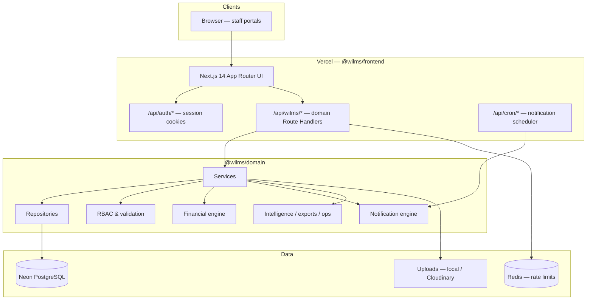
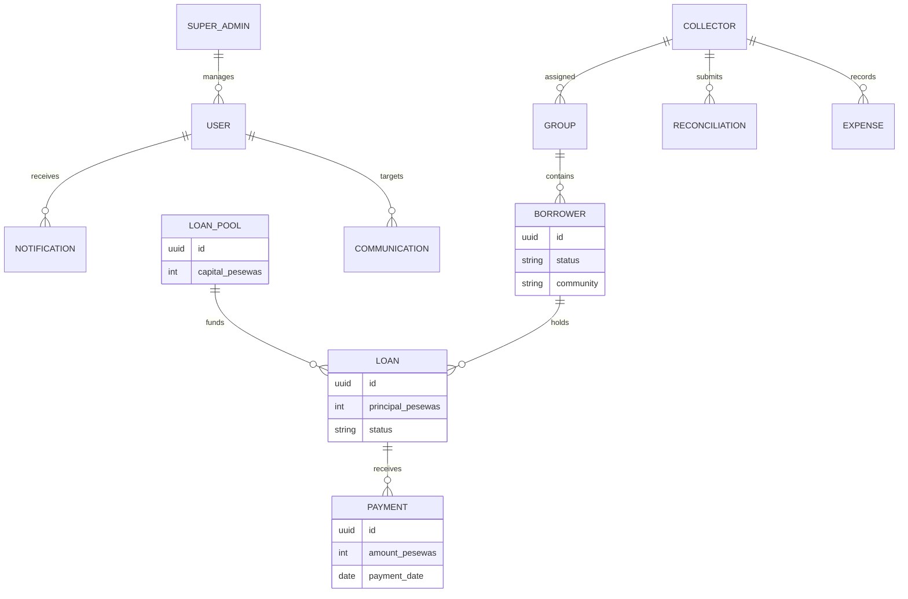
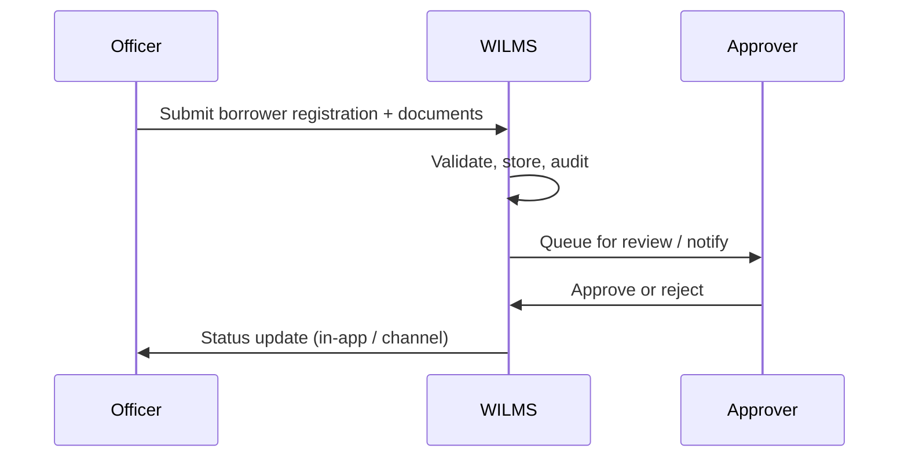
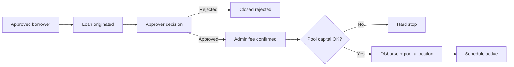
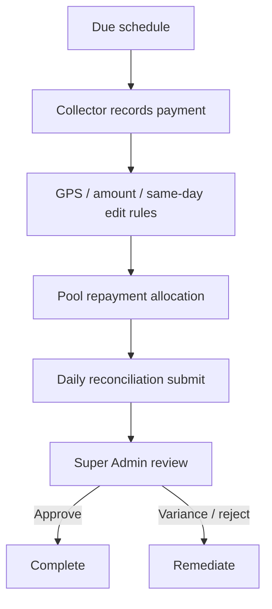
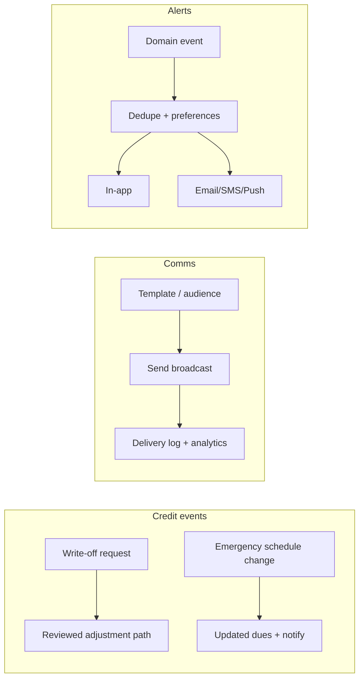

# WILMS — Women’s Interest-Free Loan Management System

[](VERSION.md)
[](#2-executive-overview)
[](package.json)
[](apps/frontend/package.json)
[](tsconfig.base.json)
[](#19-database--migrations)
[](#22-build--deployment)
[](#29-license)
[](#22-build--deployment)
[](#21-testing)

**WILMS** is a production-grade operational platform for managing women’s interest-free group lending programmes. It covers the full lending lifecycle — registration, approval, disbursement, weekly collections, reconciliation, expenses, communications, executive reporting, forecasting, and audit — with strong RBAC, financial integrity controls, and Vercel + Neon deployment.

| Field | Value |
| --- | --- |
| **Current release** | [`v1.8.0`](VERSION.md) |
| **Maturity** | Production operational platform (market packaging) |
| **Primary deployment** | [wilms.vercel.app](https://wilms.vercel.app) |
| **Runtime** | Node.js **22.x** |
| **Data store** | Neon PostgreSQL (Drizzle ORM) |
| **Auth model** | Custom HMAC-signed session cookies (`wilms_session`) |

> **Single entry point.** This README is the authoritative repository overview. Deep-dive docs live under [`docs/`](docs/README.md). The official product library lives under [`documentation/`](documentation/DOCUMENTATION_LIBRARY_INDEX.md) and is readable in-app at **/documentation** (Documentation Centre). Release evidence packs live under [`docs/v1.8.0/`](docs/v1.8.0/).

---

## Table of contents

1. [Project title and badges](#1-project-title-and-badges)
2. [Executive overview](#2-executive-overview)
3. [Key capabilities](#3-key-capabilities)
4. [Architecture overview](#4-architecture-overview)
5. [Repository structure](#5-repository-structure)
6. [Technology stack](#6-technology-stack)
7. [Core domain model](#7-core-domain-model)
8. [Financial model](#8-financial-model)
9. [User roles and permissions](#9-user-roles-and-permissions)
10. [Workflow diagrams](#10-workflow-diagrams)
11. [Features by module](#11-features-by-module)
12. [UI / UX overview](#12-ui--ux-overview)
13. [Notification system](#13-notification-system)
14. [Reporting & analytics](#14-reporting--analytics)
15. [Operations & observability](#15-operations--observability)
16. [Security model](#16-security-model)
17. [Installation](#17-installation)
18. [Environment variables](#18-environment-variables)
19. [Database & migrations](#19-database--migrations)
20. [Development workflow](#20-development-workflow)
21. [Testing](#21-testing)
22. [Build & deployment](#22-build--deployment)
23. [Performance](#23-performance)
24. [Accessibility](#24-accessibility)
25. [Documentation map](#25-documentation-map)
26. [Roadmap](#26-roadmap)
27. [Contributing](#27-contributing)
28. [Support](#28-support)
29. [License](#29-license)
30. [Final project summary](#30-final-project-summary)

---

## 1. Project title and badges

**WILMS — Women’s Interest-Free Loan Management System**

Badges at the top of this document reflect the current production release posture: **v1.8.0**, Node 22, Next.js 14, TypeScript (strict), Neon PostgreSQL, Vercel deployment, and proprietary licensing.

Related version artefacts:

| Artefact | Location |
| --- | --- |
| Release identity | [`VERSION.md`](VERSION.md) |
| Change history | [`CHANGELOG.md`](CHANGELOG.md) |
| Package versions | Root + workspace `package.json` files (`1.8.0`) |
| Release pack | [`docs/v1.8.0/`](docs/v1.8.0/) |

---

## 2. Executive overview

### What WILMS is

WILMS is an enterprise operational system for **interest-free microfinance programmes** that serve women borrowers organised in community groups. It digitises field collection, headquarters approval, capital pool accounting, communications, and executive oversight in one cohesive platform.

### Why it exists

Paper-based and spreadsheet-based lending programmes struggle with:

- inconsistent collection recording
- weak separation of duties
- delayed visibility into portfolio risk
- fragile reconciliation between field cash and system balances
- limited auditability for donors, NGOs, and institutional partners

WILMS provides a controlled digital operating system for those workflows.

### Who it is for

| Audience | How they use WILMS |
| --- | --- |
| Field collectors | Record payments, fees, expenses; reconcile daily cash |
| Registration officers | Register borrowers and capture documents |
| Approvers | Review applications and loan decisions |
| Super Admins | Run the programme, pools, users, expenses, communications, ops |
| Auditors | Review reports and audit logs without mutation rights |
| Product / programme managers | Track KPIs, forecasts, and operational health |
| DevOps / engineers | Deploy, migrate, monitor, and harden the platform |
| NGO / government / institutional partners | Evaluate controls, reporting, and operational maturity |

### Problems it solves

- End-to-end borrower and loan lifecycle control
- Interest-free pool capital accounting with hard stops on over-disbursement
- Field-to-HQ reconciliation with maker-checker review
- Multi-channel notifications with deduplication and quiet hours
- Executive intelligence, forecasting, and exportable compliance artefacts
- Role-scoped portals with permission overrides and force-logout

### Maturity and production readiness (v1.8.0)

| Dimension | Status |
| --- | --- |
| Core lending workflows | Production |
| Financial integrity controls | Production (operational ledger; statutory GL planned for v2.0) |
| RBAC / audit | Production |
| Communication center | Production (v1.6+) |
| Executive reporting & forecasting | Production (v1.7+) |
| Export center & ops incidents | Production (v1.7+) |
| Holidays (Ghana provider + enrichment) | Production (**v1.8.0**) |
| Automation engine & Settings controls | Production (**v1.8.0**) |
| Field-critical offline (payments / expenses / holiday create) | Production (**v1.8.0**) |
| Enterprise UI / CSP-safe self-hosted fonts | Production (**v1.8.0**) |
| Deployment model | Full-stack on **Vercel** + **Neon** |
| Borrower self-service portal | Not in scope for v1.8.0 |

---

## 3. Key capabilities

| Capability | Summary |
| --- | --- |
| **Borrower lifecycle** | Registration, document capture, approval, profile management, risk flags |
| **Loan management** | Origination, approval/rejection, disbursement, schedules, rescheduling, closure |
| **Pool accounting** | Capital injection, disbursement allocation, repayment allocation, utilisation |
| **Collections** | Weekly instalments, GPS-backed field capture, same-day edit window, overdue ladder |
| **Reconciliation** | Daily cash vs expected vs recorded, variance review, Super Admin approval |
| **Expenses** | Field/office expense submit → approve/reject with in-app alerts and ledger impact |
| **Notifications** | In-app, email, SMS, push; scheduler; dedupe; escalation |
| **Communication center** | Audiences, templates, broadcasts, delivery analytics |
| **Executive reporting** | Portfolio KPIs, PAR-style aging views, write-offs, compliance pack |
| **Forecasting** | Schedule-based collection forecasts and early-warning thresholds |
| **Audit logging** | Immutable operational audit trail for sensitive actions |
| **RBAC** | Role defaults + per-user permission overrides |
| **Operations dashboard** | Health, workers, financial snapshot, incidents, maintenance windows |
| **Exports** | Tracked CSV / Excel / PDF export jobs |
| **Workflow automation** | Automation engine: reminder/escalation ladders, follow-ups, Settings enable/run |
| **Holidays** | Ghana public holiday sync, impact preview, collector holiday requests |
| **Offline field ops** | Queue + sync for payments, expenses, holiday creates; shell cache for reads |

---

## 4. Architecture overview

WILMS is a **modular monolith**: a Next.js App Router frontend hosts domain HTTP via Route Handlers, with shared domain logic in `@wilms/domain`. Production targets a single Vercel deployment backed by Neon PostgreSQL.



### Runtime notes

- **Default production path:** in-process Route Handlers (no separate API host required).
- **Optional dual-run:** `WILMS_API_MODE=proxy` + `WILMS_API_UPSTREAM` for a standalone Express process (`npm run dev:api`) during local dual-run or rollback drills.
- **Authentication:** custom HMAC session cookies — **not** Auth.js / NextAuth.
- **Money:** integer **pesewas** end-to-end; UI formats as GHS.

---

## 5. Repository structure

```text
WILMS/
├── apps/
│   ├── frontend/          # Next.js 14 app (@wilms/frontend) — UI + Route Handlers
│   └── backend/           # Thin @wilms/api adapter for optional Express dual-run
├── packages/
│   ├── domain/            # @wilms/domain — services, DB, migrations, notifications
│   ├── shared-contracts/  # Shared API/domain contracts
│   ├── shared-rbac/       # Roles & permissions source of truth
│   ├── shared-types/      # Shared TypeScript types
│   ├── shared-utils/      # Shared utilities (IDs, formatting helpers)
│   └── shared-validation/ # Shared Zod / validation schemas
├── docs/                  # Architecture, ops, security, release packs
├── scripts/               # Verification, budgets, drills, codegen helpers
├── data/                  # Reference datasets (e.g. Ghana locations)
├── CHANGELOG.md
├── VERSION.md
├── CONTRIBUTING.md
└── package.json           # npm workspaces root (wilms@1.8.0)
```

| Path | Purpose |
| --- | --- |
| `apps/frontend` | Staff portals, BFF/proxy route, cron entrypoints, PWA assets |
| `apps/backend` | Optional Express host wrapping `@wilms/domain` |
| `packages/domain` | Business logic, Drizzle schema/migrations, schedulers, tests |
| `packages/shared-*` | Cross-cutting contracts, RBAC, types, validation |
| `docs/` | Authoritative documentation hub and release evidence |
| `scripts/` | Version, migration, integrity, performance, backup drills |

---

## 6. Technology stack

| Layer | Technology |
| --- | --- |
| **Frontend** | Next.js 14 (App Router), React 18, TanStack Query, TypeScript (strict) |
| **UI** | Tailwind CSS, shadcn/ui-style primitives, Lucide icons |
| **Backend / domain** | `@wilms/domain` modular services hosted in Route Handlers (Express dual-run optional) |
| **Database** | Neon PostgreSQL |
| **ORM** | Drizzle ORM + SQL migrations |
| **Authentication** | Custom HMAC-signed `wilms_session` cookie / Bearer session |
| **Authorization** | `@wilms/shared-rbac` role matrix + per-user overrides |
| **Notifications** | In-app inbox, email (SMTP/Resend/Gmail), SMS (SMSNotifyGH), Web Push |
| **Reporting** | Executive intelligence, portfolio/aging/write-off reports, Export Center |
| **Scheduler** | Vercel Cron → `/api/cron/notifications` |
| **Caching / limits** | Redis (`REDIS_URL` / `WILMS_REDIS_URL`) for production rate limiting |
| **Uploads** | Local disk (dev) or Cloudinary (prod) |
| **Testing** | Vitest (frontend + domain), Playwright e2e, smoke/verify scripts |
| **Deployment** | Vercel (frontend/full-stack) + Neon |
| **Developer tooling** | npm workspaces, Turborepo-compatible scripts, ESLint, Node 22 |

---

## 7. Core domain model



| Entity | Description |
| --- | --- |
| **Borrowers** | Programme members; statused through registration → active → closed/blacklisted |
| **Groups** | Community lending units with leaders, members, payment day, collector assignment |
| **Collectors** | Field staff recording collections, fees, expenses, reconciliations |
| **Registration officers** | Capture borrower registrations and documents |
| **Approvers** | Maker-checker for applications and loans |
| **Auditors** | Read-focused reporting and audit access |
| **Super Admins** | Full programme administration and system control |
| **Loan pools** | Capital sources with append-only allocation ledger |
| **Loans** | Interest-free principal with schedules and balances |
| **Payments** | Confirmed collections allocated to obligations / pools |
| **Reconciliations** | Daily field cash attestation and HQ review |
| **Expenses** | Operating spend pending approval (does not reduce loan principal) |
| **Communications** | Broadcasts/templates/audiences across channels |
| **Notifications** | Per-user in-app (and multi-channel) alerts |

---

## 8. Financial model

WILMS manages **interest-free** loans. There is **no interest accrual engine**. All monetary values are stored as integer **pesewas**.

> WILMS is an **operational** financial system (pool ledger + payment journal). It is **not** yet a statutory double-entry general ledger. GL / multi-branch accounting is planned for **v2.0**.

### Money chain

1. Borrower registration and approval (role-gated)
2. Admin fee confirmation before disbursement
3. Pool capital hard-stop if available capital is insufficient
4. Disbursement writes pool `DISBURSEMENT` allocation
5. Collections apply full weekly amount rules (oldest obligation first)
6. Reversals unwind allocations under controlled paths
7. Expenses affect **operating cash**, not loan principal
8. Dashboards/reports prefer SQL aggregates; oversized unpaginated lists fail closed (**422**)

### Pool ledger

| Event | Allocation type | Effect |
| --- | --- | --- |
| Capital injection | `REPLENISHMENT` | Increases pool capital |
| Loan disbursed | `DISBURSEMENT` | Increases disbursed; reduces available |
| Borrower repayment | `REPAYMENT` | Increases collected; reduces outstanding |
| Manual correction | `ADJUSTMENT` | Audited capital correction |

### Core formulas

```text
disbursed_pesewas      = SUM(DISBURSEMENT allocations)
collected_pesewas      = SUM(REPAYMENT allocations)
outstanding_pesewas    = MAX(disbursed − collected, 0)
available_capital      = capital_pesewas − outstanding_pesewas
utilisation_percent    = MIN(ROUND(disbursed / capital × 100), 100)
repayment_rate_percent = ROUND(collected / disbursed × 100, 1)   # when disbursed > 0

net_collections_after_expenses = MAX(total_collected − approved_expenses, 0)
net_operating_cash             = collections + admin_fees_collected − expenses

variance_pesewas               = collected_pesewas − expected_pesewas
primary_variance               = physical_cash − expected_due
collection_delta               = physical_cash − system_recorded
```

Authoritative detail: [`docs/FINANCIAL_MODEL.md`](docs/FINANCIAL_MODEL.md), [`docs/financial-calculations.md`](docs/financial-calculations.md).

---

## 9. User roles and permissions

### Role responsibilities

| Role | Primary responsibility |
| --- | --- |
| **Super Admin** | Programme control, users, pools, expenses review, communications, ops, settings |
| **Collector** | Field collections, admin fees, expenses, daily reconciliation |
| **Registration Officer** | Borrower registration and document capture |
| **Approver** | Application / loan review and decision |
| **Auditor** | Reports and audit visibility without operational mutation |

### Permission matrix (summary)

Source of truth: [`packages/shared-rbac`](packages/shared-rbac) and [`docs/permission-matrix.md`](docs/permission-matrix.md).

| Capability area | Collector | Officer | Approver | Auditor | Super Admin |
| --- | :---: | :---: | :---: | :---: | :---: |
| Portal access (own) | ✓ | ✓ | ✓ | ✓ | ✓ |
| Register / edit pending borrowers | partial | ✓ | | | ✓ |
| Record collections / expenses | ✓ | | | | ✓ |
| Approve loans / applications | | | ✓ | | ✓ |
| View reports / export | | | | ✓ | ✓ |
| View audit log | | | | ✓ | ✓ |
| Manage users / settings / ops | | | | | ✓ |
| Manage expenses (approve) | | | | | ✓ |
| Manage communications | | | | | ✓ |

### Separation of duties (SoD)

- Collectors cannot manage groups or approve their own expenses.
- Expense submitter cannot approve/reject the same expense.
- Auditors can view reports/audit but lack admin portal mutation rights for reconciliation review.
- Reconciliation review requires Super Admin (`access-admin-portal`).
- Financial adjustments follow maker-checker paths with audit entries.

---

## 10. Workflow diagrams

### Registration



### Approval & disbursement



### Collection & reconciliation



### Write-off / rescheduling / communication / notification



---

## 11. Features by module

| Module | Status | Introduced / matured |
| --- | --- | --- |
| Auth & sessions | Production | v1.x |
| Borrower management | Production | v1.x |
| Groups & collectors | Production | v1.x |
| Loan pools & disbursement | Production | v1.x–v1.4 |
| Collections & payment journal | Production | v1.x–v1.4 |
| Reconciliation | Production | v1.4+ |
| Expenses | Production | v1.4+ |
| Risk flags | Production | v1.x |
| Communication center | Production | **v1.6** |
| Notification automation / overdue ladder | Production | **v1.6–v1.6.2** |
| Enterprise workflows (holidays, relocate, dissolve) | Production | **v1.6.2** |
| Write-off & aging reports | Production | **v1.6.2** |
| Executive intelligence dashboard | Production | **v1.7.0** |
| Forecasting & early warnings | Production | **v1.7.0** |
| Export center | Production | **v1.7.0** |
| Ops incidents & maintenance windows | Production | **v1.7.0** |
| Ghana holiday provider & enrichment | Production | **v1.8.0** |
| Automation engine (Settings) | Production | **v1.8.0** |
| Field-critical offline + sync UX | Production | **v1.8.0** |
| Enterprise design / self-hosted fonts | Production | **v1.8.0** |
| Borrower self-service portal | Not started | Roadmap |

---

## 12. UI / UX overview

| Surface | Behaviour |
| --- | --- |
| **Role portals** | Super Admin, Collector, Officer, Approver, Auditor shells with grouped navigation |
| **Dashboards** | Programme dashboard + Executive Intelligence (`/executive`) + Collector field dashboard |
| **Command palette** | Global search (`↑` `↓` Enter Esc) for navigation and entity lookup |
| **Inbox** | In-app notifications with unread state |
| **Communication center** | Compose, audiences, templates, analytics |
| **Product tour** | Guided first-run orientation for key admin surfaces |
| **Responsive design** | Mobile-first collector flows; selective `DataTable` stack layout on ops lists; dense financial reports keep horizontal scroll |
| **Offline UX** | Contextual offline banner + sync progress (not permanent navbar Online chrome) |
| **Loading / empty / error** | Skeletons, empty states, retryable query error presentations |
| **Accessibility** | Focus management, ARIA on dialogs/listboxes, keyboard navigation |

Design system tokens and layout primitives live under `apps/frontend/src/components` and executive layout helpers.

---

## 13. Notification system

| Channel | Use |
| --- | --- |
| **In-app** | Staff inbox (payments, expenses, ops, invitations, alerts) |
| **Email** | Approvals, invitations, digests, confirmations |
| **SMS** | Borrower-facing confirmations and reminders (provider-configured) |
| **Push** | Optional Web Push for staff devices |

### Control plane

- **Scheduler:** Vercel Cron hits `/api/cron/notifications`
- **Quiet hours:** respected via notification preferences / settings
- **Deduplication:** delivery keys prevent duplicate SMS/email/in-app sends
- **Escalation ladder:** overdue payment notifications at configured day offsets (e.g. 1 / 3 / 7)
- **Operational alerts:** reconciliation variance, scheduler failures, expense review, missed-payment summaries

Implementation: `packages/domain/src/infrastructure/notifications/`.

---

## 14. Reporting & analytics

| Capability | Route / area | Notes |
| --- | --- | --- |
| Executive intelligence | `/executive` | Financial, operational, risk KPIs + forecast |
| Programme dashboard | `/dashboard` | Day-to-day HQ overview |
| Portfolio / collections / defaulters / group risk | `/reports/*` | Operational reporting suite |
| Aging analysis | Reports / intelligence APIs | Delinquency buckets |
| Write-off report | Reports | Controlled credit events |
| Compliance pack | Intelligence APIs | Access + maker-checker evidence slices |
| Export center | `/exports` | Tracked CSV / Excel / PDF jobs |
| Forecasting | Intelligence services | Schedule-based projections + thresholds |

Docs: [`docs/dashboard/EXECUTIVE_DASHBOARD.md`](docs/dashboard/EXECUTIVE_DASHBOARD.md), [`docs/reporting/FINANCIAL_REPORTING_MODEL.md`](docs/reporting/FINANCIAL_REPORTING_MODEL.md), [`docs/exports/EXPORT_ARCHITECTURE.md`](docs/exports/EXPORT_ARCHITECTURE.md), [`docs/analytics/`](docs/analytics/).

---

## 15. Operations & observability

| Capability | Detail |
| --- | --- |
| **Health** | Domain `/health` via API; Operations UI surfaces deployment/version |
| **Metrics** | Prometheus-compatible `/ops/metrics` (token-gated) |
| **Request IDs** | Correlated across API responses/logs |
| **Scheduler** | Vercel Cron + last-run state for notification workers |
| **Incidents** | Open / acknowledge / resolve on Operations (`/ops`) |
| **Maintenance windows** | Scheduled operator messaging |
| **Logging** | Structured operational logs; audit log for domain actions |
| **Monitoring** | Vercel + Neon dashboards; optional Redis for limiter health |
| **Backups** | Neon PITR / backup posture; drill script `npm run drill:backup-restore` |
| **Disaster recovery** | Redeploy Vercel + restore Neon; verify health + cron + migrations |

Ops docs: [`docs/operations.md`](docs/operations.md), [`docs/operations/`](docs/operations/).

---

## 16. Security model

| Control | Implementation |
| --- | --- |
| **Authentication** | HMAC-signed `wilms_session` cookie; Bearer accepted for API clients |
| **Session lifecycle** | Expiry redirect, force-logout, login history (admin) |
| **Authorization** | Role permissions + optional per-user grants/revokes |
| **Route guards** | Next.js middleware permission prefix checks |
| **CSRF** | Enforced on mutating BFF/proxy paths |
| **Rate limiting** | Redis-backed limits in serverless production |
| **Uploads** | MIME allowlist, size caps, purpose-scoped storage |
| **Idempotency** | Critical financial/notification writes use dedupe / idempotent paths |
| **Audit logging** | Append-only operational audit for sensitive actions |
| **Financial integrity** | Pool hard-stops, SoD on expenses/adjustments, SQL KPI aggregation |
| **Data isolation** | Role-scoped queries (e.g. collectors see assigned borrowers/groups) |
| **Secrets** | Env-only; never commit `.env.local` |

Security docs: [`docs/security-guide.md`](docs/security-guide.md), [`docs/authentication.md`](docs/authentication.md), [`docs/PERMISSIONS_AND_ROLES.md`](docs/PERMISSIONS_AND_ROLES.md).

---

## 17. Installation

### Prerequisites

- **Node.js 22.x** (see `.nvmrc` / `engines`)
- npm (workspaces)
- Git
- Optional: Neon database URL for persistent local data
- Optional: Redis for production-like rate limiting

### Clone and install

```bash
git clone <repository-url> WILMS
cd WILMS
npm ci
npm run verify:node
```

### Environment setup

```bash
cp .env.example apps/frontend/.env.local
# Also configure packages/domain/.env.local when running domain/API dual-run
```

Minimum frontend values for real API mode:

```bash
NEXT_PUBLIC_API_BASE_URL=/api/wilms
NEXT_PUBLIC_USE_MOCK=false
DATABASE_URL=postgresql://...   # Neon connection string
WILMS_SESSION_SECRET=replace-me-with-long-random-string
```

Without `DATABASE_URL`, `@wilms/domain` runs on an **in-memory** store suitable for demos only.

### Database migrate & seed

```bash
# Apply Drizzle SQL migrations to Neon (ops runbook)
npm run verify:migrations -w @wilms/domain

# Optional reference data
npm run seed:ghana-locations
```

Demo users (in-memory / seed contexts) are defined in `packages/domain/src/seed/demo-users.ts` (e.g. Super Admin `admin@wilms.demo`).

### Run locally

```bash
# Full-stack Next.js (UI + in-process domain handlers) — http://127.0.0.1:3000
npm run dev

# Optional dual-run Express domain host — http://127.0.0.1:4000
npm run dev:api
```

Health (dual-run): `GET http://127.0.0.1:4000/health`.

---

## 18. Environment variables

Full reference: [`docs/environment.md`](docs/environment.md) and [`.env.example`](.env.example).

### Application

| Variable | Description |
| --- | --- |
| `NEXT_PUBLIC_APP_URL` | Public app origin |
| `NEXT_PUBLIC_API_BASE_URL` | Browser API prefix (`/api/wilms`) |
| `NEXT_PUBLIC_USE_MOCK` | `false` for live domain data |
| `NEXT_PUBLIC_WILMS_ENV` | Environment label |
| `NEXT_PUBLIC_APP_LOCK_IDLE_MS` | Idle lock timing |
| `WILMS_API_MODE` | Omit or `proxy` for dual-run |
| `WILMS_API_UPSTREAM` | Upstream Express URL when proxying |
| `WILMS_API_PORT` / `WILMS_API_HOST` | Dual-run listener |
| `WILMS_CORS_ORIGIN` | Allowed CORS origin for dual-run |
| `WILMS_MIN_GROUP_SIZE` / `WILMS_MAX_GROUP_SIZE` | Group membership bounds |

### Database

| Variable | Description |
| --- | --- |
| `DATABASE_URL` | Neon PostgreSQL connection string (unset ⇒ in-memory) |

### Authentication / security

| Variable | Description |
| --- | --- |
| `WILMS_SESSION_SECRET` | HMAC secret for session tokens |
| `WILMS_SCHEDULER_TOKEN` / `CRON_SECRET` | Protects cron endpoints |
| `WILMS_METRICS_TOKEN` | Optional scrape token for `/ops/metrics` |

### Notifications / mail / SMS

| Variable | Description |
| --- | --- |
| `MAIL_PROVIDER` | `none` / SMTP / Resend / Gmail app path |
| `MAIL_FROM`, `SMTP_*`, `RESEND_API_KEY`, `GMAIL_*` | Mail delivery |
| `SMS_PROVIDER`, `SMSNOTIFYGH_*` | SMS delivery |
| `WILMS_INTERNAL_MAIL_SECRET` | Internal mail bridge secret |

### Scheduler / Redis

| Variable | Description |
| --- | --- |
| `REDIS_URL` / `WILMS_REDIS_URL` | Rate limiting / queue support |

### Storage

| Variable | Description |
| --- | --- |
| `UPLOAD_PROVIDER` | `local` or Cloudinary |
| `WILMS_UPLOAD_DIR` | Local upload directory |
| `UPLOAD_MAX_SIZE_BYTES` / `UPLOAD_ALLOWED_MIME_TYPES` | Upload policy |
| `CLOUDINARY_*` | Cloudinary credentials |

### Monitoring / deployment

| Variable | Description |
| --- | --- |
| `NODE_ENV` | `development` / `production` |
| Vercel project env | Mirror production secrets in Vercel Dashboard |

---

## 19. Database & migrations

| Topic | Detail |
| --- | --- |
| **ORM** | Drizzle |
| **Location** | `packages/domain/src/db/migrations/` |
| **Journal** | `packages/domain/src/db/migrations/meta/_journal.json` |
| **Latest (v1.8.0)** | `0036`–`0040` (holidays/automation + Phase 33 `EXPENSE_CREATE` / `ADMIN_FEE_RECORD` idempotency scopes) |

### Workflow

1. Author SQL migration + schema updates in `@wilms/domain`
2. Update journal metadata
3. Run `npm run verify:migrations -w @wilms/domain`
4. Apply to Neon (Preview then Production) before relying on new tables
5. Confirm Operations / Export / Intelligence endpoints

### Production migration process

1. Take Neon backup / confirm PITR window
2. Apply migration during a low-traffic window
3. Deploy application revision that depends on the schema
4. Verify `/health`, smoke APIs, and Operations surfaces
5. Monitor error rates and incident log

### Rollback guidance

- Prefer **forward fixes** for additive migrations
- Destructive rollbacks require explicit DBA review and restore-from-backup planning
- Application code that reads new tables should soft-fail or feature-gate until migration is confirmed (ops/intelligence lists soft-fail on undefined tables)

---

## 20. Development workflow

| Practice | Guidance |
| --- | --- |
| **Branching** | Branch from `main` using `feature/…`, `fix/…`, `docs/…` |
| **Commits** | Focused, imperative messages; no personal attribution |
| **Pull requests** | Required review; include test plan |
| **Code review** | Protect financial math, RBAC, idempotency, audit |
| **Versioning** | Semver across root + workspaces; `npm run verify:version` |
| **Release** | Update `VERSION.md` + `CHANGELOG.md` → Preview → Production → tag |

See [`CONTRIBUTING.md`](CONTRIBUTING.md) and [`docs/deployment-guide.md`](docs/deployment-guide.md).

---

## 21. Testing

### Commands

```bash
# Type safety
npm run type-check

# Lint (frontend workspace)
npm run lint

# Unit / component tests
npm run test
npm run test -w @wilms/domain

# Coverage
npm run test:coverage

# E2E
npm run test:e2e:install
npm run test:e2e

# Integrity / smoke / guards
npm run verify:version
npm run verify:migrations -w @wilms/domain
npm run verify:api-integrity
npm run verify:mock-guard
npm run smoke:rbac -w @wilms/domain
npm run smoke:notifications -w @wilms/domain
npm run smoke:production -w @wilms/domain
```

### Coverage areas

| Area | Focus |
| --- | --- |
| Unit tests | UI components, domain services, utilities |
| Integration / API | Route behaviour, RBAC gates |
| Financial tests | Pool math, payments, expenses, reconciliation invariants |
| Scheduler / notifications | Dedupe, channel dispatch, cron auth |
| Migration verification | Journal + SQL apply checks |
| Version verification | Workspace version consistency |
| Mock guard | Prevent accidental mock imports in production paths |

---

## 22. Build & deployment

### Local build

```bash
npm run build
npm run start
```

### Production topology

```text
Vercel (Next.js full-stack)
   ├── UI + middleware
   ├── /api/wilms/*  → @wilms/domain
   └── /api/cron/notifications
          │
          ▼
     Neon PostgreSQL
          │
     Redis (optional, rate limits)
```

### Deploy checklist

1. Set Vercel env vars (session secret, `DATABASE_URL`, mail/SMS, cron secrets)
2. Apply pending Neon migrations through **`0040`** for v1.8.0 (`0035` intelligence + `0036`–`0039` holidays/automation + `0040` financial idempotency scopes)
3. Deploy Preview → smoke login + health + critical APIs
4. Promote Production
5. Confirm Cron schedule is enabled
6. Verify Operations dashboard version/health
7. Run `npm run verify:deploy-sync` / production smoke as applicable

---

## 23. Performance

| Technique | Where it applies |
| --- | --- |
| SQL aggregation | Dashboard / financial overview KPIs |
| Pagination & limits | Lists and reports; fail closed on oversized unbounded reads |
| Indexing | Migration-added reporting/intelligence indexes |
| Caching | Client query cache (TanStack Query); Redis for limiters |
| Bundle optimization | Next.js build, `optimizePackageImports` |
| Lazy loading | Dynamic imports for heavy panels |
| Virtualization / density | Large tables with executive variants |

Budgets: `npm run bundle:budget-check`, `npm run perf:budget-check`.

---

## 24. Accessibility

| Area | Current posture |
| --- | --- |
| Keyboard navigation | Dialogs, search palette, primary forms |
| Focus management | Modal focus trap + restore |
| Semantics | Landmarks, labels, listbox/combobox patterns in search |
| Touch targets | Collector/ops mobile flows target ≥44px controls |
| Contrast / tokens | Design tokens for text/status colours |
| WCAG | Targeted WCAG-oriented practices; formal audit remains a release gate item |

Report accessibility defects with role, route, and keyboard repro steps.

---

## 25. Documentation map

| Doc | Purpose |
| --- | --- |
| [`docs/README.md`](docs/README.md) | Documentation hub |
| [`docs/ARCHITECTURE.md`](docs/ARCHITECTURE.md) | System architecture |
| [`docs/environment.md`](docs/environment.md) | Environment variables |
| [`docs/authentication.md`](docs/authentication.md) | Sessions & auth |
| [`docs/PERMISSIONS_AND_ROLES.md`](docs/PERMISSIONS_AND_ROLES.md) | RBAC |
| [`docs/permission-matrix.md`](docs/permission-matrix.md) | Permission matrix |
| [`docs/FINANCIAL_MODEL.md`](docs/FINANCIAL_MODEL.md) | Financial domain |
| [`docs/financial-calculations.md`](docs/financial-calculations.md) | Formulas |
| [`docs/deployment-guide.md`](docs/deployment-guide.md) | Deploy runbook |
| [`docs/operations.md`](docs/operations.md) | Ops & incidents |
| [`docs/security-guide.md`](docs/security-guide.md) | Security controls |
| [`docs/TROUBLESHOOTING.md`](docs/TROUBLESHOOTING.md) | Failure diagnosis |
| [`docs/dashboard/`](docs/dashboard/) | Executive dashboard docs |
| [`docs/reporting/`](docs/reporting/) | Reporting model |
| [`docs/exports/`](docs/exports/) | Export architecture |
| [`docs/analytics/`](docs/analytics/) | Forecasting assumptions |
| [`docs/audit/`](docs/audit/) | Audit architecture |
| [`docs/v1.8.0/`](docs/v1.8.0/) | **v1.8.0** release pack + production readiness matrix |
| [`docs/offline-architecture.md`](docs/offline-architecture.md) | Offline capability matrix (1.8.0 truth) |
| [`documentation/offline/`](documentation/offline/) | Offline-first Phases 0–8 (flag-gated expansions; default off) |
| [`docs/v1.7/`](docs/v1.7/) | Prior v1.7.0 release pack |
| [`docs/v1.6/`](docs/v1.6/) / [`docs/v1.6.2/`](docs/v1.6.2/) | Prior release packs |
| [`CONTRIBUTING.md`](CONTRIBUTING.md) | Contribution workflow |
| [`CHANGELOG.md`](CHANGELOG.md) | Release notes |
| [`VERSION.md`](VERSION.md) | Version identity |

---

## 26. Roadmap

| Release | Focus |
| --- | --- |
| **v1.8.0 (current)** | Enterprise design, Ghana holidays, automation engine, field-critical offline, CSP-safe fonts, offline-first flag (`WILMS_OFFLINE_MODE` default off), post-release UI closure |
| **v1.9 — Integrations & Payments** | Deeper payment-provider integrations, settlement tooling, external system connectors |
| **v2.0 — General Ledger & multi-branch** | Statutory double-entry GL, multi-branch structures, enhanced consolidation |

Roadmap items do not change v1.8.0 financial formulas without an explicit release and migration plan.

---

## 27. Contributing

1. Branch from up-to-date `main` with a neutral name (`feature/…`, `fix/…`, `docs/…`).
2. Preserve financial integrity, RBAC, idempotency, and audit controls.
3. Update docs when behaviour or operations change.
4. Run validation gates (`type-check`, `lint`, `test`, domain tests, `verify:version`).
5. Open a pull request with a clear test plan.
6. Do not add personal names, handles, or tool attribution to commits, docs, UI, or metadata.

Full guide: [`CONTRIBUTING.md`](CONTRIBUTING.md).

---

## 28. Support

| Need | Where to go |
| --- | --- |
| Product / workflow questions | Programme Super Admin / product owner |
| Technical defects | Repository issues or internal engineering tracker |
| Deployment / Neon / Vercel | [`docs/deployment-guide.md`](docs/deployment-guide.md), [`docs/TROUBLESHOOTING.md`](docs/TROUBLESHOOTING.md) |
| Security incidents | Follow organisation incident process; capture in Operations incidents |
| Release evidence | [`docs/v1.8.0/`](docs/v1.8.0/) |

When filing a defect, include: environment, role, route, request ID (if available), and reproduction steps. Never paste secrets.

---

## 29. License

Copyright © WILMS programme owners.

This software and its documentation are **proprietary**. All rights reserved.

Unauthorised copying, distribution, modification, or disclosure is prohibited except under a written agreement with the rights holders. Third-party packages retain their respective open-source licences (see dependency licence notices).

---

## 30. Final project summary

**WILMS v1.8.0** is a production-ready Women’s Interest-Free Loan Management System that digitises the full operational stack of community microfinance — from registration and disbursement through weekly collections, reconciliation, communications, holidays, automation, and executive oversight.

Built as a TypeScript modular monolith on **Next.js**, **Vercel**, and **Neon**, WILMS combines:

- rigorous **interest-free pool accounting**
- **role-based portals** with separation of duties
- **multi-channel notifications**, push preferences, and a communication center
- **field-critical offline** for payments, expenses, and holiday creates
- **automation engine** controls in Settings
- **executive intelligence**, forecasting, and exportable compliance artefacts
- an **operations control centre** for health, incidents, and maintenance

It is suitable for NGO programme delivery, government technical evaluation, institutional partner due diligence, and engineering onboarding — with this README as the single authoritative entry point to the repository.

---

**WILMS v1.8.0** — Operational excellence for interest-free women’s lending.
