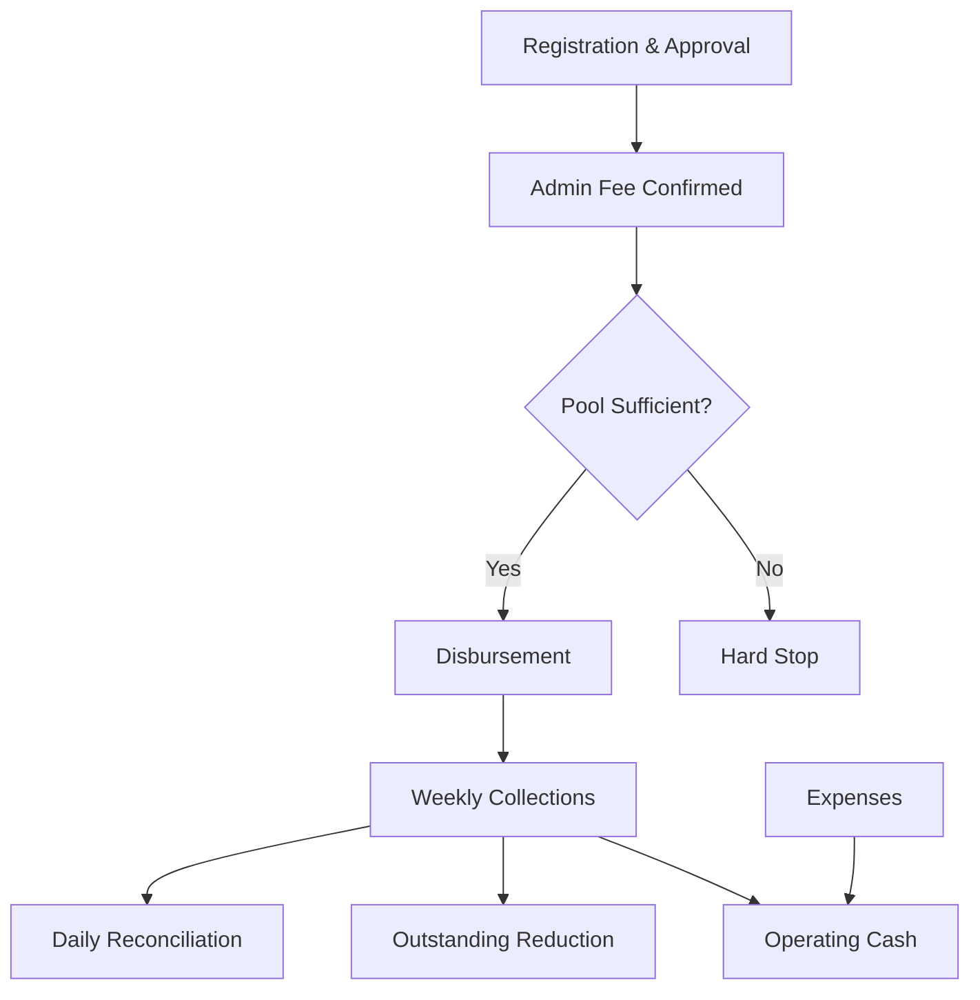
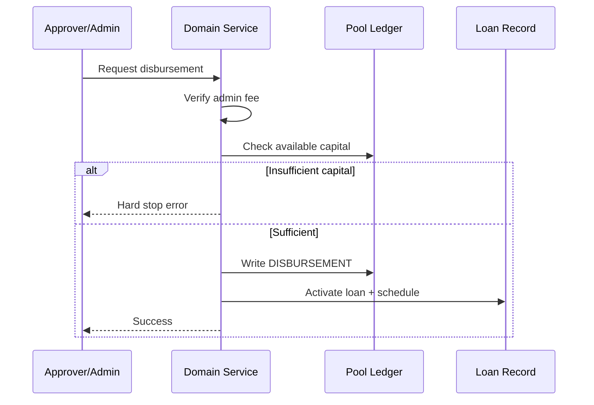

# WILMS Financial Engine Book

---

## Cover metadata

| Field | Value |
|-------|-------|
| **Title** | WILMS Financial Engine Book |
| **Edition** | Official Documentation Library |
| **Platform version documented** | Through v1.7.2 |
| **Documentation release** | v1.7.3 |
| **Date** | August 2026 |
| **Classification** | Confidential |
| **Money unit** | Integer pesewas (100 = 1 GHS) |

## Table of contents

1. [Executive summary](#executive-summary)
2. [Product financial model](#product-financial-model)
3. [Money representation](#money-representation)
4. [Pool accounting](#pool-accounting)
5. [Operating cash](#operating-cash)
6. [Disbursement engine](#disbursement-engine)
7. [Repayment and collections](#repayment-and-collections)
8. [Outstanding balances](#outstanding-balances)
9. [Admin fees](#admin-fees)
10. [Write-offs and aging](#write-offs-and-aging)
11. [Reversals](#reversals)
12. [Reconciliation](#reconciliation)
13. [Expenses and operating ledger](#expenses-and-operating-ledger)
14. [Adjustments](#adjustments)
15. [Reporting and aggregates](#reporting-and-aggregates)
16. [Integrity controls](#integrity-controls)
17. [Explicit non-claims](#explicit-non-claims)
18. [Appendices](#appendices)

---

## Executive summary

WILMS manages women's interest-free group lending programmes. The financial engine is an **operational** system of record — pool ledgers, payment journals, and expense ledgers — not a statutory double-entry general ledger. All monetary values are stored as **integer pesewas** to eliminate floating-point errors.

The core money chain flows from registration and approval through admin fee confirmation, pool-gated disbursement, weekly collections with GPS verification, daily reconciliation, and reporting. Expenses affect operating cash only; they never reduce loan principal balances.

## Product financial model

WILMS programmes operate on a **cash-first, interest-free** model:

- No interest accrual engine exists or is planned for v1.x
- Loans draw from named capital pools with hard-stop disbursement
- Weekly instalments are collected in full (no partial payments)
- Admin fees are collected before disbursement is permitted
- Field collectors record payments with GPS metadata
- HQ reconciles physical cash daily against system records



## Money representation

### Integer pesewas

All database columns storing money use integer pesewas. One Ghana Cedi (GHS) equals 100 pesewas. UI components format pesewas for display using shared currency utilities. Server-side arithmetic never uses floating-point for money.

| Display | Storage |
|---------|---------|
| GHS 10.50 | 1050 pesewas |
| GHS 500.00 | 50000 pesewas |
| GHS 0.01 | 1 pesewa |

### Rounding rules

- Utilisation percent: `MIN(ROUND(disbursed / capital × 100), 100)`
- Repayment rate: `ROUND(collected / disbursed × 100, 1)` when disbursed > 0
- Variance thresholds compared in pesewas with 100 pesewa (1 GHS) floor

## Pool accounting

Each loan pool maintains an append-only `pool_allocations` ledger.

| Event | Allocation type | Effect |
|-------|-----------------|--------|
| Pool created / capital injected | REPLENISHMENT | Increases pool capital |
| Loan disbursed from pool | DISBURSEMENT | Increases disbursed; reduces available |
| Borrower repayment | REPAYMENT | Increases collected; reduces outstanding |
| Manual correction | ADJUSTMENT | Audited capital correction |

### Per-pool formulas

```
disbursed_pesewas     = SUM(DISBURSEMENT allocations)
collected_pesewas     = SUM(REPAYMENT allocations)
outstanding_pesewas   = MAX(disbursed − collected, 0)
available_capital     = capital_pesewas − outstanding_pesewas
utilisation_percent   = MIN(ROUND(disbursed / capital × 100), 100)
repayment_rate_percent = ROUND(collected / disbursed × 100, 1)  [when disbursed > 0]
```

Pool list and dashboard merge loan portfolio totals when allocation aggregates lag (runtime reconcile + migration 0025).

## Operating cash

Operating cash represents programme liquidity from collections and fees minus approved expenses:

```
net_operating_cash = collections + admin_fees_collected − approved_expenses
net_collections_after_expenses = MAX(total_collected − approved_expenses, 0)
```

Expenses are deducted from operating cash, **not** from loan principal or outstanding balances.

## Disbursement engine

Disbursement requires:

1. Approved loan in PENDING_DISBURSEMENT status
2. Admin fee confirmed and recorded
3. Sufficient available pool capital (hard-stop if not)
4. Actor with disbursement permission

On success, a DISBURSEMENT allocation is written to the pool ledger and the loan transitions to ACTIVE with a generated repayment schedule.



## Repayment and collections

### Business rules

- **Full weekly payment only** — partial payments are rejected
- **Oldest obligation first** — payment applied to earliest due instalment
- **GPS required** on field capture
- **Same-day edit window** for collectors to correct entries
- **Immutability after day-end** — no edits once day boundary passes

### Collection allocation

When a payment is recorded:

1. Validate full weekly amount matches schedule expectation
2. Write REPAYMENT allocation to pool ledger
3. Update loan outstanding balance
4. Record GPS metadata and collector ID
5. Emit audit log entry and notifications as configured

## Outstanding balances

Outstanding at loan level: remaining principal from schedule minus confirmed payments.

Organisation dashboard outstanding:

```
outstanding = MAX(pool outstanding sum, active/defaulted loan balances)
```

## Admin fees

Admin fees are one-time charges collected before disbursement. The system blocks disbursement until the admin fee is confirmed. Admin fees contribute to net operating cash but are separate from loan principal.

## Write-offs and aging

Write-offs (v1.6.2+) proceed through the adjustments maker-checker workflow. Aging analysis reports identify loans by days past due. Write-offs do not bypass audit controls — they require supervisory review.

## Reversals

Payment reversals unwind allocation and payment state under controlled paths:

- Negative REPAYMENT allocation posted to pool ledger
- REVERSAL ledger entry for audit trail
- Payment status updated to reversed
- Permission-gated; logged in audit log

## Reconciliation

```
primary_variance = physical_cash − expected_due
collection_delta = physical_cash − system_recorded
```

Variance is **flagged** when:

- collection_delta ≠ 0
- expected_due = 0 and physical cash ≠ 0
- absolute primary variance ≥ 100 pesewas (1 GHS)
- percentage variance exceeds threshold (default 10%)

Review requires Super Admin access. Collectors bound to own collectorId. REJECTED/REOPENED rows may be resubmitted with history preserved.

## Expenses and operating ledger

Expenses follow maker-checker: submitter cannot approve own expense. Approved expenses post as operating ledger ADJUSTMENT entries. They reduce net operating cash but never affect loan principal.

## Adjustments

Capital adjustments require supervisory review via /adjustments. Approved adjustments write ADJUSTMENT type pool ledger entries. Residual SoD gaps (self-approve on adjustments) documented as Medium risk in certification packs.

## Reporting and aggregates

Organisation dashboard metrics (buildDashboardFinancialOverview):

| Metric | Calculation |
|--------|-------------|
| Pool funds | SUM(pool.capital_pesewas) |
| Total disbursed | MAX(pool disbursed, loan portfolio disbursed) |
| Total collected | SUM(confirmed payments) |
| Outstanding | MAX(pool outstanding, active loan balances) |
| Available capital | pool funds − outstanding |

Oversized unpaginated report queries return HTTP 422 (fail-closed).

## Integrity controls

| Control | Status |
|---------|--------|
| Admin fee before disbursement | Verified |
| Pool hard-stop | Verified |
| Payment immutability after day-end | Verified |
| GPS on field capture | Verified |
| Reversal unwind | Verified |
| SQL dashboard KPIs | Verified |
| Report truncation refusal | Verified |
| Adjustment self-approve | Residual Medium |
| Expense self-post APPROVED | Residual Medium |

## Explicit non-claims

- WILMS is **not** a statutory double-entry general ledger
- No interest accrual engine (interest-free product)
- Expenses do not affect loan principal balances
- No Production Certified financial seal for all residual items

## Appendices

### Appendix A — Data integrity workflow

```
Pool created → Capital (REPLENISHMENT)
            → Loan PENDING_APPROVAL (admin fee required)
            → Approve → PENDING_DISBURSEMENT
            → Disbursement (DISBURSEMENT; capital hard stop)
            → Collection (REPAYMENT; GPS required)
            → Reversal (negative REPAYMENT + REVERSAL)
            → Expense (operating cash; never principal)
            → Dashboard / Reports / Exports
```

### Appendix B — Related documentation

- `docs/FINANCIAL_MODEL.md` — architecture hub financial summary
- `docs/financial-calculations.md` — formula reference
- `documentation/books/WILMS_PRODUCT_BOOK.md` — product context
- `documentation/books/REPORTING_ANALYTICS_BOOK.md` — report specifications


---

*CONFIDENTIAL — For authorized WILMS personnel, executive review, procurement, and official record keeping only.*

*WILMS Financial Engine Book — Documentation release v1.7.3 — Platform documented through v1.7.2*