# WILMS Product Book

---

## Cover metadata

| Field | Value |
|-------|-------|
| **Title** | WILMS Product Book — Women's Interest-Free Loan Management System |
| **Edition** | Official Documentation Library |
| **Platform version documented** | Through v1.7.2 (last feature release) |
| **Documentation release** | v1.7.3 |
| **Date** | August 2026 |
| **Classification** | Confidential |
| **Primary deployment** | Vercel + Neon PostgreSQL |
| **Auth model** | Custom HMAC-signed session cookies |

---

## Table of contents

1. [Executive summary](#executive-summary)
2. [Vision, mission, and objectives](#vision-mission-and-objectives)
3. [Value proposition](#value-proposition)
4. [Target users and personas](#target-users-and-personas)
5. [Business problems addressed](#business-problems-addressed)
6. [System overview](#system-overview)
7. [Architecture](#architecture)
8. [Technology stack](#technology-stack)
9. [Domain model](#domain-model)
10. [Financial engine](#financial-engine)
11. [Workflows](#workflows)
12. [Roles, RBAC, SoD, and maker-checker](#roles-rbac-sod-and-maker-checker)
13. [Notifications](#notifications)
14. [Communications](#communications)
15. [Reporting and analytics](#reporting-and-analytics)
16. [Dashboards](#dashboards)
17. [Scheduler and cron](#scheduler-and-cron)
18. [Offline support](#offline-support)
19. [Security](#security)
20. [Deployment](#deployment)
21. [Testing and quality assurance](#testing-and-quality-assurance)
22. [Certification status](#certification-status)
23. [Version history through v1.7.2](#version-history-through-v172)
24. [v1.7.3 documentation release notes](#v173-documentation-release-notes)
25. [Completed work inventory](#completed-work-inventory)
26. [Skipped and deferred items](#skipped-and-deferred-items)
27. [Roadmap v1.8–v3.0](#roadmap-v18v30)
28. [Appendices](#appendices)

---

## Executive summary

WILMS is a production-grade operational platform for managing women's interest-free group lending programmes. It digitises the complete lending lifecycle — borrower registration, document capture, loan approval, capital pool management, weekly field collections with GPS verification, headquarters reconciliation, expense tracking, multi-channel notifications, executive intelligence, and audit — within a single TypeScript monorepo deployed on Vercel with Neon PostgreSQL.

The platform serves NGOs, government microfinance initiatives, and institutional partners operating interest-free loan programmes for women organised in community groups. WILMS enforces separation of duties through role-based access control (RBAC), maker-checker workflows on financial mutations, immutable audit logging, and integer pesewas money handling to eliminate floating-point errors.

Release **v1.7.2** represents the last feature platform release, delivering release candidate stabilization including financial-grade operational dashboards, board-ready executive intelligence, Export Center job actions, and Product Tour 2.0. Release **v1.7.3** is a documentation suite release that establishes the official documentation library and removes the standalone Export Center route in favour of contextual exports embedded in workflow surfaces.

WILMS is **not** a statutory double-entry general ledger. Operational pool ledgers and payment journals are the system of record for programme operations. Statutory GL integration is deferred to v2.0.

---

## Vision, mission, and objectives

### Vision

Every women's interest-free lending programme in Ghana and beyond operates with the same financial integrity, auditability, and operational visibility as a tier-one financial institution — without the cost or complexity of enterprise banking software.

### Mission

Provide a secure, accessible, field-ready digital operating system that empowers programme staff to serve borrowers efficiently while giving leadership real-time portfolio visibility and donors verifiable compliance evidence.

### Strategic objectives

1. **Financial integrity** — Integer pesewas accounting, pool hard-stops, immutable payment records after day-end, admin fee enforcement before disbursement.
2. **Operational control** — RBAC with five production roles, permission overrides, force-logout, separation of duties on expenses and adjustments.
3. **Field readiness** — Collector offline queue, GPS capture, mobile-optimised field shell, same-day edit window for collections.
4. **Executive visibility** — Operational dashboard for task queues, executive intelligence for board KPIs, forecasting, and portfolio breakdown.
5. **Auditability** — Append-only audit log, role-scoped report access, export confidentiality notices.
6. **Deployment simplicity** — Next.js monolith on Vercel, Neon serverless PostgreSQL, in-process domain API via Route Handlers.

---

## Value proposition

| Stakeholder | Value delivered |
|-------------|-----------------|
| Programme directors | Real-time portfolio KPIs, forecasting, board-ready exports |
| Field collectors | Offline-capable payment capture, GPS verification, daily reconciliation |
| Registration officers | Structured borrower onboarding, document capture, pending registration workflow |
| Approvers | Side-by-side review, risk flag assessment, maker-checker loan decisions |
| Auditors | Read-only access to reports, audit log, and export artefacts |
| Super admins | Full programme control — pools, users, expenses, communications, ops |
| Donors / partners | Verifiable audit trail, compliance packs, confidentiality-controlled exports |
| IT / DevOps | Monorepo with typed contracts, migration journal, smoke test suite |

---

## Target users and personas

### Super Admin

Programme administrator with full system access. Manages users, loan pools, capital replenishment, expenses, communications, operations incidents, and system settings. Requires `ACCESS_ADMIN_PORTAL` permission.

### Registration Officer

HQ staff registering new borrowers. Captures personal details, documents, signatures, and GPS-verified locations. Manages pending registrations until approval submission. Cannot approve loans or record collections.

### Collector

Field agent assigned to borrower groups. Records weekly collections, admin fees, and field expenses. Performs daily cash reconciliation. Operates primarily through the collector field shell with offline support.

### Approver

Loan decision authority. Reviews applications, compares captured documents, assigns groups and collectors, approves or rejects loans. Cannot disburse funds or modify pool capital directly.

### Auditor

Read-only oversight role. Views reports, audit log entries, risk flags, and exports. No mutation permissions on borrowers, loans, payments, or settings.

### Extended stakeholders (non-login)

Directors, MPs, NGO board members, procurement committees, and institutional investors consume exported dossiers, board presentations, and compliance packs without system access.

---

## Business problems addressed

### Problem 1: Paper and spreadsheet fragility

Manual records are lost, duplicated, or inconsistently formatted. WILMS provides structured digital records with validation, required fields, and immutable audit history.

### Problem 2: Weak separation of duties

Single individuals often register, approve, and collect. WILMS enforces five distinct roles with permission matrices and maker-checker gates on financial mutations.

### Problem 3: Field-to-HQ cash reconciliation gaps

Collectors carry cash for days before HQ verification. WILMS provides same-day collection recording, daily reconciliation workflows, and overpayment review queues.

### Problem 4: Delayed portfolio visibility

Leadership learns about defaults weeks late. WILMS delivers SQL-aggregated dashboard KPIs, executive intelligence, forecasting, and early-warning thresholds.

### Problem 5: Limited auditability for donors

Donors cannot verify programme integrity. WILMS provides append-only audit logs, exportable compliance packs, and role-scoped access controls.

### Problem 6: Capital pool over-disbursement risk

Programmes exceed available capital. WILMS hard-stops disbursement when pool available balance is insufficient.

---

## System overview

WILMS is organised as an npm workspaces monorepo with Turborepo orchestration:

```
apps/frontend     — Next.js 14 App Router (UI + Route Handlers)
apps/backend      — Thin Node adapter over @wilms/domain (optional dual-run)
packages/domain   — Services, Drizzle/Neon, HTTP Express app
packages/shared-* — Contracts, RBAC, types, utils, validation
```

The default deployment runs the domain API in-process via Next.js Route Handlers at `/api/wilms/[...path]`. An optional dual-run mode proxies to a standalone Node process on port 4000.

### Core modules

| Module | Responsibility |
|--------|----------------|
| Auth | HMAC sessions, login OTP, password reset, onboarding |
| Borrowers | Registration, profiles, documents, pending workflow |
| Loans | Applications, approval, disbursement, schedules |
| Loan pools | Capital replenishment, allocation, hard-stops |
| Payments | Collections, admin fees, reversals, GPS capture |
| Reconciliation | Daily cash matching, overpayment reviews |
| Expenses | Field and HQ expenses, submit/review workflow |
| Groups | Borrower group formation and assignment |
| Collectors | Field agent management and assignments |
| Reports | Operational and financial report generation |
| Intelligence | Executive dashboard, forecasting, portfolio breakdown |
| Notifications | In-app, email, SMS with deduplication |
| Communications | Message center, templates, broadcasts |
| Ops | Incidents, maintenance windows, health metrics |
| Audit | Append-only action log |
| Settings | Users, roles, permissions, organisation config |
| Sync | Offline queue replay for field collectors |

---

## Architecture

### High-level architecture

```mermaid
flowchart TB
    subgraph Client
        Browser[Web Browser / PWA]
        Field[Collector Field Shell]
    end

    subgraph Vercel
        Next[Next.js 14 App Router]
        RH[Route Handlers /api/wilms]
    end

    subgraph Domain
        Express[@wilms/domain Express App]
        Services[Domain Services]
        RBAC[shared-rbac]
    end

    subgraph Data
        Neon[(Neon PostgreSQL)]
        Redis[(Redis - optional rate limits)]
    end

    Browser --> Next
    Field --> Next
    Next --> RH
    RH --> Express
    Express --> Services
    Services --> RBAC
    Services --> Neon
    Express --> Redis
```

### Request flow

1. Browser sends request to Next.js with `wilms_session` cookie.
2. Route Handler forwards to `@wilms/domain` fetch handler.
3. Domain middleware validates HMAC session, attaches user context.
4. Permission middleware checks RBAC matrix.
5. Service layer executes business logic with Drizzle ORM.
6. Response serialised as JSON with standard envelope.

### Authentication architecture

WILMS uses **custom HMAC-signed session cookies** — not Auth.js, not JWT bearer tokens for browser sessions. Session tokens encode user ID, role, and expiry; signed with `WILMS_SESSION_SECRET`. CSRF protection applies to mutating BFF paths.

---

## Technology stack

| Layer | Technology | Version / notes |
|-------|------------|-------------------|
| Runtime | Node.js | 22.x required |
| Frontend framework | Next.js | 14 App Router |
| Language | TypeScript | Strict mode |
| Styling | Tailwind CSS | Design tokens, CSS variables |
| State | Zustand | Auth, offline queue, theme, shell layout |
| Database | Neon PostgreSQL | Serverless, connection pooling |
| ORM | Drizzle | Typed queries, migration journal |
| API | Express (domain) | Mounted via Route Handlers |
| Testing | Vitest + Playwright | Unit, integration, E2E |
| Deployment | Vercel | Production + preview environments |
| Cron | Vercel Cron | Daily notification dispatch 06:00 UTC |
| Export engines | jsPDF, docx, ExcelJS | PDF, Word, spreadsheet exports |
| Rate limiting | express-rate-limit | Redis-backed when configured |

---

## Domain model

### Core entities

| Entity | Description |
|--------|-------------|
| User | System account with role, status, permission overrides |
| Borrower | Loan recipient with personal details, documents, GPS |
| Group | Community borrowing group with assigned collector |
| Loan | Application through disbursement with schedule |
| LoanPool | Capital pool with replenishment, disbursement, collection ledger |
| Payment | Collection or admin fee transaction with GPS metadata |
| Transaction | Pool ledger entry (replenishment, disbursement, repayment, adjustment) |
| Reconciliation | Daily collector cash reconciliation record |
| Expense | Field or HQ expense with submit/review workflow |
| Notification | In-app notification with read state |
| AuditEntry | Immutable action log record |
| ExportJob | Tracked export generation job (API retained; standalone UI removed v1.7.3) |
| OpsIncident | Operational incident record |
| RiskFlag | Borrower or loan risk indicator |
| Region / District / Sub-district unit / Electoral area / Community | Ghana administrative hierarchy v2 (canonical master) |

Borrower registration selects **Region → MMDA → Sub-metro/Area Council (skipped if empty) → Electoral area (skipped if empty) → Community / suburb → Street / landmark**. Community selection uses searchable autocomplete (prefix, alias, case-insensitive, typo-tolerant) with offline cascade cache. Community names that are not in the master are submitted as pending suggestions for Super Admin approval and are not inserted automatically. See `documentation/location/COMMUNITY_LOCATION_GUIDE.md` and related community completion documents.

### Entity relationships (summary)

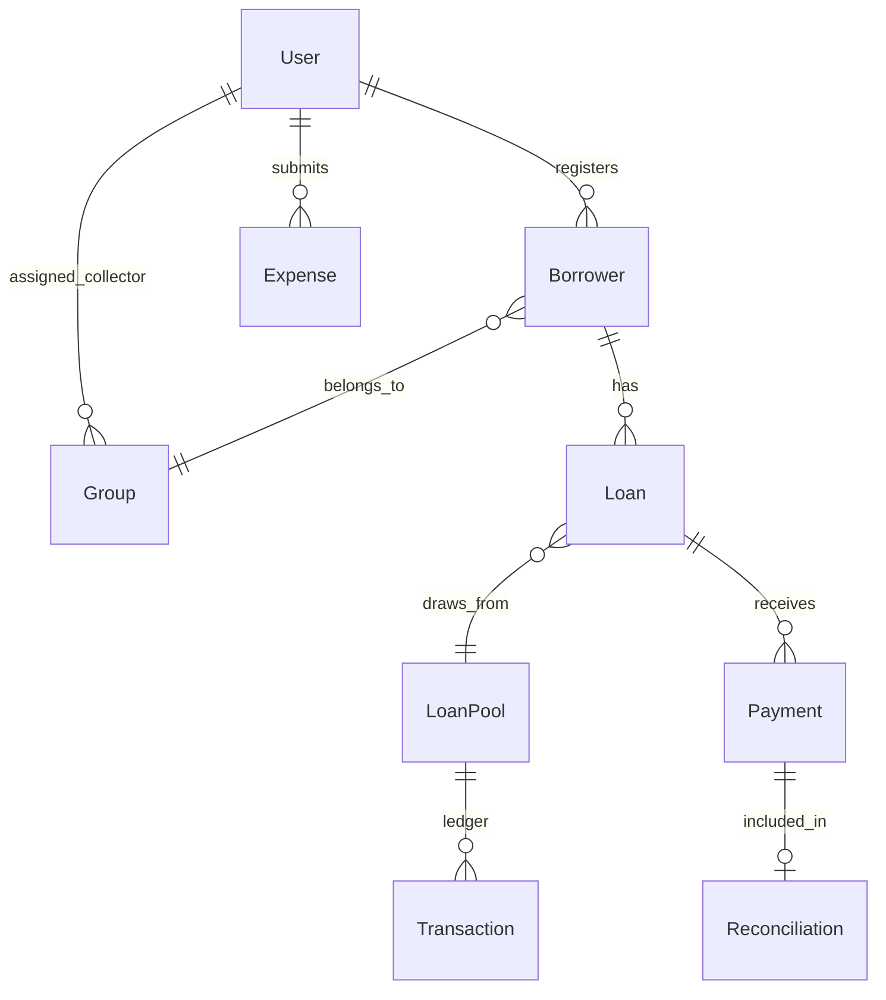

---

## Financial engine

### Money representation

All monetary values stored as **integer pesewas** (1 GHS = 100 pesewas). UI components format for display. No floating-point arithmetic on money.

### Core money chain

1. Registration and approval of borrower and loan (role-gated).
2. Admin fee confirmed before disbursement.
3. Pool capital hard-stops disbursement when insufficient.
4. Disbursement writes pool allocation (`DISBURSEMENT` transaction).
5. Collections — full weekly amount rules; oldest obligation first; GPS on field capture; same-day edit window for collectors; immutability after day ends.
6. Reversals unwind allocations and payment state under controlled paths.
7. Expenses affect operating cash, not loan principal.
8. Reports and dashboards use SQL aggregates; oversized unpaginated report lists return 422 (fail closed).

### Pool ledger events

| Event | Effect |
|-------|--------|
| Replenishment | Increases capital |
| Disbursement | Increases disbursed; reduces available |
| Repayment | Increases collected; reduces outstanding |
| Adjustment | Audited capital correction (SoD controls apply) |

### Non-claims

- WILMS is not a statutory double-entry GL.
- No interest accrual engine (interest-free product).
- Expenses do not affect loan principal balances.

---

## Workflows

### Borrower registration workflow

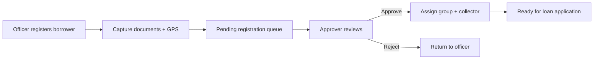

### Loan approval and disbursement

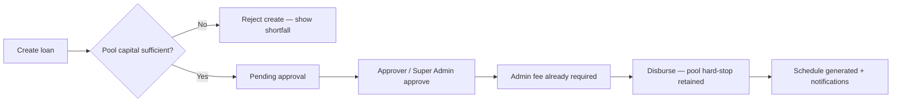

Super Admin may approve loans they created (final authority). Other roles remain under maker-checker separation of duties.

### Weekly collection workflow

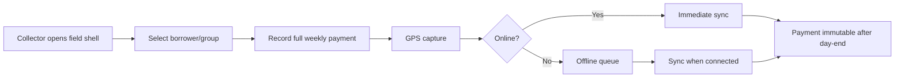

### Reconciliation workflow

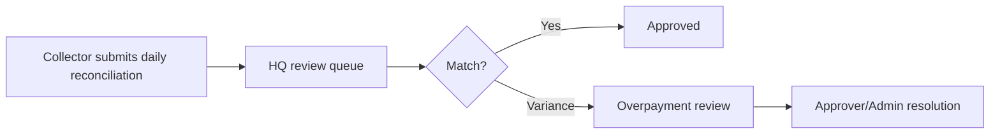

### Expense workflow (maker-checker)

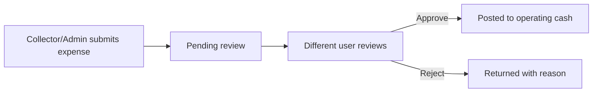

---

## Roles, RBAC, SoD, and maker-checker

### Production roles

| Role | Portal | Key permissions |
|------|--------|-----------------|
| SUPER_ADMIN | Admin | Full programme control |
| REGISTRATION_OFFICER | Registration | Register/edit borrowers, capture documents |
| COLLECTOR | Field | Record collections, expenses, view assigned borrowers |
| APPROVER | Approver | Review/approve/reject loans and borrowers |
| AUDITOR | Auditor | View reports, audit log, exports (read-only) |

### Separation of duties

| Control | Enforcement |
|---------|-------------|
| Loan approval | Approver cannot be same user who registered borrower (policy) |
| Expense posting | Submitter cannot approve own expense |
| Pool adjustments | Audited with actor tracking; residual SoD gaps documented |
| Disbursement | Requires approved loan + admin fee + sufficient pool |
| Audit log | Append-only; no user can delete entries |

### Permission overrides

Super Admin can grant individual permission overrides to users beyond their role defaults. Overrides are audited and visible in user profile.

### Force logout

Super Admin can force-logout active sessions for security incidents or personnel changes.

---

## Notifications

### Channels

- **SMS** — Primary borrower channel for the full lending lifecycle (registration through loan completion).
- **Email** — Used for approvals, receipts, disbursement, missed payment, completion, and schedule changes. Optional or omitted where the channel matrix says so (for example, due-today and grace reminders).
- **In-app** — Staff inbox (collectors, officers, Super Admin) with read state. Push mirrors in-app for users with a WILMS account.
- **Push** — Mirrored from in-app via `sendPushToUser`.

Borrowers do not hold portal user accounts; SMS is the borrower-facing channel.

### Borrower lifecycle (authoritative)

1. Registration submitted  
2. Registration approved (group and collector assigned)  
3. Loan created  
4. Loan approved — **admin-fee instruction belongs here**  
5. Admin fee recorded  
6. Loan disbursed  
7. Repayment schedule issued  
8. Reminder one day before due date  
9. Due today  
10. Payment received (or multi-week receipt)  
11. Missed payment  
12. Grace-period reminder  
13. Escalation  
14. Loan completed  

Collector reassignment, group reassignment, and payment-day changes notify the borrower when they occur.

See `documentation/notifications/` for the SMS library, trigger matrix, and scheduler timing.

### Guarantees

- Deduplication prevents duplicate notifications for the same event, recipient, and channel.
- Quiet hours respect organisation settings for non-critical notifications.
- Daily cron dispatch at 06:00 UTC via Vercel Cron (`/api/cron/notifications`).
- Failed dispatch logged; retry on next cron cycle.

### Event types

Borrower lifecycle events above, plus staff events: login alerts, invitations, expense submitted/reviewed, reconciliation variance, overpayment review, ops incident alerts, maintenance window notices.

---

## Communications

The Communications Center enables programme-wide messaging:

- **Templates** — Reusable message templates with variable substitution.
- **Broadcasts** — Targeted messages to role groups or all users.
- **Message threads** — Two-way communication between HQ and field staff.
- **Audit trail** — All sent messages logged with sender, recipient, timestamp.

Communications require `ACCESS_ADMIN_PORTAL` or designated communication permissions.

---

## Reporting and analytics

### Operational reports

Portfolio summary, collection performance, overdue analysis, disbursement register, expense summary, reconciliation status, borrower register, group performance.

### Executive intelligence (v1.7.0+)

- Financial KPIs: total disbursed, collected, outstanding, pool utilisation.
- Operational KPIs: active borrowers, collection rate, overdue count.
- Risk indicators: flagged borrowers, reconciliation aging.
- Forecasting: schedule-based projection with configurable horizon.
- Portfolio breakdown: district, community, group dimensions.

### Export patterns

**v1.7.2:** Standalone Export Center at `/exports` with job tracking, download, preview, regenerate, delete, share, copy link.

**v1.7.3:** Standalone Export Center **removed**. Exports initiated contextually from:
- Report result pages (PDF, Excel, CSV, Print)
- Borrower profile export actions
- Executive intelligence export buttons
- Reconciliation summary exports

Export job API (`POST/GET /exports/jobs`) retained for programmatic and embedded flows.

---

## Dashboards

### Operational dashboard (`/dashboard`)

Task-oriented view for daily operations:
- Reconciliation aging summary and pending table (collector display names, pending / approved-today / rejected-today / total submitted)
- Recent Activity feed from audit log (time-grouped, role-aware)
- Collection metrics and financial colour identity
- Quick links to pending approvals, overdue loans, open reconciliations

Collectors management shows live assigned borrower counts, period trend (↑↓→), collection streaks, and a rolling six-month performance chart. The Borrowers sidebar badge uses the same active-borrower count as the Borrowers directory.

### Executive intelligence (`/executive`)

Board-grade presentation for leadership:
- Financial, operational, and risk KPI cards
- Portfolio breakdown charts
- Forecast projection
- Compliance pack generation
- Contextual export actions

### Collector field dashboard

Mobile-optimised hero metrics, assigned groups, today's collection targets, offline status indicator, reconciliation shortcut.

---

## Scheduler and cron

| Job | Schedule | Endpoint |
|-----|----------|----------|
| Notification dispatch | Daily 06:00 UTC | `/api/cron/notifications` |
| Maintenance checks | On-demand | Ops module |

Vercel Cron replaces GitHub Actions schedule for production notification dispatch. Token-authenticated public scheduler routes mount before blanket auth middleware.

---

## Offline support

### Collector offline queue

- Zustand store with localStorage persistence.
- FIFO drain on reconnect.
- Offline banner and CollectorOfflineShell UI.
- Payment recordings queued with timestamp and GPS metadata.
- Sync handler replays queued operations via domain sync module.

### Limitations

- Offline limited to collector payment recording; registration and approval require connectivity.
- Conflict resolution: server wins on timestamp collision; user notified of sync failures.

---

## Security

### Authentication

- HMAC-signed session cookies (`wilms_session`).
- Login rate limiting (IP and account level).
- Optional login OTP challenge.
- Password reset with time-limited tokens.
- Session activity checks and force-logout capability.

### Authorization

- RBAC with five roles and granular permissions.
- Middleware route protection on frontend.
- `requirePermission` middleware on domain routes.
- Permission overrides audited.

### Transport and headers

- Helmet security headers in production.
- HSTS enabled in production.
- CSP configured with Vercel feedback allowlist.
- CORS restricted to configured origin.

### Data protection

- Passwords hashed with bcrypt.
- Upload allowlists for file types.
- CSRF on mutating BFF paths.
- Audit log append-only.

### Rate limiting

- Global API rate limit: 300 requests/minute.
- Redis-backed when `REDIS_URL` configured.
- Login-specific rate limiters.

---

## Deployment

### Production stack

| Component | Service |
|-----------|---------|
| Application | Vercel (Next.js) |
| Database | Neon PostgreSQL |
| Cron | Vercel Cron |
| Optional rate limits | Redis |
| Domain | wilms.vercel.app |

### Environment requirements

- Node.js 22.x
- `DATABASE_URL` — Neon connection string
- `WILMS_SESSION_SECRET` — HMAC signing key (32+ chars production)
- `NEXT_PUBLIC_API_BASE_URL=/api/wilms` — in-process default

### Migration strategy

SQL migration journal in `packages/domain`. Run via `npm run db:migrate -w @wilms/domain`. Migrations numbered sequentially (currently through 0035+).

### Dual-run mode (development)

```
WILMS_API_MODE=proxy
WILMS_API_UPSTREAM=http://127.0.0.1:4000
npm run dev:api
```

---

## Testing and quality assurance

### Test layers

| Layer | Tool | Scope |
|-------|------|-------|
| Unit | Vitest | Services, utilities, components |
| Integration | Vitest | Route handlers, repository layer |
| E2E | Playwright | Critical user flows, shell navigation |
| Smoke | Custom scripts | RBAC, notifications, API integrity, production health |

### Verification scripts

- `npm run verify:version` — version consistency across packages
- `npm run verify:api-integrity` — route registration checks
- `npm run verify:migrations` — migration journal integrity
- `npm run smoke:rbac` — role permission smoke tests
- `npm run smoke:notifications` — notification dispatch smoke

### Coverage posture

Frontend unit tests with shard execution. Domain tests via `npm run test -w @wilms/domain`. E2E covers shell, auth, and critical flows. Global DoD requires E2E pass, coverage thresholds, WCAG audit, and clean `npm audit`.

---

## Certification status

| Area | Status |
|------|--------|
| Production operational platform | **Certified for programme operations** |
| Financial integrity controls | Conditional pass — core controls verified |
| RBAC enforcement | Verified via smoke suite |
| Notification guarantees | Verified via smoke suite |
| Statutory GL | **Not certified** — deferred v2.0 |
| Multi-organisation tenancy | **Not certified** — deferred v2.0 |
| Borrower self-service portal | **Not in scope** — deferred |

---

## Version history through v1.7.2

| Version | Date | Focus |
|---------|------|-------|
| v1.0–v1.4 | 2026 H1 | Core lending, collections, reconciliation, RBAC foundation |
| v1.5.0 | 2026 | Platform consolidation — domain extraction, Route Handlers, Vercel Cron |
| v1.6.1 | 2026 | Product excellence UI, design system, export standard |
| v1.6.2 | 2026 | Enterprise readiness, workflow completion |
| v1.7.0 | 2026 | Enterprise finance, executive intelligence, export jobs, ops incidents |
| v1.7.1 | 2026 | Market readiness, dashboard separation, modal hardening |
| v1.7.2 | 2026 | RC stabilization — financial dashboard, executive polish, Export Center actions, Product Tour 2.0 |
| v1.8.0 | 2026 | Collector payment workflow; Phase 11 registration/loan/comms/ops hardening (same version identity) |

---

## v1.8.0 Phase 11 operational hardening (summary)

- Registration Approver Assign Group: reliable assignment, toast feedback, audit, notifications.
- Super Admin may self-approve loans they created; pool capital validated at loan creation.
- Borrower communication lifecycle extended (registration submitted, group assigned, schedule event separation).
- Super Admin Operations reassignment tools at `/ops/reassignment` (group, collector, payment day).
- Payment-day approval recalculates future PENDING schedule weeks.

See `documentation/phase11/` for full reports.

## v1.7.3 documentation release notes

Release v1.7.3 is a **documentation-only release** with one product simplification:

### Documentation library

- Official markdown sources for all books, manuals, and guides.
- Branded PDF and DOCX generation via `npm run docs:generate`.
- Web docs portal structure for future static deployment.
- Master index and sprint completion report.

### Export Center removal

The standalone `/exports` route and sidebar navigation entry are **removed**. Rationale:

1. **Duplicate entry points** — Reports, borrower profiles, and executive intelligence already offer export actions.
2. **Workflow context** — Users export from the data they are viewing, not from a separate hub.
3. **Reduced navigation complexity** — Fewer top-level routes for role-scoped sidebars.
4. **API retention** — Export job endpoints remain for embedded and programmatic use.

No financial, RBAC, or notification code changes in this release.

---

## Completed work inventory

### Foundation (Phases 1–4)

- Next.js + TypeScript + Tailwind scaffolding
- Design system tokens and shared component library
- Auth store, middleware, role-based route protection
- Offline queue store and sync mechanism
- Mock service layer with dev/prod switch
- Demo mode banner

### Dashboard shell architecture

- AppSidebar, AppNavbar, AppAside, DashboardShell
- Office and field shell profiles
- Global search omnibar, notification inbox
- Contextual aside on all office routes

### Core lending modules

- Borrower registration and document capture
- Loan application, approval, disbursement
- Loan pool capital management with hard-stops
- Weekly collection recording with GPS
- Daily reconciliation and overpayment review
- Expense submit/review workflow
- Group formation and collector assignment

### Intelligence and reporting (v1.7.0–v1.7.2)

- Executive intelligence dashboard
- Schedule-based forecasting
- Portfolio breakdown and compliance packs
- Export job tracking (API; standalone UI removed v1.7.3)
- Operations incidents and maintenance windows
- Product Tour 2.0

### Platform consolidation (v1.5.0)

- `@wilms/domain` package extraction
- Express → Route Handlers migration
- In-process API default
- Vercel Cron scheduler

---

## Skipped and deferred items

| Item | Status | Rationale |
|------|--------|-----------|
| Borrower self-service portal | Deferred | Out of programme scope; HQ-operated model |
| Multi-organisation tenancy | Deferred v2.0 | Single-org deployment sufficient for current partners |
| Statutory double-entry GL | Deferred v2.0 | Operational pool ledger meets programme needs |
| Native mobile app | Deferred | PWA + responsive field shell adequate for field use |
| Deep payment provider integrations | Deferred v1.8 | Cash-first programme model; MoMo/bank APIs planned |
| Full shadcn migration | Partial | High-traffic routes migrated; remainder post-RC |
| WCAG full audit pass | In progress | Remediations ongoing per QA units |
| Localized user guides | Deferred v2.x | English manuals first; Twi/Ga/Ewe planned |
| Redis + BullMQ job queue | Deferred | Vercel Cron + in-process sufficient at current scale |
| Standalone Export Center | **Removed v1.7.3** | Contextual exports reduce duplication |

---

## Roadmap v1.8–v3.0

### v1.8 — Integrations and payments

- Mobile money provider integration (MTN MoMo, Vodafone Cash)
- Bank statement import for reconciliation
- Webhook infrastructure for external systems
- OpenAPI specification generation

### v1.9 — Enterprise automation

- Workflow automation rules engine
- Scheduled report delivery
- Advanced notification routing
- Bulk import/export tooling

### v2.0 — General ledger and multi-branch

- Statutory double-entry GL module
- Multi-organisation tenancy
- Branch-level pool isolation
- Inter-branch transfer workflows

### v2.5 — Borrower engagement

- Borrower SMS notifications
- Payment reminder automation
- Optional borrower status portal (read-only)

### v3.0 — Platform scale

- Multi-region deployment
- Advanced analytics and ML risk scoring
- Localized UI (Twi, Ga, Ewe)
- Partner API marketplace

---

## Appendices

### Appendix A — Glossary

| Term | Definition |
|------|------------|
| Pesewas | Integer money unit; 100 pesewas = 1 GHS |
| Pool | Capital fund from which loans are disbursed |
| Maker-checker | Dual-control requiring different users for submit and approve |
| SoD | Separation of duties |
| RBAC | Role-based access control |
| BFF | Backend-for-frontend Route Handler layer |
| GPS capture | Geographic coordinate recorded with field transactions |
| Hard-stop | System refusal when business rule violated (e.g. insufficient pool) |
| Reconciliation | Daily matching of collector-recorded cash vs physical count |
| Contextual export | Export action embedded in the page displaying the source data |

### Appendix B — ERD overview

See Domain model section for entity relationship diagram. Full schema in `packages/domain/src/db/schema/`.

### Appendix C — Permissions matrix (summary)

| Permission | Super Admin | Officer | Collector | Approver | Auditor |
|------------|:-----------:|:-------:|:---------:|:--------:|:-------:|
| ACCESS_ADMIN_PORTAL | ✓ | | | | |
| REGISTER_BORROWERS | ✓ | ✓ | ✓ | | |
| APPROVE_LOANS | ✓ | | | ✓ | |
| RECORD_COLLECTIONS | ✓ | | ✓ | | |
| VIEW_REPORTS | ✓ | | | | ✓ |
| EXPORT_REPORTS | ✓ | | | | ✓ |
| VIEW_AUDIT_LOG | ✓ | | | | ✓ |
| MANAGE_USERS | ✓ | | | | |

Full matrix: `packages/shared-rbac/src/role-permissions.ts`

### Appendix D — API overview

Base path: `/api/wilms` (in-process) or `/api/v1` (standalone domain).

Major areas: auth, borrowers, loans, loan-pools, payments, reconciliation, expenses, reports, intelligence, notifications, communications, ops, audit, settings, sync, uploads, search, dashboard, groups, collectors, risk-flags, adjustments, analytics, enterprise, webhooks, health.

See `documentation/technical/API_REFERENCE.md` for detail.

### Appendix E — Migrations

Migration journal: `packages/domain/drizzle/`. Numbered SQL files applied sequentially. Verify with `npm run verify:migrations -w @wilms/api`.

Recent migrations:
- 0035 — Finance reporting intelligence (jobs, alerts, incidents)
- Prior — Core schema, RBAC, notifications, expenses, reconciliation

### Appendix F — Environment variables

| Variable | Required | Purpose |
|----------|----------|---------|
| DATABASE_URL | Production | Neon PostgreSQL connection |
| WILMS_SESSION_SECRET | Production | HMAC session signing |
| NEXT_PUBLIC_API_BASE_URL | Yes | API base path (`/api/wilms`) |
| NEXT_PUBLIC_USE_MOCK | Dev | Mock service layer toggle |
| REDIS_URL | Optional | Redis rate limiting |
| WILMS_API_MODE | Optional | `proxy` for dual-run |
| WILMS_API_UPSTREAM | Optional | Upstream URL for proxy mode |

Full reference: `docs/environment.md`

### Appendix G — Compliance notes

- Audit log retained indefinitely (no automated purge).
- Export artefacts include confidentiality footer.
- Demo accounts disabled in production via environment guard.
- Password policy enforced via shared validation schemas.
- Upload file types restricted to allowlist.
- GDPR/data protection: programme operates under partner data processing agreements.

---

*CONFIDENTIAL — For authorized WILMS personnel, executive review, procurement, and official record keeping only.*


---

---

---

---

## Part II — Domain deep-dives

This section provides entity-level reference for architects, auditors, and implementation teams.

### Entity: User

System account with role enum, status, permission overrides, login history, and force-logout capability.

**Key attributes:**

- `id`
- `email`
- `role`
- `status`
- `permissionOverrides`
- `lastLoginAt`

Full schema: `packages/domain/src/db/schema/`

### Entity: Borrower

Loan recipient with personal details, documents, GPS coordinates, group membership, and registration status.

**Key attributes:**

- `id`
- `firstName`
- `lastName`
- `phone`
- `groupId`
- `status`
- `gpsLat`
- `gpsLng`

Full schema: `packages/domain/src/db/schema/`

### Entity: Group

Community borrowing unit with size bounds, assigned collector, and member list.

**Key attributes:**

- `id`
- `name`
- `collectorId`
- `memberCount`
- `district`
- `community`

Full schema: `packages/domain/src/db/schema/`

### Entity: Loan

Application through servicing with schedule, status machine, and pool association.

**Key attributes:**

- `id`
- `borrowerId`
- `poolId`
- `principalPesewas`
- `status`
- `schedule`
- `adminFeePaid`

Full schema: `packages/domain/src/db/schema/`

### Entity: LoanPool

Capital pool with replenishment history, allocation ledger, and utilisation metrics.

**Key attributes:**

- `id`
- `name`
- `capitalPesewas`
- `disbursedPesewas`
- `collectedPesewas`

Full schema: `packages/domain/src/db/schema/`

### Entity: Payment

Collection or admin fee with GPS metadata, collector ID, and immutability timestamp.

**Key attributes:**

- `id`
- `loanId`
- `amountPesewas`
- `type`
- `gpsLat`
- `gpsLng`
- `collectorId`
- `recordedAt`

Full schema: `packages/domain/src/db/schema/`

### Entity: Transaction

Pool ledger allocation entry.

**Key attributes:**

- `id`
- `poolId`
- `type`
- `amountPesewas`
- `loanId`
- `actorId`
- `createdAt`

Full schema: `packages/domain/src/db/schema/`

### Entity: Reconciliation

Daily collector cash reconciliation with variance flags and review status.

**Key attributes:**

- `id`
- `collectorId`
- `physicalCashPesewas`
- `expectedDuePesewas`
- `status`
- `variancePesewas`

Full schema: `packages/domain/src/db/schema/`

### Entity: Expense

Field or HQ expense with submit/review workflow.

**Key attributes:**

- `id`
- `submitterId`
- `amountPesewas`
- `category`
- `status`
- `reviewerId`

Full schema: `packages/domain/src/db/schema/`

### Entity: AuditEntry

Immutable action log record.

**Key attributes:**

- `id`
- `actorId`
- `action`
- `entityType`
- `entityId`
- `metadata`
- `createdAt`

Full schema: `packages/domain/src/db/schema/`

### Entity: Notification

In-app notification with read state and channel metadata.

**Key attributes:**

- `id`
- `userId`
- `type`
- `read`
- `payload`
- `createdAt`

Full schema: `packages/domain/src/db/schema/`

### Entity: ExportJob

Tracked export generation job (API retained; standalone UI removed v1.7.3).

**Key attributes:**

- `id`
- `type`
- `status`
- `requestedBy`
- `artifactUrl`
- `expiresAt`

Full schema: `packages/domain/src/db/schema/`

### Entity: OpsIncident

Operational incident record for platform monitoring.

**Key attributes:**

- `id`
- `severity`
- `title`
- `status`
- `resolvedAt`

Full schema: `packages/domain/src/db/schema/`

### Entity: RiskFlag

Risk indicator on borrower, group, or loan.

**Key attributes:**

- `id`
- `entityType`
- `entityId`
- `reason`
- `status`
- `reviewedBy`

Full schema: `packages/domain/src/db/schema/`

---

## Part III — Module reference

Detailed reference for every major platform module through v1.7.2.

### Chapter 1.Auth — Authentication & Sessions

**Module ID:** `auth`

#### Purpose

Custom HMAC-signed session cookies secure all browser sessions.

#### Authorised roles

- All production roles

#### Core capabilities

- Login with email and password
- Optional login OTP challenge
- Password reset with time-limited tokens
- Session activity validation on each request
- Force-logout for security incidents
- Login rate limiting at IP and account level
- Onboarding flows for new users

#### Primary routes

- `/login`
- `/forgot-password`
- `/reset-password`
- `/onboarding`

#### API surface (representative)

- `POST /auth/login`
- `POST /auth/logout`
- `GET /auth/session`
- `POST /auth/forgot-password`

#### Operational notes

The Authentication & Sessions module integrates with the domain service layer in `packages/domain/src/services/`. All mutations pass through RBAC permission checks and are recorded in the append-only audit log where applicable. Financial modules enforce integer pesewas arithmetic and maker-checker rules as documented in the Financial Engine Book.

#### Data integrity controls

- Permission middleware on every mutating endpoint
- Input validation via shared validation schemas
- Audit log entry on state-changing operations
- Fail-closed behaviour on safety threshold violations

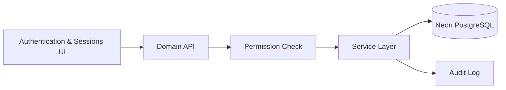

### Chapter 2.Borrowers — Borrower Management

**Module ID:** `borrowers`

#### Purpose

Structured registration, document capture, and profile lifecycle.

#### Authorised roles

- Registration Officer
- Super Admin
- Collector (view assigned)
- Approver (review)

#### Core capabilities

- Multi-step registration with KYC fields
- Document upload with type allowlist
- Signature capture
- GPS-verified location recording
- Pending registration queue
- Profile export actions
- Borrower search and filtering

#### Primary routes

- `/borrowers`
- `/borrowers/[id]`
- `/officer/register`
- `/officer/my-registrations`

#### API surface (representative)

- `GET/POST /borrowers`
- `GET/PATCH /borrowers/:id`
- `POST /borrowers/:id/documents`

#### Operational notes

The Borrower Management module integrates with the domain service layer in `packages/domain/src/services/`. All mutations pass through RBAC permission checks and are recorded in the append-only audit log where applicable. Financial modules enforce integer pesewas arithmetic and maker-checker rules as documented in the Financial Engine Book.

#### Data integrity controls

- Permission middleware on every mutating endpoint
- Input validation via shared validation schemas
- Audit log entry on state-changing operations
- Fail-closed behaviour on safety threshold violations


### Chapter 3.Loans — Loan Lifecycle

**Module ID:** `loans`

#### Purpose

Application through approval, admin fee, disbursement, and servicing.

#### Authorised roles

- Approver
- Super Admin

#### Core capabilities

- Loan application submission
- Approver side-by-side review
- Admin fee confirmation gate
- Pool capital hard-stop on disbursement
- Repayment schedule generation
- Loan status tracking
- Write-off via adjustments workflow

#### Primary routes

- `/loans`
- `/loans/new`
- `/loans/[id]`
- `/approver/pending`

#### API surface (representative)

- `GET/POST /loans`
- `POST /loans/:id/approve`
- `POST /loans/:id/disburse`

#### Operational notes

The Loan Lifecycle module integrates with the domain service layer in `packages/domain/src/services/`. All mutations pass through RBAC permission checks and are recorded in the append-only audit log where applicable. Financial modules enforce integer pesewas arithmetic and maker-checker rules as documented in the Financial Engine Book.

#### Data integrity controls

- Permission middleware on every mutating endpoint
- Input validation via shared validation schemas
- Audit log entry on state-changing operations
- Fail-closed behaviour on safety threshold violations

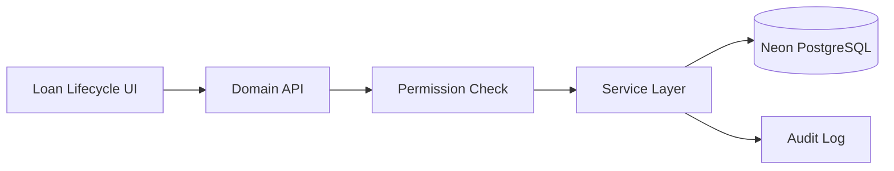

### Chapter 4.Loan Pools — Loan Pool Capital

**Module ID:** `loan-pools`

#### Purpose

Capital replenishment, allocation tracking, and utilisation monitoring.

#### Authorised roles

- Super Admin

#### Core capabilities

- Pool creation and replenishment
- Disbursement allocation ledger entries
- Available capital calculation
- Utilisation percentage display
- Hard-stop when insufficient capital
- Pool-level transaction history

#### Primary routes

- `/loan-pools`

#### API surface (representative)

- `GET/POST /loan-pools`
- `POST /loan-pools/:id/replenish`
- `GET /loan-pools/:id/transactions`

#### Operational notes

The Loan Pool Capital module integrates with the domain service layer in `packages/domain/src/services/`. All mutations pass through RBAC permission checks and are recorded in the append-only audit log where applicable. Financial modules enforce integer pesewas arithmetic and maker-checker rules as documented in the Financial Engine Book.

#### Data integrity controls

- Permission middleware on every mutating endpoint
- Input validation via shared validation schemas
- Audit log entry on state-changing operations
- Fail-closed behaviour on safety threshold violations

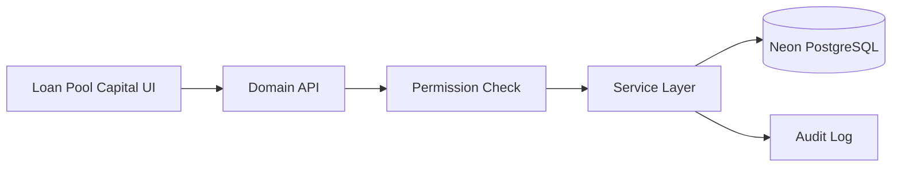

### Chapter 5.Payments — Collections & Payments

**Module ID:** `payments`

#### Purpose

Weekly field collections with GPS, admin fees, and immutability rules.

#### Authorised roles

- Collector
- Super Admin

#### Core capabilities

- Full weekly payment recording (no partial payments)
- Oldest obligation first allocation
- GPS metadata on field capture
- Same-day edit window for collectors
- Immutability after day-end boundary
- Admin fee recording
- Payment reversal under controlled paths

#### Primary routes

- `/collector/payment/[id]`
- `/collector/admin-fee`
- `/reports/daily-collection`

#### API surface (representative)

- `POST /payments`
- `POST /payments/:id/reverse`
- `GET /payments`

#### Operational notes

The Collections & Payments module integrates with the domain service layer in `packages/domain/src/services/`. All mutations pass through RBAC permission checks and are recorded in the append-only audit log where applicable. Financial modules enforce integer pesewas arithmetic and maker-checker rules as documented in the Financial Engine Book.

#### Data integrity controls

- Permission middleware on every mutating endpoint
- Input validation via shared validation schemas
- Audit log entry on state-changing operations
- Fail-closed behaviour on safety threshold violations


### Chapter 6.Reconciliation — Daily Reconciliation

**Module ID:** `reconciliation`

#### Purpose

Match collector-recorded cash against physical counts and system totals.

#### Authorised roles

- Collector
- Super Admin
- Approver

#### Core capabilities

- End-of-day reconciliation submission
- Variance flagging with configurable thresholds
- HQ review queue
- Overpayment review workflow
- Resubmission for rejected/reopened rows
- History preservation on resubmit

#### Primary routes

- `/collector/reconciliation`

#### API surface (representative)

- `POST /reconciliation`
- `GET /reconciliation`
- `PATCH /reconciliation/:id/review`

#### Operational notes

The Daily Reconciliation module integrates with the domain service layer in `packages/domain/src/services/`. All mutations pass through RBAC permission checks and are recorded in the append-only audit log where applicable. Financial modules enforce integer pesewas arithmetic and maker-checker rules as documented in the Financial Engine Book.

#### Data integrity controls

- Permission middleware on every mutating endpoint
- Input validation via shared validation schemas
- Audit log entry on state-changing operations
- Fail-closed behaviour on safety threshold violations

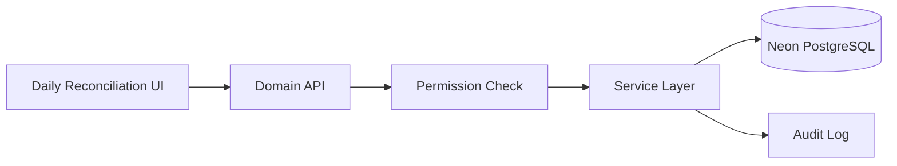

### Chapter 7.Expenses — Expense Management

**Module ID:** `expenses`

#### Purpose

Field and HQ expense tracking with maker-checker approval.

#### Authorised roles

- Collector
- Super Admin

#### Core capabilities

- Expense submission with category and receipt
- Maker-checker review (submitter cannot approve own)
- Operating cash impact (not loan principal)
- In-app notifications on submit/review
- Expense summary reports

#### Primary routes

- `/expenses`
- `/collector/expenses`

#### API surface (representative)

- `POST /expenses`
- `PATCH /expenses/:id/review`
- `GET /expenses`

#### Operational notes

The Expense Management module integrates with the domain service layer in `packages/domain/src/services/`. All mutations pass through RBAC permission checks and are recorded in the append-only audit log where applicable. Financial modules enforce integer pesewas arithmetic and maker-checker rules as documented in the Financial Engine Book.

#### Data integrity controls

- Permission middleware on every mutating endpoint
- Input validation via shared validation schemas
- Audit log entry on state-changing operations
- Fail-closed behaviour on safety threshold violations


### Chapter 8.Groups — Group Management

**Module ID:** `groups`

#### Purpose

Community borrowing group formation and collector assignment.

#### Authorised roles

- Super Admin

#### Core capabilities

- Group creation with size bounds (5–15 default)
- Member assignment
- Collector assignment
- Group risk reporting
- Group dissolve workflow (enterprise)

#### Primary routes

- `/groups`
- `/groups/[id]`

#### API surface (representative)

- `GET/POST /groups`
- `PATCH /groups/:id`
- `POST /groups/:id/members`

#### Operational notes

The Group Management module integrates with the domain service layer in `packages/domain/src/services/`. All mutations pass through RBAC permission checks and are recorded in the append-only audit log where applicable. Financial modules enforce integer pesewas arithmetic and maker-checker rules as documented in the Financial Engine Book.

#### Data integrity controls

- Permission middleware on every mutating endpoint
- Input validation via shared validation schemas
- Audit log entry on state-changing operations
- Fail-closed behaviour on safety threshold violations


### Chapter 9.Collectors — Collector Management

**Module ID:** `collectors`

#### Purpose

Field agent profiles, assignments, and performance tracking.

#### Authorised roles

- Super Admin

#### Core capabilities

- Collector directory
- Assignment to groups and borrowers
- Performance metrics in reports
- Field shell access control

#### Primary routes

- `/collectors`
- `/collectors/[id]`

#### API surface (representative)

- `GET /collectors`
- `GET /collectors/:id`
- `PATCH /collectors/:id`

#### Operational notes

The Collector Management module integrates with the domain service layer in `packages/domain/src/services/`. All mutations pass through RBAC permission checks and are recorded in the append-only audit log where applicable. Financial modules enforce integer pesewas arithmetic and maker-checker rules as documented in the Financial Engine Book.

#### Data integrity controls

- Permission middleware on every mutating endpoint
- Input validation via shared validation schemas
- Audit log entry on state-changing operations
- Fail-closed behaviour on safety threshold violations


### Chapter 10.Reports — Reporting

**Module ID:** `reports`

#### Purpose

Operational and financial reports with contextual export actions.

#### Authorised roles

- Super Admin
- Auditor

#### Core capabilities

- Loan portfolio report
- Daily collection report
- Defaulter report
- Collector performance report
- Group risk report
- Financial ledger report
- Aging analysis and write-offs (v1.6.2+)
- Contextual PDF, Excel, CSV, Print exports (v1.7.3 primary pattern)
- 422 fail-closed on oversized unpaginated lists

#### Primary routes

- `/reports`
- `/reports/*`
- `/auditor/reports`

#### API surface (representative)

- `GET /reports/*`
- `POST /exports/jobs`

#### Operational notes

The Reporting module integrates with the domain service layer in `packages/domain/src/services/`. All mutations pass through RBAC permission checks and are recorded in the append-only audit log where applicable. Financial modules enforce integer pesewas arithmetic and maker-checker rules as documented in the Financial Engine Book.

#### Data integrity controls

- Permission middleware on every mutating endpoint
- Input validation via shared validation schemas
- Audit log entry on state-changing operations
- Fail-closed behaviour on safety threshold violations

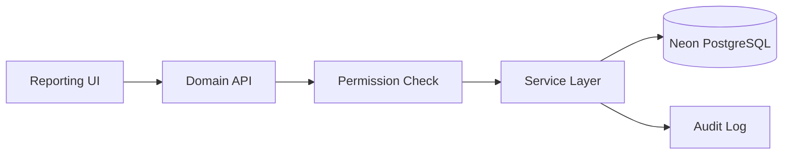

### Chapter 11.Intelligence — Executive Intelligence

**Module ID:** `intelligence`

#### Purpose

Board-grade KPIs, forecasting, and compliance packs.

#### Authorised roles

- Super Admin

#### Core capabilities

- Financial KPI cards
- Operational KPI cards
- Risk indicator summary
- Schedule-based forecasting
- Portfolio breakdown by district/community/group
- Compliance pack generation
- Contextual export buttons

#### Primary routes

- `/executive`

#### API surface (representative)

- `GET /intelligence/*`
- `GET /analytics/*`

#### Operational notes

The Executive Intelligence module integrates with the domain service layer in `packages/domain/src/services/`. All mutations pass through RBAC permission checks and are recorded in the append-only audit log where applicable. Financial modules enforce integer pesewas arithmetic and maker-checker rules as documented in the Financial Engine Book.

#### Data integrity controls

- Permission middleware on every mutating endpoint
- Input validation via shared validation schemas
- Audit log entry on state-changing operations
- Fail-closed behaviour on safety threshold violations


### Chapter 12.Notifications — Notifications

**Module ID:** `notifications`

#### Purpose

Multi-channel alerts with deduplication and quiet hours.

#### Authorised roles

- All roles (filtered by relevance)

#### Core capabilities

- In-app notification inbox
- Email transactional delivery
- SMS field alerts (provider-configured)
- Deduplication window
- Quiet hours respect
- Daily cron dispatch 06:00 UTC

#### Primary routes

- `Notification drawer (global)`

#### API surface (representative)

- `GET /notifications`
- `PATCH /notifications/:id/read`
- `POST /api/cron/notifications`

#### Operational notes

The Notifications module integrates with the domain service layer in `packages/domain/src/services/`. All mutations pass through RBAC permission checks and are recorded in the append-only audit log where applicable. Financial modules enforce integer pesewas arithmetic and maker-checker rules as documented in the Financial Engine Book.

#### Data integrity controls

- Permission middleware on every mutating endpoint
- Input validation via shared validation schemas
- Audit log entry on state-changing operations
- Fail-closed behaviour on safety threshold violations

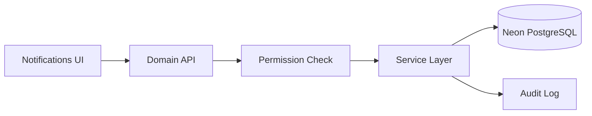

### Chapter 13.Communications — Communications Center

**Module ID:** `communications`

#### Purpose

Programme-wide messaging, templates, and broadcasts.

#### Authorised roles

- Super Admin

#### Core capabilities

- Message templates with variables
- Role-targeted broadcasts
- Audience segments (borrowers, groups, auditors, custom)
- Delivery analytics
- Read receipts for in-app messages

#### Primary routes

- `/communication-center`

#### API surface (representative)

- `GET/POST /communications/*`

#### Operational notes

The Communications Center module integrates with the domain service layer in `packages/domain/src/services/`. All mutations pass through RBAC permission checks and are recorded in the append-only audit log where applicable. Financial modules enforce integer pesewas arithmetic and maker-checker rules as documented in the Financial Engine Book.

#### Data integrity controls

- Permission middleware on every mutating endpoint
- Input validation via shared validation schemas
- Audit log entry on state-changing operations
- Fail-closed behaviour on safety threshold violations

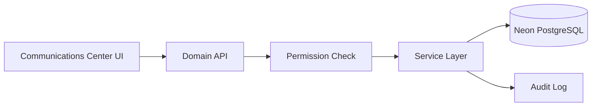

### Chapter 14.Ops — Operations Control

**Module ID:** `ops`

#### Purpose

System health, incidents, maintenance windows, and runtime metrics.

#### Authorised roles

- Super Admin

#### Core capabilities

- Health metrics dashboard
- Ops incident tracking
- Maintenance window scheduling
- Financial alert monitoring
- Deployment version display

#### Primary routes

- `/ops`

#### API surface (representative)

- `GET /ops/*`
- `GET /health`

#### Operational notes

The Operations Control module integrates with the domain service layer in `packages/domain/src/services/`. All mutations pass through RBAC permission checks and are recorded in the append-only audit log where applicable. Financial modules enforce integer pesewas arithmetic and maker-checker rules as documented in the Financial Engine Book.

#### Data integrity controls

- Permission middleware on every mutating endpoint
- Input validation via shared validation schemas
- Audit log entry on state-changing operations
- Fail-closed behaviour on safety threshold violations

```mermaid
flowchart LR
    UI[Operations Control UI] --> API[Domain API]
    API --> RBAC[Permission Check]
    RBAC --> SVC[Service Layer]
    SVC --> DB[(Neon PostgreSQL)]
    SVC --> AUDIT[Audit Log]
```

### Chapter 15.Audit — Audit Log

**Module ID:** `audit`

#### Purpose

Append-only immutable action log for compliance.

#### Authorised roles

- Super Admin
- Auditor

#### Core capabilities

- Actor, action, entity, timestamp recording
- Role-scoped read access
- Report and export integration
- No delete or modify operations

#### Primary routes

- `/reports/audit-log`
- `/auditor/audit-log`

#### API surface (representative)

- `GET /audit`
- `GET /reports/audit-log`

#### Operational notes

The Audit Log module integrates with the domain service layer in `packages/domain/src/services/`. All mutations pass through RBAC permission checks and are recorded in the append-only audit log where applicable. Financial modules enforce integer pesewas arithmetic and maker-checker rules as documented in the Financial Engine Book.

#### Data integrity controls

- Permission middleware on every mutating endpoint
- Input validation via shared validation schemas
- Audit log entry on state-changing operations
- Fail-closed behaviour on safety threshold violations

```mermaid
flowchart LR
    UI[Audit Log UI] --> API[Domain API]
    API --> RBAC[Permission Check]
    RBAC --> SVC[Service Layer]
    SVC --> DB[(Neon PostgreSQL)]
    SVC --> AUDIT[Audit Log]
```

### Chapter 16.Settings — System Settings

**Module ID:** `settings`

#### Purpose

Organisation config, users, roles, permissions, and integrations.

#### Authorised roles

- Super Admin

#### Core capabilities

- User CRUD with role assignment
- Permission overrides
- Force-logout
- Login history
- Organisation holidays
- Security policy configuration

#### Primary routes

- `/settings`

#### API surface (representative)

- `GET/PATCH /settings/*`
- `GET/POST /users/*`

#### Operational notes

The System Settings module integrates with the domain service layer in `packages/domain/src/services/`. All mutations pass through RBAC permission checks and are recorded in the append-only audit log where applicable. Financial modules enforce integer pesewas arithmetic and maker-checker rules as documented in the Financial Engine Book.

#### Data integrity controls

- Permission middleware on every mutating endpoint
- Input validation via shared validation schemas
- Audit log entry on state-changing operations
- Fail-closed behaviour on safety threshold violations

```mermaid
flowchart LR
    UI[System Settings UI] --> API[Domain API]
    API --> RBAC[Permission Check]
    RBAC --> SVC[Service Layer]
    SVC --> DB[(Neon PostgreSQL)]
    SVC --> AUDIT[Audit Log]
```

### Chapter 17.Sync — Offline Sync

**Module ID:** `sync`

#### Purpose

Collector offline queue replay on reconnect.

#### Authorised roles

- Collector

#### Core capabilities

- localStorage-persisted queue
- FIFO drain on reconnect
- GPS metadata preservation
- Conflict resolution (server wins)
- Sync failure user notification

#### Primary routes

- `Collector field shell`

#### API surface (representative)

- `POST /sync/replay`

#### Operational notes

The Offline Sync module integrates with the domain service layer in `packages/domain/src/services/`. All mutations pass through RBAC permission checks and are recorded in the append-only audit log where applicable. Financial modules enforce integer pesewas arithmetic and maker-checker rules as documented in the Financial Engine Book.

#### Data integrity controls

- Permission middleware on every mutating endpoint
- Input validation via shared validation schemas
- Audit log entry on state-changing operations
- Fail-closed behaviour on safety threshold violations

```mermaid
flowchart LR
    UI[Offline Sync UI] --> API[Domain API]
    API --> RBAC[Permission Check]
    RBAC --> SVC[Service Layer]
    SVC --> DB[(Neon PostgreSQL)]
    SVC --> AUDIT[Audit Log]
```

### Chapter 18.Adjustments — Ledger Adjustments

**Module ID:** `adjustments`

#### Purpose

Supervised capital corrections with maker-checker controls.

#### Authorised roles

- Super Admin

#### Core capabilities

- Adjustment submission
- Review and approve/reject workflow
- Audited actor tracking
- Pool ledger ADJUSTMENT entries

#### Primary routes

- `/adjustments`

#### API surface (representative)

- `POST /adjustments`
- `PATCH /adjustments/:id/review`

#### Operational notes

The Ledger Adjustments module integrates with the domain service layer in `packages/domain/src/services/`. All mutations pass through RBAC permission checks and are recorded in the append-only audit log where applicable. Financial modules enforce integer pesewas arithmetic and maker-checker rules as documented in the Financial Engine Book.

#### Data integrity controls

- Permission middleware on every mutating endpoint
- Input validation via shared validation schemas
- Audit log entry on state-changing operations
- Fail-closed behaviour on safety threshold violations

```mermaid
flowchart LR
    UI[Ledger Adjustments UI] --> API[Domain API]
    API --> RBAC[Permission Check]
    RBAC --> SVC[Service Layer]
    SVC --> DB[(Neon PostgreSQL)]
    SVC --> AUDIT[Audit Log]
```

### Chapter 19.Risk Flags — Risk Flags

**Module ID:** `risk-flags`

#### Purpose

Borrower, group, and loan risk signal management.

#### Authorised roles

- Super Admin
- Approver
- Auditor

#### Core capabilities

- Automatic and manual flag creation
- Review queue for approvers
- Integration with reports and intelligence

#### Primary routes

- `/risk-flags`

#### API surface (representative)

- `GET/POST /risk-flags`
- `PATCH /risk-flags/:id`

#### Operational notes

The Risk Flags module integrates with the domain service layer in `packages/domain/src/services/`. All mutations pass through RBAC permission checks and are recorded in the append-only audit log where applicable. Financial modules enforce integer pesewas arithmetic and maker-checker rules as documented in the Financial Engine Book.

#### Data integrity controls

- Permission middleware on every mutating endpoint
- Input validation via shared validation schemas
- Audit log entry on state-changing operations
- Fail-closed behaviour on safety threshold violations

```mermaid
flowchart LR
    UI[Risk Flags UI] --> API[Domain API]
    API --> RBAC[Permission Check]
    RBAC --> SVC[Service Layer]
    SVC --> DB[(Neon PostgreSQL)]
    SVC --> AUDIT[Audit Log]
```

---

## Part IV — Extended version history

Comprehensive release lineage from v1.0.0 through v1.7.3.

### 1.0.0 (2026 Q1)

**Focus:** Initial platform foundation

**Deliverables:**

- Next.js scaffolding
- Basic auth
- Borrower registration
- Initial RBAC

**Platform impact:**

- Foundation modules; RBAC; core lending lifecycle

### 1.1.0 (2026 Q1)

**Focus:** Core lending workflows

**Deliverables:**

- Loan application flow
- Approval queue
- Basic collections

**Platform impact:**

- Foundation modules; RBAC; core lending lifecycle

### 1.2.0 (2026 Q1–Q2)

**Focus:** Field operations

**Deliverables:**

- Collector portal
- GPS capture
- Daily reconciliation

**Platform impact:**

- Foundation modules; RBAC; core lending lifecycle

### 1.3.0 (2026 Q2)

**Focus:** Financial integrity

**Deliverables:**

- Pool ledger
- Admin fee gate
- Payment immutability
- Integer pesewas

**Platform impact:**

- Financial integrity controls; pool ledger; certification evidence

### 1.3.5 (2026 Q2)

**Focus:** Enterprise hardening

**Deliverables:**

- Audit log
- Expense workflow
- Report foundation

**Platform impact:**

- Financial integrity controls; pool ledger; certification evidence

### 1.3.7 (2026 Q2)

**Focus:** Financial certification prep

**Deliverables:**

- Reversal engine
- Dashboard SQL aggregates
- Integrity audits

**Platform impact:**

- Financial integrity controls; pool ledger; certification evidence

### 1.3.8 (2026 Q2)

**Focus:** Enterprise financial

**Deliverables:**

- Pool accounting certification
- SoD audit
- Expense engine verification

**Platform impact:**

- Financial integrity controls; pool ledger; certification evidence

### 1.4.0 (2026 Q2)

**Focus:** Production readiness

**Deliverables:**

- Final financial integrity audit
- Report truncation refusal
- Multi-phase certification

**Platform impact:**

- Financial integrity controls; pool ledger; certification evidence

### 1.4.1 (2026 Q2)

**Focus:** Stabilization

**Deliverables:**

- Financial model documentation
- Residual SoD tracking
- Production cutover validation

**Platform impact:**

- Financial integrity controls; pool ledger; certification evidence

### 1.5.0 (2026 Q2–Q3)

**Focus:** Platform consolidation

**Deliverables:**

- @wilms/domain extraction
- Route Handlers migration
- Vercel Cron
- In-process API default

**Platform impact:**

- Domain package architecture; Route Handlers; Vercel deployment patterns

### 1.5.1 (2026 Q3)

**Focus:** Financial workflow fixes

**Deliverables:**

- Reconciliation edge cases
- Pool reconcile runtime
- Migration 0025

**Platform impact:**

- Domain package architecture; Route Handlers; Vercel deployment patterns

### 1.6.0 (2026 Q3)

**Focus:** Communication center

**Deliverables:**

- Audience segments
- Broadcasts
- Read receipts
- Notification automation

**Platform impact:**

- Domain package architecture; Route Handlers; Vercel deployment patterns

### 1.6.1 (2026 Q3)

**Focus:** Product excellence UI

**Deliverables:**

- Design system tokens
- Command palette
- Sticky navbar
- Activity timeline
- Export standard

**Platform impact:**

- Domain package architecture; Route Handlers; Vercel deployment patterns

### 1.6.2 (2026 Q3)

**Focus:** Enterprise readiness

**Deliverables:**

- Write-off reports
- Aging analysis
- Force logout
- Org holidays
- Migration 0034

**Platform impact:**

- Domain package architecture; Route Handlers; Vercel deployment patterns

### 1.7.0 (2026 Q3)

**Focus:** Enterprise finance & intelligence

**Deliverables:**

- Executive intelligence
- Forecasting
- Export jobs API
- Ops incidents
- Migration 0035

**Platform impact:**

- Documentation and packaging emphasis; financial formulas unchanged in v1.7.3

### 1.7.1 (2026 Q3)

**Focus:** Market readiness

**Deliverables:**

- Dashboard vs executive separation
- Recent Activity feed
- Modal hardening
- Branded PDF covers

**Platform impact:**

- Documentation and packaging emphasis; financial formulas unchanged in v1.7.3

### 1.7.2 (2026 Q3)

**Focus:** RC stabilization

**Deliverables:**

- Financial-grade dashboard
- Export Center actions
- Product Tour 2.0
- Nav polish

**Platform impact:**

- Documentation and packaging emphasis; financial formulas unchanged in v1.7.3

### 1.7.3 (2026 Q3)

**Focus:** Documentation suite

**Deliverables:**

- Official documentation library
- PDF/DOCX generation
- Export Center UI removal
- Contextual exports
- In-app documentation portal
- Financial Engine book

**Platform impact:**

- Documentation and packaging emphasis; financial formulas unchanged in v1.7.3

---

## Part V — RBAC matrix narrative

WILMS implements role-based access control with five production roles. Super Admin receives all permissions. Other roles receive curated subsets enforcing separation of duties.

### Permission catalogue

| Permission ID | Description |
|---------------|-------------|
| `access-admin-portal` | Enter Super Admin portal routes |
| `access-collector-portal` | Enter collector field shell |
| `access-registration-portal` | Enter registration officer portal |
| `access-approver-portal` | Enter approver portal |
| `access-auditor-portal` | Enter auditor read-only portal |
| `register-borrowers` | Create new borrower records |
| `edit-borrowers` | Modify borrower profiles |
| `edit-pending-registrations` | Edit pending registration submissions |
| `capture-documents` | Upload borrower documents |
| `upload-signatures` | Capture borrower signatures |
| `gps-verification` | Record GPS coordinates |
| `manage-groups` | Create and modify borrowing groups |
| `view-assigned-borrowers` | View borrowers assigned to collector |
| `record-collections` | Record payment collections |
| `record-expenses` | Submit field expenses |
| `view-reports` | Access operational reports |
| `view-financial-reports` | Access financial reports and executive intelligence |
| `export-reports` | Generate report exports |
| `view-audit-log` | Read audit log entries |
| `review-applications` | Review pending applications |
| `approve-borrowers` | Approve borrower registrations |
| `approve-loans` | Approve loan applications |
| `reject-loans` | Reject loan applications |
| `review-risk-flags` | Review and resolve risk flags |
| `manage-users` | Create and manage user accounts |
| `manage-system-settings` | Configure organisation settings |
| `manage-expenses` | Review and approve expenses |
| `view-all-collectors` | View collector directory |
| `force-logout` | Terminate active user sessions |
| `manage-communications` | Access communication center |
| `view-communication-analytics` | View communication delivery analytics |
| `send-broadcast` | Send programme-wide broadcasts |

### Role-permission summary

| Permission | Super Admin | Officer | Collector | Approver | Auditor |
|------------|:-----------:|:-------:|:---------:|:--------:|:-------:|
| Portal access (role-specific) | Admin | Registration | Collector | Approver | Auditor |
| Register borrowers | ✓ | ✓ | ✓ | | |
| Approve loans | ✓ | | | ✓ | |
| Record collections | ✓ | | ✓ | | |
| View reports | ✓ | | | | ✓ |
| Export reports | ✓ | | | | ✓ |
| View audit log | ✓ | | | | ✓ |
| Manage users | ✓ | | | | |
| Manage communications | ✓ | | | | |

Canonical source: `packages/shared-rbac/src/role-permissions.ts`

### Separation of duties matrix

| Operation | Submitter role | Approver role | Enforcement |
|-----------|----------------|---------------|-------------|
| Loan approval | Registration Officer | Approver | Policy + RBAC |
| Expense posting | Collector/Admin | Different user | Maker-checker API |
| Disbursement | — | Super Admin/Approver | Admin fee + pool gate |
| Pool adjustment | Admin | Reviewer | Adjustments workflow |
| Audit log delete | — | — | Not permitted |

---

## Part VI — Roadmap v1.8–v3.0 (detailed)

### v1.8 — Integrations and payments

**Estimated effort:** 8–12 weeks

**Planned deliverables:**

- MTN MoMo integration
- Vodafone Cash integration
- Bank statement import
- Webhook infrastructure
- OpenAPI spec generation

**Dependencies:** Prior release certification; partner requirements gathering; infrastructure scaling assessment.

### v1.9 — Enterprise automation

**Estimated effort:** 6–10 weeks

**Planned deliverables:**

- Workflow rules engine
- Scheduled report delivery
- Advanced notification routing
- Bulk import/export tooling

**Dependencies:** Prior release certification; partner requirements gathering; infrastructure scaling assessment.

### v2.0 — General ledger and multi-branch

**Estimated effort:** 16–24 weeks

**Planned deliverables:**

- Statutory double-entry GL
- Multi-organisation tenancy
- Branch-level pool isolation
- Inter-branch transfers

**Dependencies:** Prior release certification; partner requirements gathering; infrastructure scaling assessment.

### v2.5 — Borrower engagement

**Estimated effort:** 8–12 weeks

**Planned deliverables:**

- Borrower SMS notifications
- Payment reminder automation
- Optional read-only borrower portal

**Dependencies:** Prior release certification; partner requirements gathering; infrastructure scaling assessment.

### v3.0 — Platform scale

**Estimated effort:** 20–30 weeks

**Planned deliverables:**

- Multi-region deployment
- ML risk scoring
- Localized UI (Twi, Ga, Ewe)
- Partner API marketplace

**Dependencies:** Prior release certification; partner requirements gathering; infrastructure scaling assessment.

---

## Part VII — Skipped and deferred (detailed rationale)

| Item | Status | Rationale |
|------|--------|-----------|
| Borrower self-service portal | Deferred | HQ-operated programme model; borrowers interact through field staff |
| Multi-organisation tenancy | Deferred v2.0 | Current partners deploy single-org; isolation complexity not yet required |
| Statutory double-entry GL | Deferred v2.0 | Operational pool ledger meets programme audit needs today |
| Native mobile app | Deferred | PWA and responsive field shell adequate for current field operations |
| Deep payment provider integrations | Deferred v1.8 | Cash-first model; MoMo/bank APIs planned next release line |
| Full shadcn migration | Partial | High-traffic routes migrated; remainder scheduled post-RC |
| WCAG full audit pass | In progress | Remediations ongoing per QA units |
| Localized user guides | Deferred v2.x | English manuals first; Twi/Ga/Ewe translation planned |
| Redis + BullMQ job queue | Deferred | Vercel Cron and in-process sufficient at current scale |
| Standalone Export Center | Removed v1.7.3 | Contextual exports reduce duplicate navigation; API retained |

---

## Part VIII — Appendices (expanded)

### Appendix A — Glossary (80+ terms)

| Term | Definition |
|------|------------|
| Admin fee | One-time fee collected before loan disbursement; gate enforced by system |
| Adjustment | Audited capital correction posted to pool ledger as ADJUSTMENT type |
| Allocation | Pool ledger entry linking capital movement to a loan or repayment |
| Append-only audit | Audit log design where entries are never deleted or modified |
| Approver | Role authorised to approve or reject loan and borrower applications |
| Auditor | Read-only role for reports, audit log, and exports |
| Available capital | Pool capital minus outstanding disbursed amounts not yet repaid |
| BFF | Backend-for-frontend; Next.js Route Handlers proxying to domain API |
| Borrower | Loan recipient registered through KYC workflow |
| Capital replenishment | Injection of funds into a loan pool via REPLENISHMENT allocation |
| Cash-first model | Programme design assuming physical cash collections in the field |
| Collection delta | Difference between physical cash count and system-recorded collections |
| Collector | Field agent recording weekly payments and daily reconciliation |
| Compliance pack | Executive intelligence export bundle for board and donor review |
| Contextual export | Export action embedded in the page displaying source data (v1.7.3 pattern) |
| CSRF | Cross-site request forgery protection on mutating BFF paths |
| Daily reconciliation | End-of-day matching of collector cash against system totals |
| Day-end boundary | Time after which payment records become immutable |
| Defaulted loan | Loan with missed repayments exceeding programme threshold |
| Disbursement | Release of loan principal from pool to borrower; DISBURSEMENT allocation |
| Domain package | @wilms/domain — services, Drizzle ORM, Express HTTP app |
| Deduplication | Notification system preventing duplicate alerts within a time window |
| Drizzle ORM | Type-safe SQL query layer used against Neon PostgreSQL |
| Dual-run mode | Development configuration proxying API to standalone Node on port 4000 |
| Executive intelligence | Board-grade KPI dashboard at /executive |
| Expense | Operating cost submission affecting operating cash, not loan principal |
| Export job | Tracked async export generation record; API retained post v1.7.3 |
| Fail-closed | System refusing operation when safety threshold exceeded (e.g. report 422) |
| Field shell | Mobile-optimised collector UI profile |
| Force-logout | Super Admin capability to terminate active user sessions |
| Forecast | Schedule-based projection of expected collections over configurable horizon |
| Full weekly payment | Business rule requiring complete weekly instalment; no partial payments |
| GPS capture | Geographic coordinates recorded with field transactions |
| Group | Community borrowing unit with assigned collector and size bounds |
| Hard-stop | System refusal when business rule violated (e.g. insufficient pool capital) |
| HMAC session | Custom signed session cookie using WILMS_SESSION_SECRET |
| Immutable payment | Payment record that cannot be edited after day-end boundary |
| In-process API | Default deployment running domain Express inside Next.js Route Handlers |
| Instalment | Scheduled weekly repayment amount on active loan |
| Integer pesewas | Money stored as whole pesewas; 100 pesewas = 1 GHS |
| KYC | Know Your Customer — borrower identity verification during registration |
| Loan pool | Capital fund from which loans are disbursed and to which repayments return |
| Maker-checker | Dual-control requiring different users for submit and approve actions |
| Migration journal | Numbered SQL files in packages/domain/drizzle applied sequentially |
| Neon PostgreSQL | Serverless PostgreSQL database provider for production |
| Net operating cash | Collections plus admin fees minus approved expenses |
| Notification inbox | In-app message centre with read/unread state |
| Office shell | Desktop-optimised admin UI profile for HQ roles |
| Oldest obligation first | Payment allocation rule applying funds to earliest due instalment |
| Operating cash | Programme cash from collections and fees minus expenses |
| Ops incident | Operational incident record tracked in ops module |
| Organisation holiday | Configured non-collection day affecting schedules |
| Outstanding | Unpaid loan principal: disbursed minus collected |
| Overpayment review | Workflow for resolving collection amounts exceeding expected due |
| Payment reversal | Controlled unwind of payment allocation and ledger state |
| Pending registration | Borrower record awaiting approver review |
| Permission override | Individual permission grant/revoke beyond role defaults |
| Pesewas | Smallest currency unit; 100 pesewas = 1 Ghana Cedi (GHS) |
| Pool ledger | Append-only allocation journal for pool capital movements |
| Pool utilisation | Percentage of pool capital currently disbursed and outstanding |
| Primary variance | Physical cash minus expected due in reconciliation |
| Product Tour | Guided onboarding overlay for new users (v1.7.2 Product Tour 2.0) |
| Quiet hours | Organisation setting suppressing non-critical notifications |
| RBAC | Role-based access control with five production roles |
| Registration Officer | HQ role capturing new borrower registrations |
| Replenishment | Capital injection event increasing pool funds |
| Repayment | Borrower payment reducing outstanding; REPAYMENT allocation |
| Report truncation | Refusal (HTTP 422) when unpaginated report exceeds safe size |
| Reversal allocation | Negative ledger entry unwinding a prior REPAYMENT |
| Risk flag | Indicator on borrower, group, or loan requiring review |
| Route Handler | Next.js API route at /api/wilms forwarding to domain |
| Same-day edit window | Period during which collectors may correct same-day payments |
| Schedule | Generated repayment plan with weekly instalment dates and amounts |
| Separation of duties | SoD — distinct roles for conflicting financial operations |
| Session cookie | wilms_session HMAC-signed token in browser cookie jar |
| Soft-fail | Graceful degradation when optional tables (e.g. migration 0035) missing |
| Super Admin | Full programme administrator role |
| Sync queue | Offline collector operation queue replayed on reconnect |
| Transaction | Pool ledger entry of type REPLENISHMENT, DISBURSEMENT, REPAYMENT, or ADJUSTMENT |
| Utilisation percent | MIN(ROUND(disbursed / capital × 100), 100) per pool |
| Variance threshold | Configurable percentage triggering reconciliation flag (default 10%) |
| Vercel Cron | Scheduled job runner for daily notification dispatch |
| Write-off | Loan balance removal via adjustments maker-checker workflow |
| Zustand | Client state library for auth, offline queue, theme, shell layout |
| 422 fail-closed | HTTP 422 returned when report query exceeds unpaginated safety limit |
| Interest-free | Product model with no interest accrual engine |
| Statutory GL | Double-entry general ledger — explicitly not implemented; deferred v2.0 |
| Multi-tenancy | Multiple organisations in one deployment — deferred v2.0 |
| PWA | Progressive Web App capabilities for field collector access |
| Compliance footer | Confidentiality notice appended to all export artefacts |
| Demo mode | Development UI path disabled in production via environment guard |
| Login OTP | Optional one-time password challenge on login |
| Bcrypt | Password hashing algorithm used for credential storage |
| Helmet | HTTP security headers middleware in production domain app |
| CSP | Content Security Policy configured with Vercel feedback allowlist |
| Rate limiting | API throttling; Redis-backed when REDIS_URL configured |
| ExcelJS | Spreadsheet export engine for report downloads |
| jsPDF | PDF generation library for exports and documentation suite |
| Turborepo | Monorepo build orchestration tool |
| Vitest | Unit and integration test runner |
| Playwright | End-to-end browser test framework |

### Appendix B — Environment variables catalogue

| Variable | Required | Purpose | Notes |
|----------|----------|---------|-------|
| `DATABASE_URL` | Yes (prod) | Neon PostgreSQL pooled connection string | Secret |
| `WILMS_SESSION_SECRET` | Yes (prod) | HMAC key for session token signing | Secret; 32+ chars |
| `NEXT_PUBLIC_API_BASE_URL` | Yes | Browser API prefix | /api/wilms |
| `NEXT_PUBLIC_USE_MOCK` | Yes (live) | Disable mock service layer | false |
| `NEXT_PUBLIC_APP_URL` | Recommended | Public site URL for links | https://wilms.vercel.app |
| `NEXT_PUBLIC_WILMS_ENV` | Optional | Environment label | production / development |
| `NEXT_PUBLIC_APP_LOCK_IDLE_MS` | Optional | App lock idle timeout ms | 300000 |
| `WILMS_API_MODE` | Optional | Set proxy for dual-run | proxy |
| `WILMS_API_UPSTREAM` | If proxy | Upstream Node API URL | http://127.0.0.1:4000 |
| `REDIS_URL` | Prod serverless | Shared rate-limit store | Secret |
| `WILMS_REDIS_URL` | Alt to REDIS_URL | Redis connection | Secret |
| `WILMS_SCHEDULER_TOKEN` | Cron/API | Bearer for scheduler routes | Secret |
| `CRON_SECRET` | Recommended | Vercel Cron bearer for notifications | Secret |
| `WILMS_METRICS_TOKEN` | Optional | Prometheus scrape bearer | Secret |
| `WILMS_CORS_ORIGIN` | Standalone Node | CORS allowlist | — |
| `WILMS_APP_URL` | Optional | Canonical app URL | — |
| `WILMS_API_PORT` | Optional | Node adapter listen port | 4000 |
| `WILMS_TRUST_PROXY` | Optional | Express trust proxy | — |
| `WILMS_MIN_GROUP_SIZE` | Optional | Minimum group members | 5 |
| `WILMS_MAX_GROUP_SIZE` | Optional | Maximum group members | 15 |
| `UPLOAD_PROVIDER` | Prod typical | local or cloudinary | cloudinary |
| `CLOUDINARY_CLOUD_NAME` | If Cloudinary | Cloud name | Secret |
| `CLOUDINARY_API_KEY` | If Cloudinary | API key | Secret |
| `CLOUDINARY_API_SECRET` | If Cloudinary | API secret | Secret |
| `MAIL_PROVIDER` | Optional | none, gmail, resend, etc. | — |
| `MAIL_FROM` | Optional | From email address | — |
| `SMS_PROVIDER` | Optional | none, smsnotifygh, etc. | — |
| `SMSNOTIFYGH_API_KEY` | If SMSNotifyGH | SMS API key | Secret |
| `NEXT_PUBLIC_DEMO_MODE` | Dev only | Force demo UI | unset in prod |
| `WILMS_RUNTIME` | Optional | serverless disables workers | auto on Vercel |
| `VERCEL_GIT_COMMIT_SHA` | Injected | Commit SHA in health | — |

Full reference: `docs/environment.md`

### Appendix C — Migration journal (placeholders)

| Migration | Description |
|-----------|-------------|
| 0001 | Schema evolution |
| 0002 | Schema evolution |
| 0003 | Schema evolution |
| 0004 | Schema evolution |
| 0005 | Schema evolution |
| 0006 | Schema evolution |
| 0007 | Schema evolution |
| 0008 | Schema evolution |
| 0009 | Schema evolution |
| 0010 | Schema evolution |
| 0011 | Schema evolution |
| 0012 | Schema evolution |
| 0013 | Schema evolution |
| 0014 | Schema evolution |
| 0015 | Schema evolution |
| 0016 | Schema evolution |
| 0017 | Schema evolution |
| 0018 | Schema evolution |
| 0019 | Schema evolution |
| 0020 | Schema evolution |
| 0021 | Schema evolution |
| 0022 | Schema evolution |
| 0023 | Schema evolution |
| 0024 | Schema evolution |
| 0025 | Pool reconcile runtime support |
| 0026 | Schema evolution |
| 0027 | Schema evolution |
| 0028 | Schema evolution |
| 0029 | Schema evolution |
| 0030 | Schema evolution |
| 0031 | Schema evolution |
| 0032 | Schema evolution |
| 0033 | Schema evolution |
| 0034 | Enterprise readiness workflows |
| 0035 | Finance reporting intelligence (jobs, alerts, incidents) |

Verify integrity: `npm run verify:migrations -w @wilms/domain`

### Appendix D — Compliance and data protection

- Audit log retained indefinitely (no automated purge)
- Export artefacts include confidentiality footer
- Demo accounts disabled in production via environment guard
- Password policy enforced via shared validation schemas
- Upload file types restricted to MIME allowlist
- Programme operates under partner data processing agreements
- GDPR-aligned data subject requests handled per partner policy
- Session tokens signed with HMAC; rotation requires planned maintenance
- Force-logout available for personnel offboarding
- Financial reports fail-closed rather than truncate silently

### Appendix E — Financial Engine Book cross-reference

For pool accounting, disbursement, repayment, reconciliation, reversals, and ledger behaviour, see `documentation/books/FINANCIAL_ENGINE_BOOK.md`.

### Appendix F — In-app documentation portal

Release v1.7.3 adds a Super Admin documentation portal at `/documentation` linking to this library. Source markdown lives in repository `documentation/`; PDF and DOCX artefacts generated via `npm run docs:generate`.

---

## Part IX — Extended workflow narratives

Step-by-step operational procedures for programme staff training and audit reference.

### Workflow: Borrower registration (end-to-end)

1. Registration Officer logs into registration portal
2. Navigate to Register Borrower and complete KYC fields
3. Capture required documents per programme checklist
4. Record borrower signature digitally
5. Capture GPS coordinates at registration location
6. Submit registration to pending queue
7. Approver receives notification of pending registration
8. Approver reviews documents side-by-side
9. On approval: assign group and collector
10. Borrower status transitions to approved; ready for loan application

**Controls applied:** RBAC permission check, audit log entry, integer pesewas validation.

### Workflow: Loan approval and disbursement

1. Loan application created for approved borrower
2. Approver opens pending application queue
3. Review loan amount, term, and borrower history
4. Check risk flags if present
5. Approve or reject with documented reason
6. On approval: confirm admin fee collection
7. System validates pool available capital
8. If insufficient: hard-stop with error message
9. If sufficient: execute disbursement
10. Pool DISBURSEMENT allocation written
11. Loan schedule generated; status ACTIVE

**Controls applied:** RBAC permission check, audit log entry, integer pesewas validation.

### Workflow: Weekly field collection

1. Collector opens field shell dashboard
2. Select assigned group or borrower
3. Verify weekly instalment amount due
4. Record full payment (partial payments rejected)
5. Capture GPS at collection location
6. If offline: queue operation in local storage
7. If online: immediate sync to domain API
8. REPAYMENT allocation updates pool ledger
9. Payment immutable after organisation day-end
10. Same-day corrections allowed within edit window

**Controls applied:** RBAC permission check, audit log entry, integer pesewas validation.

### Workflow: Daily reconciliation

1. Collector completes day collections
2. Open reconciliation form in field shell
3. Enter physical cash count
4. System compares against expected due and recorded
5. Submit reconciliation record
6. Variance rules evaluate primary and collection delta
7. If flagged: enters HQ review queue
8. Super Admin or designated reviewer resolves variance
9. Overpayment review if physical exceeds expected
10. Approved reconciliation closes daily cycle

**Controls applied:** RBAC permission check, audit log entry, integer pesewas validation.

### Workflow: Expense submit and review

1. Collector or Admin submits expense with category
2. Attach receipt if required by policy
3. Expense enters pending review status
4. Different user (not submitter) reviews expense
5. Approve: posts to operating cash ledger
6. Reject: returns with reason to submitter
7. In-app notification sent on status change
8. Approved expenses appear in expense summary reports
9. Operating cash reduced; loan principal unaffected

**Controls applied:** RBAC permission check, audit log entry, integer pesewas validation.

### Workflow: Contextual export (v1.7.3)

1. User navigates to report, borrower profile, or executive view
2. Select export format: PDF, Excel, CSV, or Print
3. Export job created via API if async generation required
4. Confidentiality footer appended to artefact
5. Download or share from contextual action menu
6. Standalone Export Center route no longer used
7. Bookmarks to /exports redirect to /reports

**Controls applied:** RBAC permission check, audit log entry, integer pesewas validation.

---

## Part X — Report catalogue

| Report | Route | Purpose |
|--------|-------|---------|
| Loan Portfolio | `/reports/loan-portfolio` | Outstanding balances, disbursements, portfolio composition |
| Daily Collection | `/reports/daily-collection` | Daily totals, variances, collector performance |
| Defaulters | `/reports/defaulters` | Missed repayments and default risk |
| Collector Performance | `/reports/collector-performance` | Expected vs actual by collector |
| Group Risk | `/reports/group-risk` | Group-level risk distribution |
| Financial Ledger | `/reports/financial-ledger` | Ledger movements for audit |
| Audit Log | `/reports/audit-log` | Immutable action history |
| Aging Analysis | `/reports/aging-analysis` | Days past due breakdown (v1.6.2+) |
| Write-offs | `/reports/write-offs` | Write-off register (v1.6.2+) |

All reports support contextual export actions. Oversized unpaginated queries return HTTP 422.

---

## Part XI — Deployment and operations reference

### Production checklist

1. Configure DATABASE_URL (Neon pooled endpoint)
2. Set WILMS_SESSION_SECRET (32+ character secret)
3. Set NEXT_PUBLIC_API_BASE_URL=/api/wilms
4. Set NEXT_PUBLIC_USE_MOCK=false
5. Configure REDIS_URL for serverless rate limiting
6. Set CRON_SECRET and WILMS_SCHEDULER_TOKEN for scheduled jobs
7. Configure upload provider (Cloudinary recommended)
8. Run database migrations before first deploy
9. Verify smoke tests pass in staging
10. Disable demo mode environment variables in production

### Health and monitoring

- `/api/wilms/health` — application health endpoint
- Ops dashboard at `/ops` — incidents, maintenance, version
- Audit log — compliance investigations
- Financial alerts — configured thresholds in intelligence module

---

## Part XII — Testing and verification reference

| Command | Purpose |
|---------|---------|
| `npm run lint` | ESLint across frontend |
| `npm run test` | Vitest unit and integration |
| `npm run test -w @wilms/domain` | Domain service tests |
| `npm run type-check` | TypeScript strict check |
| `npm run verify:version` | Version consistency |
| `npm run verify:migrations` | Migration journal integrity |
| `npm run smoke:rbac` | RBAC permission smoke |
| `npm run smoke:notifications` | Notification dispatch smoke |
| `npm run docs:generate` | PDF/DOCX documentation suite |

---

## Part XIII — Programme FAQ and certification reference

**Q: What money unit does WILMS use?**

A: Integer pesewas. 100 pesewas = 1 GHS. No floating-point money arithmetic.

**Q: Is WILMS a general ledger?**

A: No. Operational pool ledgers and payment journals only. Statutory GL deferred v2.0.

**Q: Does WILMS charge interest?**

A: No. Interest-free product model. No interest accrual engine.

**Q: Can collectors record partial payments?**

A: No. Full weekly instalment required. Business rule enforced at API level.

**Q: When do payments become immutable?**

A: After organisation day-end boundary. Same-day edit window applies before that.

**Q: What auth system does WILMS use?**

A: Custom HMAC-signed session cookies (wilms_session). Not Auth.js or JWT browser sessions.

**Q: Where did Export Center go in v1.7.3?**

A: Standalone /exports removed. Use contextual exports on reports, profiles, and executive views.

**Q: Is the export job API still available?**

A: Yes. POST/GET /exports/jobs retained for embedded and programmatic flows.

**Q: How many production roles exist?**

A: Five: Super Admin, Registration Officer, Collector, Approver, Auditor.

**Q: Can a collector approve their own expense?**

A: No. Maker-checker requires a different user for approval.

**Q: What happens when pool capital is insufficient?**

A: Hard-stop. Disbursement refused until replenishment increases available capital.

**Q: Are admin fees required before disbursement?**

A: Yes. System blocks disbursement until admin fee confirmed.

**Q: Do expenses reduce loan principal?**

A: No. Expenses affect operating cash only.

**Q: How does offline collection work?**

A: Collector offline queue in localStorage; FIFO replay on reconnect via sync module.

**Q: What database does WILMS use?**

A: Neon PostgreSQL with Drizzle ORM.

**Q: Where does the API run in production?**

A: In-process via Next.js Route Handlers at /api/wilms by default.

**Q: How are notifications dispatched on schedule?**

A: Vercel Cron daily at 06:00 UTC via /api/cron/notifications.

**Q: Can audit log entries be deleted?**

A: No. Append-only design. No user can delete audit entries.

**Q: What report size limit applies?**

A: Oversized unpaginated report queries return HTTP 422 (fail-closed).

**Q: Where is the Financial Engine documented?**

A: documentation/books/FINANCIAL_ENGINE_BOOK.md

**Q: How do I generate PDF manuals?**

A: npm run docs:generate from repository root.

**Q: Where is the in-app documentation portal?**

A: /documentation — Super Admin, ACCESS_ADMIN_PORTAL permission.

**Q: What is contextual export?**

A: Export action on the page displaying the source data (v1.7.3 primary pattern).

**Q: Can Super Admin override permissions?**

A: Yes. Individual permission overrides are audited.

**Q: What GPS data is captured?**

A: Latitude and longitude on field collections and registration verification.

**Q: How is reconciliation variance flagged?**

A: Collection delta, primary variance ≥ 1 GHS, percentage threshold (default 10%).

**Q: What write-off workflow applies?**

A: Adjustments maker-checker via /adjustments (v1.6.2+).

**Q: Is multi-organisation supported?**

A: Not in v1.x. Deferred to v2.0.

**Q: Is there a borrower portal?**

A: Not in scope. HQ-operated model. Optional read-only portal planned v2.5.

**Q: What test commands should CI run?**

A: lint, test, type-check, verify:version, verify:migrations, smoke:rbac.

### Certification pack references

| Pack | Location | Scope |
|------|----------|-------|
| v1.3.8 enterprise financial | docs/certification/v1.3.8/enterprise-financial/ | Pool accounting, SoD, reversals |
| v1.4 final system audit | docs/certification/v1.4/final-system-audit/ | Financial integrity closure |
| v1.7.2 RC1 | docs/v1.7.2/ | Release candidate stabilization evidence |
| v1.7.3 docs suite | docs/v1.7.3/ | Documentation release pack |
| v1.8.0 market readiness | docs/v1.8.0/market-readiness/ | Guarantor limit, IDs, GPS, update requests, SMS |

## v1.8.0 market-readiness notes

- Guarantors may cover up to three active borrowers; duplicate only applies to the same borrower.
- Review screens show Region → MMDA → Sub-District → Electoral Area → Community → City/Town.
- Official IDs: `BRW-YYYY-NNNNN`, `LN-YYYY-NNNNN`, collector `Name (COL-NNN)`.
- Collectors request borrower data changes; officers and Super Admins approve.
- SMS remains mandatory for borrower communications unless system-wide SMS is disabled.

---

*CONFIDENTIAL — For authorized WILMS personnel, executive review, procurement, and official record keeping only.*

*WILMS Product Book — Documentation release v1.7.3 — Platform documented through v1.7.2*
