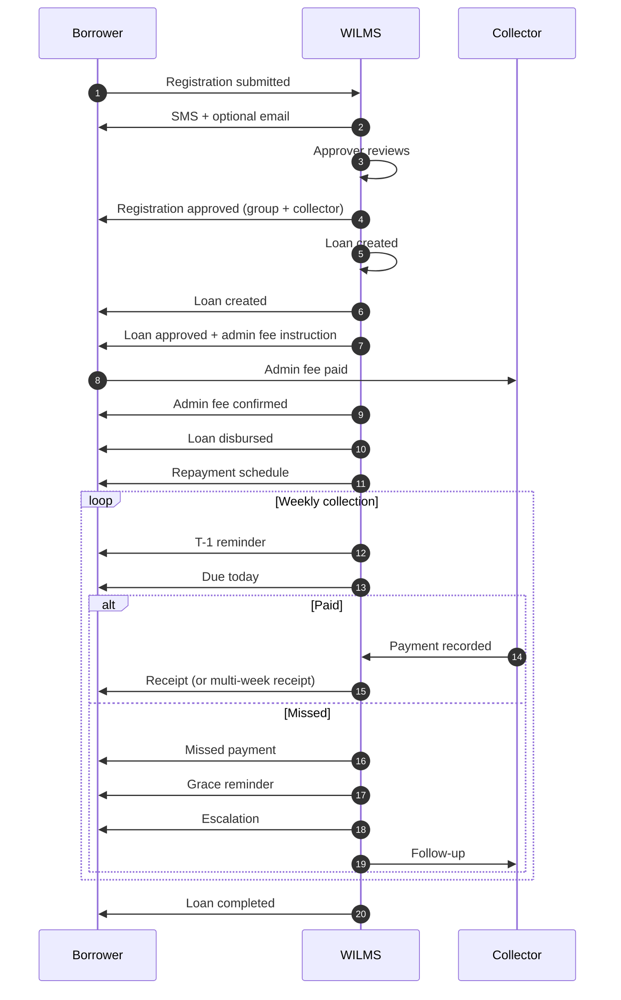

# Borrower Communication Workflow

**Product version:** 1.8.0  
**Language:** British English  
**Authority:** Real WILMS borrower lifecycle. No invented stages.

## Sequence

1. Registration submitted  
2. Registration approved (group and collector assigned automatically)  
3. Loan application created  
4. Loan approved (admin-fee instruction)  
5. Admin fee recorded  
6. Loan disbursed  
7. Repayment schedule issued  
8. Payment reminder (one day before due date)  
9. Payment due today  
10. Payment received (or multi-week payment)  
11. Missed payment (same day, after due date with no payment)  
12. Grace-period reminder  
13. Escalation notice  
14. Loan completed  
15. Collector reassigned / group reassigned / payment day changed (as they occur)

## Admin fee placement

Admin-fee instruction is sent **after loan approval**, not after registration.  
Admin-fee confirmation is sent **after the fee is recorded**, and states that the loan is being prepared for **disbursement**.  
Disbursement remains blocked until the fee is recorded.

## Automatic scheduler events

Triggered daily at **06:00 UTC** by `/api/cron/notifications`:

| Event | When |
|-------|------|
| Reminder (1 day before) | Pending week due date = today + `paymentReminderDaysBefore` (default 1) |
| Due today | Pending week due date = today |
| Missed payment | Newly marked missed weeks for today |
| Grace reminder | Days overdue = configured grace days |
| Escalation | Days overdue = grace days + 1 |

Idempotency: `notification_delivery_records` unique keys prevent duplicate SMS/email/in-app for the same event, loan, and date.
