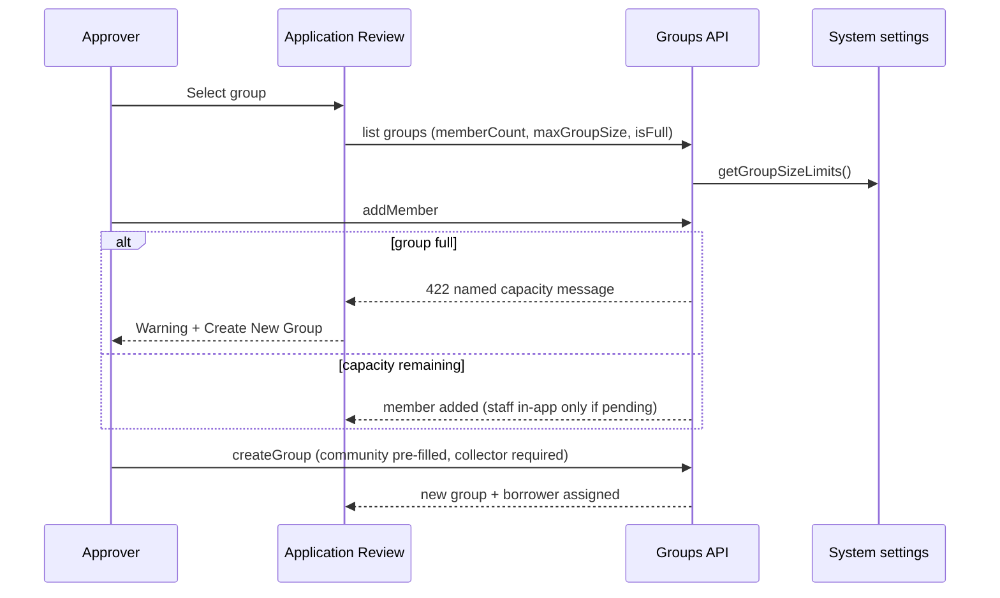

# Group capacity workflow — Approver application review

## Rules

- Full groups are disabled in the select list.
- Create New Group is always available during pending review.
- Community is taken from the application.
- Collector remains required (existing group rule).
- Borrower SMS is **not** sent on assignment while status is PENDING.
