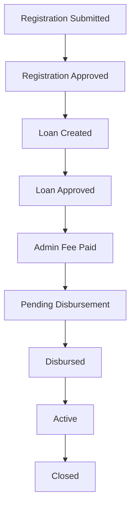

# Loan workflow status (user-facing)

Displayed on the loan detail stepper. Internal statuses (draft, written-off, defaulted) map to the nearest public step and are not labelled.

When a loan record exists, registration submitted/approved and loan created are complete. Current step then follows lifecycle + admin-fee flag.
