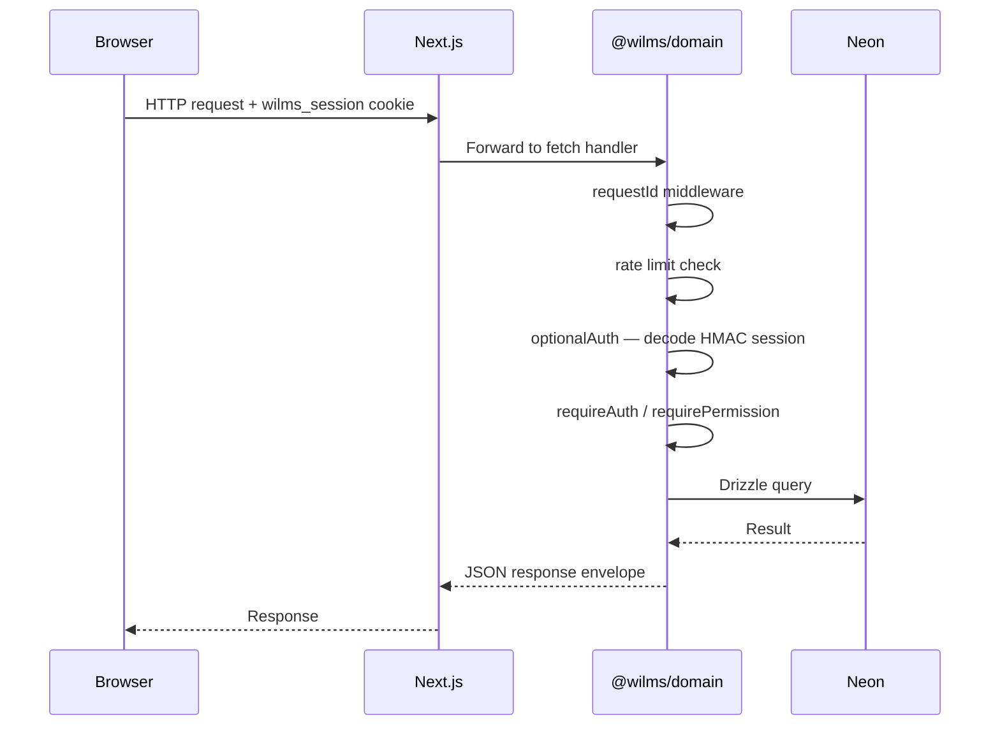
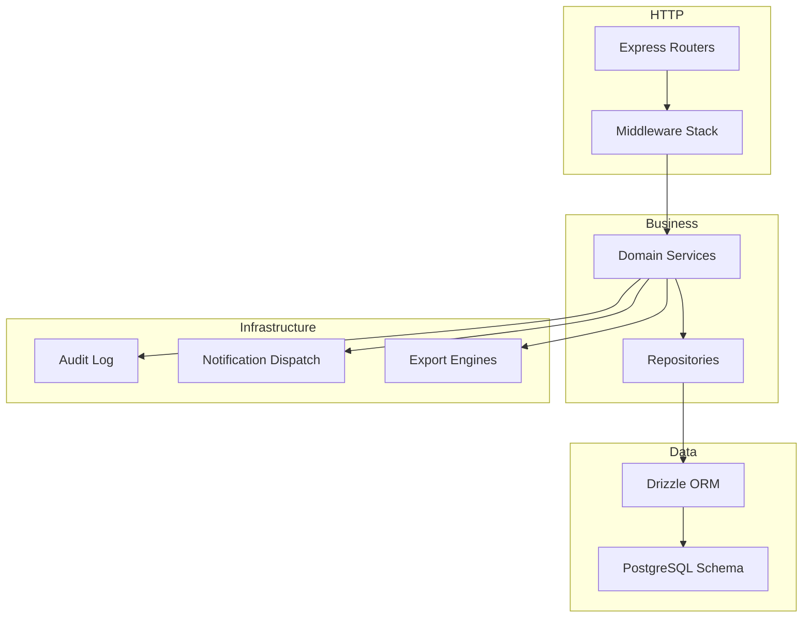
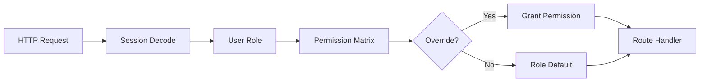
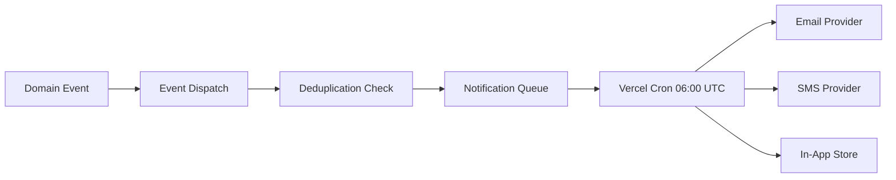

# WILMS Technical Architecture Guide

**Version:** 1.7.3  
**Classification:** Confidential

---

## 1. Introduction

This guide describes the technical architecture of WILMS (Women's Interest-Free Loan Management System) as deployed through release v1.7.2, with v1.7.3 documentation updates. WILMS is a TypeScript monorepo using Next.js 14, `@wilms/domain`, and Neon PostgreSQL.

---

## 2. Monorepo structure

```
WILMS/
├── apps/
│   ├── frontend/          @wilms/frontend — Next.js UI + Route Handlers
│   └── backend/           @wilms/api — thin adapter (optional dual-run)
├── packages/
│   ├── domain/            @wilms/domain — services, DB, HTTP app
│   ├── shared-rbac/       Role and permission definitions
│   ├── shared-types/      Cross-package TypeScript types
│   ├── shared-contracts/  API contract shapes
│   ├── shared-utils/      Shared utilities
│   └── shared-validation/ Zod schemas
├── documentation/         Official docs library (v1.7.3)
├── docs/                  Architecture hub, ADRs, release packs
└── scripts/               Build, verify, and doc generation
```

---

## 3. Deployment topology

```mermaid
flowchart LR
    subgraph Internet
        User[Browser / PWA]
    end

    subgraph Vercel Edge
        CDN[Static Assets]
        SSR[Next.js SSR/RSC]
        API[Route Handlers]
    end

    subgraph Neon
        PG[(PostgreSQL)]
    end

    subgraph Optional
        Redis[(Redis)]
    end

    User --> CDN
    User --> SSR
    User --> API
    API --> Domain[@wilms/domain]
    Domain --> PG
    Domain --> Redis
```

### Default mode: in-process API

Next.js catch-all Route Handler at `/api/wilms/[...path]` invokes `@wilms/domain` fetch handler. No cross-origin BFF. Session cookies scoped to same origin.

### Dual-run mode (development / fallback)

```
WILMS_API_MODE=proxy
WILMS_API_UPSTREAM=http://127.0.0.1:4000
```

Frontend proxies to standalone Express process on port 4000.

---

## 4. Request lifecycle



---

## 5. Authentication architecture

WILMS uses **custom HMAC-signed session cookies** — not Auth.js.

| Component | Location |
|-----------|----------|
| Session encoding | `packages/domain/src/middleware/authenticate.ts` |
| Login routes | `packages/domain/src/modules/auth/routes.ts` |
| Frontend auth store | `apps/frontend/src/stores/authStore.ts` |
| Route middleware | `apps/frontend/src/middleware.ts` |

Session token contains user ID, role, expiry. Signed with `WILMS_SESSION_SECRET`. Invalid or expired tokens rejected with 401.

Additional auth features:
- Login rate limiting (IP + account)
- Optional OTP challenge
- Password reset with time-limited tokens
- Force-logout via session invalidation
- Login alert notifications

---

## 6. Domain layer architecture



### Module organisation

Each domain module follows the pattern:
- `routes.ts` — Express router with auth/permission middleware
- `service.ts` — Business logic
- Repository access via `packages/domain/src/repositories/`

Registered modules include: auth, borrowers, loans, loan-pools, payments, reconciliation, expenses, reports, intelligence, notifications, communications, ops, audit, settings, sync, uploads, search, dashboard, groups, collectors, risk-flags, adjustments, analytics, enterprise, webhooks, health, scheduler.

---

## 7. Frontend architecture

### App Router structure

```
apps/frontend/src/
├── app/              Route pages (App Router)
├── components/       Shared UI primitives
├── features/         Feature modules (export, intelligence, etc.)
├── services/         API client wrappers
├── stores/           Zustand stores (auth, offline, theme, shell)
├── lib/              Re-exports from domain + utilities
└── middleware.ts     Role-based route protection
```

### Shell architecture

| Shell | Profile | Users |
|-------|---------|-------|
| DashboardShell (office) | Sidebar + navbar + aside | Admin, Officer, Approver, Auditor |
| DashboardShell (field) | Bottom nav + offline wrapper | Collector |

### State management

- **authStore** — Session user, login/logout
- **offlineQueueStore** — Collector offline payment queue (localStorage persist)
- **themeStore** — Light/dark theme preference
- **shellLayoutStore** — Sidebar collapse state

---

## 8. Data layer

### Neon PostgreSQL

Serverless PostgreSQL with connection pooling. Drizzle ORM for typed queries.

### Migration journal

SQL files in `packages/domain/drizzle/`. Applied via `npm run db:migrate -w @wilms/domain`. Verified with `npm run verify:migrations`.

### Money handling

All monetary columns store integer pesewas. No floating-point in financial calculations. UI formatting via currency components.

---

## 9. RBAC architecture



Shared across frontend middleware and domain `requirePermission` middleware via `@wilms/shared-rbac`.

Five production roles: SUPER_ADMIN, REGISTRATION_OFFICER, COLLECTOR, APPROVER, AUDITOR.

---

## 10. Notification architecture



Quiet hours and deduplication enforced in dispatch layer.

---

## 11. Export architecture

### v1.7.3 pattern: contextual exports

Export engines in `apps/frontend/src/features/export/`:
- PDF (jsPDF with branded cover)
- Excel (ExcelJS)
- CSV
- Print (iframe-based, no popups)
- DOCX (docx library)

Exports initiated from report pages, borrower profiles, executive intelligence — not from standalone Export Center (removed v1.7.3).

### Export job API (retained)

Domain intelligence module exposes `/exports/jobs` CRUD for programmatic export tracking. Used by embedded export flows.

---

## 12. Offline architecture

Collector offline queue:
1. Payment recorded locally in Zustand + localStorage.
2. OfflineBanner indicates pending sync count.
3. On reconnect, sync module replays FIFO queue.
4. Server validates and persists; conflicts reported to user.

---

## 13. Security layers

| Layer | Mechanism |
|-------|-----------|
| Transport | HTTPS (Vercel), HSTS production |
| Headers | Helmet (CSP, referrer policy, hidePoweredBy) |
| Auth | HMAC session cookies |
| AuthZ | RBAC + permission overrides |
| CSRF | Mutating BFF path protection |
| Rate limit | Global 300/min; login-specific limiters |
| Uploads | File type allowlist |
| Audit | Append-only audit log |

---

## 14. Cron and scheduler

Vercel Cron invokes `/api/cron/notifications` daily at 06:00 UTC. Token-authenticated public scheduler routes in domain module mount before blanket auth middleware.

---

## 15. Testing architecture

| Layer | Location | Tool |
|-------|----------|------|
| Frontend unit | `apps/frontend/src/**/*.test.ts` | Vitest |
| Domain unit | `packages/domain/src/tests/` | Vitest |
| E2E | `apps/frontend/e2e/` | Playwright |
| Smoke | `scripts/` | Node scripts |

---

## 16. Build and deployment pipeline

1. `npm ci` from root (Node 22+)
2. `npm run build -w @wilms/frontend` — Next.js production build
3. Vercel deploy with environment variables
4. `npm run db:migrate` on deploy (or manual)
5. Smoke tests: `npm run smoke:production`, `npm run smoke:rbac`

---

## 17. Observability

- Request ID middleware on all domain requests
- Health endpoint: `/health`
- Ops module: incidents, maintenance windows
- Structured console logging (no external APM in production)

---

*CONFIDENTIAL — For authorized WILMS personnel, executive review, procurement, and official record keeping only.*
