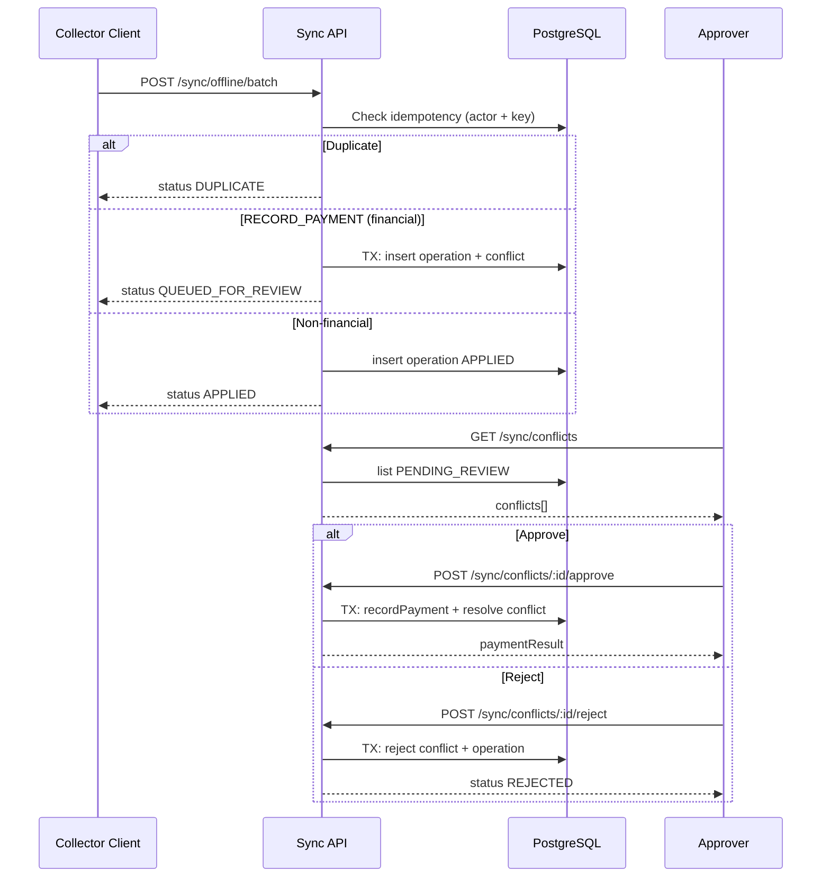

# P14.6 — Offline Sync Architecture

**Release:** v0.2.2  
**Branch:** `release/p14.6-cd-sync-ux`  
**Date:** 2026-06-30

---

## Overview

Offline sync queues collector operations on the client and replays them via `POST /sync/offline/batch`. Financial mutations (`RECORD_PAYMENT`) never auto-apply — they enter a human review queue. Non-financial operations (future types) may auto-apply.

---

## Entity Relationship

```
users (existing)
  │
  ├──< offline_sync_operations
  │       id (PK, UUID)
  │       idempotency_key + actor_user_id (UNIQUE)
  │       operation_type, payload (JSONB)
  │       client_created_at, status, result (JSONB)
  │       created_at, updated_at
  │
  └──< offline_sync_conflicts
          id (PK, UUID)
          operation_id (FK → offline_sync_operations.id)
          conflict_reason, status
          resolution_note, resolved_by_user_id (FK → users.id)
          resolved_at, created_at
```

| Entity | Purpose |
|--------|---------|
| `offline_sync_operations` | Idempotent ingest log; one row per client operation |
| `offline_sync_conflicts` | Review queue for financial ops; links 1:1 to operation at ingest |

**Statuses — operations:** `RECEIVED` (default), `QUEUED_FOR_REVIEW`, `APPLIED`, `REJECTED`  
**Statuses — conflicts:** `PENDING_REVIEW`, `RESOLVED`, `REJECTED`

---

## Queue Schema (`0007_offline_sync.sql`)

```sql
-- offline_sync_operations
CREATE TABLE offline_sync_operations (
  id UUID PRIMARY KEY,
  idempotency_key TEXT NOT NULL,
  actor_user_id UUID NOT NULL REFERENCES users(id),
  operation_type TEXT NOT NULL,
  payload JSONB NOT NULL,
  client_created_at TIMESTAMPTZ NOT NULL,
  status TEXT NOT NULL DEFAULT 'RECEIVED',
  result JSONB,
  created_at TIMESTAMPTZ NOT NULL DEFAULT NOW(),
  updated_at TIMESTAMPTZ NOT NULL DEFAULT NOW()
);
CREATE UNIQUE INDEX offline_sync_idempotency_idx
  ON offline_sync_operations (actor_user_id, idempotency_key);

-- offline_sync_conflicts
CREATE TABLE offline_sync_conflicts (
  id UUID PRIMARY KEY,
  operation_id UUID NOT NULL REFERENCES offline_sync_operations(id),
  conflict_reason TEXT NOT NULL,
  status TEXT NOT NULL DEFAULT 'PENDING_REVIEW',
  resolution_note TEXT,
  resolved_by_user_id UUID REFERENCES users(id),
  resolved_at TIMESTAMPTZ,
  created_at TIMESTAMPTZ NOT NULL DEFAULT NOW()
);
```

Drizzle schema: `apps/backend/src/db/schema/offline-sync.ts`  
Journal entry: `0007_offline_sync` (8th migration, idx 7)

---

## Conflict Flow

1. **Ingest** — Collector posts batch (max 50 ops); sorted by `clientCreatedAt` ascending.
2. **Idempotency** — `(actor_user_id, idempotency_key)` unique index; duplicate → `DUPLICATE` (no side effects).
3. **Financial gate** — `RECORD_PAYMENT` in `FINANCIAL_OPERATION_TYPES`:
   - `runInTransaction`: insert operation (`QUEUED_FOR_REVIEW`) + conflict (`PENDING_REVIEW`).
   - Return `QUEUED_FOR_REVIEW` with `conflictId`.
4. **Non-financial** — Insert operation as `APPLIED`; return `APPLIED`.
5. **Review** — Approver with `APPROVE_LOANS`:
   - **Approve** — `runInTransaction`: resolve conflict, call `paymentService.recordPayment` (reuses idempotency key), mark operation `APPLIED`.
   - **Reject** — `runInTransaction`: conflict `REJECTED`, operation `REJECTED`.

---

## Sequence Diagram



---

## Permissions

| Endpoint | Permission |
|----------|------------|
| `POST /sync/offline/batch` | `RECORD_COLLECTIONS` |
| `GET /sync/conflicts` | `APPROVE_LOANS` |
| `POST /sync/conflicts/:id/approve` | `APPROVE_LOANS` |
| `POST /sync/conflicts/:id/reject` | `APPROVE_LOANS` |

---

## Verdict

**IMPLEMENTED** — schema, service, routes, and financial conflict queue operational. Frontend offline queue routes payment replay through sync API.
