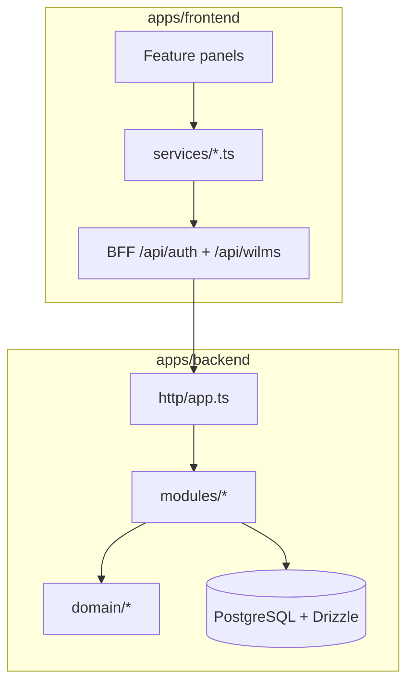

# P14.6.4 — Architecture Review

**Date:** 2026-06-30  
**Status:** **REVIEWED**

---

## System overview

WILMS uses a **monorepo** with:

- **Frontend:** Next.js App Router (`apps/frontend`) — BFF under `/api/*`, business calls via `apiClient` → `/api/wilms/*` proxy
- **Backend:** Express API (`apps/backend`) — domain modules under `src/modules/`
- **Shared:** Workspaces in root `package.json` (`apps/*`, `packages/*`)

**Version:** `0.2.2`

---

## Backend module inventory (27 modules)

All modules follow `routes.ts` (+ optional `service.ts`) pattern. Registered in `apps/backend/src/http/app.ts`.

| # | Module | Router | Primary domain |
|---|--------|--------|--------------|
| 1 | `health` | `healthRouter` | Liveness, migrations, version |
| 2 | `auth` | `authRouter` | Login, session (mounted outside `/api/v1` prefix) |
| 3 | `loans` | `loansRouter` | Loan lifecycle |
| 4 | `loan-pools` | `loanPoolsRouter` | Pool management |
| 5 | `adjustments` | `adjustmentsRouter` | Balance adjustments |
| 6 | `payments` | `paymentsRouter` | Collection, reversals |
| 7 | `borrowers` | `borrowersRouter` | Borrower CRUD, registration |
| 8 | `collectors` | `collectorsRouter` | **P14.6.4** — collector directory |
| 9 | `group-formation` | `groupFormationRouter` | Formation workflow |
| 10 | `groups` | `groupsRouter` | **P14.6.4** — group management |
| 11 | `audit` | `auditRouter` | Immutable audit log |
| 12 | `reconciliation` | `reconciliationRouter` | Daily reconciliation |
| 13 | `reports` | `reportsRouter` | Reports hub + daily collection |
| 14 | `settings` | `settingsRouter` | **P14.6.4** — system settings, users, roles |
| 15 | `notifications` | `notificationsRouter` | **P14.6.4** — in-app notifications |
| 16 | `collector-portal` | `collectorPortalRouter` | **P14.6.4** — collector workspace APIs |
| 17 | `dashboard` | `dashboardRouter` | **P14.6.4** — super-admin KPIs |
| 18 | `expenses` | `expensesRouter` | **P14.6.4** — expense tracking |
| 19 | `risk-flags` | `riskFlagsRouter` | **P14.6.4** — risk flag CRUD |
| 20 | `search` | `searchRouter` | **P14.6.4** — global search |
| 21 | `locations` | `locationsRouter` | **P14.6.4** — Ghana locations |
| 22 | `overpayment-reviews` | `overpaymentReviewsRouter` | **P14.6.4** — overpayment queue |
| 23 | `analytics` | `analyticsRouter` | **P14.6.4** — analytics aggregates |
| 24 | `photo-capture` | `photoCaptureRouter` | **P14.6.4** — identity photo sessions |
| 25 | `transactions` | `transactionsRouter` | **P14.6.4** — transaction ledger |
| 26 | `sync` | `syncRouter` | Offline sync batch |
| 27 | `uploads` | `uploadsRouter` | Cloudinary uploads |

**Route count:** 132 Express route registrations (matrix script); 108 consumed by frontend `apiClient`.

---

## Mount strategy

```text
createApp()
├── healthRouter          → /health
├── authRouter            → /auth/*
├── mountBusinessRoutes('/api/v1')
└── mountBusinessRoutes('')     # legacy un-prefixed paths
```

Dual mount preserves backward compatibility for clients using `/api/v1` or root paths.

---

## P14.6.4 boundary decisions

| Decision | Rationale |
|----------|-----------|
| One module per frontend service domain | Matches `apps/frontend/src/services/*Service.ts` — simplifies matrix verification |
| Shared domain logic in `src/domain/` | Daily collection report builder separated from HTTP — `domain/reports/daily-collection.ts` |
| Persistence via repositories + Drizzle | `repositories/user.repository.ts`, `db/schema/*` |
| Permission middleware per router | `requireAuth` + `requirePermission(PERMISSION.*)` — no cross-module auth bypass |
| In-memory fallback when DB disabled | Settings/collectors services support demo mode via `isDatabaseEnabled()` |

---

## Data layer (migration 0008)

| Table | Module consumer |
|-------|-----------------|
| `risk_flags` | `risk-flags` |
| `system_settings` | `settings` |

Enums: `flag_entity_type`, `flag_type`, `flag_status` — `apps/backend/src/db/schema/enums.ts`.

---

## Frontend alignment

| Layer | Path | Contract |
|-------|------|----------|
| Services | `apps/frontend/src/services/*.ts` | `apiClient.{get,post,patch,delete}` |
| BFF proxy | Next.js `/api/wilms/[...path]` | Forwards to Railway upstream |
| Auth BFF | `apps/frontend/src/lib/auth/authenticate.ts` | Direct upstream for login (CSRF) |

---

## Architecture diagram



---

## Deferred / stub boundaries

| Module | Stub behavior |
|--------|---------------|
| `reports` | `loan-portfolio`, `defaulters`, `collector-performance`, `group-risk`, `financial-ledger` return empty `rows` |
| `analytics` | Aggregate endpoints — verify data depth in v0.3.0 |

---

## Verdict

**PASS** — Module boundaries are coherent, ADR-003 compliant (no mock imports in production paths), and synchronized with frontend services. P14.6.4 closes the admin API surface gap documented since P14.5.
