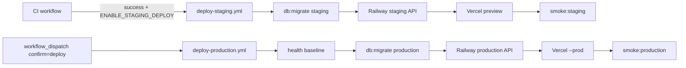

# P14.6.4 — Workflow Repair Report

**Date:** 2026-06-30  
**Status:** **FIXED**

---

## Problem

GitHub Actions **rejects `secrets.*` references in step-level `if:` conditions**. Workflows referenced secrets in `if:` guards, causing workflow validation failures or silently skipped deploy steps.

**Affected files:**

- `.github/workflows/deploy-staging.yml`
- `.github/workflows/deploy-production.yml`

---

## Before (broken pattern)

Step-level guards using secrets — **invalid / unreliable**:

```yaml
# deploy-production.yml (removed)
- name: Confirm current production health
  if: ${{ secrets.WILMS_API_URL != '' }}
  run: curl -fsS "${{ secrets.WILMS_API_URL }}/health"

- name: Run database migrations
  if: ${{ secrets.DATABASE_URL != '' }}
  run: npm run db:migrate -w @wilms/api
```

```yaml
# deploy-staging.yml (removed)
- name: Run staging database migrations
  if: ${{ secrets.STAGING_DATABASE_URL != '' }}
  ...

- name: Deploy API to Railway (staging)
  if: ${{ secrets.RAILWAY_STAGING_SERVICE_ID != '' }}
  ...

- name: Deploy frontend to Vercel (preview)
  if: ${{ secrets.VERCEL_TOKEN != '' }}
  ...

- name: Staging health check
  if: ${{ secrets.WILMS_STAGING_API_URL != '' }}
  ...

- name: Staging smoke tests
  if: ${{ secrets.WILMS_STAGING_APP_URL != '' && secrets.WILMS_STAGING_API_URL != '' }}
  ...
```

---

## After (fixed)

Secrets moved to **`env:`** and action **`with:`** blocks only. Job-level gating uses safe expressions:

### Staging (`deploy-staging.yml`)

```yaml
jobs:
  deploy-staging:
    if: >-
      ${{ github.event.workflow_run.conclusion == 'success' &&
          vars.ENABLE_STAGING_DEPLOY == 'true' }}
```

Steps run unconditionally within the job; secrets injected at execution time:

- `DATABASE_URL: ${{ secrets.STAGING_DATABASE_URL }}`
- `railway_token: ${{ secrets.RAILWAY_TOKEN }}`
- `vercel-token: ${{ secrets.VERCEL_TOKEN }}`
- Smoke env: `WILMS_APP_URL`, `WILMS_API_URL`, `WILMS_SMOKE_EMAIL`, `WILMS_SMOKE_PASSWORD`

### Production (`deploy-production.yml`)

```yaml
jobs:
  verify-baseline:
    if: inputs.confirm == 'deploy'
  deploy-api:
    if: inputs.confirm == 'deploy'
  deploy-frontend:
    if: inputs.confirm == 'deploy'
  verify-production:
    if: inputs.confirm == 'deploy'
```

Manual dispatch requires `confirm: deploy` — no secret-based `if:` on steps.

---

## Pipeline flow (after fix)



---

## Evidence

`git diff afc2160 -- .github/workflows/deploy-staging.yml .github/workflows/deploy-production.yml` — removes all `if: ${{ secrets.* }}` step conditions.

---

## Verdict

**PASS** — Deploy workflows comply with GitHub Actions secret scoping rules. Staging remains gated by `vars.ENABLE_STAGING_DEPLOY`; production remains gated by manual `confirm` input.
