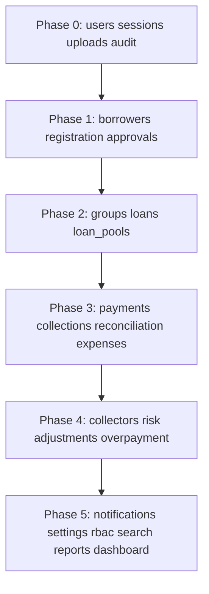

# P14.1B ÔÇö Database Readiness Matrix

**Phase:** P14.1B (documentation only)  
**Date:** 2026-06-09  
**Sources:** P14.1A domain inventory, P14.1B blueprints, DTO audit, validation run.

---

## Scoring methodology

Percentages are **evidence-based estimates** from current code state (P14.0 + P14.1A/B). Not production readiness.

| Dimension | What 100% means |
|-----------|-----------------|
| **Frontend complete** | Feature UI, hooks, types, mock service, validation (where applicable) |
| **Backend complete** | Express module with routes matching `I*Service` contract |
| **Database readiness** | Confirmed type fields + blueprint columns + persistence (mock or backend) |
| **Contract readiness** | API DTO alignment between frontend client, mock, and backend (where exists) |
| **Overall readiness** | Average of the four dimensions |

**Persistence today:** In-memory only (`backend/src/db/store.ts`, mock stores). Neon/Drizzle = **0% deployed** (Proposed).

---

## Validation (required)

| Command | Result |
|---------|--------|
| `npm run type-check` |  Pass |
| `npm run lint` |  Pass  no ESLint warnings or errors |

Documentation-only phase ÔÇö no migrations, schema, or code changes.

---

## Domain matrix

| Domain | Frontend | Backend | Database | Contract | Overall | Blockers | Dependencies |
|--------|:--------:|:-------:|:--------:|:--------:|:-------:|----------|--------------|
| **Auth** | 95% | 45% | 15% | 55% | **53%** | User/session tables; refresh/logout on Express | Users, RBAC |
| **Users** | 90% | 0% | 40% | 10% | **35%** | No `/settings/users` backend | RBAC, Auth |
| **Borrowers** | 95% | 70% | 65% | 60% | **73%** | Full profile DTO; status enum parity; upload FK gaps | Uploads, Groups |
| **Registration** | 95% | 65% | 60% | 55% | **69%** | Signature/thumbprint/ID doc not on backend record | Uploads, Users |
| **Approvals** | 95% | 60% | 55% | 50% | **65%** | Reviewed history stub; no notification side-effects | Borrowers, Audit, Notifications |
| **Groups** | 90% | 25% | 50% | 20% | **46%** | Management routes missing; member join table | Borrowers, Collectors, Loans |
| **Collectors** | 90% | 0% | 35% | 5% | **33%** | No collector entity/backend | Users, Groups, Payments |
| **Loans** | 95% | 0% | 55% | 5% | **39%** | Entire `/loans` module absent | Borrowers, Admin fee, Payments |
| **Collections** | 95% | 30% | 40% | 25% | **48%** | Collector dashboard API; rich payment entry context | Payments, Loans, Collectors |
| **Payments** | 95% | 55% | 60% | 45% | **64%** | Edit no-op; status enum mismatch; GPS shape | Borrowers, Loans, Audit |
| **Expenses** | 85% | 0% | 45% | 5% | **34%** | No backend module | Users, Uploads |
| **Reconciliation** | 85% | 0% | 40% | 5% | **33%** | No backend module | Payments, Collectors |
| **Risk** | 90% | 0% | 45% | 5% | **35%** | No backend module | Borrowers, Groups, Loans, Audit |
| **Notifications** | 85% | 0% | 40% | 5% | **33%** | No backend; mock producers not replicated | Users, all mutating domains |
| **Search** | 80% | 0% | 25% | 5% | **28%** | No search index/API | All searchable entities |
| **Reports** | 90% | 35% | 30% | 30% | **46%** | Most reports return empty rows | Loans, Payments, Audit |
| **Settings** | 90% | 0% | 45% | 5% | **35%** | No settings backend | Users, RBAC, System settings table |
| **RBAC** | 90% | 20% | 35% | 25% | **43%** | Role CRUD mock-only; static backend matrix | Users, Permissions tables |
| **Uploads** | 90% | 60% | 55% | 50% | **64%** | Multipart; registration upload FK gaps | Object storage, Borrowers |
| **Audit** | 85% | 55% | 60% | 50% | **63%** | Action enum not enforced server-side | All mutating domains |
| **Dashboard Analytics** | 90% | 10% | 25% | 15% | **35%** | Dashboard/metrics APIs absent | Payments, Loans, Expenses, Reports |

---

## Roll-up summary

| Metric | Value |
|--------|-------|
| Domains at 70% overall | 2  Borrowers (73%), Registration (69% near) |
| Domains at Ôëñ35% overall | 8 ÔÇö Users, Collectors, Expenses, Reconciliation, Notifications, Search, Settings, Dashboard |
| Platform database deployed | **0%** (Neon/Drizzle Proposed) |
| Backend modules implemented | 8 / ~20 needed |
| Confirmed blueprint tables | 20+ (see P14.1B-database-blueprint.md) |

---

## Critical path for P14.1C (Neon + Drizzle)

Recommended sequencing from evidence (aligns with `P13.3-api-implementation-sequencing.md`):

---

## Per-domain detail

### Auth (Overall 53%)

| Dimension | Score | Evidence |
|-----------|-------|----------|
| Frontend | 95% | Login, session, guards ÔÇö `authentication/`, `lib/auth/*` |
| Backend | 45% | Login + session GET only ÔÇö `modules/auth` |
| Database | 15% | Demo users seed; no sessions table |
| Contract | 55% | Dual Next/Express login paths |

**Blockers:** Persistent users, session store, password hashing model.  
**Dependencies:** Users table, RBAC.

---

### Users (Overall 35%)

| Dimension | Score | Evidence |
|-----------|-------|----------|
| Frontend | 90% | Settings users CRUD UI |
| Backend | 0% | No module |
| Database | 40% | Types + mock store |
| Contract | 10% | API client calls unimplemented routes |

**Blockers:** `users` table, settings API.  
**Dependencies:** RBAC roles/permissions.

---

### Borrowers (Overall 73%)

| Dimension | Score | Evidence |
|-----------|-------|----------|
| Frontend | 95% | Full management + registration consumption |
| Backend | 70% | CRUD, checks, approval ÔÇö `modules/borrowers` |
| Database | 65% | `BorrowerRecord` + blueprint |
| Contract | 60% | DTO shape gaps on review/full-profile |

**Blockers:** Upload FK columns; enum parity; reviewed history.  
**Dependencies:** Uploads, group assignment.

---

### Registration (Overall 69%)

| Dimension | Score | Evidence |
|-----------|-------|----------|
| Frontend | 95% | Wizard + schema + conflicts |
| Backend | 65% | POST/DELETE + checks |
| Database | 60% | Payload richer than backend record |
| Contract | 55% | Missing persisted upload IDs |

**Blockers:** Persist all `*UploadId` fields; photo capture API (Proposed).  
**Dependencies:** Uploads, Users (officer).

---

### Approvals (Overall 65%)

| Dimension | Score | Evidence |
|-----------|-------|----------|
| Frontend | 95% | Full approver workflow |
| Backend | 60% | PATCH approve/reject/blacklist |
| Database | 55% | Status on borrower; no decision history table |
| Contract | 50% | Reviewed list stub; review DTO shape |

**Blockers:** `reviewed_applications` or audit-derived history; notifications.  
**Dependencies:** Borrowers, Group formation, Audit.

---

### Groups (Overall 46%)

| Dimension | Score | Evidence |
|-----------|-------|----------|
| Frontend | 90% | Management UI |
| Backend | 25% | Formation only |
| Database | 50% | `GroupRecord` + membership blueprint |
| Contract | 20% | `/groups/*` missing |

**Blockers:** Group management module; `group_members` table; collector FK.  
**Dependencies:** Borrowers, Collectors.

---

### Collectors (Overall 33%)

| Dimension | Score | Evidence |
|-----------|-------|----------|
| Frontend | 90% | Dashboard + directory |
| Backend | 0% | No routes |
| Database | 35% | DTOs only; no `collectors` table type |
| Contract | 5% | |

**Blockers:** Collector = user extension model decision in P14.1C; assignment tables.  
**Dependencies:** Users, Groups, Payments.

---

### Loans (Overall 39%)

| Dimension | Score | Evidence |
|-----------|-------|----------|
| Frontend | 95% | Wizard, portfolio, schedule |
| Backend | 0% | |
| Database | 55% | Types + schedule blueprint |
| Contract | 5% | |

**Blockers:** `/loans` module; `loans` + `loan_schedule_weeks` tables.  
**Dependencies:** Borrowers, Admin fee, Loan pools.

---

### Collections (Overall 48%)

| Dimension | Score | Evidence |
|-----------|-------|----------|
| Frontend | 95% | Payment entry, offline queue |
| Backend | 30% | Payment entry stub; no collector dashboard |
| Database | 40% | Derived DTOs |
| Contract | 25% | `PaymentEntryContext` mismatch |

**Blockers:** Loan-linked entry context; collector APIs.  
**Dependencies:** Payments, Loans, Collectors.

---

### Payments (Overall 64%)

| Dimension | Score | Evidence |
|-----------|-------|----------|
| Frontend | 95% | Record/edit/same-day |
| Backend | 55% | Record + duplicate check; weak edit |
| Database | 60% | `PaymentRecord` + blueprint |
| Contract | 45% | Status/GPS mismatches |

**Blockers:** Edit persistence; enum alignment; loan allocation.  
**Dependencies:** Borrowers, Loans, Audit.

---

### Expenses (Overall 34%)

**Blockers:** `expenses` table + API; receipt upload FK.  
**Dependencies:** Users, Uploads.

---

### Reconciliation (Overall 33%)

**Blockers:** `reconciliation_submissions` table + API.  
**Dependencies:** Payments (aggregates), Collectors.

---

### Risk (Overall 35%)

**Blockers:** `risk_flags` + timeline tables + API.  
**Dependencies:** Polymorphic entities (borrower, group, etc.).

---

### Notifications (Overall 33%)

**Blockers:** Inbox + delivery tables; mutation producers.  
**Dependencies:** Users; event hooks on all domains.

---

### Search (Overall 28%)

**Blockers:** Search index model (Proposed architecture in P13); `/search` API.  
**Dependencies:** All indexed entity tables.

---

### Reports (Overall 46%)

**Blockers:** Materialized views or query layer for 6+ report types.  
**Dependencies:** Loans, Payments, Groups, Collectors, Audit.

---

### Settings (Overall 35%)

**Blockers:** Singleton settings + legal config persistence.  
**Dependencies:** Users, RBAC.

---

### RBAC (Overall 43%)

**Blockers:** `roles`, `permissions`, `role_permissions`, user overrides tables.  
**Dependencies:** Users; backend `requirePermission` already wired.

---

### Uploads (Overall 64%)

**Blockers:** Multipart (Proposed); FK wiring on borrower; retention policy (Proposed).  
**Dependencies:** Filesystem/S3; Borrowers.

---

### Audit (Overall 63%)

**Blockers:** Enum validation; immutability constraints in DB.  
**Dependencies:** None (append-only; hooks from all domains).

---

### Dashboard Analytics (Overall 35%)

**Blockers:** `/dashboard/summary`, `/analytics/collections`; aggregate queries.  
**Dependencies:** Payments, Loans, Expenses, Reports.

---

## Cross-cutting blockers (all domains)

| # | Blocker | Type | Source |
|---|---------|------|--------|
| 1 | No Neon/PostgreSQL connection | Proposed | P14.0 scope |
| 2 | No Drizzle schema | Proposed | package.json |
| 3 | In-memory backend only | Confirmed | `store.ts` |
| 4 | Mock/API provider split | Confirmed | `data-provider/types.ts` |
| 5 | Notification side-effects on mutation | Referenced | Mock services only |
| 6 | Offline batch payment API | Proposed | P13.3 Phase 3 |
| 7 | BorrowerStatus enum mismatch | Confirmed | DTO audit |
| 8 | Payment status enum mismatch | Confirmed | DTO audit |

---

## P14.1C readiness gate

**Ready to begin schema design when:**

- [x] Entity relationships documented ÔÇö `P14.1B-entity-relationship-discovery.md`
- [x] Table blueprint from types ÔÇö `P14.1B-database-blueprint.md`
- [x] Contract gaps identified ÔÇö `P14.1B-dto-contract-audit.md`
- [x] Upload model analyzed ÔÇö `P14.1B-upload-storage-analysis.md`
- [x] Domain readiness scored ÔÇö this document
- [ ] Product sign-off on enum alignment breaking changes
- [ ] Decision: Collector as User role vs separate table (types imply user id overlap ÔÇö `collector-management.ts`, `mocks/users.ts`)

---

## Related documents

| Document | Purpose |
|----------|---------|
| P14.1A-domain-inventory.md | Domain existence matrix |
| P14.1A-domain-mapping.md | Feature  service  route |
| P14.1A-confirmed-entities.md | Entity confirmation |
| P14.1B-entity-relationship-discovery.md | Relationships |
| P14.1B-database-blueprint.md | Column blueprint |
| P14.1B-dto-contract-audit.md | Contract gaps |
| P14.1B-upload-storage-analysis.md | File storage |
| P13.3-api-implementation-sequencing.md | Implementation phasing |
