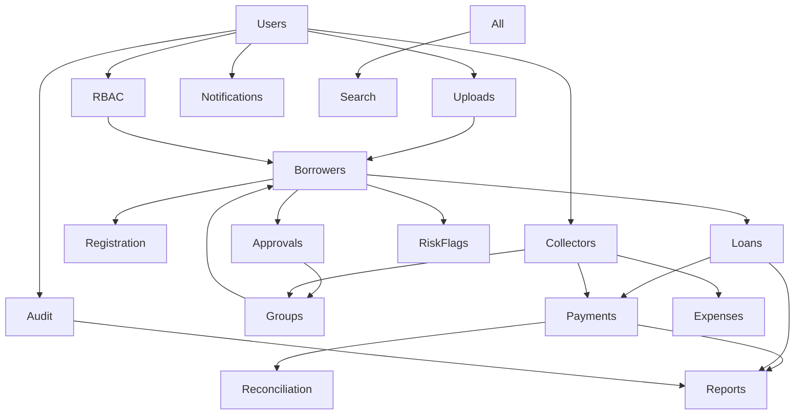

# P14.1C ÔÇö Canonical Domain Model

**Phase:** P14.1C (architecture design only ÔÇö no schema code)  
**Date:** 2026-06-09  
**Governing documents:** ADR-001, P14.1C mandatory architecture rules (phase brief)  
**Sources:** P14.1A/B deliverables, `src/types/*`, `backend/src/db/store.ts`

**Note:** `P14.1C-ADR-002-database-and-backend-architecture-decisions.md` was referenced in the phase brief but was not present in the repository at design time. Rules from that brief (UUID v7, soft delete, external uploads, append-only audit, RBAC tables, `version` columns) are applied here alongside ADR-001 without alteration to ADR-001.

**Status legend:** Confirmed | Referenced | Proposed ÔÇö never merged.

---

## Cross-cutting architecture (Approved)

| Rule | Source |
|------|--------|
| Collector = User extension (`users` 1  0..1 `collectors`) | ADR-001 |
| Canonical enums at `backend/src/contracts/enums/` | ADR-001 |
| UUID v7 primary keys | P14.1C phase brief |
| Upload metadata in PostgreSQL; files external | P14.1C phase brief |
| Audit append-only | P14.1C phase brief |
| Soft delete: users, borrowers, groups, notifications, expenses | P14.1C phase brief |
| RBAC: roles, permissions, role_permissions, user_roles | P14.1C phase brief |
| Mutable entities: createdAt, updatedAt, version | P14.1C phase brief |

---

## Users

| Attribute | Value |
|-----------|-------|
| **Aggregate root** | User |
| **Child entities** | None (Collector is separate aggregate extension ÔÇö see Collectors) |
| **Ownership** | Platform / Settings domain |
| **Persistence status** | **Referenced** ÔÇö types + mock (`settings-users.store.ts`); backend demo seed only (`backend/src/seed/demo-users.ts`) |

### Relationships

- 1  0..1 Collector profile (ADR-001)
- 1  * Audit entries (as `actorId`)
- 1  * Uploads (as owner  ADR-001)
- *  * Roles via `user_roles` (Proposed table  phase brief)

### Lifecycle

| State | Evidence |
|-------|----------|
| ACTIVE / INVITED / SUSPENDED | `SettingsUserRecord.status` ÔÇö `src/types/settings.ts` L20 |
| Soft delete | **Proposed** ÔÇö phase brief mandates; hard delete rejected in mock (`settings-users.store.ts`) |

### Status labels

- **Confirmed:** User DTOs, auth session, demo users
- **Referenced:** Full CRUD persistence
- **Proposed:** `users` table with UUID v7, passwordHash, soft delete

---

## RBAC

| Attribute | Value |
|-----------|-------|
| **Aggregate root** | Role (with Permission as reference data) |
| **Child entities** | role_permissions (join), user_roles (join), user_permission_overrides (**Referenced**) |
| **Ownership** | Settings / platform |
| **Persistence status** | **Referenced** ÔÇö mock stores + client matrix; backend static `permissions/matrix.ts` |

### Relationships

- Role * Ôåö * Permission
- User * Ôåö * Role
- User  optional permission overrides (`src/lib/rbac/user-permission-overrides.ts`)

### Lifecycle

- System roles cannot be deleted ÔÇö `settings-roles.store.ts`
- Permission definitions are catalog data ÔÇö `PermissionDefinition` ÔÇö `user-management.ts`

### Status labels

- **Confirmed:** Permission constants, role DTOs, client-side gates
- **Referenced:** Mock role CRUD
- **Proposed:** Database-driven RBAC tables (phase brief)

---

## Borrowers

| Attribute | Value |
|-----------|-------|
| **Aggregate root** | Borrower |
| **Child entities** | Embedded profile fields (P14.1B blueprint); upload FK references |
| **Ownership** | Registration officer creates; platform owns record |
| **Persistence status** | **Confirmed** ÔÇö `BorrowerRecord` in `backend/src/db/store.ts`; mock registry |

### Relationships

- Many-to-one Group (`groupId`)
- Many-to-one User (`registeredByOfficerId`)
- One-to-many Loan, Payment
- Many-to-one Upload (photo, guarantor, documents, signatures)

### Lifecycle

| Transition | Evidence |
|------------|----------|
| PENDING  APPROVED / REJECTED / BLACKLISTED | Approval workflow  `borrowers/service.ts` |
| PENDING hard delete | `deleteRegistration` ÔÇö **Confirmed** today; **Proposed** soft delete per phase brief |
| AT_RISK, DEFAULTED | Frontend enum only ÔÇö `borrower.ts` L4ÔÇô5 |

### Status labels

- **Confirmed:** Core borrower record, conflict checks, backend module
- **Referenced:** Full profile, risk summary, all upload FKs on backend
- **Proposed:** Soft delete replacing hard delete for pending registrations (alignment TBD in P14.2)

---

## Registration

| Attribute | Value |
|-----------|-------|
| **Aggregate root** | Borrower (same aggregate ÔÇö not separate) |
| **Child entities** | None ÔÇö workflow only |
| **Ownership** | Registration officer via `registeredByOfficerId` |
| **Persistence status** | **Confirmed** ÔÇö `POST /borrowers`, `RegisterBorrowerPayload` |

### Lifecycle

1. Officer submits wizard  Borrower PENDING
2. Conflict checks (phone, id, name, blacklist, guarantor)
3. Upload IDs attached before submit
4. Pending delete allowed ÔÇö `deleteRegistration`

### Status labels

- **Confirmed:** Payload, schema, backend register route
- **Referenced:** Photo capture session API
- **Proposed:** Persist all signature/thumbprint upload IDs on backend (P14.1B gap)

---

## Approvals

| Attribute | Value |
|-----------|-------|
| **Aggregate root** | Borrower (state transition) |
| **Child entities** | ReviewedApplicationSummary (**Referenced** view); approval_decisions table (**Proposed** for history) |
| **Ownership** | Approver actions on borrower aggregate |
| **Persistence status** | **Confirmed** ÔÇö PATCH approve/reject/blacklist on backend |

### Lifecycle

- Approve  triggers group formation (`processApprovedBorrower`)
- Reject / blacklist  `rejectionReason` on record
- Mock emits notifications + audit ÔÇö backend partial audit only

### Status labels

- **Confirmed:** Approval actions, audit on backend
- **Referenced:** `ReviewedApplicationSummary` list (backend stub empty)
- **Proposed:** Immutable approval_decision history table for reviewed queue

---

## Groups

| Attribute | Value |
|-----------|-------|
| **Aggregate root** | Group |
| **Child entities** | GroupMember (join), GroupRiskHistory (**Referenced** mock), GroupActivity (**Referenced**) |
| **Ownership** | Platform; collector assignment per `GroupDetail.collector` |
| **Persistence status** | **Confirmed** ÔÇö `GroupRecord` backend; **Referenced** ÔÇö management mock |

### Relationships

- Group * Ôåö * Borrower via `group_members`
- Group  User (collector via `collectors.userId`  ADR-001)
- Group  Borrower (leader)

### Lifecycle

| State | Evidence |
|-------|----------|
| ACTIVE / AT_RISK / FLAGGED / SUSPENDED | `GROUP_STATUS` ÔÇö `group-detail.ts` |
| Auto-formation on approval | `group-formation/service.ts` |

### Status labels

- **Confirmed:** GroupRecord, formation module
- **Referenced:** Full GroupDetail, membership mutations
- **Proposed:** Soft delete on groups (phase brief)

---

## Collectors

| Attribute | Value |
|-----------|-------|
| **Aggregate root** | Collector (extension profile) |
| **Child entities** | None ÔÇö metrics are DTO aggregates |
| **Ownership** | Extends User ÔÇö ADR-001 |
| **Persistence status** | **Referenced** ÔÇö DTOs only; no backend record |

### Relationships

- Collector 1  1 User (`userId` FK  ADR-001)
- Collector 1  * Groups (assignment)
- Collector 1  * Payments (`collectorId`  resolves to `users.id` in schema design)

### Lifecycle

| State | Evidence |
|-------|----------|
| ACTIVE / AWAY | `COLLECTOR_STATUS` ÔÇö `collector-management.ts` |
| employmentStatus | **Proposed** column ÔÇö ADR-001 collectors table |

### Status labels

- **Confirmed:** Collector DTOs, dashboard builders (mock)
- **Referenced:** All collector APIs
- **Proposed:** `collectors` table per ADR-001 (collectorCode, assignedRegion, assignedDistrict)

---

## Loans

| Attribute | Value |
|-----------|-------|
| **Aggregate root** | Loan |
| **Child entities** | LoanScheduleWeek, FinancialTransaction (disbursement/admin fee ÔÇö **Referenced**) |
| **Ownership** | Platform lending |
| **Persistence status** | **Confirmed** ÔÇö types + mock; **Referenced** ÔÇö no backend |

### Relationships

- Loan  Borrower
- Loan  LoanSchedule (1:1 schedule)
- Loan  Payment (repayment allocation  mock logic)
- Loan  optional LoanPool (**Referenced**  no FK in types)

### Lifecycle

| State | Evidence |
|-------|----------|
| PENDING_DISBURSEMENT  ACTIVE  COMPLETED / DEFAULTED / WRITTEN_OFF | `LOAN_STATUS`  `loan.ts` |

### Status labels

- **Confirmed:** Types, mock lifecycle, schedule store
- **Referenced:** Backend `/loans` module
- **Proposed:** Admin fee gate before disburse (`transaction.ts`)

---

## Payments

| Attribute | Value |
|-----------|-------|
| **Aggregate root** | Payment (collection transaction) |
| **Child entities** | None ÔÇö edit metadata on same row |
| **Ownership** | Collector (user) records against borrower |
| **Persistence status** | **Confirmed** ÔÇö `PaymentRecord` backend + mock store |

### Relationships

- Payment  Borrower
- Payment  User (collectorId  users.id)
- Payment  Loan (**Referenced**  allocation in mock, not on PaymentRecord)
- Payment  Audit entry on record/edit

### Lifecycle

| State | Evidence |
|-------|----------|
| CONFIRMED / PENDING_SYNC | Frontend ÔÇö `payment.ts` |
| RECORDED / EDITED | Backend ad-hoc ÔÇö `payments/routes.ts` |

### Status labels

- **Confirmed:** Record, duplicate check, same-day query
- **Referenced:** Edit mutation, loan allocation, full PaymentEntryContext
- **Proposed:** Canonical PaymentStatus enum (ADR-001 governance)

---

## Expenses

| Attribute | Value |
|-----------|-------|
| **Aggregate root** | Expense |
| **Child entities** | None |
| **Ownership** | Collector (user) records; super-admin reviews |
| **Persistence status** | **Confirmed** ÔÇö mock; **Referenced** ÔÇö no backend |

### Lifecycle

PENDING  APPROVED / REJECTED  `EXPENSE_STATUS`  `expense.ts`

### Status labels

- **Confirmed:** Types, mock CRUD
- **Referenced:** Backend module
- **Proposed:** Soft delete (phase brief)

---

## Reconciliation

| Attribute | Value |
|-----------|-------|
| **Aggregate root** | ReconciliationSubmission (per collector + date) |
| **Child entities** | None |
| **Ownership** | Collector submits; platform validates variance |
| **Persistence status** | **Referenced** ÔÇö mock store only |

### Relationships

- Reconciliation  User (collector)
- Derived from Payment totals ÔÇö mock computation

### Lifecycle

Draft  submitted (`submitted: true`)  `ReconciliationSummary`  `services.ts` L249

### Status labels

- **Confirmed:** Types, schema, mock
- **Referenced:** Backend persistence
- **Proposed:** ReconciliationStatus enum (ADR-001 list ÔÇö not yet in frontend types)

---

## Notifications

| Attribute | Value |
|-----------|-------|
| **Aggregate root** | NotificationInboxItem (inbox); NotificationDelivery (outbound log) |
| **Child entities** | None |
| **Ownership** | User recipient (inbox scoped to session user ÔÇö **Referenced** gap) |
| **Persistence status** | **Confirmed** ÔÇö mock; **Referenced** ÔÇö no backend |

### Relationships

- Inbox  User (**Proposed** explicit `userId`)
- Delivery  optional Borrower, Loan

### Lifecycle

Unread  read (`isRead`)  `notification.ts` L61

### Status labels

- **Confirmed:** Event types, inbox DTO, mock producers
- **Referenced:** Backend API, userId on inbox
- **Proposed:** Soft delete on notifications (phase brief); NotificationStatus enum (ADR-001)

---

## Uploads

| Attribute | Value |
|-----------|-------|
| **Aggregate root** | Upload |
| **Child entities** | None |
| **Ownership** | User (uploader ÔÇö ADR-001); optional entityId link |
| **Persistence status** | **Confirmed** ÔÇö backend `StoredUpload` + filesystem |

### Relationships

- Upload  optional Borrower/Expense via entityId + purpose
- Upload  User owner (**Proposed**  not on current StoredUpload)

### Lifecycle

Create  serve  hard delete today  **Proposed:** soft metadata retention for audit

### Status labels

- **Confirmed:** UPLOAD_PURPOSE enum, backend routes
- **Referenced:** Multipart, all registration FKs on borrower
- **Proposed:** External object storage key; no base64 in DB (phase brief)

---

## Audit

| Attribute | Value |
|-----------|-------|
| **Aggregate root** | AuditEntry |
| **Child entities** | None |
| **Ownership** | Platform ÔÇö immutable log |
| **Persistence status** | **Confirmed** ÔÇö backend in-memory + mock store |

### Relationships

- AuditEntry  User (actorId)
- Polymorphic target (targetEntityId + targetEntityType)

### Lifecycle

Append only ÔÇö never update/delete (phase brief + current append pattern)

### Status labels

- **Confirmed:** Create + list, partial backend coverage
- **Referenced:** Enum validation on action
- **Proposed:** DB constraints enforcing immutability

---

## Risk Flags

| Attribute | Value |
|-----------|-------|
| **Aggregate root** | RiskFlag |
| **Child entities** | FlagTimelineEvent |
| **Ownership** | Platform compliance |
| **Persistence status** | **Confirmed** ÔÇö mock; **Referenced** ÔÇö no backend |

### Relationships

Polymorphic: Borrower, Group, Collector, LoanPool, Application ÔÇö `FlagEntityType`

### Lifecycle

OPEN  UNDER_REVIEW  CRITICAL  RESOLVED  `FLAG_STATUS`  `risk-flag.ts`

### Status labels

- **Confirmed:** Types, mock list/detail
- **Referenced:** Backend API
- **Proposed:** RiskStatus enum name per ADR-001 (maps to FLAG_STATUS in code)

---

## Reports

| Attribute | Value |
|-----------|-------|
| **Aggregate root** | None ÔÇö read models / materialized views |
| **Child entities** | Report catalog entries (static metadata) |
| **Ownership** | Platform read-only |
| **Persistence status** | **Referenced** ÔÇö aggregations from payments (partial backend) |

### Relationships

Reports read from: payments, loans, groups, collectors, audit ÔÇö no write aggregates

### Status labels

- **Confirmed:** Report DTOs, mock data, catalog on backend
- **Referenced:** Full report query layer
- **Proposed:** Materialized views or batch jobs (P14.1B)

---

## Search

| Attribute | Value |
|-----------|-------|
| **Aggregate root** | None ÔÇö index over existing entities |
| **Child entities** | GlobalSearchResult (DTO only) |
| **Ownership** | Platform |
| **Persistence status** | **Proposed** ÔÇö no backend; mock scans in-memory registries |

### Relationships

Index spans: BORROWER, GROUP, COLLECTOR, LOAN, USER, etc. ÔÇö `GLOBAL_SEARCH_ENTITY` ÔÇö `search.ts`

### Status labels

- **Confirmed:** Frontend search UI + mock
- **Referenced:** Search API contract
- **Proposed:** Search index table or Postgres full-text (P13.3)

---

## Domain dependency graph

---

## Related

- `P14.1C-table-architecture.md`
- `P14.1C-ADR-001-collector-identity-and-enum-governance.md`
- `P14.1B-entity-relationship-discovery.md`
