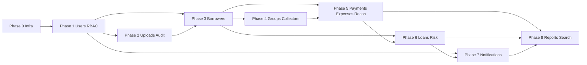

# P14.1C ÔÇö Migration Architecture Plan

**Phase:** P14.1C (planning only ÔÇö no migrations, no SQL)  
**Date:** 2026-06-09  
**Governing:** ADR-001, P14.1C mandatory rules  
**Target:** Neon PostgreSQL + Drizzle (P14.2 implementation)

---

## Principles

| Principle | Source |
|-----------|--------|
| Expand-contract migrations | Avoid breaking running mock/demo during cutover |
| Phase gates with rollback | Each phase independently revertible |
| Seed after schema | Demo users from `demo-users.ts`  DB seed |
| Enum tables first in each phase | ADR-001 governance |
| No data in audit/upload binary columns | Phase brief |

---

## Phase 0 ÔÇö Infrastructure

### Scope

- Neon project + database provisioning (**Proposed** ÔÇö not created in P14.1C)
- Drizzle config scaffold (**Proposed** P14.2)
- `backend/src/contracts/enums/` canonical enum definitions (**Proposed**)
- External object storage bucket for uploads (**Proposed**)
- Environment variables: `DATABASE_URL`, `UPLOAD_STORAGE_*`
- Migration runner CI hook (**Proposed**)

### Dependencies

None.

### Blockers

- Neon account / connection string
- ADR-002 file referenced in brief not in repo ÔÇö rules applied from phase brief

### Risks

- Environment drift between local Neon branch and production

### Rollback

Tear down Neon branch; no application dependency yet.

### Cutover requirements

None ÔÇö infrastructure only.

---

## Phase 1 ÔÇö Auth + Users + RBAC

### Tables

users, roles, permissions, role_permissions, user_roles, user_permission_overrides (**Referenced**)

### Dependencies

Phase 0 enums: UserStatus

### Blockers

- Canonical UserStatus enum merge (frontend `ACTIVE|INVITED|SUSPENDED` ÔÇö `settings.ts`)
- Password hashing strategy alignment with Next auth route

### Risks

- Dual auth path (Next `/api/auth/login` vs Express) during cutover

### Rollback

Drop RBAC tables; revert to demo-users seed in memory.

### Cutover requirements

- Express auth reads users table
- Session still cookie-based; `user_sessions` optional sub-phase
- Map `DEMO_USERS` to seeded rows with same IDs **Proposed** for zero UI disruption

---

## Phase 2 ÔÇö Uploads + Audit

### Tables

uploads, audit_entries

### Dependencies

Phase 1 users (owner_user_id, actor_id FKs)

### Blockers

- External storage wiring (replace base64 ÔÇö phase brief)
- Multipart API contract (P14.1B gap)

### Risks

- Registration flow depends on upload IDs before borrowers table exists ÔÇö uploads can land with entity_id null initially

### Rollback

Revert to filesystem-only in-memory storage.

### Cutover requirements

- `POST /uploads` writes metadata + external key only
- Audit append-only DB constraint
- Migrate existing in-memory audit to table on first deploy **Proposed**

---

## Phase 3 ÔÇö Borrowers + Registration + Approvals

### Tables

borrowers, borrower_approval_decisions, group_formation_queue

### Dependencies

Phase 1 users, Phase 2 uploads

### Enums

BorrowerStatus, ApprovalStatus (maps ReviewedDecision ÔÇö `approval.ts`)

### Blockers

- Enum merge: frontend 6 values vs backend 4 ÔÇö **Breaking change risk** (P14.1B #7)
- All registration upload FK columns
- Soft delete vs hard delete registration ÔÇö policy decision

### Risks

- DTO shape changes for getBorrowerReview
- Conflict check performance without indexes (mitigated in index strategy)

### Rollback

Feature flag: `USE_DB_BORROWERS=false`  in-memory store.

### Cutover requirements

- Replace `backend/src/db/store.ts` borrower Map with repository
- Seed pending borrowers from current seed data
- Wire approval_decisions on approve/reject/blacklist

---

## Phase 4 ÔÇö Groups + Collectors

### Tables

collectors, groups, group_members, group_formation_sequence

### Dependencies

Phase 1 users, Phase 3 borrowers

### Blockers

- ADR-001 collectors.user_id backfill for demo collectors
- Group management API still mock ÔÇö schema ahead of API **acceptable**

### Risks

- memberIds[] migration from in-memory groups to join table

### Rollback

Keep formation queue in DB; group management reads mock until Phase 4 API.

### Cutover requirements

- `processApprovedBorrower` writes groups + group_members
- collector_user_id on groups references users.id

---

## Phase 5 ÔÇö Payments + Expenses + Reconciliation

### Tables

payments, expenses, reconciliation_submissions

### Dependencies

Phase 3 borrowers, Phase 1 users (collector), Phase 4 optional for group context

### Enums

PaymentStatus (merge CONFIRMED/PENDING_SYNC/RECORDED/EDITED), ExpenseStatus, ReconciliationStatus

### Blockers

- PaymentStatus canonical enum ÔÇö **Breaking** (P14.1B #1)
- Payment edit must mutate row + version
- PaymentEntryContext requires loans schedule **dependency on Phase 6 for full parity**

### Risks

- Offline queue replay (`offlineQueueStore`) needs version conflict handling

### Rollback

Payments remain in-memory array; dual-write period **Proposed**.

### Cutover requirements

- Duplicate payment unique constraint live
- Expense soft delete
- Reconciliation replaces mock store

---

## Phase 6 ÔÇö Loans + Risk Flags

### Tables

loans, loan_schedule_weeks, loan_pools, financial_transactions, risk_flags, risk_flag_timeline_events, adjustment_requests, overpayment_reviews

### Dependencies

Phase 3 borrowers, Phase 5 payments (allocation), Phase 4 groups

### Enums

LoanStatus, RiskStatus (FLAG_STATUS), AdjustmentStatus, OverpaymentReviewStatus

### Blockers

- Entire loan API module absent ÔÇö largest backend gap
- Admin fee  disbursement chain

### Risks

- Payment-to-loan allocation backfill complexity

### Rollback

Loans mock-only until API ready; schema can exist empty.

### Cutover requirements

- createLoan + disburseLoan persist schedule weeks
- Risk flag polymorphic indexes live

---

## Phase 7 ÔÇö Notifications

### Tables

notifications_inbox, notification_deliveries

### Dependencies

Phase 1 users; mutation hooks from Phases 3ÔÇô6

### Enums

NotificationEvent (exists), NotificationStatus (**Proposed** per ADR-001 list), InboxSeverity

### Blockers

- user_id on inbox mandatory
- Event producers on all mutating endpoints (P13.3 Phase 6)

### Risks

- Inbox volume; retention policy undefined (**Proposed**)

### Rollback

Inbox reads empty; mock notification service fallback.

### Cutover requirements

- Replace mock notification emitters with DB inserts in services
- markAsRead updates version column

---

## Phase 8 ÔÇö Reports + Search

### Tables / artifacts

- Materialized views or reporting tables (**Proposed**)
- Search index columns or `search_documents` table (**Proposed**)
- system_settings, registration_legal_config

### Dependencies

All transactional phases for accurate aggregates

### Blockers

- Report DTOs expect rich shapes; empty backend stubs today
- Search API undefined

### Risks

- MV refresh lag vs real-time dashboard

### Rollback

Reports fall back to mock aggregators.

### Cutover requirements

- Daily collection report from payments table (partial already works in-memory)
- Global search endpoint backed by indexes

---

## Dependency graph

---

## Rollback strategy (global)

| Level | Action |
|-------|--------|
| L1 ÔÇö Feature flag | `DATA_PROVIDER=memory` bypasses DB repositories |
| L2 ÔÇö Phase rollback | Drop tables from failed phase forward (dev branches only) |
| L3 ÔÇö Neon branch | Reset to pre-migration branch snapshot |
| L4 ÔÇö Application | Redeploy previous release; in-memory backend still exists in P14.0 code |

**Evidence:** Current dual provider ÔÇö `MockDataProvider` vs `ApiDataProvider` ÔÇö `src/data-provider/types.ts`

---

## Persistence cutover plan

| Stage | Description |
|-------|-------------|
| C0 | Schema deployed; app still in-memory |
| C1 | Dual-write: memory + DB (dev only) **Proposed** |
| C2 | Read-from-DB for implemented modules |
| C3 | Remove in-memory Maps from `store.ts` **P14.2+** |
| C4 | `NEXT_PUBLIC_API_BASE_URL` production cutover |
| C5 | E2E suite in API mode green |

### Cutover gates

- [ ] Enum sync complete (P14.1C-dto-alignment-audit all Safe or Aligned)
- [ ] Type-check + lint + E2E pass API mode
- [ ] No mock-only rejections (`photoCaptureSessionService` resolved or gated)
- [ ] Seed data parity with demo experience

### Blockers to production cutover

1. ~85 mock-only API methods still without backend (P14.1B)
2. Neon not provisioned (0% deployed ÔÇö P14.1B matrix)
3. PaymentStatus / BorrowerStatus alignment
4. Notification producers

---

## Risk register

| ID | Risk | Phase | Mitigation |
|----|------|-------|------------|
| R1 | Enum breaking changes | 3, 5 | Canonical enums first; coordinated FE sync |
| R2 | Upload cutover without multipart | 2 | Keep dataUrl bridge temporarily **Proposed** |
| R3 | Schema ahead of API | 4ÔÇô8 | Feature flags per domain |
| R4 | Offline queue version conflicts | 5 | Optimistic locking on payments.version |
| R5 | Audit volume | 2+ | Partition by month **Proposed** |
| R6 | Soft delete query omission | All | Mandate deleted_at filter in repository layer **Proposed** |

---

## Related

- `P14.1C-neon-readiness-report.md`
- `P14.1C-dto-alignment-audit.md`
- `P13.3-api-implementation-sequencing.md`
