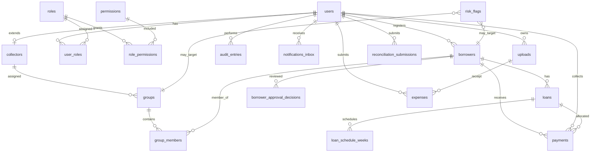

# P14.1C ÔÇö Relationship Architecture

**Phase:** P14.1C (architecture only)  
**Date:** 2026-06-09  
**Governing:** ADR-001, P14.1C mandatory rules  
**Sources:** P14.1B-entity-relationship-discovery.md, P14.1C-table-architecture.md

---

## Relationship inventory

### Identity & RBAC

| From | To | Cardinality | Ownership | Cascade on delete | Soft delete impact | Status |
|------|-----|-------------|-----------|-------------------|-------------------|--------|
| users | collectors | 1 : 0..1 | User owns collector profile | RESTRICT ÔÇö cannot delete user with active collector assignments without workflow | users.deleted_at hides collector ops | **Confirmed** ADR-001 |
| users | user_roles | 1 : * | Platform | CASCADE revoke roles | Hidden user loses access | **Proposed** table |
| roles | role_permissions | 1 : * | Platform | CASCADE | N/A | **Proposed** |
| permissions | role_permissions | 1 : * | Catalog | RESTRICT | N/A | **Proposed** |
| users | user_permission_overrides | 1 : * | Platform | CASCADE | N/A | **Referenced** |
| users | audit_entries | 1 : * (as actor) | Platform | RESTRICT ÔÇö preserve audit | Audit never deleted | **Confirmed** |
| users | uploads | 1 : * (owner) | User | SET NULL on upload owner optional | Upload metadata may soft-delete | **Proposed** owner FK |

---

### Collectors & groups

| From | To | Cardinality | Ownership | Cascade | Soft delete impact | Status |
|------|-----|-------------|-----------|---------|-------------------|--------|
| collectors | users | * : 1 | User is parent | CASCADE soft-delete collector when user soft-deleted | Both hidden | **Confirmed** ADR-001 |
| collectors | groups | 1 : * (assignment) | Platform assigns | SET NULL group.collector on collector soft-delete | Groups need reassignment | **Referenced** ÔÇö `ReassignGroupCollectorInput` |
| groups | group_members | 1 : * | Group owns membership | CASCADE remove members on group hard delete; soft delete preserves | Members hidden with group | **Confirmed** mock |
| group_members | borrowers | * : 1 | Borrower in one group at a time (business rule mock) | RESTRICT | Borrower soft-delete removes from active queries | **Confirmed** mock |
| groups | borrowers | 1 : * (via members) | Group | ÔÇö | ÔÇö | **Confirmed** |
| groups | users (leader) | * : 1 | Leader is borrower | RESTRICT | ÔÇö | **Referenced** `GroupLeaderProfile` |

**Ambiguity (P14.1B):** `GroupRecord.memberIds[]` vs normalized `group_members` ÔÇö **Resolved for P14.1C:** use join table; deprecate array on record.

---

### Borrowers & registration

| From | To | Cardinality | Ownership | Cascade | Soft delete impact | Status |
|------|-----|-------------|-----------|---------|-------------------|--------|
| users | borrowers | 1 : * (registered_by) | Officer creates | RESTRICT | Officer user soft-delete preserves historical FK | **Confirmed** |
| borrowers | uploads | * : * (via FK columns) | Borrower references | RESTRICT ÔÇö uploads retained for audit | Orphan uploads garbage-collected **Proposed** | **Referenced** gap on backend |
| borrowers | loans | 1 : * | Platform | RESTRICT | Active loans block borrower soft-delete **Proposed** rule | **Confirmed** types |
| borrowers | payments | 1 : * | Platform | RESTRICT | Payments immutable | **Confirmed** |
| borrowers | borrower_approval_decisions | 1 : * | Platform | CASCADE | History preserved | **Proposed** |
| group_formation_queue | borrowers | * : 1 | Formation service | CASCADE dequeue | N/A | **Confirmed** backend |

**Ambiguity (P14.1B):** Registration as separate entity ÔÇö **Resolved:** workflow on Borrower aggregate, not separate table.

---

### Approvals

| From | To | Cardinality | Ownership | Cascade | Soft delete impact | Status |
|------|-----|-------------|-----------|---------|-------------------|--------|
| borrowers | approval state | 1 : 1 (status column) | Borrower aggregate | N/A | ÔÇö | **Confirmed** |
| approval action | group_formation | 1 : 0..1 trigger | Formation service | N/A | ÔÇö | **Confirmed** backend |
| approval action | notifications | 1 : * side effect | Notification domain | N/A | ÔÇö | **Referenced** mock only |

**Ambiguity (P14.1B):** Reviewed applications list ÔÇö **Resolved:** query `borrower_approval_decisions` or materialized view; not separate aggregate root.

---

### Loans & payments

| From | To | Cardinality | Ownership | Cascade | Soft delete impact | Status |
|------|-----|-------------|-----------|---------|-------------------|--------|
| loans | loan_schedule_weeks | 1 : * | Loan | CASCADE | ÔÇö | **Confirmed** |
| loans | payments | 1 : * (allocation) | Payment | RESTRICT | ÔÇö | **Referenced** ÔÇö not on PaymentRecord today |
| loans | financial_transactions | 1 : * | Ledger | RESTRICT | ÔÇö | **Referenced** mock |
| borrowers | financial_transactions | 1 : * (admin fee) | Transaction | RESTRICT | ÔÇö | **Confirmed** types |
| payments | users (collector) | * : 1 | Collector records | RESTRICT | Maps to users.id not collectors.id | **Confirmed** ADR-001 |
| payments | audit_entries | 1 : * | Audit | RESTRICT | ÔÇö | **Confirmed** partial backend |

**Ambiguity (P14.1B):** `collectorId` on payment ÔÇö **Resolved (ADR-001):** FK to `users.id`; join `collectors` for operational fields in queries.

---

### Expenses & reconciliation

| From | To | Cardinality | Ownership | Cascade | Soft delete impact | Status |
|------|-----|-------------|-----------|---------|-------------------|--------|
| users | expenses | 1 : * (recorded_by) | Collector user | RESTRICT | expense.deleted_at | **Confirmed** types |
| expenses | uploads | * : 0..1 (receipt) | Expense | SET NULL | ÔÇö | **Referenced** |
| users | reconciliation_submissions | 1 : * | Collector | RESTRICT | ÔÇö | **Referenced** mock |
| payments | reconciliation (derived) | * : 1 aggregate | Computed | N/A | ÔÇö | **Referenced** |

---

### Notifications

| From | To | Cardinality | Ownership | Cascade | Soft delete impact | Status |
|------|-----|-------------|-----------|---------|-------------------|--------|
| users | notifications_inbox | 1 : * | User inbox | CASCADE | notification.deleted_at | **Proposed** userId |
| notifications | borrowers | * : 0..1 | Context | SET NULL | ÔÇö | **Confirmed** optional FK |
| notifications | loans | * : 0..1 | Context | SET NULL | ÔÇö | **Confirmed** |
| domain mutations | notification_deliveries | 1 : * | Platform | RESTRICT | ÔÇö | **Referenced** mock producers |

**Ambiguity (P14.1B):** Inbox without userId on DTO ÔÇö **Resolved:** `notifications_inbox.user_id` NOT NULL in schema.

---

### Uploads

| From | To | Cardinality | Ownership | Cascade | Soft delete impact | Status |
|------|-----|-------------|-----------|---------|-------------------|--------|
| users | uploads | 1 : * | Uploader | RESTRICT | Soft delete metadata | **Proposed** ADR-001 |
| uploads | borrowers | * : 0..1 (entity) | Polymorphic optional | RESTRICT binary | ÔÇö | **Confirmed** entityId |
| uploads | expenses | * : 0..1 | Receipt | RESTRICT | ÔÇö | **Referenced** |

**Ambiguity (P14.1B):** Base64 in DB ÔÇö **Resolved (phase brief):** external storage_key only; no binary in PostgreSQL.

---

### Audit

| From | To | Cardinality | Ownership | Cascade | Soft delete impact | Status |
|------|-----|-------------|-----------|---------|-------------------|--------|
| audit_entries | users | * : 1 (actor) | Platform | RESTRICT | Never delete audit | **Confirmed** |
| audit_entries | any entity | * : 1 (polymorphic target) | Platform | RESTRICT | Target soft-delete preserves audit | **Confirmed** |

**Rule:** NO CASCADE DELETE on audit_entries. NO UPDATE. NO DELETE.

---

### Risk

| From | To | Cardinality | Ownership | Cascade | Soft delete impact | Status |
|------|-----|-------------|-----------|---------|-------------------|--------|
| risk_flags | polymorphic entity | * : 1 | Platform | RESTRICT | Flag remains if entity soft-deleted | **Confirmed** FlagEntityType |
| risk_flags | risk_flag_timeline_events | 1 : * | Flag | CASCADE | ÔÇö | **Confirmed** mock |

---

### Reports & search (read-only)

| From | To | Cardinality | Notes | Status |
|------|-----|-------------|-------|--------|
| payments | daily_collection_report | * : aggregate | Backend partial | **Confirmed** |
| loans + payments | portfolio_report | aggregate | Mock only | **Referenced** |
| all entities | search_index | 1 : 0..1 index row | **Proposed** | **Proposed** |

---

## Cascade rules summary

| Rule | Applies to |
|------|------------|
| RESTRICT | audit_entries, payments (delete), users with audit history |
| CASCADE (soft) | user  collector visibility |
| CASCADE (hard, child rows) | group  group_members on group hard delete **Proposed** only for admin purge |
| SET NULL | group.collector_user_id on collector reassignment |
| NO ACTION | audit_entries immutability |

---

## Soft delete impact matrix

| Entity | Soft delete column | Query filter | Dependent behavior |
|--------|-------------------|--------------|-------------------|
| users | deleted_at | Hide from login, lists | Collector profile hidden |
| borrowers | deleted_at | Hide from active lists | Block if active loan **Proposed** |
| groups | deleted_at | Hide from management | Members inactive |
| notifications | deleted_at | Hide from inbox | ÔÇö |
| expenses | deleted_at | Hide from claims | ÔÇö |
| uploads | deleted_at **Proposed** | Hide URL; retain audit | Binary in external storage lifecycle separate |

Entities **without** soft delete (by design): audit_entries, payments, financial_transactions, reconciliation_submissions (immutable submit), notification_deliveries.

---

## Ambiguous relationships ÔÇö resolution log

| # | P14.1B ambiguity | P14.1C resolution | Evidence |
|---|------------------|-------------------|----------|
| 1 | Collector vs User identity | User 1:0..1 Collector; payments.collector_user_id  users.id | ADR-001 |
| 2 | group_members vs memberIds[] | Normalized group_members table | mock store vs store.ts |
| 3 | Registration separate entity | Workflow on borrowers | P14.1B registration section |
| 4 | Approval history | borrower_approval_decisions table | ReviewedApplicationSummary stub |
| 5 | Inbox user scope | notifications_inbox.user_id NOT NULL | notification.ts DTO gap |
| 6 | Loan pool FK | loan_pool_id nullable on loans | No FK in types ÔÇö optional |
| 7 | Payment collector FK target | users.id not collectors.id | PaymentRecord.collectorId |
| 8 | Single vs multi role | user_roles join; primary role denormalized optional | SettingsUserRecord single role |
| 9 | Pending registration delete | Move from hard delete to soft delete **Proposed** for audit | phase brief vs store.ts |
| 10 | Upload binary storage | External only | phase brief |

---

## ERD (architecture view)

---

## Related

- `P14.1C-table-architecture.md`
- `P14.1C-migration-plan.md`
- `P14.1C-ADR-001-collector-identity-and-enum-governance.md`
