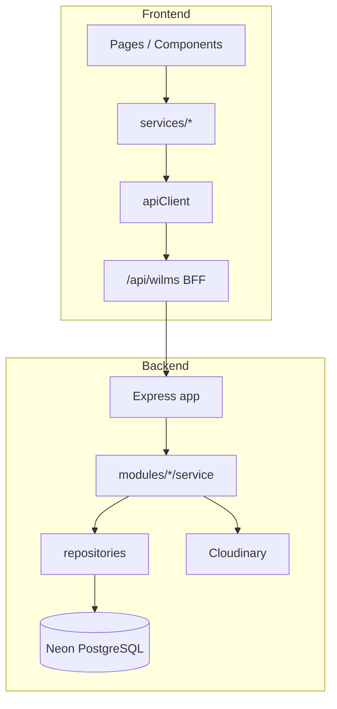

# P14.3A.3 ÔÇö API Architecture

**Phase:** P14.3A.3 Phase 3  
**Date:** 2026-06-09  
**Status:** Complete

---

## Frontend API Layer

```text
apps/frontend/src/
Ôö£ÔöÇÔöÇ app/api/
Ôöé   Ôö£ÔöÇÔöÇ auth/login/route.ts      # Session cookie login (Next route)
Ôöé   Ôö£ÔöÇÔöÇ auth/logout/route.ts
    wilms/[...path]/route.ts # BFF proxy  WILMS_API_UPSTREAM
Ôö£ÔöÇÔöÇ config/api.ts                # API_BASE_URL, timeouts
Ôö£ÔöÇÔöÇ utils/apiClient.ts           # fetch wrapper, { data } unwrap
Ôö£ÔöÇÔöÇ data-provider/
Ôöé   Ôö£ÔöÇÔöÇ types.ts                 # mock vs api resolution
Ôöé   Ôö£ÔöÇÔöÇ ApiDataProvider.ts       # production service bundle
Ôöé   ÔööÔöÇÔöÇ MockDataProvider.ts      # development bundle
ÔööÔöÇÔöÇ services/
     index.development.ts     # webpack alias  mock
     index.production.ts      # webpack alias  api
     loanService.ts           # apiClient  /loans
    Ôö£ÔöÇÔöÇ paymentService.ts
    Ôö£ÔöÇÔöÇ borrowerService.ts
    Ôö£ÔöÇÔöÇ uploadService.ts
      (20+ domain services)
```

**Note:** There is no `src/api/` folder ÔÇö API access is via `services/` + `apiClient` + BFF routes.

### Request flow (production)

```text
UI Component
   @/services (loanService, etc.)
   apiClient.get/post('/loans')
   NEXT_PUBLIC_API_BASE_URL + path
     (often http://host/api/wilms/loans)
   Next.js BFF /api/wilms/[...path]
   WILMS_API_UPSTREAM (http://127.0.0.1:4000/loans)
   Express backend
```

---

## Backend API Layer

```text
apps/backend/src/
Ôö£ÔöÇÔöÇ index.ts                     # Express bootstrap + env load
Ôö£ÔöÇÔöÇ http/
Ôöé   Ôö£ÔöÇÔöÇ app.ts                   # Route mounting
Ôöé   Ôö£ÔöÇÔöÇ response.ts              # { data } envelope
Ôöé   ÔööÔöÇÔöÇ map-financial-error.ts
Ôö£ÔöÇÔöÇ modules/                     # Route + service per domain
Ôöé   Ôö£ÔöÇÔöÇ auth/routes.ts
Ôöé   Ôö£ÔöÇÔöÇ loans/routes.ts + service.ts
Ôöé   Ôö£ÔöÇÔöÇ payments/routes.ts + service.ts
Ôöé   Ôö£ÔöÇÔöÇ borrowers/routes.ts + service.ts
Ôöé   Ôö£ÔöÇÔöÇ uploads/routes.ts
Ôöé   Ôö£ÔöÇÔöÇ reports/routes.ts
    
Ôö£ÔöÇÔöÇ repositories/                # Drizzle persistence
Ôö£ÔöÇÔöÇ db/persistence.ts            # Memory Ôåö PostgreSQL facade
ÔööÔöÇÔöÇ infrastructure/
    Ôö£ÔöÇÔöÇ uploads/                 # local + Cloudinary providers
    Ôö£ÔöÇÔöÇ mail/                    # SMTP + Resend adapters
    ÔööÔöÇÔöÇ sms/                     # Arkesel + Twilio adapters
```

**Note:** No `src/routes/` top-level ÔÇö routes live inside `modules/*/routes.ts`.

### Route mounting (`http/app.ts`)

| Mount | Routers |
|-------|---------|
| `/health`, `/auth` | health, auth |
| `/api/v1` + legacy `/` | loans, payments, borrowers, group-formation, audit, reports, uploads |

---

## Ownership Matrix

| Domain | Frontend service | Backend route | Backend service | Persistence |
|--------|------------------|---------------|-----------------|-------------|
| Auth | `authService` + `/api/auth/*` | `/auth/*` | auth module | users (memory/DB) |
| Loans | `loanService` | `/loans/*` | `modules/loans/service.ts` | loan repositories |
| Payments | `paymentService` | `/payments` | `modules/payments/service.ts` | payment + ledger repos |
| Borrowers | `borrowerService` | `/borrowers/*` | `modules/borrowers/service.ts` | borrower repository |
| Uploads | `uploadService` | `/uploads/*` | upload routes + providers | local disk / Cloudinary |

---

## Dependency Diagram



---

## Shared Packages

`packages/shared-{contracts,rbac,types,validation,utils}` ÔÇö DTOs, enums, validation schemas. No HTTP or env access.
