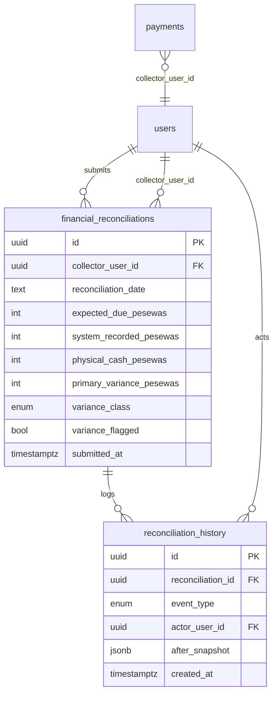
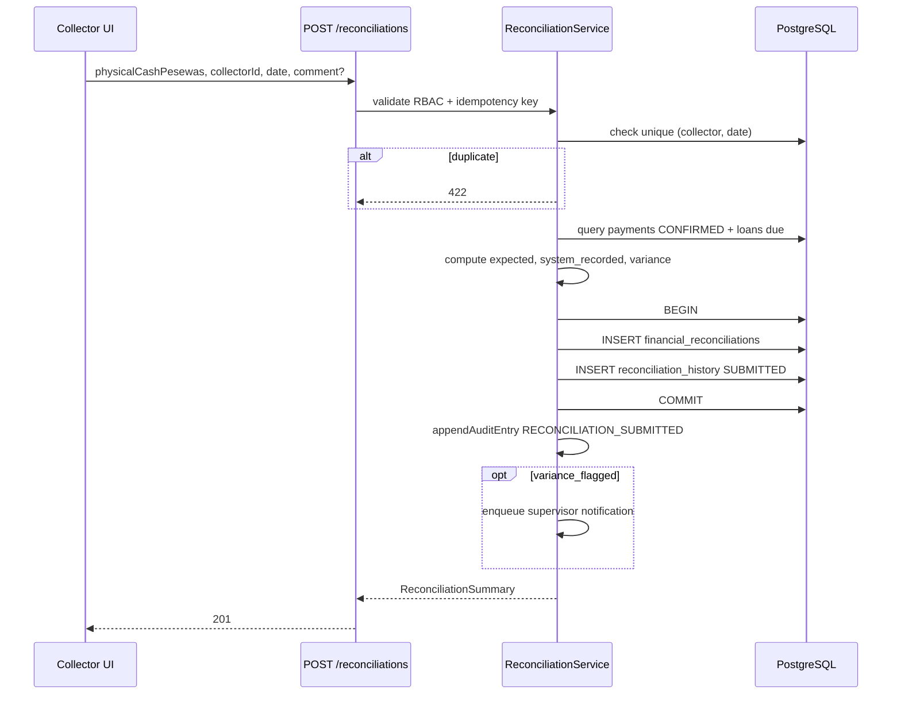

# P14.3B ÔÇö Reconciliation Architecture

**Phase:** P14.3B.4B (Architecture ÔÇö design only)  
**Date:** 2026-06-22  
**Branch:** `feature/p14.3b-phase-4b-architecture`  
**Base:** `feature/p14.3b-phase-4a-discovery` @ `f26709e`

---

## Entry Gate Validation

| Gate | Status | Evidence |
|------|--------|----------|
| P14.3B.3C.2 committed and pushed | **PASS** | `origin/feature/p14.3b-phase-3c-certification` @ `440e2bd` |
| README reflects 3C.2 CONDITIONAL | **PASS** | `README.md` L33ÔÇô36 |
| Reconciliation discovery completed | **PASS** | `f26709e` on `feature/p14.3b-phase-4a-discovery` |
| Discovery evidence available | **PASS** | `P14.3B-reconciliation-discovery.md`, `P14.3B-reconciliation-readiness-and-risk.md` |

**Architecture phase may proceed.**

---

## Phase 1 ÔÇö Domain Definition

### 1.1 Reconciliation purpose

| Type | In scope (v1) | Out of scope (v1) |
|------|---------------|-------------------|
| **Collector cash reconciliation** | **Yes** ÔÇö primary domain | ÔÇö |
| **Branch reconciliation** | No | Multi-branch rollup deferred |
| **Supervisor review** | **Yes** ÔÇö variance-flagged submissions | Full approval workflow deferred to 4C+ |
| **Financial integrity reconciliation** | Partial ÔÇö uses payment/ledger sources | Not `verify:financial` portfolio checks |

**Business problem:** At end of day, a collector counts physical cash collected in the field. The system must compare that count against what was recorded, identify variance against expected collections for due loans, persist an immutable submission, and alert supervisors when variance exceeds policy.

| Field | Value |
|-------|-------|
| **File Path** | `apps/frontend/src/features/reconciliation/components/ReconciliationForm.tsx` |
| **Evidence** | End-of-day form: expected, actual (system), physical cash, variance KPIs |
| **Reasoning** | UI models collector EOD cash count, not pool capital reconciliation |
| **Risk** | **Ready** (frontend contract exists) |

### 1.2 Domain boundaries

```text
ÔöîÔöÇÔöÇÔöÇÔöÇÔöÇÔöÇÔöÇÔöÇÔöÇÔöÇÔöÇÔöÇÔöÇÔöÇÔöÇÔöÇÔöÇÔöÇÔöÇÔöÇÔöÇÔöÇÔöÇÔöÇÔöÇÔöÇÔöÇÔöÇÔöÇÔöÇÔöÇÔöÇÔöÇÔöÇÔöÇÔöÇÔöÇÔöÇÔöÇÔöÇÔöÇÔöÇÔöÇÔöÇÔöÇÔöÇÔöÇÔöÇÔöÇÔöÇÔöÇÔöÇÔöÇÔöÇÔöÇÔöÇÔöÇÔöÇÔöÇÔöÇÔöÇÔöÇÔöÇÔöÇÔöÇÔöÉ
Ôöé                        RECONCILIATION (v1)                       Ôöé
Ôöé  Physical cash vs system-recorded payments for collector + date  Ôöé
Ôöé  One immutable submission per (collector_id, date)               Ôöé
ÔööÔöÇÔöÇÔöÇÔöÇÔöÇÔöÇÔöÇÔöÇÔöÇÔöÇÔöÇÔöÇÔöÇÔöÇÔöÇÔöÇÔöÇÔöÇÔöÇÔöÇÔöÇÔöÇÔöÇÔöÇÔöÇÔöÇÔöÇÔöÇÔöÇÔöÇÔöÇÔöÇÔöÇÔöÇÔöÇÔöÇÔöÇÔöÇÔöÇÔöÇÔöÇÔöÇÔöÇÔöÇÔöÇÔöÇÔöÇÔöÇÔöÇÔöÇÔöÇÔöÇÔöÇÔöÇÔöÇÔöÇÔöÇÔöÇÔöÇÔöÇÔöÇÔöÇÔöÇÔöÇÔöÇÔöÿ
         reads from                    does NOT write
              Ôöé                              Ôöé
    ÔöîÔöÇÔöÇÔöÇÔöÇÔöÇÔöÇÔöÇÔöÇÔöÇÔö╝ÔöÇÔöÇÔöÇÔöÇÔöÇÔöÇÔöÇÔöÇÔöÇÔöÉ                    Ôöé
    Ôû╝         Ôû╝         Ôû╝                    Ôû╝
 payments  loans/     adjustments         ledger
 (actual)  schedule   (visibility only)   pools
           (expected)  reversals
```

| Adjacent domain | Relationship | Boundary |
|-----------------|--------------|----------|
| **Payments** | Source of `system_recorded_pesewas` | Reconciliation **reads** `payments`; does not create payments |
| **Adjustments** | May explain variance; not in mock totals | v1: **exclude** from cash formula; document in comments |
| **Reversals** | Must exclude `REVERSED` payments from actual | v1: **filter** `status = CONFIRMED` only |
| **Pools** | Orthogonal capital tracking | `verify:pools` separate; reconciliation does not read pool balances |
| **Ledger** | Integrity proof for payments | No direct ledger reads in v1 reconcile query |

| Field | Value |
|-------|-------|
| **File Path** | `apps/backend/src/modules/payments/payment-reversal.service.ts` L1ÔÇô6 |
| **Evidence** | Reversal mutates payment status, ledger, schedule ÔÇö separate bounded context |
| **Reasoning** | Reconciliation observes payment outcomes; does not trigger reversals |
| **Risk** | **Needs Alignment** ÔÇö must filter REVERSED in actual sum |

| Field | Value |
|-------|-------|
| **File Path** | `P14.3B-adjustment-architecture-review.md` |
| **Evidence** | Approved adjustments change loan balance via ledger |
| **Reasoning** | Cash reconciliation Ôëá balance adjustment; PAYMENT_CORRECTION is post-hoc |
| **Risk** | **High Risk** if adjustments counted without rules |

### 1.3 Three-way cash model (architecture decision)

The mock UI exposes three figures. Architecture v1 formalizes:

| Term | Definition | Source |
|------|------------|--------|
| **Expected Due** | Sum of `weekly_payment_pesewas` for loans due on date | Schedule + `isLoanDueOnDate` |
| **System Recorded** | Sum of eligible payments for collector + date | `payments` table |
| **Physical Cash** | Collector-entered count | Submission input |

**Variance (v1):** `physical_cash_pesewas  expected_due_pesewas` (per phase brief)

**Supplementary metric (retain from mock):** `physical_cash_pesewas  system_recorded_pesewas`  surfaced as `collection_variance_pesewas` for supervisor diagnostics.

| Field | Value |
|-------|-------|
| **File Path** | `apps/frontend/src/utils/reconciliation-summary.ts` L28ÔÇô32 |
| **Evidence** | Current mock: `variance = physical  actual` (system recorded) |
| **Reasoning** | 4B aligns primary variance to `physical  expected`; retain system delta as secondary field |
| **Risk** | **Needs Alignment** ÔÇö frontend formula update required in 4C |

---

## Phase 2 ÔÇö Expected Cash Design

### ExpectedCashFormula v1

```
expected_due_pesewas(collector_id, date) =
  Σ loan.weekly_payment_pesewas
  FOR EACH loan L
  WHERE L is assigned to collector's portfolio
    AND isLoanDueOnDate(L.payment_day, date)
    AND L.lifecycle_status IN ('ACTIVE', 'COMPLETED')  -- completed may still have due week edge cases; 4C validates
```

**Explicit exclusions from Expected Due:**

| Item | Included? | Reason |
|------|-----------|--------|
| CONFIRMED payments | No ÔÇö payments feed System Recorded, not Expected | Expected is schedule-based |
| REVERSED payments | No | Reversal removes payment from System Recorded |
| PENDING_SYNC payments | No | Not confirmed |
| Approved PAYMENT_CORRECTION | No | Affects balance, not due schedule |
| WRITE_OFF | No | Reduces obligation; separate workflow |
| BALANCE_ADJUSTMENT | No | Not a collection expectation |
| Rejected adjustments | No | No financial effect |
| Expenses | No | Out of v1 scope (`R-REC-07`) |

### SystemRecordedFormula v1

```
system_recorded_pesewas(collector_id, date) =
  Σ payment.amount_pesewas
  FOR EACH payment P
  WHERE P.collector_user_id = collector_id
    AND P.payment_date = date
    AND P.status = 'CONFIRMED'
```

| Field | Value |
|-------|-------|
| **File Path** | `apps/backend/src/db/schema/payments.ts` L22 |
| **Evidence** | `paymentStatusEnum`: `CONFIRMED`, `PENDING_SYNC`, `REVERSED` |
| **Reasoning** | REVERSED payments must be excluded from actual |
| **Risk** | **Blocking** if not implemented in 4C |

### Worked examples

**Example A ÔÇö Balanced day**

| Input | Value |
|-------|-------|
| Loans due | 3 × GHS 50.00 = 150.00 |
| System recorded | 150.00 (3 CONFIRMED payments) |
| Physical cash | 150.00 |

| Metric | Calculation | Result |
|--------|-------------|--------|
| Expected Due | 150.00 | 150.00 |
| System Recorded | 150.00 | 150.00 |
| Primary variance | 150  150 | **0** (balanced) |
| Collection delta | 150  150 | 0 |

**Example B ÔÇö Shortage (physical < expected)**

| Expected Due | 200.00 |
| System Recorded | 180.00 (collector under-recorded) |
| Physical Cash | 175.00 |

| Metric | Result |
|--------|--------|
| Primary variance | 175  200 = **25.00** (shortage) |
| Collection delta | 175  180 = 5.00 |
| Flag (10% of expected) | \|25\| / 200 = 12.5%  **flagged** |

**Example C ÔÇö Reversal same day**

| Morning payment | 100.00 CONFIRMED |
| Afternoon reversal | payment  REVERSED |

| Metric | Result |
|--------|--------|
| System Recorded | **0** (REVERSED excluded) |
| Expected Due | 100.00 (unchanged ÔÇö loan still due) |
| Physical cash | 0 (cash returned) |
| Primary variance | 0  100 = **100** (shortage, flagged) |

---

## Phase 3 ÔÇö Variance Design

### Classification

```
primary_variance_pesewas = physical_cash_pesewas  expected_due_pesewas

IF primary_variance_pesewas = 0         BALANCED
IF primary_variance_pesewas < 0         SHORTAGE
IF primary_variance_pesewas > 0         OVERAGE
```

### Threshold

```
variance_flagged =
  IF expected_due_pesewas = 0
    THEN |primary_variance_pesewas| > 0
  ELSE
    (|primary_variance_pesewas| / expected_due_pesewas) × 100 > threshold_percent
```

Default `threshold_percent = 10` ÔÇö matches `RECONCILIATION_VARIANCE_THRESHOLD_PERCENT`.

| Field | Value |
|-------|-------|
| **File Path** | `apps/frontend/src/constants/reconciliation.ts` L2 |
| **Evidence** | Hardcoded 10%; blueprint has `reconciliation_variance_threshold_percent` in settings |
| **Reasoning** | v1: constant; 4C reads from settings when backend settings API exists |
| **Risk** | **Low** |

### Comment and review requirements

| State | Comment required | Supervisor review |
|-------|------------------|-----------------|
| BALANCED, not flagged | No | No ÔÇö auto-complete |
| SHORTAGE/OVERAGE, flagged | **Yes** ÔÇö `comment` field min 10 chars | **Yes** ÔÇö notification + dashboard alert |
| SHORTAGE/OVERAGE, not flagged | Optional | No |

**Approval workflow (v1):** Submit-only. No admin approve/reject state machine in 4C MVP. Supervisor **reviews** via reports/alerts; does not block submission. State machine (`PENDING_REVIEW  APPROVED`) deferred to 4D.

| Field | Value |
|-------|-------|
| **File Path** | `apps/frontend/src/services/mock/reconciliationService.mock.ts` L111ÔÇô116 |
| **Evidence** | `sendSupervisorAlert` on `varianceFlagged` |
| **Reasoning** | Reuse notification pattern in 4C backend |
| **Risk** | **Ready** |

---

## Phase 4 ÔÇö Pool Alignment Decision

### Evidence

| Field | Value |
|-------|-------|
| **File Path** | `apps/backend/src/db/schema/enums.ts` L200ÔÇô204 |
| **Evidence** | `pool_allocation_type`: `DISBURSEMENT`, `REPAYMENT`, `REPLENISHMENT`, `ADJUSTMENT` |
| **Reasoning** | Schema supports REPAYMENT allocations |
| **Risk** | **Needs Alignment** |

| Field | Value |
|-------|-------|
| **File Path** | `apps/backend/src/modules/payments/service.ts` |
| **Evidence** | Payment record writes payments + ledger; no `pool_allocations` REPAYMENT row |
| **Reasoning** | Pool collected_pesewas not updated on live payment |
| **Risk** | **High Risk** |

### Recommendation

**Defer paymentpool REPAYMENT allocation wiring to a dedicated Pool Hardening phase (post-4C).**

Reconciliation v1 **must not depend** on pool allocation completeness. Collector cash reconciliation compares physical cash to **payments**, not pool aggregates.

| Impact | Assessment |
|--------|------------|
| Migration impact | None in 4C if deferred |
| Compatibility impact | `verify:pools` may show drift until pool hardening |
| Reconciliation impact | None ÔÇö orthogonal domains per `P14.3B-pool-architecture-review.md` L52 |

**Classification:** **Needs Alignment** (not Blocking for reconciliation v1)

---

## Phase 5 ÔÇö Reversal Alignment Decision

### Evidence

| Field | Value |
|-------|-------|
| **File Path** | `apps/backend/src/modules/payments/payment-reversal.service.ts` L6 |
| **Evidence** | "Pool allocation reversal explicitly out of scope for 3C.1 MVP" |
| **Reasoning** | Reversal MVP complete without pool compensating entries |
| **Risk** | **Needs Alignment** for pools; **Ready** for reconciliation |

### Recommendation for reconciliation

**Reconciliation v1:** Exclude `REVERSED` payments from `system_recorded_pesewas`. No reconciliation write on reversal events.

**Pool compensating entries on reversal:** **Defer** to Pool Hardening phase (same as Phase 4). Reversal architecture (`P14.3B-reversal-architecture.md` L117ÔÇô119) designs pool reversal as sub-step ÔÇö not yet implemented.

| Impact | Assessment |
|--------|------------|
| Migration impact | None for reconciliation table |
| Compatibility impact | Pool totals may not reflect reversals until pool hardening |
| Reconciliation impact | Filter REVERSED status ÔÇö **required in 4C** |

**Classification:** **Ready** (reconciliation); **Needs Alignment** (pools)

---

## Phase 6 ÔÇö Data Model Design

**Design only ÔÇö no migrations in 4B.**

### Entity: `financial_reconciliations`

Primary submission record (evolves blueprint `reconciliation_submissions`).

| Column | Type | Notes |
|--------|------|-------|
| `id` | uuid PK | uuidv7 |
| `collector_user_id` | uuid FK  users | Submitter |
| `reconciliation_date` | text | ISO date `YYYY-MM-DD` |
| `expected_due_pesewas` | integer | Snapshot at submit |
| `system_recorded_pesewas` | integer | Snapshot at submit |
| `physical_cash_pesewas` | integer | Input |
| `primary_variance_pesewas` | integer | physical  expected |
| `collection_delta_pesewas` | integer | physical  system_recorded |
| `variance_class` | enum | `BALANCED`, `SHORTAGE`, `OVERAGE` |
| `variance_flagged` | boolean | Threshold exceeded |
| `threshold_percent` | integer | Snapshot of policy at submit |
| `comment` | text nullable | Required when flagged |
| `status` | enum | `SUBMITTED` (v1 only) |
| `submitted_at` | timestamptz | Immutable |
| `created_at` | timestamptz | Row creation |

**Unique index:** `(collector_user_id, reconciliation_date)` WHERE `status = 'SUBMITTED'` ÔÇö prevents duplicate submit (`R-REC-05`).

### Entity: `reconciliation_history`

Append-only event log (mirrors `adjustment_history` / `reversal_history` pattern).

| Column | Type | Notes |
|--------|------|-------|
| `id` | uuid PK | |
| `reconciliation_id` | uuid FK | |
| `event_type` | enum | `SUBMITTED`, `COMMENT_ADDED` (future) |
| `actor_user_id` | uuid FK | |
| `before_snapshot` | jsonb nullable | |
| `after_snapshot` | jsonb | Full submission snapshot |
| `reason` | text nullable | |
| `created_at` | timestamptz | |

### Entity: `reconciliation_variances`

Optional denormalized view table for reporting ÔÇö **defer to 4D** if query performance allows JSON extraction from history. v1: variance fields on `financial_reconciliations` suffice.

### ERD



### Submit sequence



### Retention

- Submissions: **indefinite** (financial control record)
- History: **append-only, no delete**
- Soft-delete: **not permitted** on reconciliation rows

---

## Phase 7 ÔÇö RBAC & Audit Design

### Roles and permissions (reuse ÔÇö no new permissions in v1)

| Action | Permission | Evidence |
|--------|------------|----------|
| View reconciliation page | `RECORD_COLLECTIONS` | `permission-matrix.ts` L111 |
| Submit reconciliation | `RECORD_COLLECTIONS` | `ReconciliationForm.tsx` PermissionGate |
| View all collector reconciliations | `VIEW_FINANCIAL_REPORTS` | Align with pool read pattern |
| Review variance alerts | `VIEW_REPORTS` or `VIEW_FINANCIAL_REPORTS` | Super-admin dashboard |

**No new RBAC constants in 4B.** If supervisor-only submit is needed later, add `REVIEW_RECONCILIATION` in 4D.

### Audit

| Event | Action enum | Target entity |
|-------|-------------|---------------|
| Submit | `RECONCILIATION_SUBMITTED` | `RECONCILIATION` |

Enums exist in `apps/backend/src/db/schema/enums.ts` ÔÇö **not wired** in `audit.repository.ts` ACTION_MAP. 4C must add mapping.

**Requirements:**

- Append-only `reconciliation_history` (transactional proof)
- Async `audit_entries` (best-effort, existing pattern)
- Actor = `collector_user_id` from session
- Before/after in history JSON snapshot

### Idempotency

New scope: `RECONCILIATION_SUBMIT`  
Key: `(collector_user_id, reconciliation_date)`  
Duplicate  return existing submission (409 or 422 per mock  mock uses 422)

---

## Phase 8 ÔÇö API Contract (design)

Align with existing frontend stub:

| Method | Path | Maps to |
|--------|------|---------|
| GET | `/reconciliation?collectorId=&date=` | Pre-submit summary (computed live) |
| POST | `/reconciliations` | Submit + persist |

Response shape: `ReconciliationSummary` in `apps/frontend/src/types/services.ts` ÔÇö extend with `collectionDeltaPesewas` and `varianceClass` in 4C.

---

## Architecture Decisions Summary

| ID | Decision |
|----|----------|
| AD-REC-01 | v1 scope = collector cash reconciliation only |
| AD-REC-02 | Primary variance = physical  expected_due |
| AD-REC-03 | System recorded = CONFIRMED payments only |
| AD-REC-04 | Defer pool REPAYMENT allocation to Pool Hardening |
| AD-REC-05 | Defer reversal pool compensating entries to Pool Hardening |
| AD-REC-06 | Table `financial_reconciliations` + `reconciliation_history` |
| AD-REC-07 | Unique (collector, date) constraint |
| AD-REC-08 | Reuse `RECORD_COLLECTIONS`; no new permissions v1 |
| AD-REC-09 | Submit-only workflow; no approval state machine in 4C |
| AD-REC-10 | Wire `RECONCILIATION_SUBMITTED` audit enum in 4C |

---

## Readiness Outcome

| Metric | Score | Verdict |
|--------|-------|---------|
| Architecture completeness | **85%** | Ready for 4C planning |
| Cross-domain alignment | **70%** | Pool/reversal pool deferred |
| Frontend contract alignment | **75%** | Variance formula update needed |
| **Overall** | **78%** | **Ready for implementation planning** |

**STOP.** Do not begin P14.3B.4C until architecture PR approved and `approved-for-4c-implementation` label applied.

---

## Related Documents

- `P14.3B-reconciliation-risk-register.md`
- `P14.3B-phase-4b-coverage-manifest.md`
- `P14.3B-phase-4b-pr-description.md`
- `P14.3B-reconciliation-discovery.md` (4A)
