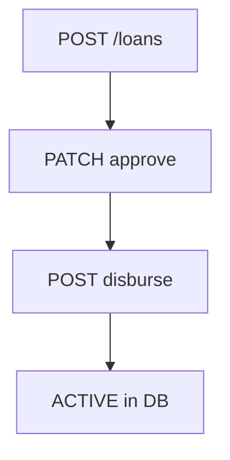

# P14.3C ÔÇö Workflow Certification

**Date:** 2026-06-20  
**HEAD:** `e71c6a7`

---

## 1. Authentication

| Item | Value |
|------|-------|
| Permissions | Public login; session required elsewhere |
| Backend | `auth/routes.ts` |
| Pages | `/login`, middleware |
| Tables | `users` |
| Status | **Complete** |
| Evidence | security 11/11 |

---

## 2. Borrower registration

| Item | Value |
|------|-------|
| Pages | `/officer/register`, `/officer/my-registrations` |
| Backend | `borrowers/routes.ts` POST, checks |
| Tables | `borrowers` |
| Status | **Complete** |
| Evidence | demo cert registration steps |

---

## 3. Group formation

| Item | Value |
|------|-------|
| Backend | `/groups/formation/*` only |
| Pages | Approver flow (partial); `/groups` uses mock `groupService` |
| Status | **Partial** |
| Evidence | group-formation routes exist; full groups API missing |

---

## 4. Loan approval & disbursement

| Item | Value |
|------|-------|
| Permissions | APPROVE_LOANS, REJECT_LOANS |
| Pages | `/loans/new`, `/approver/pending`, `/loans/[id]` |
| Status | **Complete** (harness gap: workflow-create-loan 404 on shared Neon) |
| Evidence | verify:live 16/17; cert:demo |

---

## 5. Payment collection

| Item | Value |
|------|-------|
| Backend | `payments/routes.ts` |
| Pages | `/collector/payment/[id]` |
| Status | **Complete** |
| Evidence | demo cert; cert scripts |

---

## 6. Adjustments

| Item | Value |
|------|-------|
| Backend | `adjustments/` |
| Pages | `/adjustments` |
| Status | **Complete** |
| Evidence | verify:adjustments 10/10 |

---

## 7. Payment reversal

| Item | Value |
|------|-------|
| Backend | `payment-reversal.service.ts`, POST reverse |
| Pages | Approver flows |
| Status | **Complete** |
| Evidence | functional 10/10, ledger 1634/1634 |

---

## 8. Reconciliation

| Item | Value |
|------|-------|
| Backend | `reconciliation/` |
| Pages | `/collector/reconciliation` |
| Status | **Complete** |
| Evidence | 24/24 functional, RBAC 6/6, demo |

---

## 9. Reports

| Item | Value |
|------|-------|
| Backend | `reports/` ÔÇö hub + daily live; 5 stubs |
| Pages | `/reports/*` |
| Status | **Partial** |
| Evidence | `reports/routes.ts` empty row returns |

---

## 10. Uploads

| Item | Value |
|------|-------|
| Backend | `uploads/` local + Cloudinary code |
| Pages | Registration wizard, photo flows |
| Status | **Conditional** (local certified; Cloudinary blocked) |
| Evidence | cert:upload:env |

---

## 11. Audit

| Item | Value |
|------|-------|
| Backend | `audit/routes.ts` |
| Pages | `/auditor/audit-log`, report audit page |
| Status | **Complete** |
| Evidence | auditor-can-post-audit 201 |

---

## Workflow summary

| Status | Count |
|--------|-------|
| Complete | **8** |
| Partial | **2** (groups, reports) |
| Conditional | **1** (uploads) |
| **Total workflows** | **11** |
