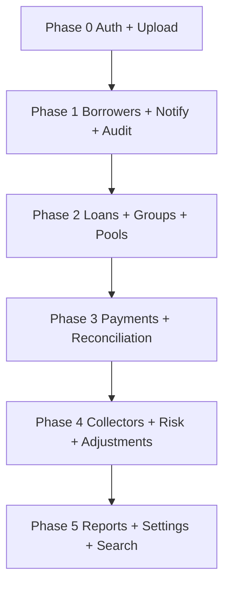

# P13.3 API Implementation Sequencing

**Date:** 2026-06-09  
**Reference:** `P13-api-contract-map.md`, `src/data-provider/ApiDataProvider.ts`  
**Goal:** Minimize blocked UI flows when switching from mock to API

## Phase 0 — Platform (Week 1)

| Priority | Domain | Endpoints | Unblocks |
|----------|--------|-----------|----------|
| P0 | Auth | `POST /api/auth/login`, session refresh, logout | All shells, E2E sign-in |
| P0 | Health | `/health`, CORS, apiClient base URL | Provider swap |
| P0 | Uploads | `POST /uploads`, `GET /uploads/:id` | Registration photos, signatures, exports |

**Evidence:** `authService.ts`, `uploadService.ts`; registration and collector flows depend on upload ids.

## Phase 1 — Registration & approval (Week 2–3)

| Priority | Service | Key methods | UI surfaces |
|----------|---------|-------------|-------------|
| P1 | Borrowers | `registerBorrower`, conflict checks, `listPendingApplications`, `approveBorrower`, `rejectBorrower` | Officer register, approver pending |
| P1 | Notifications | `listNotifications`, `markRead` | Navbar inbox |
| P1 | Audit | `listAuditEntries` | Settings activity, audit reports |

**Evidence:** `borrowerService.ts`, `notificationService.ts`, `auditService.ts`; approver E2E in `accessibility.spec.ts`.

## Phase 2 — Lending core (Week 4–5)

| Priority | Service | Key methods | UI surfaces |
|----------|---------|-------------|-------------|
| P2 | Loans | `createLoan`, `disburseLoan`, `getLoanSchedule`, `listPortfolioEntries` | Loan wizard, portfolio reports |
| P2 | Groups | `listGroups`, `getGroup`, formation | Groups management, collector sheets |
| P2 | Loan pools | `listLoanPools`, allocations | Super admin loan pools dashboard |

**Evidence:** `loanService.ts`, `groupService.ts`, `loanPoolService.ts`, `SuperAdminDashboard.tsx`.

## Phase 3 — Field operations (Week 6–7)

| Priority | Service | Key methods | UI surfaces |
|----------|---------|-------------|-------------|
| P3 | Payments | `recordPayment`, `editPayment`, `getPaymentEntryContext` | Collector payment entry, dashboard |
| P3 | Transactions | `recordAdminFee`, admin fee status | Collector admin fee |
| P3 | Reconciliation | collector reconciliation endpoints | `CollectorReconciliation` |
| P3 | Expenses | CRUD + approval | Collector expenses |
| P3 | Offline sync | batch payment ingest | `offlineQueueStore` — **new backend contract** |

**Evidence:** `paymentService.ts`, `transactionService.ts`, `reconciliationService.ts`, `expenseService.ts`.

## Phase 4 — Management & risk (Week 8–9)

| Priority | Service | Key methods | UI surfaces |
|----------|---------|-------------|-------------|
| P4 | Collectors | management + performance metrics | Collectors directory, reports |
| P4 | Risk flags | list, resolve, alerts | Risk flags panel |
| P4 | Adjustments | approval workflow | Adjustments panel |
| P4 | Overpayment review | queue + decisions | Approver/reviewer flows |

**Evidence:** `collectorManagementService.ts`, `riskFlagService.ts`, `adjustmentService.ts`, `overpaymentReviewService.ts`.

## Phase 5 — Reporting & settings (Week 10–11)

| Priority | Service | Key methods | UI surfaces |
|----------|---------|-------------|-------------|
| P5 | Reports | daily collection, portfolio, defaulters, ledger, group risk | `/reports/*` |
| P5 | Dashboard | KPI aggregates | Super admin + collector dashboards |
| P5 | Settings | users, roles, system config | Settings panels |
| P5 | Search | global search | `GlobalSearchPanel` |

**Evidence:** `reportService.ts`, `dashboardService.ts`, `settingsService.ts`, `searchService.ts`.

## Phase 6 — Mock-only closure (Week 12)

| Item | Action |
|------|--------|
| `deleteRegistration` | Implement DELETE or document permanent mock-only |
| `simulatePhoneCapture` | Implement session API or remove from production build |
| Notification producers | Emit on all mutating endpoints currently handled in mock services |

## Dependency Graph

## Verification per phase

After each phase:

1. Enable API provider for implemented domains only (feature-flagged partial swap if needed).
2. Run domain unit tests in `src/tests/services/*.mock.test.ts` as contract reference.
3. Run targeted E2E: `role-journeys.spec.ts`, `p13-workflows.spec.ts`, relevant shell specs.
4. Full gate: `CI=1 npm run test:e2e` (185 tests).

## Incomplete Work

- Partial provider swap (per-domain API mode) is **not implemented** — today switch is all-or-nothing via `resolveDataProviderMode()`.
- Offline queue server contract not defined in `P13-api-contract-map.md` — add before Phase 3.
