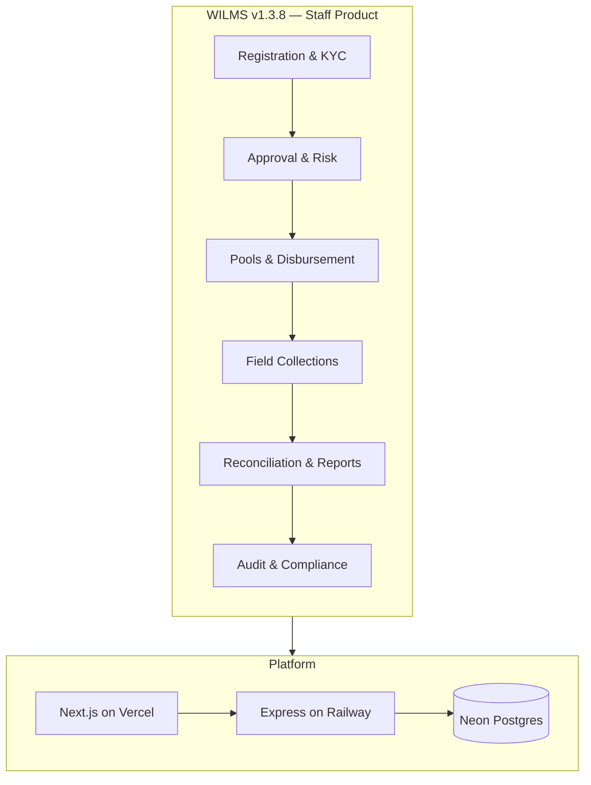
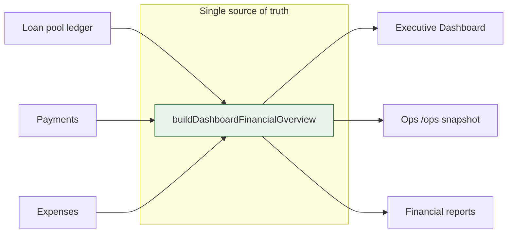

# Final Executive Summary — WILMS v1.3.8 Product Acceptance

**To:** Programme Board / Executive Sponsor  
**From:** Product Acceptance Working Group (CTO, QA Director, Compliance)  
**Date:** 17 July 2026  
**Subject:** Launch recommendation for v1.3.8

---

## Recommendation

### ⚠ Ready with Conditions

WILMS v1.3.8 is **fit for controlled operational rollout** (staging pilot → production with ops checklist) once four actionable conditions below are closed. It is **not** unconditionally certified for production until those items are evidenced.

**Overall readiness: ≈ 83/100** — [LAUNCH_READINESS_SCORECARD.md](./LAUNCH_READINESS_SCORECARD.md)

---

## What v1.3.8 delivers

| Capability | Status |
|------------|--------|
| Five staff portals (Super Admin, Registration Officer, Approver, Collector, Auditor) | ✅ |
| Full money chain: registration → audit | ✅ |
| Server-authoritative financial dashboard | ✅ `buildDashboardFinancialOverview` |
| RBAC with SoD (collector cannot manage groups) | ✅ `packages/shared-rbac` |
| Operations dashboard `/ops` + Prometheus metrics | ✅ Phase 20 |
| Production mock/demo guard | ✅ |
| Zero TODO/FIXME/HACK in application source | ✅ |
| Comprehensive ops documentation pack | ✅ Phase 20 |

**Explicitly out of scope:** Borrower self-service login, statutory double-entry GL, Redis job queues, 100k+ load certification.

---

## System at a glance

---

## Financial integrity (executive view)

All executive KPIs flow from one backend function — not recomputed in the browser in production. Formulas: `docs/financial-calculations.md`.

---

## Scorecard summary

| Area | Score |
|------|------:|
| Financial Integrity | 88 |
| Security | 85 |
| Operations | 86 |
| Documentation | 90 |
| Scalability | 62 |
| Accessibility | 72 |
| **Overall (weighted)** | **≈ 83** |

Strengths: financial model, security hardening in v1.3.8, ops runbooks.  
Weaknesses: scale architecture (in-process workers), accessibility not re-certified, no load proof.

---

## Actionable conditions (must close for ✅ unconditional)

| # | Condition | Owner | Done when |
|---|-----------|-------|-----------|
| C1 | Apply migration `0027_hot_query_indexes` on **all** environments | DevOps | `/health` migrations ok; idx 27 in `__drizzle_migrations` |
| C2 | Staging authenticated E2E smoke — full money chain, all 5 roles | QA | Signed log + artifacts in `docs/archive/` or ticket |
| C3 | Neon PITR backup restore test | DevOps | Entry in backup log per `BACKUP_AND_RECOVERY_PLAN.md` |
| C4 | Executive acknowledgement of accepted limitations | Sponsor | Written sign-off: no borrower portal, no GL, in-process queues until v1.4 |

---

## What ✅ Ready for Production (unconditional) requires

Beyond closing C1–C4:

- Production config verified (mock off, integrations live) per `production-guide.md`
- On-call trained on `INCIDENT_RESPONSE_PLAYBOOK.md` and `ROLLBACK_RUNBOOK.md`
- No Critical-severity open defects in launch tracker
- Optional stretch: WCAG attestation, load test plan for programme growth

---

## Risk register (residual, non-Critical)

| Risk | Likelihood | Impact | Mitigation |
|------|------------|--------|------------|
| API restart loses queued notifications | Medium | Low–Med | v1.4 Redis; manual resend |
| Single API instance | Low | Med | Scale plan in `LONG_TERM_MAINTENANCE_PLAN.md` |
| External accounting needs GL | High (if required) | Med | Export reports; v1.4 GL roadmap |
| Field offline sync conflicts | Low | Low | Approver queue |

No production outages are claimed or inferred in this acceptance cycle.

---

## Documentation and handover

- **Handover:** [SYSTEM_HANDOVER_GUIDE.md](./SYSTEM_HANDOVER_GUIDE.md)
- **Ops pack:** `docs/certification/v1.3.8/production-operations/`
- **This pack:** `docs/certification/v1.3.8/product-acceptance/`

Phase 21 docs updates: `docs/README.md` hub, README release history, security/production guide v1.3.8 stamps, `CHANGELOG.md` ops notes.

---

## Decision

| Option | Selected |
|--------|----------|
| ❌ Not Ready | |
| **⚠ Ready with Conditions** | **✓** |
| ✅ Ready for Production (unconditional) | After C1–C4 |

Formal certification statement: [FINAL_PRODUCT_CERTIFICATION.md](./FINAL_PRODUCT_CERTIFICATION.md).

---

*Evidence-based acceptance. Phase 17–20 engineering audits are referenced, not repeated.*
