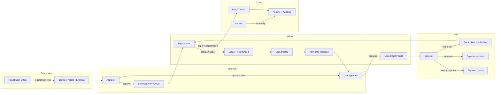
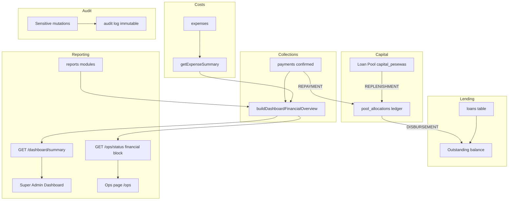
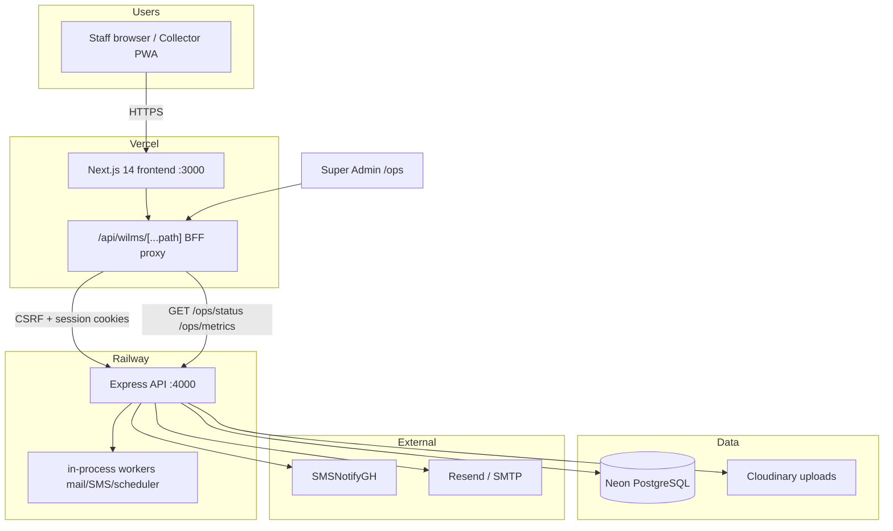

# System Handover Guide — WILMS v1.3.8

**Phase:** 21 — Product Acceptance  
**Audience:** Operations, Support, Super Admin  
**Date:** 17 July 2026

---

## 1. What you are receiving

WILMS v1.3.8 is a **staff-operated** loan management system:

- **5 roles** with separate portals (no borrower login)
- **Money chain:** registration through audit (see §3)
- **Hosting:** Vercel (frontend) + Railway (API) + Neon (Postgres) per `docs/production-guide.md`
- **Ops dashboard:** `/ops` (Super Admin) — health, financial snapshot, worker topology

---

## 2. Operational flow (staff)



---

## 3. Financial flow (system of record)



**SSoT:** `apps/backend/src/modules/dashboard/financial-overview.ts` — documented in `docs/financial-calculations.md`.

---

## 4. Deploy architecture



**Correlation:** `X-Request-Id` from BFF through API (`CHANGELOG.md`, `request-id.test.ts`).

---

## 5. Environment configuration

### 5.1 Production (required)

| Check | Reference |
|-------|-----------|
| Mock flags **off** | `mock-guard.ts` — process exits if `NEXT_PUBLIC_USE_MOCK=true` |
| `DATABASE_URL` set | Neon connection |
| Migrations applied | `npm run verify:migrations`; health `migrations.status: ok` |
| Uploads | Cloudinary env per backend config |
| Frontend API mode | `NEXT_PUBLIC_USE_MOCK=false`, `WILMS_API_UPSTREAM` |

See `docs/production-guide.md` and `production-operations/DEPLOYMENT_RUNBOOK.md`.

### 5.2 Local dev against API

From root `AGENTS.md`:

```bash
# apps/frontend/.env.local
NEXT_PUBLIC_API_BASE_URL=/api/wilms
NEXT_PUBLIC_USE_MOCK=false
WILMS_API_UPSTREAM=http://127.0.0.1:4000
```

```bash
npm run dev:api   # :4000
npm run dev       # :3000
```

Demo logins: `apps/backend/src/seed/demo-users.ts` (in-memory when `DATABASE_URL` unset).

---

## 6. Health and monitoring

| Endpoint | Purpose |
|----------|---------|
| `GET /health` | DB, schema, migrations, integrations |
| `GET /ops/status` | Super Admin aggregated status |
| `GET /ops/metrics` | Prometheus text format |

UI: `https://wilms.vercel.app` → login as Super Admin → **Operations** (`/ops`).

Guides: `production-operations/SYSTEM_MONITORING_GUIDE.md`, `PRODUCTION_ALERT_MATRIX.md`.

---

## 7. Support runbooks (handover checklist)

| # | Document | Use when |
|---|----------|----------|
| 1 | `GO_LIVE_CHECKLIST.md` | Pre-promote |
| 2 | `DEPLOYMENT_RUNBOOK.md` | Deploy / migrate |
| 3 | `ROLLBACK_RUNBOOK.md` | Bad deploy |
| 4 | `INCIDENT_RESPONSE_PLAYBOOK.md` | Outage / degradation |
| 5 | `BACKUP_AND_RECOVERY_PLAN.md` | Data recovery |
| 6 | `PRODUCTION_SUPPORT_MANUAL.md` | L1/L2 tickets |
| 7 | Role guides (5) | Staff training |

---

## 8. Known operational constraints (v1.3.8)

| Constraint | Impact | Mitigation |
|------------|--------|------------|
| In-process queue | API restart drops in-flight background jobs | Re-send from Communication Center; v1.4 queues |
| Single-instance workers | No horizontal worker scaling | Keep one Railway API instance until Redis |
| No borrower portal | Borrowers call office / collector | By design |
| No statutory GL | Export reports for external accounting | Roadmap v1.4+ |
| Migration 0027 | Hot query indexes | Apply before prod promote |

---

## 9. Verification commands (post-handover)

```bash
npm run verify:migrations
npm run verify:deploy-sync
npm run smoke:production
npm run smoke:rbac
npm run type-check
npm run test -w @wilms/api
```

---

## 10. Escalation

| Tier | Contact / action |
|------|------------------|
| L1 | `PRODUCTION_SUPPORT_MANUAL.md` — password reset, collector assignment |
| L2 | `INCIDENT_RESPONSE_PLAYBOOK.md` — DB, mail, SMS |
| L3 | Engineering — schema repair only with written recovery plan |

---

## 11. Handover sign-off items

- [ ] Super Admin can reach `/ops` and read green/degraded surfaces
- [ ] `/health` returns `schema.status: ok` on target environment
- [ ] Migration 0027 applied (journal idx 27)
- [ ] Role guides distributed to programme staff
- [ ] On-call has runbook URLs bookmarked
- [ ] Staging smoke evidence filed (launch condition)

**Handover status:** ⚠ **Conditional** — complete checklist above for unconditional ops acceptance.
