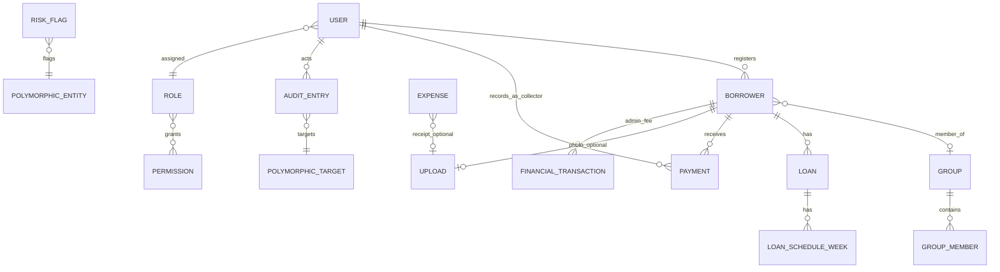

# P14.1B — Entity Relationship Discovery

**Phase:** P14.1B (evidence-based documentation only)  
**Date:** 2026-06-09  
**Primary sources:** P14.1A deliverables, `src/types/*`, `src/services/mock/*`, `backend/src/db/store.ts`, `backend/src/infrastructure/*`.

**Status legend**

| Status | Meaning |
|--------|---------|
| **Confirmed** | Type interface + mock and/or backend persistence |
| **Referenced** | Type/contract exists; persistence incomplete or view-only |
| **Proposed** | Mentioned in project docs only (P13/P14); not in runtime code |

Relationships are cited from **field references only** — no speculative joins.

---

## Borrower

### Source

- `src/types/borrower.ts` — `BorrowerSummary`, `BorrowerDetail`, `BorrowerFullProfile`
- `backend/src/db/store.ts` — `BorrowerRecord`, `BorrowerProfile`

### Current usage

- Features: `borrower-management`, `borrower-registration`, `approval-workflow`, `payment-collection`, `loan-management`, `admin-fee`
- Services: `IBorrowerService` — `src/types/services.ts` L148–167

### Relationships

| Type | Target | Evidence |
|------|--------|----------|
| Many-to-one | Group | `BorrowerSummary.groupId?`, `groupName` — `borrower.ts` L17–18; `assignBorrowerToGroup` — `store.ts` L237–246 |
| Many-to-one | User (registration officer) | `BorrowerRecord.registeredByOfficerId` — `store.ts` L46 |
| One-to-many | Loan | `LoanSummary.borrowerId` — `loan.ts` L13; `listBorrowerLoans` — `services.ts` L176 |
| One-to-many | Payment | `PaymentRecord.borrowerId` — `store.ts` L52 |
| Many-to-one | Upload (photos) | `BorrowerProfile.photoUploadId?`, `guarantorPhotoUploadId?` — `store.ts` L30–31 |
| One-to-many | Audit entry (as target) | `targetEntityType` polymorphic — `services.ts` L373–374 |

### Required keys

| Key | Field | Evidence |
|-----|-------|----------|
| PK | `id` | `BorrowerRecord.id` — `store.ts` L35 |
| FK (optional) | `groupId` | `store.ts` L43 |
| FK | `registeredByOfficerId` | `store.ts` L46 |
| FK (optional) | `photoUploadId`, `guarantorPhotoUploadId` | `BorrowerProfile` — `store.ts` L30–31 |
| Unique (referenced) | `phone`, `idType`+`idNumber` | Conflict checks — `IBorrowerService.checkPhone`, `checkId` |

### Status

**Confirmed**

---

## Registration (Borrower registration workflow)

Registration is not a separate aggregate type; it is a **Borrower** in `PENDING` status plus `RegisterBorrowerPayload`.

### Source

- `src/types/borrower-registration.ts` — `RegisterBorrowerPayload`, `BorrowerRegistrationFormValues`
- `src/features/borrower-registration/registration.schema.ts`
- `backend/src/modules/borrowers/service.ts` — `registerBorrower`, `deleteRegistration`

### Current usage

- Features: `borrower-registration`
- Services: `IBorrowerService.registerBorrower`, `deleteRegistration`, conflict checks

### Relationships

| Type | Target | Evidence |
|------|--------|----------|
| Creates | Borrower | `registerBorrower` → `BorrowerRecord` — `borrowers/service.ts` |
| References | Upload (multiple purposes) | Payload upload ID fields — `borrower-registration.ts` L88–95 |
| References | User (officer) | `registeredByOfficerId` — `borrower-registration.ts` L66 |

### Required keys

| Key | Field | Evidence |
|-----|-------|----------|
| PK | Borrower `id` (post-create) | Same as Borrower |
| FK | `registeredByOfficerId` | `RegisterBorrowerPayload` L66 |

### Status

**Confirmed** (as workflow on Borrower; not a standalone entity type)

---

## Approval (Borrower approval workflow)

Approval is a **state transition** on Borrower (`PENDING` → `APPROVED` | `REJECTED` | `BLACKLISTED`), not a separate persisted entity.

### Source

- `src/types/approval.ts` — `RejectBorrowerInput`, `BorrowerReviewDetail`, `ReviewedApplicationSummary`
- `backend/src/modules/borrowers/service.ts` — `approveBorrower`, `rejectBorrower`, `blacklistBorrower`

### Current usage

- Features: `approval-workflow`
- Services: `IBorrowerService` approval methods; triggers `IGroupFormationService.processApprovedBorrower` on approve (backend)

### Relationships

| Type | Target | Evidence |
|------|--------|----------|
| One-to-one (view) | Borrower | `BorrowerReviewDetail extends BorrowerDetail` — `approval.ts` L15 |
| Triggers | Group formation | `processApprovedBorrower` — `group-formation/service.ts` (backend) |
| Produces | Audit entry | `appendAuditEntry` — `borrowers/service.ts` |
| Referenced | Notification | Mock only — `borrowerService.mock.ts` |

### Required keys

| Key | Field | Evidence |
|-----|-------|----------|
| PK | Borrower `id` | Approval acts on existing borrower |
| Audit | `rejectionReason?` on record | `BorrowerRecord.rejectionReason?` — `store.ts` L48 |

### Status

**Confirmed** (workflow); **Referenced** (reviewed-application history — backend returns empty list per `listReviewedApplications` stub)

---

## Group

### Source

- `src/types/group.ts` — `GroupSourceRecord`, `GroupMember`, `GroupSummary`
- `src/types/group-detail.ts` — `GroupDetail`, membership inputs
- `backend/src/db/store.ts` — `GroupRecord`

### Current usage

- Features: `group-management`, `payment-collection` (collection sheet)
- Services: `IGroupService`, `IGroupFormationService`

### Relationships

| Type | Target | Evidence |
|------|--------|----------|
| One-to-many | Borrower (members) | `GroupRecord.memberIds[]` — `store.ts` L67; `GroupMember.borrowerId` — `group.ts` |
| Many-to-one | Collector | `GroupDetail.collector` — `group-detail.ts` L64 (mock-enriched) |
| Many-to-one | User (registration officer) | `GroupDetail.registrationOfficerName` — `group-detail.ts` L65 |
| One-to-many | Loan (via members) | `GroupMember.loanStatus` — `group.ts` L48 |
| One-to-many | Risk history | `GroupDetail.riskHistory` — `group-detail.ts` L71 (mock) |

### Required keys

| Key | Field | Evidence |
|-----|-------|----------|
| PK | `id` | `GroupRecord.id` — `store.ts` L62 |
| Unique (referenced) | `systemId` | `GroupRecord.systemId` — `store.ts` L63 |
| FK (array) | `memberIds[]` → borrower.id | `store.ts` L67 |

### Status

**Confirmed** (core record); **Referenced** (collector assignment, risk history, activity — mock-only enrichment)

---

## Group member (join entity)

### Source

- `src/types/group.ts` — `GroupMember`, `GroupMemberDetail`
- `src/services/mock/group-membership.store.ts`

### Current usage

- Features: `group-management`
- Services: `IGroupService` membership mutations

### Relationships

| Type | Target | Evidence |
|------|--------|----------|
| Many-to-one | Group | Membership scoped by `groupId` in inputs — `group-detail.ts` L88–93 |
| Many-to-one | Borrower | `GroupMember.borrowerId` — `group.ts` |
| Many-to-many | Group ↔ Borrower | Via membership store (mock) |

### Required keys

| Key | Field | Evidence |
|-----|-------|----------|
| PK (referenced) | Composite `groupId` + `borrowerId` | `GroupMembershipChangeInput` — `group-detail.ts` L88–92 |
| FK | `borrowerId`, `groupId` | Same |

### Status

**Confirmed** (mock persistence); **Referenced** on backend (only `memberIds[]` on `GroupRecord`)

---

## Loan

### Source

- `src/types/loan.ts` — `LoanSummary`, `LoanDetail`, `CreateLoanInput`, `LoanPortfolioEntry`
- `src/types/loan-schedule.ts` — `LoanSchedule`, `LoanScheduleWeek`
- `src/services/mock/loanService.mock.ts`, `loan-schedule.store.ts`

### Current usage

- Features: `loan-management`, `borrower-management`, `admin-fee`, `reports`
- Services: `ILoanService` — `services.ts` L169–182

### Relationships

| Type | Target | Evidence |
|------|--------|----------|
| Many-to-one | Borrower | `LoanSummary.borrowerId` — `loan.ts` L13 |
| One-to-many | Payment (log) | `LoanPaymentLogEntry` — `loan.ts`; `listLoanPaymentLog` |
| One-to-one (derived) | Loan schedule | `LoanSchedule.loanId` — `loan-schedule.ts` L19 |
| Referenced | Loan pool | `LoanPoolSummary` — separate aggregate; no FK in `loan.ts` |

### Required keys

| Key | Field | Evidence |
|-----|-------|----------|
| PK | `id` | `LoanSummary.id` — `loan.ts` L12 |
| FK | `borrowerId` | `loan.ts` L13 |

### Status

**Confirmed** (types + mock); **Referenced** (no backend module)

---

## Payment (collection transaction)

### Source

- `src/types/payment.ts` — `PaymentTransaction`, `RecordPaymentInput`, `EditPaymentInput`
- `backend/src/db/store.ts` — `PaymentRecord`
- `backend/src/modules/payments/routes.ts`

### Current usage

- Features: `payment-collection`, offline queue
- Services: `IPaymentService` — `services.ts` L190–199

### Relationships

| Type | Target | Evidence |
|------|--------|----------|
| Many-to-one | Borrower | `PaymentRecord.borrowerId` — `store.ts` L52 |
| Many-to-one | User/Collector | `PaymentRecord.collectorId` — `store.ts` L53 |
| Many-to-one | Loan (referenced) | `PaymentEntryContext.loanId` — `payment-entry.ts` L15 (mock-rich context) |
| One-to-many | Audit entry | Payment edit/create audit — `payments/routes.ts` L104–109, L134–140 |

### Required keys

| Key | Field | Evidence |
|-----|-------|----------|
| PK | `id` | `PaymentRecord.id` — `store.ts` L51 |
| FK | `borrowerId`, `collectorId` | `store.ts` L52–53 |
| Unique (business rule) | Same borrower + date + amount | `findDuplicatePayment` — `store.ts` L197–207 |

### Status

**Confirmed**

---

## Collection (operational domain)

"Collection" is an **operational domain**, not a separate entity type. Persisted as **Payment** records plus derived **PaymentEntryContext** / **CollectorDashboard** DTOs.

### Source

- `src/types/payment-entry.ts`, `src/types/collector-dashboard.ts`
- `src/types/collection-metrics.ts`

### Current usage

- Features: `payment-collection`, `analytics`, `super-admin-dashboard`
- Services: `IPaymentService`, `ICollectorService`, `ICollectionMetricsService`

### Relationships

| Type | Target | Evidence |
|------|--------|----------|
| Aggregates | Payment | Dashboard/metrics built from payments (mock builders) |
| Many-to-one | Borrower, Collector | Via payment and dashboard DTOs |

### Required keys

N/A — no standalone collection entity.

### Status

**Referenced** (domain); persisted data = **Payment** (**Confirmed**)

---

## Admin fee (financial transaction subtype)

Admin fee is modeled as `FinancialTransaction` with `type: ADMIN_FEE`, plus status DTOs.

### Source

- `src/types/transaction.ts` — `FinancialTransaction`, `AdminFeeStatus`, `RecordAdminFeeInput`, `AwaitingAdminFeeBorrower`
- `src/services/mock/transactionService.mock.ts`, `transaction-log.store.ts`

### Current usage

- Features: `admin-fee`
- Services: `ITransactionService` — `services.ts` L184–188

### Relationships

| Type | Target | Evidence |
|------|--------|----------|
| Many-to-one | Borrower | `FinancialTransaction.borrowerId`, `AdminFeeStatus.borrowerId` — `transaction.ts` |
| Many-to-one | Collector | `FinancialTransaction.collectorId`, `RecordAdminFeeInput.collectorId` |
| Optional | Loan | `FinancialTransaction.loanId?` — `transaction.ts` L16 |
| Gates | Loan disbursement | `getDisbursementEligibility` — `ILoanService` L181 |

### Required keys

| Key | Field | Evidence |
|-----|-------|----------|
| PK | `id` | `FinancialTransaction.id` — `transaction.ts` L12 |
| FK | `borrowerId`, `collectorId` | `transaction.ts` L14–18 |

### Status

**Confirmed** (types + mock); **Referenced** (no backend persistence)

---

## User (session + settings)

Two related shapes: **SessionUser** (auth) and **SettingsUserRecord** (admin).

### Source

- `src/types/auth.ts` — `SessionUser`, `LoginResult`
- `src/types/settings.ts` — `SettingsUserRecord`
- `src/types/user-management.ts` — `SettingsUserProfile`
- `backend/src/seed/demo-users.ts`

### Current usage

- Features: `authentication`, `settings`, all role shells
- Services: `IAuthService`, `ISettingsService`

### Relationships

| Type | Target | Evidence |
|------|--------|----------|
| Many-to-one | Role | `SettingsUserRecord.role`, `SessionUser.role` |
| One-to-many | Permission (via role) | `SettingsUserProfile.assignedPermissionIds` — `user-management.ts` L16 |
| One-to-many | Audit entry (as actor) | `AuditEntry.actorId` — `services.ts` L370 |
| Referenced | Collector | Collector personas overlap demo users — `src/mocks/users.ts` |

### Required keys

| Key | Field | Evidence |
|-----|-------|----------|
| PK | `id` / `userId` | `SessionUser.id`, `SettingsUserRecord.id` |
| Unique (referenced) | `email` | `SettingsUserRecord.email`, `LoginInput.email` |

### Status

**Confirmed** (types + mock + demo seed); **Referenced** (no persistent user table on backend)

---

## Role

### Source

- `src/types/user-management.ts` — `RoleDefinition`, `CreateRoleInput`, `UpdateRoleInput`
- `src/services/mock/settings-roles.store.ts`
- `backend/src/infrastructure/permissions/matrix.ts` — static `PERMISSION` constants only

### Current usage

- Features: `settings` (`RoleSettingsPanel`)
- Services: `ISettingsService.listRoles`, `createRole`, etc.

### Relationships

| Type | Target | Evidence |
|------|--------|----------|
| Many-to-many | Permission | `RoleDefinition.permissionIds[]` — `user-management.ts` L86 |
| One-to-many | User | `RoleDefinition.userCount` — `user-management.ts` L88 |

### Required keys

| Key | Field | Evidence |
|-----|-------|----------|
| PK | `id` | `RoleDefinition.id` — `user-management.ts` L83 |
| FK (join, referenced) | `permissionIds[]` | `user-management.ts` L86 |

### Status

**Confirmed** (mock); **Referenced** (backend has static matrix, no role storage)

---

## Permission

### Source

- `src/types/user-management.ts` — `PermissionDefinition`
- `src/types/rbac.ts`
- `src/lib/rbac/permission-matrix.ts`, `backend/infrastructure/permissions/matrix.ts`

### Current usage

- Features: `settings`, all shells via `PermissionProvider`
- Middleware: `require-permission.ts` (backend)

### Relationships

| Type | Target | Evidence |
|------|--------|----------|
| Many-to-many | Role | Via `permissionIds` on roles |
| Referenced | User overrides | `src/lib/rbac/user-permission-overrides.ts`, `src/mocks/user-permission-overrides.ts` |

### Required keys

| Key | Field | Evidence |
|-----|-------|----------|
| PK | `id` | `PermissionDefinition.id` — `user-management.ts` L76 |

### Status

**Confirmed** (definitions in constants/mock); **Referenced** (no permission CRUD backend)

---

## Collector

Collector is a **user persona** with operational metrics, not a separate type file named `CollectorRecord`.

### Source

- `src/types/collector-management.ts` — `CollectorSummary`, `CollectorDetail`
- `src/types/collector-dashboard.ts` — `CollectorDashboard`
- `src/services/mock/collectorManagementService.mock.ts`, `collectorService.mock.ts`

### Current usage

- Features: `collector-management`, `payment-collection`
- Services: `ICollectorManagementService`, `ICollectorService`

### Relationships

| Type | Target | Evidence |
|------|--------|----------|
| One-to-many | Group | `CollectorSummary.groupCount`; `GroupDetail.collector` |
| One-to-many | Payment | `PaymentRecord.collectorId` — `store.ts` L53 |
| One-to-many | Borrower (assigned) | `CollectorDashboard.borrowers` — `collector-dashboard.ts` |

### Required keys

| Key | Field | Evidence |
|-----|-------|----------|
| PK | `id` | `CollectorSummary.id` — `collector-management.ts` L9 |
| FK (referenced) | Same as User id | Demo collectors in `src/mocks/users.ts` |

### Status

**Confirmed** (DTOs + mock); **Referenced** (no collector table/backend record)

---

## Notification

Two shapes: **inbox item** (read model) and **delivery** (outbound).

### Source

- `src/types/notification.ts` — `NotificationInboxItem`, `NotificationDelivery`, `SendNotificationInput`
- `src/services/mock/notificationService.mock.ts`

### Current usage

- Features: `notifications`; navbar `NotificationInboxPanel`
- Services: `INotificationService`

### Relationships

| Type | Target | Evidence |
|------|--------|----------|
| Optional FK | Borrower | `SendNotificationInput.borrowerId?` — `notification.ts` L29 |
| Optional FK | Loan | `SendNotificationInput.loanId?` — `notification.ts` L30 |
| Referenced | User (inbox owner) | Implicit per-session inbox (no userId on `NotificationInboxItem`) |

### Required keys

| Key | Field | Evidence |
|-----|-------|----------|
| PK | `id` | `NotificationInboxItem.id`, `NotificationDelivery.id` |
| State | `isRead` | `NotificationInboxItem.isRead` — `notification.ts` L61 |

### Status

**Confirmed** (types + mock); **Referenced** (no backend module)

---

## Upload

### Source

- `src/types/upload.ts` — `UploadRecord`, `UploadFileInput`, `UPLOAD_PURPOSE`
- `backend/src/infrastructure/uploads/storage.ts` — `StoredUpload`

### Current usage

- Features: `borrower-registration`, forms (`PhotoUploadField`, `SignatureUploadField`), expenses (receipt)
- Services: `IUploadService`

### Relationships

| Type | Target | Evidence |
|------|--------|----------|
| Optional FK | Any entity | `UploadRecord.entityId?`, `StoredUpload.entityId?` — `upload.ts` L30, `storage.ts` L13 |
| Referenced | Borrower profile | `photoUploadId` on `BorrowerProfile` — `store.ts` L30 |

### Required keys

| Key | Field | Evidence |
|-----|-------|----------|
| PK | `id` | `UploadRecord.id`, `StoredUpload.id` |

### Status

**Confirmed**

---

## Audit entry

### Source

- `src/types/services.ts` — `AuditEntry` L367–377
- `src/types/audit.ts` — `CreateAuditEntryInput`
- `backend/src/infrastructure/audit/audit-log.ts` — `AuditEntryRecord`

### Current usage

- Features: `reports` (audit log), `settings` (activity), `approval-workflow`, `risk-flags`
- Services: `IAuditService`

### Relationships

| Type | Target | Evidence |
|------|--------|----------|
| Many-to-one | User (actor) | `actorId` — `services.ts` L370 |
| Polymorphic | Any target | `targetEntityId`, `targetEntityType` — L373–374 |

### Required keys

| Key | Field | Evidence |
|-----|-------|----------|
| PK | `id` | `AuditEntryRecord.id` — `audit-log.ts` L4 |
| FK | `actorId` | L6 |
| Polymorphic FK | `targetEntityId` + `targetEntityType` | L8–9 |

### Status

**Confirmed**

---

## Expense

### Source

- `src/types/expense.ts` — `ExpenseRecord`, `CreateExpenseInput`, `ReviewExpenseInput`
- `src/services/mock/expenseService.mock.ts`

### Current usage

- Features: `expenses`, `super-admin-dashboard` (summary widget)
- Services: `IExpenseService`

### Relationships

| Type | Target | Evidence |
|------|--------|----------|
| Many-to-one | User (recorder) | `recordedById`, `recordedByName` — `expense.ts` L32–33 |
| Optional FK | Upload (receipt) | `receiptUploadId?` — `expense.ts` L30 |

### Required keys

| Key | Field | Evidence |
|-----|-------|----------|
| PK | `id` | `ExpenseRecord.id` — `expense.ts` L22 |
| FK | `recordedById` | L32 |

### Status

**Confirmed** (mock); **Referenced** (no backend)

---

## Reconciliation

### Source

- `src/types/reconciliation.ts` — `SubmitReconciliationInput`, `ReconciliationSubmission`
- `src/types/services.ts` — `ReconciliationSummary` L241–251
- `src/services/mock/reconciliation.store.ts`

### Current usage

- Features: `reconciliation`
- Services: `IReconciliationService`

### Relationships

| Type | Target | Evidence |
|------|--------|----------|
| Many-to-one | Collector | `collectorId` — `reconciliation.ts` L2, `ReconciliationSummary` L242 |
| Derived from | Payment totals | `expectedPesewas`, `actualPesewas` — mock computes from payments |

### Required keys

| Key | Field | Evidence |
|-----|-------|----------|
| PK (referenced) | Composite `collectorId` + `date` | `SubmitReconciliationInput` — `reconciliation.ts` L2–4 |
| FK | `collectorId` | L2 |

### Status

**Confirmed** (mock); **Referenced** (no backend)

---

## Risk flag

### Source

- `src/types/risk-flag.ts` — `RiskFlagSummary`, `RiskFlagDetail`, `FlagTimelineEvent`
- `src/services/mock/riskFlagService.mock.ts`

### Current usage

- Features: `risk-flags`
- Services: `IRiskFlagService`

### Relationships

| Type | Target | Evidence |
|------|--------|----------|
| Polymorphic | Borrower, Group, Collector, Loan pool, Application | `FlagEntityType` — `risk-flag.ts` L1–7 |
| One-to-many | Timeline events | `RiskFlagDetail.timeline` — `risk-flag.ts` L84 |

### Required keys

| Key | Field | Evidence |
|-----|-------|----------|
| PK | `id` | `RiskFlagSummary.id` — `risk-flag.ts` L31 |
| Polymorphic FK | `entityId` + `entityType` | L32–34 |

### Status

**Confirmed** (mock); **Referenced** (no backend)

---

## Adjustment request

### Source

- `src/types/adjustment.ts` — `AdjustmentRequest`
- `src/services/mock/adjustment.store.ts`

### Current usage

- Features: `adjustments`
- Services: `IAdjustmentService`

### Relationships

| Type | Target | Evidence |
|------|--------|----------|
| Many-to-one | Borrower | `borrowerId` — `adjustment.ts` L22 |
| Optional | Loan | `loanId?` — L23 |
| Many-to-one | User (requester) | `requestedBy` — L26 |

### Required keys

| Key | Field | Evidence |
|-----|-------|----------|
| PK | `id` | L19 |
| FK | `borrowerId` | L22 |

### Status

**Confirmed** (mock); **Referenced** (no backend)

---

## Overpayment review

### Source

- `src/types/overpayment-review.ts` — `OverpaymentReview`
- `src/services/mock/overpayment-review.store.ts`

### Current usage

- Features: `overpayment-review`
- Services: `IOverpaymentReviewService`

### Relationships

| Type | Target | Evidence |
|------|--------|----------|
| Many-to-one | Borrower, Loan, Collector | `borrowerId`, `loanId`, `collectorId` — `overpayment-review.ts` L12–16 |

### Required keys

| Key | Field | Evidence |
|-----|-------|----------|
| PK | `id` | L11 |
| FK | `borrowerId`, `loanId`, `collectorId` | L12–16 |

### Status

**Confirmed** (mock); **Referenced** (no backend)

---

## Loan pool

### Source

- `src/types/loan-pool.ts` — `LoanPoolSummary`, `LoanPoolDetail`
- `src/services/mock/loanPoolService.mock.ts`

### Current usage

- Features: `loan-pools`
- Services: `ILoanPoolService`

### Relationships

| Type | Target | Evidence |
|------|--------|----------|
| Referenced | Group | `groupCount` on pool — `loan-pool.ts` L20 |
| Referenced | Loan | No direct FK in types; capital/disbursement aggregates |

### Required keys

| Key | Field | Evidence |
|-----|-------|----------|
| PK | `id` | `LoanPoolSummary.id` — `loan-pool.ts` L10 |

### Status

**Confirmed** (mock); **Referenced** (no backend; no loan→pool FK in types)

---

## Photo capture session

### Source

- `src/types/photo-capture-session.ts`
- `src/services/mock/photoCaptureSessionService.mock.ts`

### Current usage

- Features: `borrower-registration` (phone relay)
- Services: `IPhotoCaptureSessionService`

### Relationships

| Type | Target | Evidence |
|------|--------|----------|
| References | Registration session | `CreatePhotoCaptureSessionInput.registrationSessionId` — `photo-capture-session.ts` L12 |
| References | User (officer) | `officerId` — L13 |

### Required keys

| Key | Field | Evidence |
|-----|-------|----------|
| PK | `sessionToken` | `PhotoCaptureSession.sessionToken` — L2 |

### Status

**Confirmed** (mock); **Proposed** (API route in P13 contract, not implemented on backend)

---

## System settings

### Source

- `src/types/settings.ts` — `SystemSettings`
- `src/services/mock/settings.store.ts`

### Current usage

- Features: `settings`, `borrower-registration` (legal config via separate type)
- Services: `ISettingsService.getSettings`, `updateSettings`

### Relationships

| Type | Target | Evidence |
|------|--------|----------|
| Configures | Group formation | `minGroupSize`, `maxGroupSize` — `settings.ts` L6–7; `GroupFormationConfig` — `group-formation.ts` |
| Configures | Notifications | `smsNotificationsEnabled`, etc. — `settings.ts` L4–6 |

### Required keys

| Key | Field | Evidence |
|-----|-------|----------|
| PK (referenced) | Singleton row | Single `SystemSettings` object in mock store |

### Status

**Confirmed** (mock); **Referenced** (no backend)

---

## Approved borrower queue (backend-only helper)

### Source

- `backend/src/db/store.ts` L74, L219–228

### Current usage

- `group-formation/service.ts` — community queue before auto-group

### Relationships

| Type | Target | Evidence |
|------|--------|----------|
| Many-to-one | Borrower | `borrowerId` in queue entry |
| Scoped by | Community | Map key = community string |

### Status

**Confirmed** (backend in-memory only; no frontend type file)

---

## Relationship summary diagram (evidence-based)

Only relationships with direct field evidence are shown. Dashed conceptual links (e.g. Loan pool → Loan) are omitted.

---

## Validation

- Derived from P14.1A-confirmed-entities.md and source files cited inline.
- No relationships added without field-level evidence.
- Proposed items (photo capture API, Neon DB) excluded from Confirmed relationship claims.

---

## Related

- `P14.1B-database-blueprint.md` — Column-level blueprint
- `P14.1A-confirmed-entities.md` — Entity inventory
