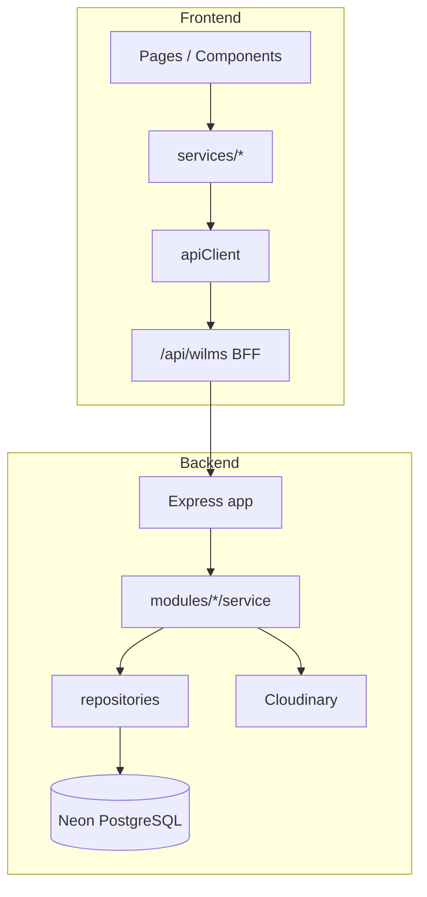

# P14.3A.3 — API Architecture

**Phase:** P14.3A.3 Phase 3  
**Date:** 2026-06-09  
**Status:** Complete

---

## Frontend API Layer

```text
apps/frontend/src/
├── app/api/
│   ├── auth/login/route.ts      # Session cookie login (Next route)
│   ├── auth/logout/route.ts
│   └── wilms/[...path]/route.ts # BFF proxy → WILMS_API_UPSTREAM
├── config/api.ts                # API_BASE_URL, timeouts
├── utils/apiClient.ts           # fetch wrapper, { data } unwrap
├── data-provider/
│   ├── types.ts                 # mock vs api resolution
│   ├── ApiDataProvider.ts       # production service bundle
│   └── MockDataProvider.ts      # development bundle
└── services/
    ├── index.development.ts     # webpack alias → mock
    ├── index.production.ts      # webpack alias → api
    ├── loanService.ts           # apiClient → /loans
    ├── paymentService.ts
    ├── borrowerService.ts
    ├── uploadService.ts
    └── … (20+ domain services)
```

**Note:** There is no `src/api/` folder — API access is via `services/` + `apiClient` + BFF routes.

### Request flow (production)

```text
UI Component
  → @/services (loanService, etc.)
  → apiClient.get/post('/loans')
  → NEXT_PUBLIC_API_BASE_URL + path
     (often http://host/api/wilms/loans)
  → Next.js BFF /api/wilms/[...path]
  → WILMS_API_UPSTREAM (http://127.0.0.1:4000/loans)
  → Express backend
```

---

## Backend API Layer

```text
apps/backend/src/
├── index.ts                     # Express bootstrap + env load
├── http/
│   ├── app.ts                   # Route mounting
│   ├── response.ts              # { data } envelope
│   └── map-financial-error.ts
├── modules/                     # Route + service per domain
│   ├── auth/routes.ts
│   ├── loans/routes.ts + service.ts
│   ├── payments/routes.ts + service.ts
│   ├── borrowers/routes.ts + service.ts
│   ├── uploads/routes.ts
│   ├── reports/routes.ts
│   └── …
├── repositories/                # Drizzle persistence
├── db/persistence.ts            # Memory ↔ PostgreSQL facade
└── infrastructure/
    ├── uploads/                 # local + Cloudinary providers
    ├── mail/                    # SMTP + Resend adapters
    └── sms/                     # Arkesel + Twilio adapters
```

**Note:** No `src/routes/` top-level — routes live inside `modules/*/routes.ts`.

### Route mounting (`http/app.ts`)

| Mount | Routers |
|-------|---------|
| `/health`, `/auth` | health, auth |
| `/api/v1` + legacy `/` | loans, payments, borrowers, group-formation, audit, reports, uploads |

---

## Ownership Matrix

| Domain | Frontend service | Backend route | Backend service | Persistence |
|--------|------------------|---------------|-----------------|-------------|
| Auth | `authService` + `/api/auth/*` | `/auth/*` | auth module | users (memory/DB) |
| Loans | `loanService` | `/loans/*` | `modules/loans/service.ts` | loan repositories |
| Payments | `paymentService` | `/payments` | `modules/payments/service.ts` | payment + ledger repos |
| Borrowers | `borrowerService` | `/borrowers/*` | `modules/borrowers/service.ts` | borrower repository |
| Uploads | `uploadService` | `/uploads/*` | upload routes + providers | local disk / Cloudinary |

---

## Dependency Diagram



---

## Shared Packages

`packages/shared-{contracts,rbac,types,validation,utils}` — DTOs, enums, validation schemas. No HTTP or env access.
