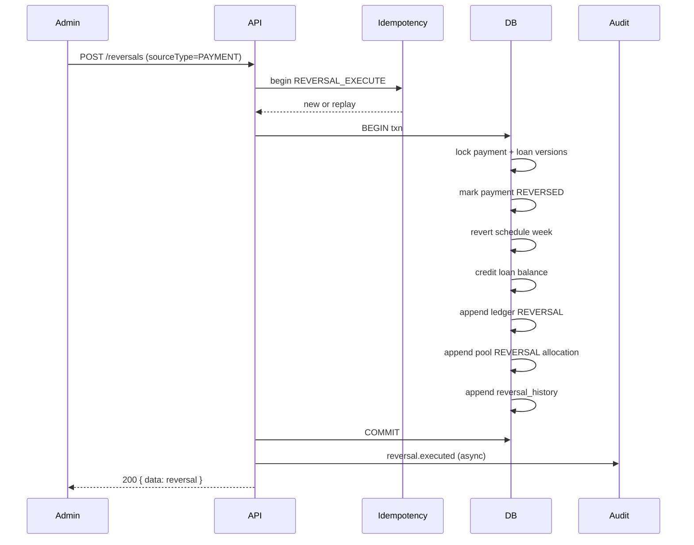
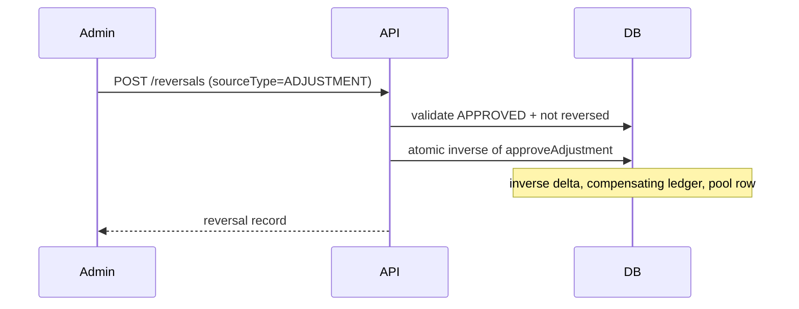

# P14.3B — Reversal Architecture

**Phase:** P14.3B.3B  
**Date:** 2026-06-21  
**Status:** Design complete — pending human approval before 3C implementation

---

## Reversal Principles

### Immutable financial history

| Rule | Rationale |
|------|-----------|
| Never delete `payments`, `ledger_entries`, or `pool_allocations` | Append-only accounting (ADR aligned with Phase 1 pool design) |
| Never UPDATE ledger amounts or entry types | Audit trail integrity |
| Never mutate payment amount/date in place | Reversal must be explicit compensating event |
| Allow status/metadata updates on source rows | Mark `payments.status = REVERSED`, set `reversed_at`, link to reversal ID |

### Compensating transactions

Every reversal produces **new rows** that negate the financial effect of a source event:

```text
Source event (immutable)
        ↓
Reversal request (PENDING)
        ↓
Reversal execution (atomic)
        ├─ reversal record (APPROVED/EXECUTED)
        ├─ compensating ledger entry (REVERSAL)
        ├─ compensating pool allocation (if applicable)
        ├─ loan balance + schedule correction
        ├─ source entity status flag (REVERSED)
        └─ reversal_history + audit
```

### What is reversed vs not reversed

| Entity | Reversed? | Mechanism |
|--------|-----------|-----------|
| Payment | **Yes** (Phase 3C scope) | Status flag + schedule unpay + balance credit + ledger REVERSAL |
| Approved adjustment | **Yes** (Phase 3C+) | Compensating ledger + inverse balance delta; adjustment row `REVERSAL_PENDING` |
| Pool allocation | **Yes** (when source had allocation) | Compensating allocation linked to source allocation ID |
| Loan disbursement | **Conditional** | Only if zero repayments + admin approval; otherwise **not allowed** |
| Pending adjustment | **No** | Use reject workflow instead |
| Audit entries | **Never** | Append new audit actions only |

### Separation from adjustments

| Concern | Adjustment | Reversal |
|---------|------------|----------|
| Trigger | Manual correction request | Undo specific posted transaction |
| Approval | Admin approve/reject | Admin approve/execute (same RBAC gate) |
| Ledger type | `ADJUSTMENT` | `REVERSAL` |
| Source link | Optional loan | **Required** `sourceType` + `sourceId` |
| Double-apply guard | N/A | Block if source already reversed or if PAYMENT_CORRECTION adjustment exists for same payment |

**Blocking Issue B-ARCH-01:** Product rule must define mutual exclusion between `PAYMENT_CORRECTION` adjustment and payment reversal on same `paymentId`. **Design decision:** reversal takes precedence; block new PAYMENT_CORRECTION if payment reversed; block reversal if approved PAYMENT_CORRECTION exists for same payment.

---

## Reversal Types

### 1. Payment Reversal

**Preconditions**

- Source payment exists, `status = CONFIRMED`
- No existing reversal for `sourceId`
- No approved `PAYMENT_CORRECTION` adjustment referencing same payment/amount
- Loan lifecycle allows credit (ACTIVE or COMPLETED with balance restore)
- Schedule week linked to payment can revert from PAID → prior status (MISSED or PENDING per due date)

**Transaction sequence**

```text
BEGIN
  1. INSERT financial_reversals (PENDING → EXECUTED in same txn for admin-execute model)
  2. UPDATE payments SET status=REVERSED, reversed_by, reversed_at, version+1
     WHERE id=? AND version=? AND status=CONFIRMED
  3. UPDATE loan_schedules week: PAID → computed status (optimistic version)
  4. UPDATE loans SET loan_balance+=amount, lifecycle if needed (optimistic version)
  5. INSERT ledger_entries type=REVERSAL, reverses_ledger_entry_id=original REPAYMENT id
  6. IF loan_pool_id: INSERT pool_allocations compensating (type REVERSAL or ADJUSTMENT+metadata)
  7. INSERT reversal_history (EXECUTED, before/after balance, delta)
COMMIT
appendAuditEntry(REVERSAL_EXECUTED)  -- post-commit pattern preserved
```

**Ledger behavior:** New `REVERSAL` entry; amount equals original repayment amount; metadata `{ sourcePaymentId, sourceLedgerEntryId, weekNumber }`.

**Audit:** `reversal.requested`, `reversal.approved` (if two-step), `reversal.executed`.

**Idempotency:** Scope `REVERSAL_EXECUTE`; key = `(sourceType=PAYMENT, sourceId=paymentId)`.

---

### 2. Adjustment Reversal

**Preconditions**

- Source adjustment `status = APPROVED`
- Not already reversed
- WRITE_OFF reversal triggers dedicated workflow (blacklist restore out of scope Phase 3C — **Blocking Issue B-ARCH-02**)

**Transaction sequence:** Inverse of approve path using stored `beforeBalancePesewas` / `deltaPesewas` from adjustment row; compensating ledger `REVERSAL` linked to original `ADJUSTMENT` ledger entry via metadata query or new FK.

**Ledger:** `REVERSAL` entry amount = original adjustment ledger amount; delta sign inverted.

**Audit:** `reversal.executed` target `ADJUSTMENT`.

**Idempotency:** `(sourceType=ADJUSTMENT, sourceId=adjustmentId)`.

---

### 3. Pool Allocation Reversal

Not a standalone user action — **sub-step** of payment or adjustment reversal.

**Preconditions:** Source allocation row exists.

**Behavior:** `appendAllocation` with `allocationType = REVERSAL` (new enum value) and `metadata.reversesAllocationId`.

**Not reversed alone:** Orphan pool rows without financial source reversal forbidden.

---

### 4. Disbursement Reversal

**Preconditions (strict)**

- Loan ACTIVE, zero REPAYMENT ledger rows
- Zero payments for loan
- Admin + `ACCESS_ADMIN_PORTAL`
- Within policy window (configurable — design default: same cycle batch only)

**If any payment exists:** **Reject** — use payment reversal path instead.

**Transaction sequence:** Reverse lifecycle toward PENDING_DISBURSEMENT; compensating `LOAN_DISBURSEMENT` offset via `REVERSAL` ledger entry; soft-flag disbursement row `reversed_at` (new column design — no delete).

**Phase 3C scope:** **Deferred** unless preconditions trivial — document as Phase 3D candidate.

---

## Ledger Design

### New ledger type

Add enum value: **`REVERSAL`** (design only — migration in 3C).

Existing types unchanged: `LOAN_DISBURSEMENT`, `REPAYMENT`, `INTEREST_CHARGE`, `PENALTY_CHARGE`, `ADJUSTMENT`.

### Linking strategy

**Preferred schema extension (3C migration):**

| Column | Type | Purpose |
|--------|------|---------|
| `reverses_ledger_entry_id` | uuid nullable FK → `ledger_entries.id` | Direct link to reversed entry |
| `reversal_id` | uuid nullable FK → `financial_reversals.id` | Link to reversal workflow row |

Until FK exists, require `metadata.reversesLedgerEntryId` (interim — not preferred for production).

### Balance recalculation strategy

**Authoritative:** `loans.loan_balance` updated atomically in reversal txn (same as payment post).

**Verification:** `verify:reversals` harness recomputes expected balance from disbursements − repayments ± adjustments ± reversals.

**Do not** recalculate from scratch on every read — preserve current denormalized pattern.

### Audit trail preservation

Original ledger rows remain; reports sum net effect:

```text
netRepayment = SUM(REPAYMENT) - SUM(REVERSAL WHERE reverses REPAYMENT)
```

---

## Sequence Diagrams

### Payment reversal (admin execute)



### Adjustment reversal



---

## API Design (3C — not implemented)

| Method | Path | Permission |
|--------|------|------------|
| POST | `/reversals` | `ACCESS_ADMIN_PORTAL` (request + execute combined v1) |
| GET | `/reversals` | `ACCESS_ADMIN_PORTAL` |
| GET | `/reversals/:id` | `ACCESS_ADMIN_PORTAL` |
| GET | `/reversals/pending` | Optional v2 two-step approval |

Envelope: `{ data: T }` per existing API standard.

Frontend: new `reversalService.ts` + `TRANSACTION_TYPE.REVERSAL` (3C).

---

## Unresolved → Blocking Issues

| ID | Issue | Disposition |
|----|-------|-------------|
| B-ARCH-01 | Adjustment vs reversal mutual exclusion on same payment | Resolved in design — enforce at API |
| B-ARCH-02 | WRITE_OFF adjustment reversal (blacklist restore) | **Deferred to Phase 5** — block reversal of WRITE_OFF in 3C |
| B-ARCH-03 | Schedule week status after unpay | Design: revert to MISSED if dueDate < today else PENDING |
| B-ARCH-04 | Disbursement reversal scope | **Deferred to 3D** — payment reversal only in 3C MVP |

**Phase 2 exit:** PASS — no unresolved questions block payment reversal architecture.
