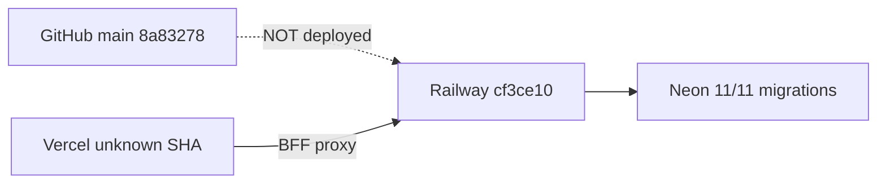

# RC1.3.2 — Deployment Verification

**Date:** 2026-07-02T22:45:00Z  
**Frontend:** https://wilms.vercel.app  
**Backend:** https://wilms-production.up.railway.app

---

## Summary

**Result: PARTIAL FAIL** — Services are reachable; Railway recently redeployed but **commit SHA drift** persists. Frontend ↔ backend ↔ GitHub are **not synchronized** to the same release.

---

## Railway (API)

**Evidence:** `GET /health` @ 2026-07-02T22:41:09Z

```json
{
  "status": "ok",
  "version": "0.2.2",
  "gitCommit": "cf3ce103d49a8b7c0d37a4dc813472461ef01895",
  "environment": "production",
  "database": { "connected": true, "status": "connected" },
  "migrations": { "expected": 11, "applied": 11, "status": "ok" },
  "uploads": { "activeProvider": "cloudinary", "valid": true },
  "runtime": {
    "nodeVersion": "v20.20.2",
    "deployedAt": "2026-07-02T22:35:38.142Z",
    "buildId": "1a7d5cc8-4fda-40e9-a170-02ec63aaf650"
  }
}
```

| Check | Result |
|-------|--------|
| HTTP status | 200 |
| Uptime at probe | ~331s (fresh restart ~22:35 UTC) |
| Migrations | 11/11 OK |
| Cloudinary | Valid |
| Deployed commit | **`cf3ce10`** — does not match `main` `8a83278` |
| Expected commit | `8a83278` (RC1.2) or post-RC1.3 merge if merged |

**Note:** A manual redeploy occurred (low uptime, new `deployedAt`) but the **reported `gitCommit` is unchanged** from pre-RC1.2 audits. Investigate Railway build source branch / `WILMS_GIT_COMMIT` injection.

---

## Vercel (Frontend)

**Evidence:** `GET /login` @ 2026-07-02T22:41:08Z

| Check | Result |
|-------|--------|
| HTTP status | 200 |
| Server header | `Vercel` |
| `x-vercel-id` | `iad1::iad1::2g757-1783032068049-ea6e9af52084` |
| Deployment SHA | Not available without Vercel dashboard / CLI |
| BFF login + CSRF | PASS (smoke) |
| Demo banner | Absent |

Intermittent `ERR_NAME_NOT_RESOLVED` observed on later probe — transient DNS; retry succeeded earlier.

---

## Cross-layer alignment



| Link | Synchronized? |
|------|---------------|
| GitHub → Railway | **NO** |
| GitHub → Vercel | **Unknown** |
| Vercel → Railway (BFF) | **YES** (login, reports, settings work) |
| Railway → Neon | **YES** (migrations 11/11) |

---

## Environment variables (inferred)

| Variable | Evidence |
|----------|----------|
| `DATABASE_URL` | Connected |
| `WILMS_CORS_ORIGIN` | Login + BFF work |
| Cloudinary | `uploads.valid: true` |
| `WILMS_API_UPSTREAM` (Vercel) | BFF routes reach Railway |

Full env audit requires Railway/Vercel dashboard access (not available in this run).

---

## Pass gate

All three surfaces must report the **same commit SHA** as GitHub `main`. **FAIL until Railway (and Vercel) deploy from `8a83278` or later merged RC1.3 commit.**
