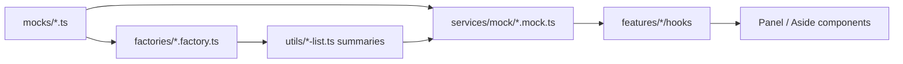

# Hardcoded Data Audit (P4)

Audit date: 2026-06-09

## Goal

Executive pages must not embed literal KPI totals, table rows, or sidebar insights. Demo data lives in `mocks/`, scaled datasets in `services/mock/factories/`, and UI reads through service hooks.

## Resolved in P4

| Area | Before | After |
|------|--------|-------|
| Risk & Flags KPIs / breakdown / blacklists | `REFERENCE_SUMMARY` constants in `risk-flag-list.ts` | Computed in `buildRiskFlagListResponse()` from generated flags |
| Risk flag rows | 10 static mocks only | `risk-flags-demo.factory.ts` (64 flags, reference type distribution) |
| Reports index KPIs | `REPORT_KPI_FALLBACK` literals | `useDashboardSummary()` only; loading state when unavailable |
| Reports aside | Hardcoded scheduled exports / history | `MOCK_REPORTS_HUB` + `useReportsHubMetadata()` |
| Settings users table | `SETTINGS_REFERENCE_USERS` constant in panel | `MOCK_SETTINGS_USERS` + `useSettingsUsers()` |
| Settings aside activity | Hardcoded change log | `MOCK_SETTINGS_ACTIVITY` + `useSettingsActivity()` |
| Collector list alerts (legacy util) | Inline alert array | `getCollectorsDemoDataset().alerts` |
| Collector summary fallback | `50_000` pesewas | `COLLECTOR_EXPECTED_PESEWAS_FALLBACK` from reference scale |

## Data flow



## Remaining acceptable literals

- **Navigation labels and route maps** (not metrics)
- **Settings form defaults** in section cards (demo read-only controls; not KPIs)
- **Export document copy** in builders (static compliance text, user rows sourced from mock re-export)
- **Theme / layout tokens** in CSS

## Verification

```bash
npm run lint
npx tsc --noEmit
npm test -- src/tests/services/mock/risk-flags-demo.factory.test.ts
npm test -- src/tests/reports/ReportsIndexPanel.test.tsx
```
