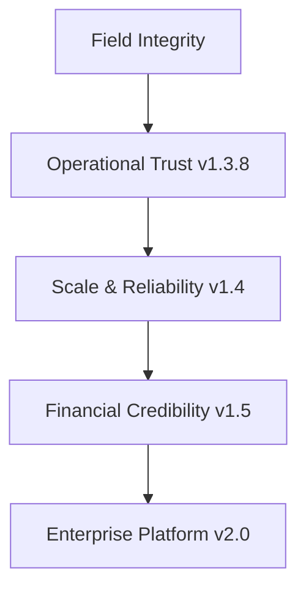

# Executive Strategy — Board-Level Positioning

**Date:** 17 July 2026  
**Phase:** 24.10  
**Audience:** Board, sponsors, banking partners, NGO leadership

---

## Where WILMS plays

WILMS is a **vertical operations platform** for **women's interest-free microfinance** in field-heavy markets (initially Ghana). It wins when the problem is:

- Enforcing **non-negotiable collection rules** (full weekly payment, no partials, no advance, oldest obligation first)
- Tracking **donor/pool capital** separately from loan portfolio
- **GPS-verified** field collection with collector cash reconciliation
- Giving NGO leadership **honest KPIs** without spreadsheet shadow systems

WILMS does **not** win when the buyer needs:

- Global multi-entity ERP (SAP, Dynamics, Oracle)
- Licensed core banking (Temenos, Finacle)
- Generic composable lending API as primary product (Mambu)

**We are not competing with SAP on day one.** We are building the credible path from field ops → partner-grade books.

---

## Strategic pillars

| Pillar | Investment | Outcome |
|--------|------------|---------|
| **Field integrity** | BRD enforcement, GPS, audit | Collectors cannot break money rules |
| **Operational trust** | v1.3.8 remediation, certification | Deploy today with known limits |
| **Scale & reliability** | v1.4 queues, idempotency, observability | Grow to 100k payments without silent errors |
| **Financial credibility** | v1.5 GL dual-write, trial balance | Banking partner can review books |
| **Enterprise platform** | v2.0 GL authority, multi-branch | Audit-ready at NGO/bank scale |

---

## Market positioning statement

> **For women's microfinance institutions and their banking partners**, WILMS is the field-to-finance operations platform that enforces interest-free lending discipline and produces auditable money trails — unlike generic ERPs that require years of customization, or core banking systems built for licensed banks, not NGO field models.

---

## Honest capability ladder

| Stage | Claim we CAN make | Claim we CANNOT make |
|-------|-------------------|----------------------|
| **Today (v1.3.8)** | Production-ready field lending ops; pool tracking; recon | Statutory GL; multi-branch; borrower portal |
| **v1.4** | Trustworthy at growth; durable async; idempotent money API | Banking books of record |
| **v1.5** | Trial balance; period close; drift-monitored dual-write | Full ERP replacement |
| **v2.0** | GL authoritative; multi-site; compliance packs | SAP feature parity |

---

## Risk appetite (board guidance)

| Risk | Appetite | Mitigation |
|------|----------|------------|
| Money integrity bug | **Zero** | Idempotency, audit, hotfix SLA |
| Scope creep into ERP | **Low** | This planning pack; non-goals list |
| Technical bankruptcy (rewrite) | **Zero** | Modular monolith; phased GL |
| Partner rejection on books | **Medium** | v1.5 GL track + accountant partnership |
| Delayed production cert | **Accepted** | Software complete; operator evidence pending |

---

## Investment thesis (v1.4)

| Spend | ~80–120 engineering person-days | |
|-------|--------------------------------|---|
| **Why now** | v1.3.8 accepted limitations (in-process queues, optional idempotency) are partner blockers at scale |
| **ROI** | Avoid duplicate payment incidents; unlock 100k payment orgs; SRE due diligence pass |
| **What we defer** | Borrower portal, GL implementation, multi-branch |

---

## Partnership model

| Partner type | WILMS role | Their role |
|--------------|------------|------------|
| **NGO sponsor** | Primary operator; field system of record | Program design; capital injection |
| **Banking partner** | Operational + eventual GL export | Licensed ledger; regulatory reporting |
| **Auditor** | Export packs + audit chain | Independent verification |
| **Technology** | Railway/Vercel/Neon | Infra SLA |

**Bank conversation:** "Use WILMS for field truth through v1.4; use our GL export from v1.5 to feed your core if required."

---

## Governance

| Body | Responsibility |
|------|----------------|
| Board | Approve version themes; borrower portal product gate |
| Sponsor | Production certification evidence; limitation sign-off |
| CTO | Architecture non-goals; v1.4 P0 scope |
| Accountant (external) | CoA sign-off before GL Phase A |
| Engineering | M1/M2/M3 milestones |

---

## What success looks like

| Horizon | Success |
|---------|---------|
| **3 months** | v1.4 P0 shipped; production cert issued; maintenance branch live |
| **6 months** | M1 passed; v1.5 GL staging dual-write |
| **1 year** | M2 — 30-day zero drift TB |
| **2 years** | M3 — independent audit; optional multi-branch pilot |

---

## Explicit strategic non-goals

- Competing with SAP/Dynamics on ERP breadth
- Cryptocurrency or blockchain ledger narratives
- Microservices for engineering aesthetics
- Borrower portal without BRD and support model
- Claiming "enterprise ERP" before M2

---

## References

- [`ENTERPRISE_EVOLUTION_PLAN.md`](./ENTERPRISE_EVOLUTION_PLAN.md)
- [`MASTER_ROADMAP.md`](./MASTER_ROADMAP.md)
- [`FINAL_EXECUTIVE_SUMMARY.md`](../../certification/v1.3.8/product-acceptance/FINAL_EXECUTIVE_SUMMARY.md)
