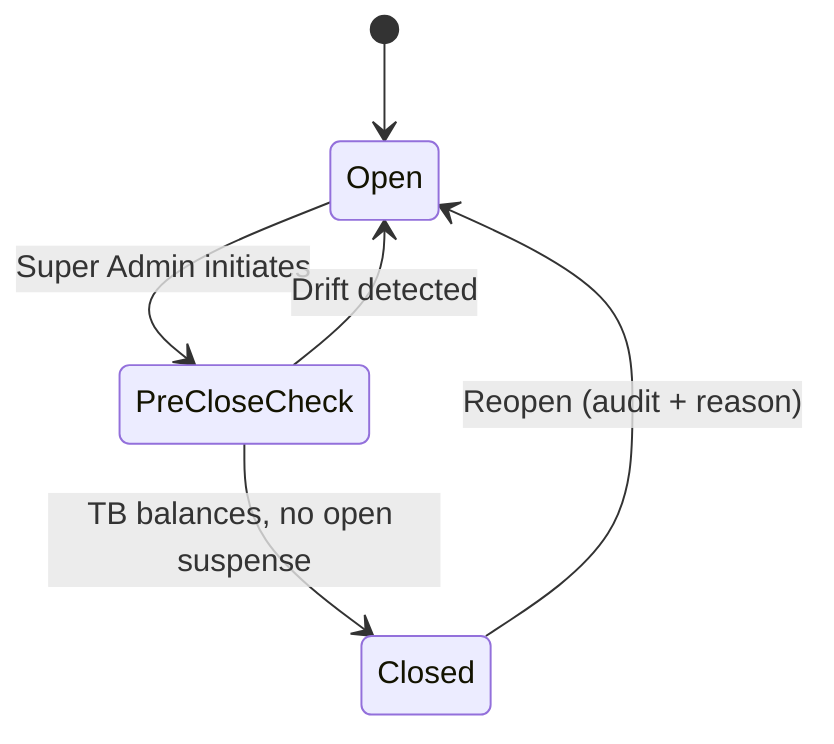
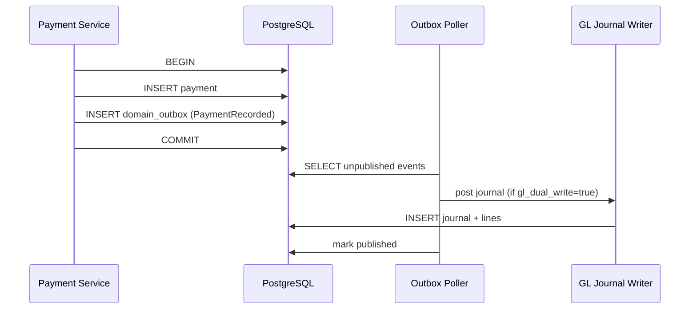

# Financial Engine v2 — Design Document (Phase 24.6)

**Date:** 17 July 2026  
**Status:** Design only — **no v1.4 implementation**  
**Implementation:** v1.5 Phase A/B per [`DOUBLE_ENTRY_LEDGER_MIGRATION_ROADMAP.md`](../../certification/v1.3.8/enterprise-architecture/DOUBLE_ENTRY_LEDGER_MIGRATION_ROADMAP.md)  
**v1.4 prep:** Outbox, feature flag `gl_dual_write`, schema ADR

---

## Executive summary

WILMS v1.3.8 operates a strong **operational sub-ledger** (`ledger_entries`, payments, pools, expenses) but cannot produce a **trial balance**, **period close**, or **partner-grade GL export**. Financial Engine v2 adds a **double-entry General Ledger bounded context** beside — not replacing — field operations.

**Verdict (unchanged):** Keep operational model; add GL via dual-write → drift monitoring → authoritative cutover (v2.0).

---

## Design principles

1. **Operational events are source of truth for field UX** through v1.5.
2. **GL journals are immutable** — corrections via reversing entries only.
3. **Posting rules are versioned** with `effective_from` dates.
4. **Dual-write behind feature flag** (`gl_dual_write`) — v1.4 ships flag infrastructure only.
5. **Outbox delivers posting commands** in the same transaction as money writes (v1.4 outbox → v1.5 GL consumer).
6. **Accountant sign-off required** for CoA equity/liability treatment — do not invent GAAP in code.

---

## Target module boundary

```text
┌─────────────────────────────────────────────────────────┐
│ Financial GL Context (new)                               │
│  ┌─────────────┐  ┌──────────────┐  ┌─────────────────┐ │
│  │ CoA service │  │ Posting rules│  │ Journal writer  │ │
│  └─────────────┘  └──────────────┘  └─────────────────┘ │
│  ┌─────────────┐  ┌──────────────┐  ┌─────────────────┐ │
│  │ Period close│  │ Trial balance│  │ Bank recon GL   │ │
│  └─────────────┘  └──────────────┘  └─────────────────┘ │
└─────────────────────────────────────────────────────────┘
         ▲                          │
         │ outbox events            │ read APIs
         │                          ▼
┌────────┴────────────────────────────────────────────────┐
│ Existing: Payments, Loans, Pools, Expenses, Recon      │
└────────────────────────────────────────────────────────┘
```

---

## Schema design (v1.5 Phase A)

### Chart of Accounts — `gl_accounts`

| Column | Type | Notes |
|--------|------|-------|
| `id` | uuid PK | |
| `code` | varchar(10) UNIQUE | e.g. `1200` |
| `name` | text | |
| `normal_balance` | enum debit/credit | |
| `account_type` | enum asset/liability/equity/income/expense | |
| `is_active` | boolean | Soft retire only |
| `parent_id` | uuid FK nullable | Hierarchy optional v1.5 |

**Starter CoA** (from upstream roadmap — confirm with org accountant):

| Code | Account | Normal |
|------|---------|--------|
| 1000 | Cash — Operating | Debit |
| 1100 | Cash — Field / Collector | Debit |
| 1200 | Loan Portfolio — Principal | Debit |
| 1300 | Admin Fee Receivable | Debit |
| 2000 | Pool Liability / Equity (org choice) | Credit |
| 3000 | Capital Contributions | Credit |
| 4000 | Admin Fee Income | Credit |
| 5000 | Operating Expenses | Debit |
| 6000 | Suspense / Clearing | Both |

### Journal header — `gl_journal_entries`

| Column | Type | Notes |
|--------|------|-------|
| `id` | uuid PK | |
| `journal_date` | date | Business date |
| `period_id` | uuid FK | |
| `source_event_type` | varchar | `PaymentRecorded`, etc. |
| `source_event_id` | uuid | Operational FK |
| `posting_rule_version` | int | Audit trail |
| `description` | text | |
| `reverses_journal_id` | uuid nullable | Reversal link |
| `created_at` | timestamptz | Immutable |

**Constraint:** No UPDATE/DELETE on posted journals.

### Journal lines — `gl_journal_lines`

| Column | Type | Notes |
|--------|------|-------|
| `id` | uuid PK | |
| `journal_id` | uuid FK | |
| `account_id` | uuid FK | |
| `debit_pesewas` | bigint | Exactly one of debit/credit > 0 |
| `credit_pesewas` | bigint | |
| `memo` | text nullable | |

**Constraint:** Per journal: `SUM(debit) = SUM(credit)`.

### Periods — `gl_periods`

| Column | Type | Notes |
|--------|------|-------|
| `id` | uuid PK | |
| `year` | int | |
| `month` | int | |
| `status` | enum open/closed | |
| `closed_at` | timestamptz nullable | |
| `closed_by_user_id` | uuid nullable | Super Admin |

### Posting rules — `gl_posting_rules`

| Column | Type | Notes |
|--------|------|-------|
| `id` | uuid PK | |
| `event_type` | varchar | |
| `version` | int | |
| `effective_from` | date | |
| `debit_account_code` | varchar | |
| `credit_account_code` | varchar | |
| `amount_source` | varchar | Field mapping expression |
| `is_active` | boolean | |

---

## Posting rule examples

| Operational event | Debit | Credit |
|-------------------|-------|--------|
| Pool capital injected | 1000 Cash Operating | 3000 Capital |
| Loan disbursed | 1200 Loan Portfolio | 1000 Cash Operating |
| Weekly repayment | 1000/1100 Cash | 1200 Loan Portfolio |
| Payment reversal | Opposite of original | |
| Admin fee collected | 1000 Cash | 4000 Fee Income |
| Expense recorded | 5000 Expense | 1000 Cash |
| Recon overage/shortage | 6000 Suspense + 1100 Field | Per policy |

---

## Trial balance (v1.5 Phase B)

**Definition:** For period P, TB = `SUM(debit) - SUM(credit)` per account from all journals with `journal_date` in P.

| Output | Format |
|--------|--------|
| API | `GET /gl/trial-balance?period=2026-07` |
| Export | CSV + SHA-256 manifest |
| Validation | Total debits = total credits |

**Materialized balances:** Nightly job `gl_account_balances` (account_id, period_id, balance_pesewas) for fast reads.

---

## Period close workflow



**Pre-close checks:**

1. No unposted outbox events older than 1h
2. Drift report: Σ loan balances vs GL 1200
3. Drift report: Σ pool cash vs GL 1000/2000
4. Collector recon submissions complete for period (warning, not block — configurable)

---

## Bank reconciliation (design)

**v1.3.8 today:** Collector cash recon snapshots (operational control).

**v2 design layers:**

| Layer | Purpose |
|-------|---------|
| **Operational recon** | Field collector daily cash — keep as sub-ledger control |
| **GL cash accounts** | 1000, 1100 balances from journals |
| **Bank statement import** | CSV upload of actual bank balance (v1.5 manual; v2.0 optional feed) |
| **Recon report** | GL cash vs bank vs operational recon totals |

**Unmatched items** post to 6000 Suspense until resolved.

---

## Financial statements (v2.0)

| Statement | Source accounts | Phase |
|-----------|-----------------|-------|
| Balance Sheet | Assets (1xxx) vs Liab+Equity (2xxx, 3xxx) | v2.0 |
| Income Statement | 4xxx income − 5xxx expenses | v2.0 |
| Cash flow (indirect) | Derived from GL + operational | v2.0 optional |

v1.5 delivers **trial balance only** — not full statutory pack.

---

## Integration with v1.4 outbox



When `gl_dual_write=false` (v1.4 default): outbox events logged, GL writer no-op.

---

## Balance drift monitor

| Check | Frequency | Alert |
|-------|-----------|-------|
| Σ `loans.loan_balance` vs GL 1200 | Daily | Slack/Pager if ≠ 0 |
| Σ pool available vs GL cash+liability | Daily | Degraded ops surface |
| Σ payments vs operational ledger | Weekly | Audit report |

**Exit criterion (v1.5):** 30 consecutive days zero drift in staging.

---

## Migration phases (reference)

| Phase | Version | Scope | Effort (pd) |
|-------|---------|-------|-------------|
| A — Foundations | v1.5 | Schema, posting rules, dual-write flagged | 25–40 |
| B — Read models | v1.5 | TB, period close, drift, export pack | 20–35 |
| C — Cutover | v2.0 | GL authoritative; backfill; auditor sign-off | 15–30 + accounting |

**v1.4 contribution:** Outbox table (8–12 pd), feature flags (5–8 pd), this design doc — **no GL tables in v1.4**.

---

## Risks

| Risk | Mitigation |
|------|------------|
| Wrong equity/liability mapping | Accountant sign-off before Phase A migration |
| Dual-write performance | Async outbox consumer; batch nightly balance |
| Operational/GL divergence | Drift monitor blocks period close |
| Big-bang cutover | Feature flag gradual; operational remains UX source until v2.0 |

---

## What NOT to do

- Rewrite payments into event-sourced microservice alongside GL
- Call single-sided `ledger_entries` "double-entry"
- Enable GL authoritative without period close
- Implement GL in v1.4 (scope creep)

---

## References

- [`DOUBLE_ENTRY_LEDGER_MIGRATION_ROADMAP.md`](../../certification/v1.3.8/enterprise-architecture/DOUBLE_ENTRY_LEDGER_MIGRATION_ROADMAP.md)
- [`ENTERPRISE_ROADMAP_v14_v15_v20.md`](../../certification/v1.3.8/enterprise-architecture/ENTERPRISE_ROADMAP_v14_v15_v20.md) — M2 milestone
- [`WILMS_V14_ROADMAP.md`](./WILMS_V14_ROADMAP.md) — outbox + flags
