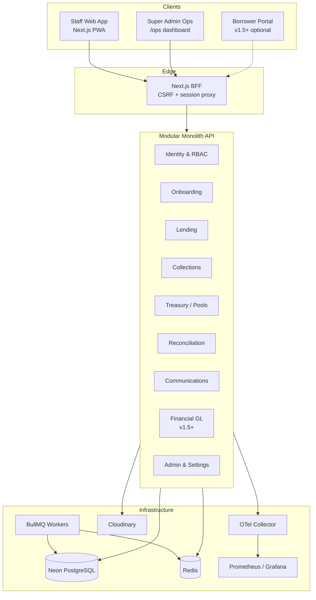
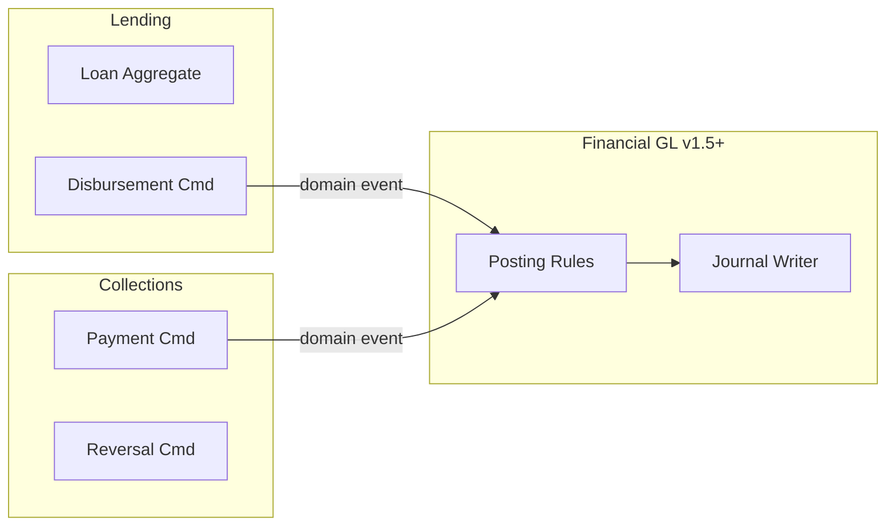
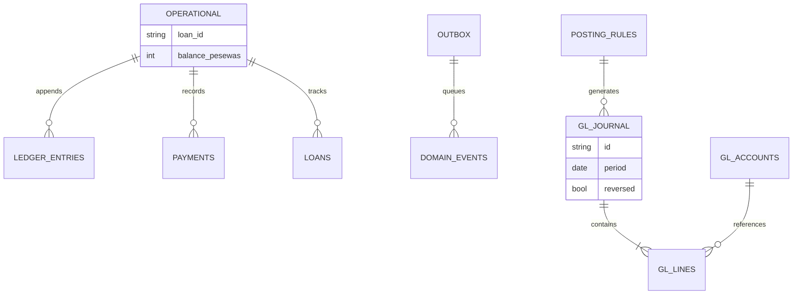

# Long-Term Architecture — v1.4 → v2.0

**Date:** 17 July 2026  
**Phase:** 24.3  
**Decision:** **Modular monolith** through v1.5; extract workers first, network services only if scale forces  
**Extends:** [`ENTERPRISE_ARCHITECTURE_RECOMMENDATIONS.md`](../../certification/v1.3.8/enterprise-architecture/ENTERPRISE_ARCHITECTURE_RECOMMENDATIONS.md) (DA-01, DA-02)

---

## Target state overview

WILMS evolves from a **field-operations microfinance ledger** (v1.3.8) to a **banking-partner-credible platform** (v2.0) without abandoning the modular monolith that matches team size and deployment reality.



---

## Bounded contexts (modular monolith)

Each context owns tables, services, and public module APIs. Cross-context calls go through explicit service interfaces — not deep repository imports.

| Context | Responsibility | Key modules today | v1.4 change | v1.5+ change |
|---------|----------------|-------------------|-------------|--------------|
| **Identity** | Users, sessions, RBAC, overrides | `auth`, `users` | Hash-chain audit MVP | ABAC attributes |
| **Onboarding** | Borrowers, groups, KYC, blacklist | `borrowers`, `groups` | Cursor lists | Field encryption |
| **Lending** | Loans, disbursement, lifecycle | `loans`, `loan-pools` | Idempotency on create | GL posting rules |
| **Collections** | Payments, reversals, GPS | `payments` | Idempotency + cursor | GL dual-write |
| **Treasury** | Pools, capital, allocations | `loan-pools`, `settings` | Split settings service | Pool GL mapping |
| **Operating Cash** | Expenses, admin fees | `expenses`, fees | SQL aggregates | GL expense journals |
| **Reconciliation** | Collector cash recon | `reconciliation` | UX resubmit | Suspense GL accounts |
| **Communications** | Mail, SMS, templates | `communications`, `notifications` | BullMQ workers | Worker isolation |
| **Reporting** | Dashboard, exports | `dashboard`, `reports` | SQL KPIs (done) | CQRS snapshots |
| **Financial GL** | CoA, journals, TB, periods | — (design only) | Outbox + flags prep | Phase A/B/C |
| **Operations** | Health, metrics, ops status | `health`, `ops` | OTel + Prometheus | SLO dashboards |



---

## Layered architecture (unchanged philosophy)

```text
HTTP Routes → Service (use cases) → Domain rules → Repository → PostgreSQL
                    │
                    └──► Outbox (v1.4) → BullMQ → Workers
```

**Command/query split (pragmatic CQRS):**

- **Commands:** transactional; money paths with idempotency + outbox in same DB transaction.
- **Queries:** SQL aggregates and cursor pages; no in-memory reduce over unbounded lists.

---

## Data architecture evolution



| Layer | v1.3.8 | v1.4 | v1.5 | v2.0 |
|-------|--------|------|------|------|
| Operational sub-ledger | Authoritative for field ops | Same | Same + verified | Projection |
| `ledger_entries` | Event log | Same | Maps to GL | Maps to GL |
| GL | None | Schema design only | Dual-write flagged | Authoritative cash/P&L |
| KPIs | SQL aggregates (dashboard fixed) | + cursor lists | Materialized daily | + search index |

---

## Platform evolution (Phase 24.3 — architecture lens)

| Capability | Why (WILMS-specific) | Benefits | Trade-offs | Complexity (pd) | Priority |
|------------|---------------------|----------|------------|-----------------|----------|
| **Redis + BullMQ** | `ops/service.ts` reports `queue: 'in_process'` | Survives API restart; multi-instance safe workers | +$ infra; worker deployment | 15–23 | **P0** |
| **Outbox** | Money + audit side effects must be atomic | Reliable domain events; GL dual-write ready | At-least-once delivery | 8–12 | **P1** |
| **OTel + Prometheus** | Money path failures invisible in logs alone | Trace payment latency; SRE partner trust | Cardinality discipline | 8–12 | **P0** |
| **Feature flags** | GL cutover too risky for big-bang | `gl_dual_write` gradual enable | Test combinatorics | 5–8 | **P1** |
| **Cursor pagination** | `list-pagination.ts` defaults to 2000-row cap | Deep list correctness | Client migration | 10–15 | **P0** |
| **Idempotency-Key** | Optional today on money POSTs | Duplicate protection | Client contract | 4–6 | **P0** |
| **CQRS read models** | Dashboard JS reduces eliminated for collections; lists remain | Scale reads independently | Two paths | 10–20 | **P1** |
| **Double-entry GL** | Partner/regulator books requirement | Trial balance, period close | Major domain addition | 60–105 (v1.5–v2.0) | **P2** |
| **ABAC** | Single-org RBAC adequate now | Branch/amount policies | Complexity | 20–30 | **P3** |
| **Workflow engine** | Current lifecycle enum sufficient | Multi-step approvals | Build vs buy | 20–40 | **P3** |
| **Event bus (Kafka/NATS)** | Outbox + BullMQ enough at WILMS scale | External integrations | Ops overhead | 15–25 | **P3** |
| **Horizontal API scaling** | One Railway instance OK today | HA | Requires stateless workers first | 5–10 | **P2** |
| **Multi-tenancy** | Deploy-per-sponsor model today | SaaS economics | Isolation architecture | 40–80 | **P3** |
| **Multi-branch** | No org-unit schema | Regional ops | Reporting dimensions | 30–50 | **P3** |
| **Offline sync (IndexedDB)** | Collectors in low connectivity | Queue survives refresh | Conflict UX | 6–10 | **P1** |
| **Mobile native app** | PWA covers v1.4 | Store presence | Maintenance burden | 60–120 | **P3** |
| **AI reporting** | Anomaly explanations for auditors | Draft narratives | Never auto-post money | 15–25 | **P3** |
| **Object storage abstraction** | Cloudinary sufficient | Portability | YAGNI now | 8–12 | **P3** |
| **Secrets rotation** | Manual session secret risk | Breach containment | Dual-secret window | 5–8 | **P2** |

---

## Deployment topology

### v1.4 target

```text
Vercel ──► Next.js (BFF + UI)
Railway ──► Express API (1+ instances)
Railway ──► Redis
Railway ──► Worker process (BullMQ consumers) — may share image, separate service
Neon    ──► PostgreSQL (primary; read replica v1.5 if plan allows)
```

### v2.0 target (incremental)

```text
Same as v1.4, plus:
  - Optional read replica for reporting
  - Optional extracted Communications worker IF queue depth SLO breached
  - Grafana Cloud or self-hosted Prometheus
```

**Not on the roadmap:** Kubernetes mesh, service-per-bounded-context.

---

## Integration boundaries

```mermaid
sequenceDiagram
    participant C as Collector PWA
    participant B as BFF
    participant A as API
    participant D as PostgreSQL
    participant Q as BullMQ
    participant W as Worker

    C->>B: POST /payments + Idempotency-Key
    B->>A: Forward + CSRF
    A->>D: BEGIN; payment; outbox; COMMIT
    A-->>B: 201
    B-->>C: 201
    W->>Q: Poll job
    W->>D: Send SMS / email
```

---

## Security architecture (evolution)

| Control | v1.3.8 | v1.4 | v2.0 |
|---------|--------|------|------|
| Auth | HMAC sessions | Same | Same (+ rotation runbook) |
| RBAC | Role + override TTL | Same | + ABAC attributes |
| Audit | Append-only log | Hash-chain MVP | WORM export |
| Money | Optional idempotency | **Mandatory** | Same |
| Transport | TLS everywhere | Same | Same |
| Field PII | Plain in DB | Design encryption | Implement if required |

---

## Explicit architectural non-goals

1. Microservices mesh before independent scale proof.
2. Full-system event sourcing.
3. Replacing Next.js or Express without ADR.
4. Borrower portal in API core (v1.5+ product gate).
5. GL as books-of-record before drift monitoring (v1.5 minimum).

---

## ADRs required in implementation (not Phase 24)

| ADR | Topic |
|-----|-------|
| ADR-005 | Modular monolith boundaries (formalize DA-02) |
| ADR-006 | Redis + BullMQ worker topology |
| ADR-007 | Outbox delivery semantics |
| ADR-008 | Cursor pagination contract |
| ADR-009 | Feature flag implementation |
| ADR-010 | GL dual-write strategy (v1.5 kickoff) |

---

## Reference

- GL detail: [`FINANCIAL_ENGINE_V2_DESIGN.md`](./FINANCIAL_ENGINE_V2_DESIGN.md)
- v1.4 backlog: [`WILMS_V14_ROADMAP.md`](./WILMS_V14_ROADMAP.md)
- Upstream GL roadmap: [`DOUBLE_ENTRY_LEDGER_MIGRATION_ROADMAP.md`](../../certification/v1.3.8/enterprise-architecture/DOUBLE_ENTRY_LEDGER_MIGRATION_ROADMAP.md)
