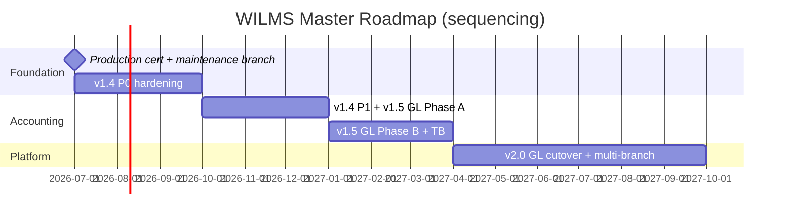

# Master Roadmap — Phase 24.10 Prioritized Timeline

**Date:** 17 July 2026  
**Sizing:** Person-days cumulative; parallel work possible with 2 engineers  
**Status:** Planning — dates are sequencing guides, not commitments

---

## Roadmap at a glance



---

## Next 3 months (Jul–Oct 2026) — v1.4 P0 + certification

**Theme:** Trust the platform at growth.

| # | Deliverable | Effort (pd) | Priority | Depends on |
|---|-------------|-------------|----------|------------|
| 1 | Operator production certification + `maintenance/v1.3.8` | 0 eng (ops) | **P0** | Checklist complete |
| 2 | Mandatory `Idempotency-Key` (FA-04) | 4–6 | **P0** | Frontend keys |
| 3 | Redis + BullMQ workers (REL-02) | 12–18 | **P0** | Redis provisioned |
| 4 | Cursor pagination (PERF-02) | 10–15 | **P0** | Index 0027+ |
| 5 | OpenTelemetry + Prometheus extend (OBS-01) | 8–12 | **P0** | Metrics token |
| 6 | Restore drill automation (REL-01) | 5–8 | **P0** | Neon access |
| 7 | Rollback runbook SSoT (DO-05) | 2–3 | **P0** | — |
| 8 | Backend tests in CI | 1–2 | **P0** | — |

**Milestone M1 gate:** KPI totals match SQL at 100k payments; idempotent money API; durable queue; restore drill passed.

**Estimated engineering:** 42–64 pd (~2 engineers × 6–8 weeks focused)

---

## Next 6 months (Jul 2026–Jan 2027) — v1.4 complete + v1.5 kickoff

**Theme:** Finish hardening; start books.

| # | Deliverable | Effort (pd) | Priority | Version |
|---|-------------|-------------|----------|---------|
| 9 | Outbox pattern (DA-06) | 8–12 | **P1** | v1.4 |
| 10 | Feature flags + `gl_dual_write` stub (DO-03) | 5–8 | **P1** | v1.4 |
| 11 | Offline IndexedDB queue (OFF-01) | 6–10 | **P1** | v1.4 |
| 12 | Node 22 unify (DO-01) | 2–4 | **P1** | v1.4 |
| 13 | Audit hash-chain MVP (SEC-02) | 10–15 | **P1** | v1.4 |
| 14 | OpenAPI + knip/madge (DX) | 9–15 | **P2** | v1.4 |
| 15 | Tag **v1.4.0** production cutover | — | **P0** | v1.4 |
| 16 | GL schema + posting rules (Phase A start) | 25–40 | **P0** | v1.5 |
| 17 | Accountant CoA sign-off | 0 eng | **P0** | v1.5 |

**Milestone:** v1.4.0 live; v1.5 GL dual-write in staging.

**Cumulative engineering (6 mo):** ~107–168 pd

---

## Next 1 year (Jul 2026–Jul 2027) — v1.5 accounting & policy

**Theme:** Books the bank can read.

| # | Deliverable | Effort (pd) | Priority |
|---|-------------|-------------|----------|
| 18 | GL dual-write production (flagged) | incl. in Phase A | **P0** |
| 19 | Trial balance API + export | 8–12 | **P0** |
| 20 | Period open/close | 8–12 | **P0** |
| 21 | Balance drift monitor | 5–8 | **P0** |
| 22 | Financial audit export pack | 8–12 | **P1** |
| 23 | ABAC/policy module | 20–30 | **P1** |
| 24 | CQRS materialized KPIs | 10–20 | **P1** |
| 25 | Field encryption (if required) | 10–15 | **P1** |
| 26 | **Borrower portal** (if product approves) | 25–40 | **Product** |
| 27 | Tag **v1.5.0** | — | **P0** |

**Milestone M2:** Staging month-end TB balances; 30 days zero drift; partner GL export review.

**Cumulative engineering (1 yr):** ~200–280 pd

---

## Next 2 years (Jul 2026–Jul 2028) — v2.0 platform maturity

**Theme:** GL authoritative; multi-site ready.

| # | Deliverable | Effort (pd) | Priority |
|---|-------------|-------------|----------|
| 28 | GL cutover — cash & P&L authoritative | 15–30 | **P0** |
| 29 | Historical backfill / opening journal | 10–20 + accounting | **P0** |
| 30 | Multi-branch org schema | 30–50 | **P1** |
| 31 | 1M+ row archival playbook | 10–20 | **P1** |
| 32 | Compliance report packs | 15–25 | **P1** |
| 33 | Portfolio analytics / forecasting | 20–40 | **P2** |
| 34 | Optional Communications extract | 15–25 | **P3** |
| 35 | Independent financial + security audit | 0 eng | **P0** |
| 36 | Tag **v2.0.0** | — | **P0** |

**Milestone M3:** Auditor reconstructs TB from GL exports; scale test to agreed volume; enterprise certification criteria met.

**Cumulative engineering (2 yr):** ~315–490 pd (excludes product/analytics optionality)

---

## Priority stack (cross-version)

| Priority | Items |
|----------|-------|
| **P0** | Idempotency, BullMQ, cursor pagination, OTel/Prometheus, restore drill, v1.5 GL, TB, drift, v2.0 cutover |
| **P1** | Outbox, feature flags, IndexedDB, hash-chain, ABAC, CQRS snapshots, multi-branch |
| **P2** | OpenAPI, knip/madge, secrets rotation, a11y re-audit, analytics |
| **P3** | Native mobile, event bus, AI assist, multi-tenancy SaaS |

---

## Dependency chain

```text
v1.3.8 cert ──► v1.4 P0 ──► M1 ──► v1.4 P1 + outbox/flags
                                      │
                                      ▼
                              v1.5 GL Phase A/B ──► M2
                                      │
                                      ▼
                              v2.0 cutover + multi-branch ──► M3
```

---

## Resource model

| Team | v1.4 | v1.5 | v2.0 |
|------|------|------|------|
| Engineers | 1–2 senior | 2 | 2 + accountant |
| Ops/SRE | 0.25 FTE | 0.5 FTE | 0.5 FTE |
| Product | 0.1 FTE | 0.25 FTE (portal gate) | 0.5 FTE |
| External accountant | — | Required | Cutover sign-off |

---

## Decision calendar

| When | Decision |
|------|----------|
| Certification | Execute maintenance branch plan |
| v1.4 RC | Enable BullMQ in staging |
| v1.4.0 | Deprecate in-process queue |
| v1.5 kickoff | CoA equity/liability; borrower portal yes/no |
| v1.5 RC | Enable `gl_dual_write` staging |
| v2.0 kickoff | GL cutover date; multi-branch pilot site |

---

## Non-goals (entire horizon)

- Microservices mesh
- Frontend framework rewrite
- Cryptocurrency
- v1.3.x feature development post-maintenance branch
- SAP parity claims before M3

---

## Document index

| Horizon | Primary doc |
|---------|-------------|
| Maintenance | [V13_MAINTENANCE_STRATEGY.md](./V13_MAINTENANCE_STRATEGY.md) |
| v1.4 detail | [WILMS_V14_ROADMAP.md](./WILMS_V14_ROADMAP.md) |
| Architecture | [LONG_TERM_ARCHITECTURE.md](./LONG_TERM_ARCHITECTURE.md) |
| Scale | [SCALABILITY_REVIEW.md](./SCALABILITY_REVIEW.md) |
| GL | [FINANCIAL_ENGINE_V2_DESIGN.md](./FINANCIAL_ENGINE_V2_DESIGN.md) |
| Ops | [OPERATIONS_ROADMAP.md](./OPERATIONS_ROADMAP.md) |
| Strategy | [EXECUTIVE_STRATEGY.md](./EXECUTIVE_STRATEGY.md) |

---

## Upstream alignment

This master roadmap consolidates:

- [`ENTERPRISE_ROADMAP_v14_v15_v20.md`](../../certification/v1.3.8/enterprise-architecture/ENTERPRISE_ROADMAP_v14_v15_v20.md) — M1/M2/M3
- [`ROADMAP_v1.4_v2.0.md`](../../certification/v1.3.8/enterprise-excellence/ROADMAP_v1.4_v2.0.md)
- [`MAINTENANCE_BRANCH_PLAN.md`](../../certification/v1.3.8/production-cutover/MAINTENANCE_BRANCH_PLAN.md)
