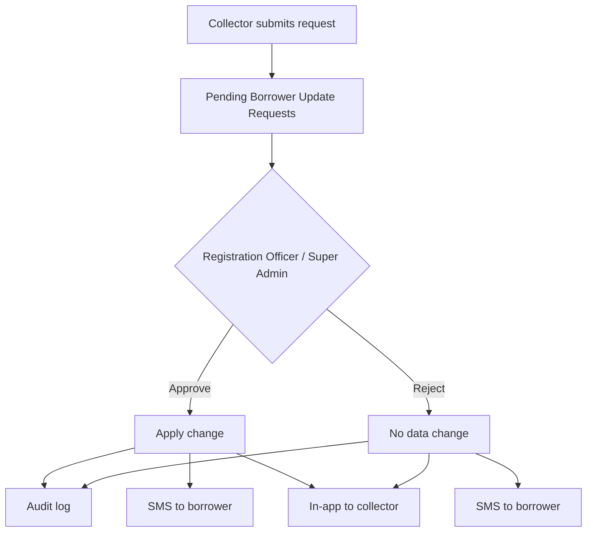

# Borrower Update Request Workflow

**Version:** v1.8.0  
**Classification:** Confidential  
**Audience:** Collectors, Registration Officers, Super Admins

---

## Principle

Collectors **must not** edit borrower records directly. They submit a request. Registration Officers and Super Admins review, then the platform applies the change.

## Permitted fields

| Field | Label |
|-------|-------|
| `PHONE` | Phone number |
| `ALTERNATE_PHONE` | Alternate phone |
| `NAME` | Name correction |
| `ADDRESS` | Home address |
| `COMMUNITY` | Community |
| `CITY` | City / town |
| `BUSINESS_ADDRESS` | Business address |
| `GUARANTOR_PHONE` | Guarantor phone |
| `GUARANTOR_NAME` | Guarantor name |

## Workflow

## Queues

| Role | Path |
|------|------|
| Collector | `/collector/borrower-updates` |
| Registration Officer | `/officer/borrower-updates` |
| Super Admin | `/borrower-updates` |

## Audit and notifications

Each request stores requester, field, before value, after value, reason, reviewer, review note, and timestamps.

| Audience | Channel |
|----------|---------|
| Borrower | SMS (mandatory), email if on file |
| Collector | In-app |
| Reviewers | In-app on submit |

Maker-checker: the requester cannot approve their own request.

## API

| Method | Path | Permission |
|--------|------|------------|
| `GET` | `/borrower-update-requests` | Collector (own) / Officer & Super Admin (all) |
| `POST` | `/borrower-update-requests` | Collector |
| `POST` | `/borrower-update-requests/:id/approve` | Officer / Super Admin |
| `POST` | `/borrower-update-requests/:id/reject` | Officer / Super Admin |

Migration: `0044_v180_borrower_update_requests.sql`.
