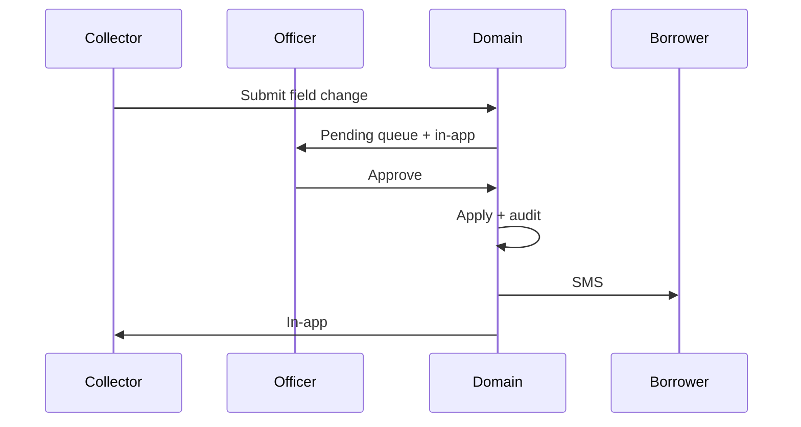

# WILMS v1.8.0 — Final Quality & Market-Readiness Report

**Version:** v1.8.0 (unchanged)  
**Branch:** `feature/v1.8.0-final-quality-market-readiness`  
**Base:** `main` at `87b844a`  
**Classification:** Confidential  
**Audience:** Product, operations, engineering, executive review  
**Date:** 13 August 2026

This sprint did not add major product modules. It corrected critical workflow defects, strengthened data integrity, and aligned documents and communications with market-ready standards.

---

## Verdict

**Recommend merge into `main` after human review of the guarantor rule, borrower-update queue, and branded exports.**

Priority 0 and Priority 1 items are implemented. Type-check, lint, unit tests, and production build passed on this branch. Remaining work is polish and a few documented gaps, not blockers for the guarantor, review, identity, GPS, update-request, or SMS work.

---

## Definition of done

| Criterion | Status |
|-----------|--------|
| Guarantors may cover up to three active borrowers | Met |
| Duplicate only for the same borrower / same active registration | Met |
| Registration review shows community and city | Met |
| Approver review shows the same location cascade | Met |
| Borrower and loan documents use readable IDs | Met |
| Export file names are branded (`WILMS_…`, hyphens preserved in IDs) | Met |
| Printed documents use readable identifiers, headers, footers, page numbers | Met |
| Group collections capture GPS (or confirmed exception) | Met |
| Collectors request borrower updates; they cannot edit records directly | Met |
| Update requests follow approval, apply, audit, and notifications | Met |
| SMS is mandatory for borrower communications unless system-wide SMS is disabled | Met |
| Registration address fields and community dropdown use opaque card surfaces | Met |
| Dashboard tiles use opaque card surfaces (targeted pass) | Met (light) |
| Tests and build pass | Met |
| Documentation pack complete | Met |

---

## Priority 0 — Workflow and data integrity

### A. Guarantor limit

A second **different** borrower is no longer treated as a duplicate. Duplicate means the **same borrower** (phone or national ID) with an active registration.

| Active guarantees (other borrowers) | Outcome |
|-------------------------------------|---------|
| 0, 1, or 2 | Allowed |
| 3 | Blocked (`AT_LIMIT`) |
| Same borrower, active registration | Blocked (`DUPLICATE`) |

Active slot statuses: `PENDING`, `APPROVED`, `AT_RISK`, `DEFAULTED`. `REJECTED` and `BLACKLISTED` do not occupy a slot. Ghana numbers `024…` and `+233…` match.

There is **no** unique database constraint on guarantor phone (intentional). Domain `registerBorrower` re-evaluates eligibility before persist.

Detail: [GUARANTOR_LIMIT_FIX.md](./GUARANTOR_LIMIT_FIX.md).

### B–C. Location cascade on review screens

Registration review and Approver application review both render:

Region → MMDA / District → Sub-District Unit → Electoral Area → Community / Suburb → City / Town (omitted when it equals the community).

Helper: `apps/frontend/src/utils/location-hierarchy.ts`. Shared component: `BorrowerReviewProfile`.

Detail: [LOCATION_REVIEW_UI_UPDATE.md](./LOCATION_REVIEW_UI_UPDATE.md).

---

## Priority 1 — Identity, GPS, updates, SMS

### Readable IDs and branded exports

| Entity | Pattern | Example |
|--------|---------|---------|
| Borrower | `BRW-YYYY-NNNNN` | `BRW-2026-00417` |
| Loan | `LN-YYYY-NNNNN` | `LN-2026-00124` |
| Collector (print) | Name and code | `Kwame Mensah (COL-012)` |

File names use `WILMS_` prefix. Official IDs and ISO dates keep hyphens.

Example: `WILMS_Borrower_Profile_Gloria_Serwaa_BRW-2026-00417.pdf`

Details: [DOCUMENT_ID_STANDARD.md](./DOCUMENT_ID_STANDARD.md), [EXPORT_BRANDING_GUIDE.md](./EXPORT_BRANDING_GUIDE.md).

### Group collection GPS

Group collection recording stores latitude, longitude, accuracy, timestamp, collector ID, and device metadata when available. If GPS is unavailable the collector must confirm and record a reason; the exception is audited (`collection.gps-exception`). Payment log, borrower profile export, and GPS summary surfaces show the capture.

Detail: [GROUP_COLLECTION_GPS.md](./GROUP_COLLECTION_GPS.md).

### Borrower update requests

Collectors submit a request. Registration Officers and Super Admins approve or reject. The change is applied, audited, and notified (SMS to the borrower; in-app for staff). Requesters cannot approve their own request.

Queues:

- Collector: `/collector/borrower-updates`
- Officer: `/officer/borrower-updates`
- Super Admin: `/borrower-updates`

Migration: `0044_v180_borrower_update_requests.sql`.

Detail: [BORROWER_UPDATE_REQUEST_WORKFLOW.md](./BORROWER_UPDATE_REQUEST_WORKFLOW.md).

### Mandatory borrower SMS

SMS is required for borrower communications unless system-wide SMS is disabled for an outage. Delivery failures are logged and do not roll back the financial event. Borrower update approved/rejected SMS is wired in this sprint; the broader lifecycle was already present.

Detail: [BORROWER_SMS_POLICY.md](./BORROWER_SMS_POLICY.md).

---

## Priority 2–3 — UI polish and accessibility

- Home and business address fields: dark `bg-card` textarea, 120-character limit, labels, readable placeholders.
- Community search: opaque `bg-card`, `z-50`, keyboard navigation, hover and active states.
- Super Admin and collector dashboard tiles: opaque card surfaces (no translucent overlays on those tiles).
- Accessibility: combobox roles on location search, `aria-invalid` and focus rings on textareas. This is an improvement pass, not a full WCAG certification.

---

## Validation evidence

Run on 13 August 2026, local Windows, Node 22 workspaces.

| Gate | Command | Result |
|------|---------|--------|
| Type-check | `npm run type-check` | Passed (frontend + domain) |
| Lint | `npm run lint` | Passed — no ESLint warnings or errors |
| Frontend tests | `npm run test` | Passed — shard 1: 98 files / 281 tests; shard 2: 97 files / 277 tests (**558 tests**) |
| Domain tests | `npm run test -w @wilms/domain` | Passed — 95 files / **311 tests** |
| Production build | `npm run build` | Passed — Next.js 14.2.35 compiled; 69 static pages generated |

### Targeted coverage added or updated this sprint

| Area | Evidence |
|------|----------|
| Guarantor limit / duplicate / multi-borrower | Domain `guarantor-eligibility.test.ts` (8); frontend mock eligibility tests |
| Location cascade | `location-hierarchy.test.ts`; `PendingApplicationReview.test.tsx` |
| Readable IDs | `display-ids.test.ts`; `api-config.test.ts` |
| Branded file names | `export-filename.test.ts` |
| Group GPS | `gps.test.ts`; group collection sheet GPS confirmation |
| Borrower updates | Domain `borrower-updates/lifecycle.test.ts` (create, approve, reject, audit, SoD) |
| SMS wiring | `borrower-communication-wiring.test.ts` (update approved/rejected) |
| Community dropdown | `LocationAutocomplete.test.tsx` (keyboard + opaque `bg-card` / `z-50`) |

---

## Migrations

| File | Purpose |
|------|---------|
| `packages/domain/src/db/migrations/0044_v180_borrower_update_requests.sql` | `borrower_update_requests` table, FKs, indexes |

Apply with the existing domain migrate command after merge (`npm run db:migrate -w @wilms/domain`). Forward-only.

No guarantor unique constraint was added (would incorrectly block the three-borrower rule).

---

## Unresolved issues (non-blocking)

1. **Payment log collector column** may still show an internal collector ID when the payment record has no staff display name. Printed collector labels are used where the name and code are available.
2. **Reconciliation and executive report grids** do not add a dedicated GPS column on every screen; GPS is on payment detail, payment log, group collection, audit exception, and borrower profile export.
3. **Some list CSV names** remain generic after branding (`WILMS_borrowers.csv`, `WILMS_audit-log.csv`) rather than entity-ID names. Borrower profile, loan schedule, group profile, registration, and statement patterns follow the official examples.
4. **Dashboard and WCAG work** is a targeted pass (opaque cards, contrast, keyboard on community search). A full board-level visual audit and WCAG 2.2 AA certification were not in this sprint’s critical path.
5. **Historical guarantor records** follow the same count rules at evaluation time. No data rewrite was required because there was no unique phone constraint.
6. **Version remains v1.8.0** by instruction. Do not bump the tag for this branch.

---

## Documentation updated

Sprint pack under `docs/v1.8.0/market-readiness/`:

- GUARANTOR_LIMIT_FIX.md
- LOCATION_REVIEW_UI_UPDATE.md
- BORROWER_UPDATE_REQUEST_WORKFLOW.md
- DOCUMENT_ID_STANDARD.md
- EXPORT_BRANDING_GUIDE.md
- GROUP_COLLECTION_GPS.md
- BORROWER_SMS_POLICY.md
- FINAL_V180_MARKET_READINESS_REPORT.md (this file)

Canonical books also received v1.8.0 addenda (Product Book, BRD, Operations Manual, Developer Guide, Technical Architecture, Product Dossier), including Documentation Centre copies under `apps/frontend/public/documentation/`.

---

## Merge recommendation

1. Review this branch (do not commit to `main` directly).
2. Confirm migration `0044` is applied in staging before production.
3. Smoke: register a second borrower against a guarantor who already has one active guarantee; confirm registration and approver review show community and city; export a borrower profile and confirm `BRW-` ID and `WILMS_…pdf` name; record a group collection with GPS denied and a reason; submit a borrower update request and approve it; confirm SMS attempt is logged.
4. Merge to `main` and deploy. Remain on **v1.8.0**.
