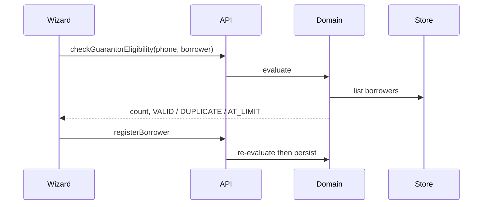

# Guarantor Limit Fix

**Version:** v1.8.0  
**Classification:** Confidential  
**Audience:** Product, operations, engineering

---

## Problem

The registration wizard treated a second **different** borrower as a duplicate whenever a guarantor already had one active guarantee. The banner showed:

> Current Guarantees: 1 of 3 · DUPLICATE

That blocked valid multi-borrower guarantees.

## Required rule

| Active guarantees | Outcome |
|-------------------|--------|
| 0 | Allowed |
| 1 | Allowed for a **different** borrower |
| 2 | Allowed for a **different** borrower |
| 3 | Blocked (`AT_LIMIT`) |
| Same borrower / same active registration | Blocked (`DUPLICATE`) |

Active statuses that occupy a slot: `PENDING`, `APPROVED`, `AT_RISK`, `DEFAULTED`.  
Rejected and blacklisted registrations do **not** occupy a slot.

Duplicate means the **same borrower** (matched by phone or national ID), not merely the same guarantor phone.

Phone matching normalises Ghana formats (`024…` and `+233…`).

## Layers updated

| Layer | Behaviour |
|-------|-----------|
| Domain `evaluateGuarantorEligibility` | Count other active borrowers; duplicate only for same applicant |
| Domain `registerBorrower` | Rejects ineligible guarantors |
| Frontend mock eligibility | Same rules |
| Registration wizard | Passes borrower ID number; shows accurate count and message |
| Database | No unique constraint on guarantor phone (intentional) |

## Sequence

## Tests

- 0, 1, and 2 active guarantees allowed
- 3 active guarantees blocked
- Same borrower treated as duplicate
- Different borrower allowed
- Ghana phone normalisation
- Rejected / blacklisted excluded from the count
