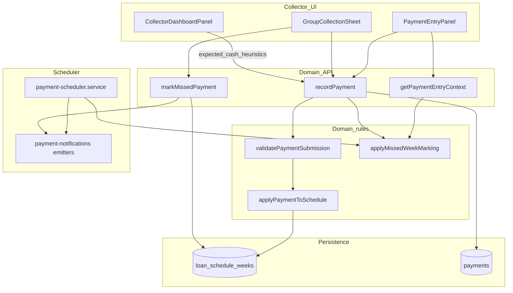
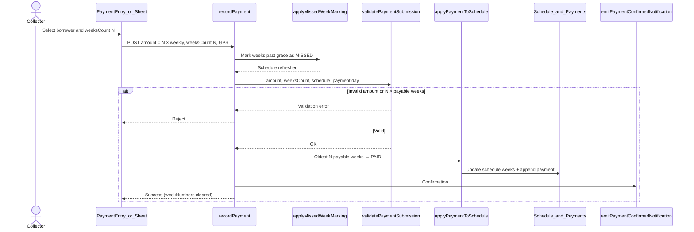
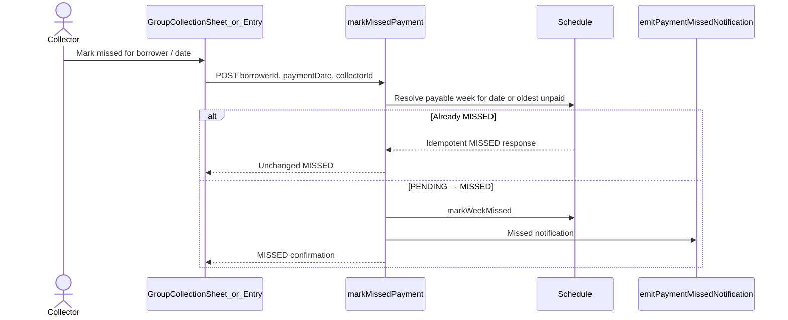
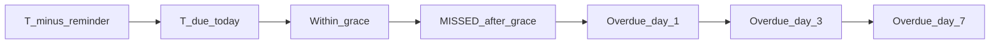

# Collector Payment Architecture Review

**Product version:** 1.8.0  
**Scope:** Collector payment recording, schedule allocation, missed-week marking, expected cash, and notification escalation  
**Language:** British English  
**Status:** Architecture review (codebase audit; no behaviour change implied by this document)

---

## Executive summary

WILMS already operates a **schedule-backed weekly collection engine**: each loan week is `PENDING`, `MISSED`, or `PAID`; grace-aware missed marking and a payment notification scheduler are in production use; collectors record payments through domain services with idempotency and GPS requirements.

What is **not** yet end-to-end for field multi-week catch-up is the full product surface: allocation helpers are being extended for `weeksCount`, but collector UI and several expected-cash / dashboard paths still assume **one weekly installment**. The group collection sheet exposes `DOUBLE` / `PARTIAL` / `ADVANCE` modes that the API rejects. Grace settings and the overdue notification ladder (days 1 / 3 / 7 past due) are related but not yet presented as a single T−1…T+7 product timeline.

This review inventories what exists, names the integration gaps for phased work, and documents target sequences for multi-week payment and mark-missed flows.

---

## Evidence sources

| Area | Path |
|------|------|
| Allocation / payable weeks | `packages/domain/src/domain/payment/allocation.ts` |
| Payment service | `packages/domain/src/modules/payments/service.ts` |
| Payment routes | `packages/domain/src/modules/payments/routes.ts` |
| Missed-week marking | schedule repository `applyMissedWeekMarking` (used from payments + scheduler) |
| Payment scheduler | `packages/domain/src/modules/notifications/payment-scheduler.service.ts` |
| Notification emitters | `packages/domain/src/infrastructure/notifications/payment-notifications.ts` |
| Expected cash (recon) | `packages/domain/src/domain/reconciliation/expected-cash.ts` |
| Collector payment UI | `apps/frontend/src/features/payment-collection/components/PaymentEntryPanel.tsx` |
| Group sheet UI | `apps/frontend/src/features/payment-collection/components/GroupCollectionSheet.tsx` |
| Collector dashboard expected amounts | `apps/frontend/src/features/payment-collection/collector-dashboard.utils.ts` |

---

## Current architecture

---

## What exists today

### Schedule week statuses

Each repayment week on an active loan schedule has one of:

| Status | Meaning |
|--------|---------|
| `PENDING` | Not yet paid; may become payable when `dueDate ≤ referenceDate` |
| `MISSED` | Past grace (or explicitly marked); still payable (oldest-first) |
| `PAID` | Cleared; not payable |

**Payable rule** (`isWeekPayable` / `getPayableWeeks`):

- `PAID` → not payable  
- `MISSED` → payable  
- `PENDING` and `dueDate ≤ referenceDate` → payable  
- Ordered oldest-first by `weekNumber`

### Grace-aware missed marking

`applyMissedWeekMarking` uses system setting **`latePaymentGraceDays`** (default **3**). A week is not marked `MISSED` until `dueDate + graceDays < referenceDate`.

Triggered from:

- `getPaymentEntryContext` (when opening payment entry)
- `recordPayment` (before validation / allocation)
- `payment-scheduler.service` (batch scan of active loans)

### Allocation domain (`allocation.ts`)

| Function | Role |
|----------|------|
| `validatePaymentSubmission` | Exact amount vs weekly installment; no partial / overpayment / advance; weekday / due-date rules; optional **`weeksCount`** (default 1) |
| `applyPaymentToSchedule` | Marks oldest payable week(s) `PAID`; optional **`weeksCount`** (default 1) |
| `getOldestPayableWeeks` | Slice of payable weeks for multi-week allocation |
| `computeGraceAndEscalation` | Levels: `NONE` / `DUE` / `GRACE` / `OVERDUE` / `ESCALATED` |
| `countConsecutiveMissedWeeks` | Consecutive unpaid past-due / missed count |

**Note:** `weeksCount` support is present in the allocation helpers and on `recordPaymentSchema`; full wiring through `postPayment` and collector UI is an integration point (see gaps).

### Payment service (`payments/service.ts`)

| API | Behaviour |
|-----|-----------|
| `getPaymentEntryContext` | Active loan, grace marking, obligation weeks, required amount, can-accept flags |
| `recordPayment` | Idempotent `PAYMENT_POST`; GPS required; duplicate check; validate → allocate → ledger / balance / confirmation notification |
| `markMissedPayment` | Idempotent `PAYMENT_MISSED_MARK`; marks payable week `MISSED`; emits missed notification |

### Payment notification scheduler

`payment-scheduler.service.ts` (HTTP-triggered, idempotent via delivery dedupe):

| Job | Behaviour |
|-----|-----------|
| Due soon | `PENDING` weeks with `dueDate = referenceDate + paymentReminderDaysBefore` |
| Due today | `PENDING` weeks with `dueDate = referenceDate` |
| Missed mark + notify | `applyMissedWeekMarking` then `emitPaymentMissedNotification` |
| Overdue ladder | Days past due **1 / 3 / 7** → `emitPaymentOverdueLadderNotification` |
| Admin summary | `emitAdminMissedPaymentSummary` when any newly missed events occurred |

Emitters live in `payment-notifications.ts` (SMS gated in part by `missedPaymentSmsEnabled` and global SMS settings).

### Settings relevant to collections

| Setting | Default / role |
|---------|----------------|
| `latePaymentGraceDays` | Default 3 — when weeks become `MISSED` |
| `paymentReminderDaysBefore` | Lead days for due-soon reminders |
| `missedPaymentSmsEnabled` | Gates missed / overdue SMS alongside global SMS enablement |

### Collector UI vs API

| Surface | Current behaviour |
|---------|-------------------|
| `PaymentEntryPanel` | **Single-week** collection entry |
| `GroupCollectionSheet` | UI modes `NORMAL` / `DOUBLE` / `PARTIAL` / `ADVANCE` — **API rejects** partial, overpayment, and advance (and double is not a first-class multi-week allocation path) |
| Expected cash | Often **one weekly installment** — collector portal / dashboard utils and `expected-cash.ts` reconcile around schedule dues or payment-day fallback of a single weekly amount |

### Related fix (out of payment core)

Approver **Assign Group** was fixed separately (borrower identity / `borrowerId` alignment). It is noted here only as adjacent workflow hygiene, not as part of the payment allocation engine.

---

## Product rules confirmed in code

| Rule | Enforcement |
|------|-------------|
| No partial payments | `validatePaymentSubmission` — amount must equal `weeksCount × weeklyPaymentPesewas` |
| No overpayment (single week) | Explicit message when `weeksCount === 1` and amount &gt; weekly |
| No advance payments | Reject when no payable week (`dueDate ≤ referenceDate` / missed) |
| Oldest-first allocation | `getPayableWeeks` sorted by `weekNumber` |
| GPS required to record | `postPayment` validation |
| Idempotent posts | `runWithIdempotency` scopes `PAYMENT_POST` / `PAYMENT_MISSED_MARK` |

---

## Gaps and integration points (phased work)

These are the deliberate extension points for subsequent phases. Do not treat UI labels or sheet modes as shipped behaviour unless the domain API accepts them.

| # | Gap | Current state | Target integration |
|---|-----|---------------|--------------------|
| 1 | **Multi-week N× weekly allocation** | Helpers accept `weeksCount`; service path still centres on one week in practice; UI is single-week | End-to-end: schema → `validatePaymentSubmission` / `applyPaymentToSchedule` with `weeksCount` → one payment of `N × weekly` clearing N oldest payable weeks |
| 2 | **Schedule-aware expected collections** | `expected-cash.ts` sums schedule dues for the recon date (or one weekly payment-day fallback); dashboards often use one installment | Expected collections should reflect payable / due schedule weeks (including multi-week arrears catch-up expectations where product defines them) |
| 3 | **Payment UI multi actions + mark missed** | Entry panel single-week; sheet modes diverge from API; mark missed exists in service / sheet utilities | Unified collector actions: pay 1…N weeks, mark missed, aligned to API contracts |
| 4 | **Grace / escalation ladder alignment T−1…T+7** | Grace days (default 3) for MISSED; reminders via `paymentReminderDaysBefore`; overdue emitters at 1 / 3 / 7 past due; `computeGraceAndEscalation` uses a separate level model | Present and operate as one coherent timeline from pre-due reminder through grace and ladder |
| 5 | **Dashboard / report parity** | Collector expected amounts and recon formulas lean on single-installment assumptions | Dashboards and reports must match schedule allocation and multi-week payments once shipped |

### Suggested phase grouping

| Phase theme | Primary gaps |
|-------------|--------------|
| Domain multi-week payment | Gap 1 |
| Collector UX (pay N + mark missed) | Gap 3 |
| Expected cash & recon | Gap 2 |
| Timeline / notifications productisation | Gap 4 |
| Dashboard & reporting parity | Gap 5 |

---

## Target sequence: multi-week payment

Intended flow once Gap 1 (and UI Gap 3) are closed. Amount must equal **N × weekly installment**; allocation is always oldest payable first.

**Allocation sketch**

| Input | Effect |
|-------|--------|
| `weeksCount = 1` | Clear oldest payable week; amount = 1 × weekly |
| `weeksCount = N` | Clear oldest N payable weeks; amount = N × weekly |
| `N > payable.length` | Reject |
| No payable weeks | Reject (advance not allowed) |

---

## Target sequence: mark missed

Collector-initiated mark missed already exists in the service layer; UI alignment is Gap 3. Scheduler-driven marking remains the automated path after grace.

**Automated path (scheduler)** — independent of collector action:

1. Scan active loans.  
2. `applyMissedWeekMarking(loanId, referenceDate, latePaymentGraceDays)`.  
3. For each newly missed week → `emitPaymentMissedNotification`.  
4. For weeks past due at ladder days 1 / 3 / 7 → overdue ladder emitters.  
5. If any newly missed → admin summary.

---

## Grace and escalation timeline (alignment target)

Current mechanics are listed separately so phases can unify product messaging to **T−1 … T+7** without inventing new emitters prematurely.

| Relative day | Existing mechanism | Notes |
|--------------|-------------------|--------|
| T−`paymentReminderDaysBefore` | Due-soon notification | Setting-driven lead (commonly 1 → T−1) |
| T (due date) | Due-today notification; week still `PENDING` until paid or grace expires | Payable on/after due date |
| T+1 … T+`latePaymentGraceDays` | Still within grace for auto-MISSED; `computeGraceAndEscalation` → `GRACE` | Default grace = 3 |
| Past grace | Auto `MISSED` via `applyMissedWeekMarking` | Also collector `markMissedPayment` |
| Days past due 1, 3, 7 | Overdue ladder notifications | Ladder is **calendar days past due**, not necessarily “days after grace” |

**Gap 4** is to align settings, UI copy, scheduler thresholds, and `computeGraceAndEscalation` so operators and collectors see one coherent ladder.

---

## Expected cash and dashboard parity

| Component | Today | Parity need |
|-----------|--------|-------------|
| `calculateExpectedDuePesewas` | Schedule dues on recon date + payment-day weekly fallback | Remain schedule-first; ensure multi-week payments do not double-count or under-state expected vs recorded |
| Collector dashboard utils | `expectedPesewas: loan.weeklyPaymentPesewas` style heuristics | Reflect obligations actually due / payable for the collection context |
| Reports | Downstream of recorded payments and schedule status | Must consume the same allocation outcomes as collector flows |

---

## Risk summary

| Risk | Severity | Mitigation direction |
|------|----------|----------------------|
| Sheet modes (`DOUBLE` / `PARTIAL` / `ADVANCE`) imply unsupported behaviour | High (field confusion) | Gate or remove modes until API accepts equivalent contracts; prefer explicit `weeksCount` |
| Partial wiring of `weeksCount` (helpers vs service vs UI) | High | Ship domain + API + UI in one vertical slice |
| Expected cash stays one-week while payments clear N weeks | Medium | Schedule-aware expected collections (Gap 2) with dashboard parity (Gap 5) |
| Grace vs overdue ladder interpreted differently by ops | Medium | Single T−1…T+7 product timeline (Gap 4) |

---

## Out of scope for this review

- Payment reversal / edit flows (separate services)  
- Offline queue durability (covered under offline architecture documentation)  
- Non-weekly repayment cadences beyond the weekly installment model assumed by collector collection UX  
- Invented product features not present in the audit list above  

---

## Related documentation

| Document | Relevance |
|----------|-----------|
| `docs/advanced-lending.md` | Grace period and schedule context |
| `docs/synchronization-guide.md` | Payment apply path after sync |
| `documentation/offline/ARCHITECTURE_DISCOVERY_REPORT.md` | Offline / confirmation notification constraints |
| `packages/domain/src/domain/payment/allocation.ts` | Source of truth for payable and allocation rules |

---

*End of collector payment architecture review — WILMS 1.8.0*
