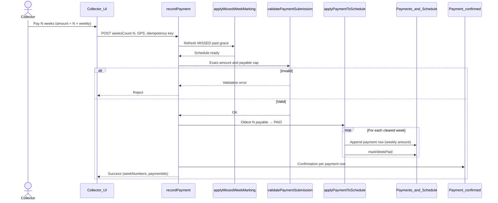

# Payment Allocation Design

**Product version:** 1.8.0  
**Scope:** Multi-week oldest-first allocation, payment row model, `weeksCount`, idempotency, and mark-missed semantics  
**Language:** British English  
**Status:** Design specification

---

## Purpose

Define how a collector payment clears one or more schedule weeks when a borrower is catching up arrears. Allocation is schedule-backed, oldest-first, and exact-amount only. Marking a week missed is a **schedule event**, not a payment.

Related: `COLLECTOR_PAYMENT_ARCHITECTURE_REVIEW.md`, `GRACE_PERIOD_SPECIFICATION.md`.

---

## Core rules

| Rule | Behaviour |
|------|-----------|
| Exact amount | `amountPesewas` must equal `weeksCount × weeklyPaymentPesewas` |
| No partial | Amount below one weekly installment is rejected |
| No overpayment | Amount above the requested N weeks is rejected |
| No advance | If no payable week exists for the payment date, reject |
| Oldest-first | Clear the oldest payable weeks by ascending `weekNumber` |
| GPS required | Collection posts require latitude / longitude |
| Mark missed ≠ payment | `markMissedPayment` updates schedule status only; no payment row |

---

## Payable weeks

A schedule week is **payable** when:

| Status | Payable? |
|--------|----------|
| `PAID` | No |
| `MISSED` | Yes |
| `PENDING` and `dueDate ≤ paymentDate` | Yes |

Payable weeks are sorted oldest-first (`weekNumber` ascending). Domain helpers: `isWeekPayable`, `getPayableWeeks`, `getOldestPayableWeeks` in `packages/domain/src/domain/payment/allocation.ts`.

---

## `weeksCount`

| Field | Contract |
|-------|----------|
| Name | `weeksCount` |
| Type | Positive integer, range 1–52 |
| Default | `1` when omitted |
| Effect | Number of oldest payable weeks to clear in one collector action |
| Amount | Must equal `weeksCount × weeklyPaymentPesewas` |
| Cap | Must not exceed the count of currently payable weeks |

**Examples**

| Payable weeks (oldest → newest) | `weeksCount` | Amount (weekly = ₵50) | Weeks cleared |
|---------------------------------|--------------|------------------------|---------------|
| W30, W31, W32 | 1 | ₵50 | W30 |
| W30, W31, W32 | 2 | ₵100 | W30, W31 |
| W30, W31 | 4 | — | Rejected (`Only 2 payable week(s) available`) |

---

## N payment rows (persistence model)

A multi-week catch-up is **one collector action** but **N payment rows** in persistence:

| Aspect | Behaviour |
|--------|-----------|
| Request | Single `recordPayment` with total `amountPesewas` and `weeksCount = N` |
| Persistence | One payment row per cleared week, each for the **weekly** installment |
| Schedule | Each targeted week marked `PAID` |
| Ledger / pool | One repayment allocation per week / payment id |
| Response | Aggregates `weekNumbers`, `weeksCount`, `paymentIds`; primary `id` is the first payment |

This keeps schedule ↔ payment 1:1 for audit and reconciliation while allowing field UX to record a catch-up in one step.

---

## Allocation sequence

---

## Idempotency

| Mechanism | Scope |
|-----------|-------|
| `runWithIdempotency` | Scope `PAYMENT_POST` — safe retry of the same collector post |
| Schedule version checks | `markWeekPaid` expects current week version |
| Duplicate guard (single week) | Same borrower / date / amount rejected when `weeksCount === 1` |
| Already `PAID` weeks | Multi-week loop rejects if a target week is already paid |

Retries with the same idempotency key must not create additional payment rows or double-clear weeks.

---

## Mark missed is a schedule event

| Concern | Payment | Mark missed |
|---------|---------|-------------|
| API | `recordPayment` | `markMissedPayment` |
| Idempotency scope | `PAYMENT_POST` | `PAYMENT_MISSED_MARK` |
| Creates payment row? | Yes (N rows for N weeks) | **No** |
| Schedule effect | Week(s) → `PAID` | Week → `MISSED` |
| Cash / ledger | Repayment posted | None |
| Notification | Payment confirmed | Missed payment alert |

Automated missed marking after grace (`applyMissedWeekMarking`) is also a schedule event, driven by the payment notification scheduler — see `GRACE_PERIOD_SPECIFICATION.md` and `SCHEDULER_EXTENSION_SPECIFICATION.md`.

---

## Validation summary

| Check | Outcome when failed |
|-------|---------------------|
| `weeksCount` not a positive integer | Reject |
| Amount ≠ `weeksCount × weekly` | Reject (with partial / overpayment messaging when N = 1) |
| Zero payable weeks | Reject (advance not allowed) |
| `weeksCount` > payable length | Reject |
| Payment day / due-date weekday rules | Reject when outside allowed collection day |

---

## Source of truth

| Area | Path |
|------|------|
| Allocation helpers | `packages/domain/src/domain/payment/allocation.ts` |
| Payment service | `packages/domain/src/modules/payments/service.ts` |
| Routes / schema | `packages/domain/src/modules/payments/routes.ts` |
| Domain tests | `packages/domain/src/tests/payment/multi-week-allocation.test.ts` |

---

*End of payment allocation design — WILMS 1.8.0*
