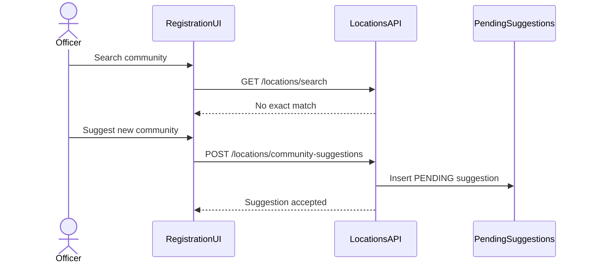

# Community Suggestion Workflow

**Product version:** 1.8.0  
**Language:** British English

## Rule

Registration officers must never insert communities directly into the master tables.

## Flow



## Statuses

| Status | Meaning |
|--------|---------|
| `PENDING` | Awaiting review |
| `APPROVED` | Eligible to be promoted into `communities` by an admin import/review process |
| `REJECTED` | Not accepted |

## API

`POST /api/v1/locations/community-suggestions`

Body:

```json
{
  "districtId": "uuid",
  "proposedName": "New Community Name"
}
```
