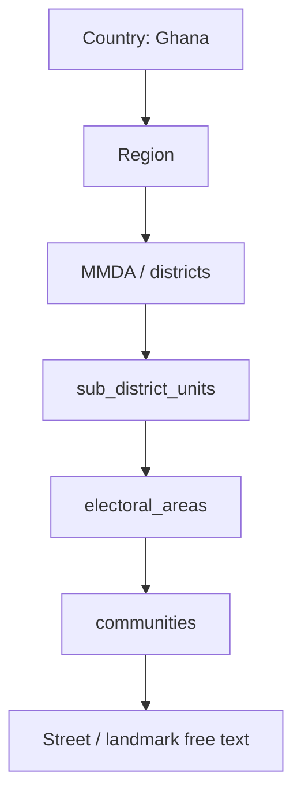

# Ghana Administrative Model

**Product version:** 1.8.0  
**Language:** British English

## Canonical stack

All master tables use UUID primary keys, provenance (`source`, `source_id`, `dataset_version`), and `is_active`.

Skip behaviour:

- No sub-district units → continue to electoral areas or communities.
- No electoral areas → continue to district communities.
- No community match → suggestion queue (Super Admin approval only).

Street and landmark remain free text on the borrower profile (`houseAddress`).
