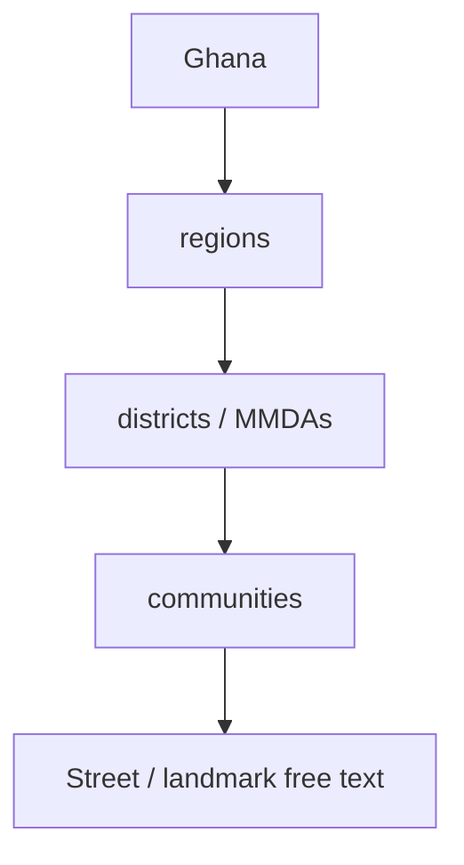
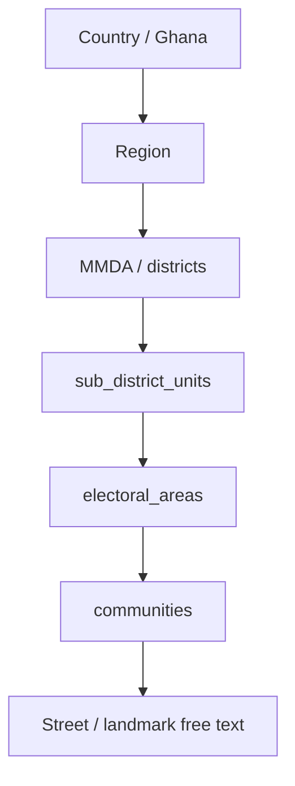

# Ghana Administrative Hierarchy v2 — Architecture Review

**Product version:** 1.8.0  
**Branch:** `feature/v1.8.0-ghana-admin-hierarchy-v2`  
**Language:** British English  
**Status:** Phase 1 audit (completed before schema work)

---

## Executive summary

WILMS v1.8.0 already has a canonical location master from the previous sprint: `regions` → `districts` (MMDAs) → `communities`, with nullable foreign keys on borrowers, groups, and collectors. That model is sufficient for registration and reporting at three levels, but it cannot represent Ghana’s actual local-government stack: Sub-Metropolitan District Councils, Area / Zonal / Town / Urban Councils, and Electoral Areas.

This review records every location dependency before the v2 cutover. The upgrade is additive: new tables sit between district and community, existing text fields and v1 foreign keys remain, and incomplete national coverage at sub-district and electoral-area level is treated as a skippable cascade rather than invented master data.

---

## Current model (v1 location master)

| Table | Role | Key constraints |
|-------|------|-----------------|
| `regions` | 16 Ghana regions | Unique `code`, `name`, `(source, source_id)` |
| `districts` | MMDAs | Unique `(region_id, name)`, `(source, source_id)` |
| `communities` | Localities | Unique `(district_id, name)`, `(source, source_id)` |
| `pending_community_suggestions` | Review queue | Status `PENDING` / `APPROVED` / `REJECTED` |
| `location_sync_log` | Import audit | Source, version, row counts |
| `ghana_regions` / `ghana_districts` / `ghana_cities` | Legacy bundled tables | Kept; not deleted |

Operational FKs (nullable, text columns retained):

- `borrowers.region_id`, `district_id`, `community_id`
- `groups.community_id`
- `collectors.assigned_region_id`, `assigned_district_id`, `assigned_community_id`

---

## Target model (v2)

Skip rules (required for incomplete national datasets):

1. If an MMDA has no sub-district units, registration skips to electoral areas (or communities if those are also empty).
2. If an electoral area has no communities, the officer may suggest a community. Suggestions are never auto-created.
3. `electoral_areas.sub_district_unit_id` and `communities.electoral_area_id` are nullable so historical v1 rows remain valid.

---

## Foreign-key and historical-data constraints

| Consumer | Current coupling | v2 risk | Mitigation |
|----------|------------------|---------|------------|
| Borrower registration | Region / district / community names plus optional UUIDs | New cascade steps | Optional fields; existing names still required |
| Borrower profile JSON | `region`, `district`, `city` | New keys added, old keys kept | Soft add `subDistrictUnit`, `electoralArea` |
| Groups | `community` text + `community_id` | Unchanged | Backfill only when a community UUID exists |
| Collectors | Zone text + assigned region/district/community UUIDs | Need sub-unit and electoral assignment | New nullable columns; no rename of `zone` |
| Reports / intelligence | Community and district name filters | Need aggregation at every level | Join through location master when IDs exist; fall back to names |
| Offline PWA | IndexedDB snapshots for regions/districts/communities | Missing intermediate levels | New cache keys; hierarchy snapshot versioned |
| Search | `ilike` on names and community aliases | Need ranking + typo tolerance | Trigram indexes; keep `ilike` fallback |
| Legacy `ghana_*` tables | Bundled offline fallback | Must not break mock/demo | Keep as fallback when master tables are empty |

**Rollback:** migration `0042` is additive (`CREATE TABLE`, `ADD COLUMN`, indexes). It does not drop v1 tables, unique keys, or text columns. Reverting is `DROP` of new objects only.

**Migration sequencing:** `0041_v180_location_master` must already be applied. `0042` assumes `regions`, `districts`, and `communities` exist.

---

## Performance

| Risk | Why it matters | Control |
|------|----------------|---------|
| 261 MMDAs under 16 regions | District dropdowns grow | Server-side list by `region_id`; cache 5 minutes |
| Thousands of communities | Autocomplete latency | `pg_trgm` GIN indexes; search `limit` |
| Offline cache size | PWA IndexedDB | Cache per parent id, plus one compact hierarchy snapshot |
| Duplicate MMDAs on source swap | Unique `(region_id, name)` vs `(source, source_id)` | Upsert by normalised name within region; adapters do not own identity |

---

## Source-adapter rule

Application services must not import geoBoundaries, GADM, GSS, or OSM clients. Only `scripts/location-sync` adapters produce a normalised snapshot. Swapping GSS for geoBoundaries must not require schema changes.

---

## Coverage honesty

| Level | National coverage in this sprint | Source |
|-------|----------------------------------|--------|
| Regions | 16 / 16 | Existing seed + IMCCOD region grouping |
| MMDAs | 261 / 261 | [IMCCOD MMDA register](https://imccod.gov.gh/mmdas/) |
| Sub-district units | Partial — STMA three sub-metros verified; other MMDAs empty until a national sub-structure dataset is licensed | STMA / GNA |
| Electoral areas | Partial — STMA 36 electoral areas from the Assembly Members register | [STMA Assembly Members](https://stma.gov.gh/assembly-members.php) |
| Communities / suburbs | Partial — STMA sub-metro locality lists plus existing bundled communities | STMA sub-metro pages + existing seed |

Empty levels are a product behaviour (skip), not a data-quality failure.

---

## Implementation order

1. Additive schema and migration `0042`
2. Source-agnostic import pipeline
3. National MMDA upsert + STMA deep hierarchy
4. APIs, registration cascade, collector territory fields
5. Reporting aggregation, offline cache, GIS documentation
6. Tests and evidence
