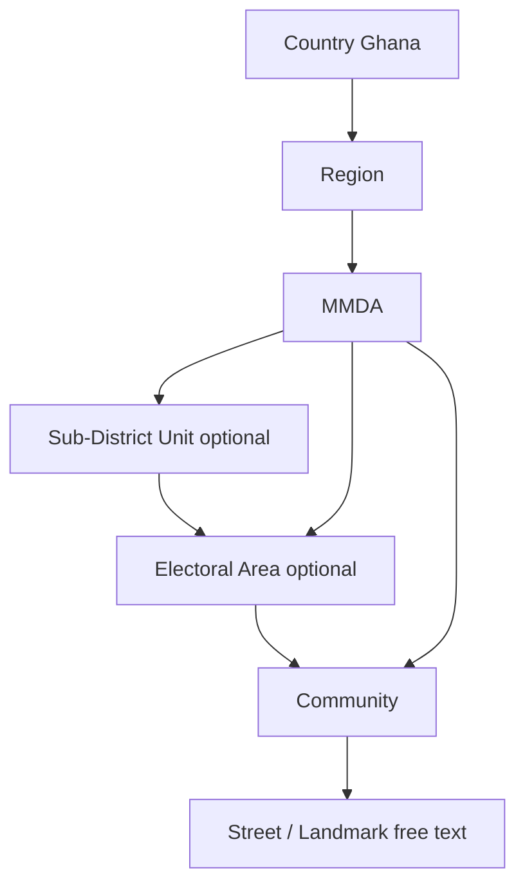

# Ghana Locality Architecture

**Product version:** 1.8.0  
**Language:** British English

## Design rules

1. Deeper levels may be empty; UI cascades skip empty lists.
2. Do not invent Area Councils or electoral areas.
3. Stable UUIDs are derived from `(source, sourceId)` — do not rename the IMCCOD/STMA source key.
4. HOTOSM communities use source `hotosm` and never invent electoral parents.
5. Alias resolution and trigram search sit on top of the location master.
