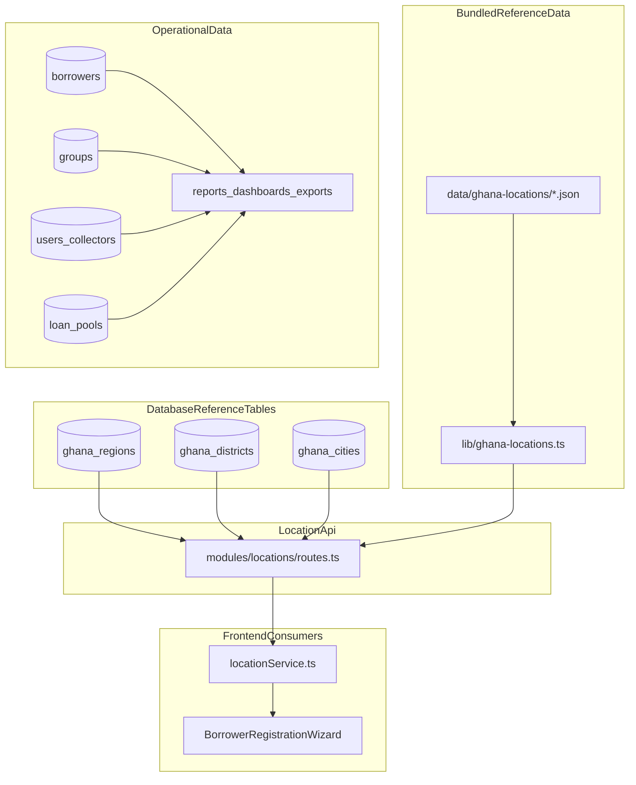

# Location Architecture Review

**Product version:** 1.8.0  
**Scope:** Ghana administrative location master migration, API cutover, offline support, reporting impact, and safe reset strategy  
**Language:** British English  
**Status:** Architecture review (codebase audit before implementation)

---

## Executive summary

WILMS already contains a partially normalised Ghana reference hierarchy, but it is not yet the authoritative source for the product. The existing `ghana_regions`, `ghana_districts`, and `ghana_cities` tables are only loosely integrated with operational data, while borrowers, groups, collectors, loan pools, dashboards, reports, and exports still depend primarily on denormalised location names stored as free text or nested profile fields.

The current setup is sufficient for a bundled reference lookup, but it is not yet safe for enterprise-grade master-data governance, repeatable imports, offline synchronisation, constituency analytics, or future GIS integration. The migration therefore needs to be staged: create a new canonical location master, preserve existing text relationships during backfill, ship compatibility reads, then progressively cut consumers over to the new hierarchy.

---

## Evidence sources

| Area | Path |
|------|------|
| Current location schema | `packages/domain/src/db/schema/ghana-locations.ts` |
| Current location migration | `packages/domain/src/db/migrations/0012_ghana_locations.sql` |
| Import script | `packages/domain/src/db/seed/import-ghana-locations.ts` |
| Bundled location fallback | `packages/domain/src/lib/ghana-locations.ts` |
| DB repository | `packages/domain/src/repositories/ghana-locations.repository.ts` |
| Runtime location routes | `packages/domain/src/modules/locations/routes.ts` |
| Registration UI consumer | `apps/frontend/src/features/borrower-registration/components/BorrowerRegistrationWizard.tsx` |
| Frontend service | `apps/frontend/src/services/locationService.ts` |
| Seed manifest | `data/ghana-locations/MANIFEST.md` |
| Offline snapshot persistence | `apps/frontend/src/lib/offline/offlineSnapshotStore.ts` |
| Query persistence | `apps/frontend/src/lib/query/collector-query-persister.ts` |
| Borrowers schema | `packages/domain/src/db/schema/borrowers.ts` |
| Groups schema | `packages/domain/src/db/schema/groups.ts` |
| Users / collectors schema | `packages/domain/src/db/schema/users.ts` |
| Loan pools schema | `packages/domain/src/db/schema/loan-pools.ts` |
| Risk flags schema | `packages/domain/src/db/schema/risk-flags.ts` |
| Enterprise workflow schema | `packages/domain/src/db/schema/enterprise-workflows.ts` |
| Reports and analytics consumers | `packages/domain/src/modules/reports/routes.ts`, `packages/domain/src/modules/intelligence/service.ts` |

---

## Current architecture

---

## What exists today

### Reference hierarchy

The repository currently models Ghana locations as:

| Table | Purpose | Notes |
|-------|---------|-------|
| `ghana_regions` | Region master | UUID PK, unique region code |
| `ghana_districts` | District/MMDA master | FK to region, name uniqueness within region |
| `ghana_cities` | Community-like lookup | FK to district, but still named `cities` in schema and APIs |

The basic parent-child structure is sound, but the model is too narrow for the requested enterprise master data because it lacks:

- provenance fields beyond `source` on cities
- alias support
- active/inactive lifecycle flags
- sync logs
- pending suggestion workflow
- stable import semantics across repeated runs

### Import and seed flow

The import script reads:

- `data/ghana-locations/regions.json`
- `data/ghana-locations/districts.json`
- `data/ghana-locations/cities.json`

The manifest explicitly documents that the current data is incomplete:

- all 16 regions are present
- districts are only a **48-sample MMDA subset**
- cities/communities are only **144 entries**
- some community names are sourced from OpenStreetMap fallback

That means the current dataset is not suitable as the final authoritative national hierarchy.

### Runtime API shape

The current runtime endpoints are:

- `GET /locations/regions`
- `GET /locations/regions/:id/districts`
- `GET /locations/districts/:id/cities`
- `GET /locations/search`
- `GET /locations/current`

These endpoints are not yet versioned and do not return dataset metadata such as source, version, or last-updated timestamps.

### Frontend location usage

The borrower registration flow is the primary current consumer. It:

- loads region, district, and city data through `locationService`
- stores selected values by **display name** in form state
- resolves UI dropdown selection by matching IDs from the location lookup but ultimately writes names

The frontend service also falls back to bundled mock-style data if the API request fails, which is useful for resiliency but means the product currently tolerates multiple ID spaces.

---

## Where locations are currently stored

### Canonical reference tables

| Table | Current relationship style |
|-------|----------------------------|
| `ghana_regions` | canonical reference |
| `ghana_districts` | canonical reference |
| `ghana_cities` | canonical reference, but conceptually should become `communities` |

### Operational entities using denormalised location values

| Area | Current location fields | Risk |
|------|-------------------------|------|
| Borrowers | `community` column plus `region`, `district`, `city` in profile payloads | High |
| Groups | free-text `community` | High |
| Users / collectors | `region`, `branch`, `zone`, `assignedRegion`, `assignedDistrict` | High |
| Loan pools | free-text `region` | Medium |
| Risk flags | free-text `community` | Medium |
| Holiday requests | optional free-text `community` | Medium |
| Enterprise workflows | `fromCommunity`, `toCommunity`, `fromDistrict`, `toDistrict` | Medium |

This is the main migration challenge: the authoritative hierarchy exists separately from the data that actually drives the product.

---

## API, reporting, and analytics impact

### APIs

The current location routes are thin read endpoints over DB-or-bundled fallback data. They do not yet support:

- metadata-rich responses
- community suggestion submissions
- sync-status visibility
- administrative inactive states
- alias search
- pagination or richer search facets

### Reports and dashboards

Reports and executive analytics still rely mainly on free-text `community` and `region` fields. This creates four concrete issues:

1. spelling drift can fragment aggregates
2. renamed communities cannot be safely reconciled historically
3. constituency or district analytics cannot be trusted without mapping
4. exports may not reflect a single official naming source

### Executive analytics caveat

The current executive intelligence flow accepts location-style filters, but the broader codebase still aggregates mostly off denormalised names. A location-master migration must therefore be treated as both a schema project and a reporting correctness project.

---

## Offline architecture today

Offline behaviour is currently closer to **bundled static fallback** than to **synchronised local master data**.

Current characteristics:

- location JSON is bundled into the app/runtime through `lib/ghana-locations.ts`
- the frontend can fall back to bundled locations when API reads fail
- existing offline storage persists broader UI/query state, but there is no dedicated versioned IndexedDB cache for the location hierarchy

Implication:

The requested offline-capable region -> district -> community master must add explicit caching, version tracking, and refresh logic rather than relying only on bundled fallback data.

---

## Import and ID risks

### Non-idempotent imports

The current importer generates fresh `uuidv7()` IDs on every run for regions, districts, and cities. The repository upserts use `id` as the conflict target, while codes and name constraints are also unique. This creates a high risk that repeat imports will fail or fork identities instead of behaving idempotently.

### Dual ID spaces

The bundled fallback logic creates slug IDs from names and codes, while DB rows use UUIDs. The runtime code already contains compatibility comments acknowledging that clients may hold slug IDs. This is a strong signal that the next master-data design must define a single canonical ID strategy and a compatibility bridge during migration.

### Search inconsistency

`searchGhanaLocations()` currently searches bundled districts and cities rather than a fully canonical DB-backed dataset. Post-import changes in the database would therefore not necessarily be reflected in search results.

---

## Migration impact inventory

### Directly impacted data domains

| Domain | Why it changes |
|--------|----------------|
| Registration | region/district/city selectors, validation, payload mapping |
| Borrower management | stored borrower location fields and edits |
| Group management | community/group aggregation and creation |
| Collector assignment | territory fields and future geographic ownership |
| Reporting | community/region-based aggregations |
| Executive dashboards | district/community filters and heat-map style summaries |
| Exports | official names and hierarchy labels |
| Offline | cached hierarchy, search, and suggestion flows |

### Backfill requirement classes

| Class | Strategy |
|-------|----------|
| Already matches canonical name | deterministic map to master row |
| Minor spelling variation | alias match or curated mapping |
| Legacy / unsupported locality | preserve text and route to pending suggestion or unresolved mapping log |
| Historical workflow reference | keep historical text while linking to a canonical FK when possible |

---

## Recommended migration strategy

1. Add the new location-master tables alongside the old `ghana_*` tables.
2. Build an idempotent importer with source/version metadata and sync logs.
3. Introduce new FK-capable columns or mapping tables for borrowers, groups, and collector territory data.
4. Backfill records while preserving the current text fields for read compatibility.
5. Refactor APIs to versioned `/api/v1/locations/*` responses with metadata.
6. Cut frontend selectors over from `city` to `community`.
7. Add IndexedDB-backed location cache and refresh semantics.
8. Update reporting, exports, and executive analytics to prefer canonical joins.
9. Remove old tables and compatibility paths only after validation evidence is complete.

---

## Rollback considerations

Rollback must remain possible until all compatibility reads are removed. The safest rollback posture is:

- keep legacy text fields during the transition
- keep old location routes as shims while frontend rollout completes
- log unmapped or ambiguous backfill cases
- avoid destructive removal of `ghana_*` tables until validation confirms parity

For database reset operations, preserve:

- `users`
- migration history
- auth/reference tables required for role access and sign-in continuity

A literal users-only wipe would break operational access control.

---

## Key findings

1. The current Ghana location dataset is incomplete and not suitable as the final authoritative national hierarchy.
2. Operational records are still denormalised, so migration success depends more on mapping/backfill than on the new schema alone.
3. Imports are not yet safely repeatable because IDs are regenerated per run.
4. Offline location support is currently bundled fallback, not synchronised cached master data.
5. Reporting and analytics must be updated as part of the migration or location totals will remain inconsistent.

---

## Implementation guidance for this sprint

The location master sprint should prioritise:

1. schema and import correctness
2. compatibility mapping for borrower/group/collector data
3. API and frontend cutover to `community`
4. offline cache/version support
5. reporting and export correctness

The sprint should not assume that replacing seed JSON alone is sufficient.
