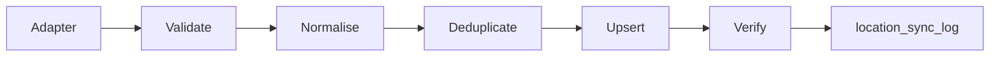

# Location Import Pipeline

**Product version:** 1.8.0  
**Language:** British English



Adapters live in `scripts/location-sync/adapters/` and are selected with `WILMS_LOCATION_ADAPTER` (`gss`, `geoboundaries`, `gadm`, `osm`). Application modules never import an adapter.

Commands:

```bash
npm run db:apply:ghana-hierarchy -w @wilms/domain
npm run seed:ghana-hierarchy -w @wilms/domain
```

Identity for MMDAs is the existing UUID when a normalised name already exists in the region, so borrower and collector foreign keys survive a source swap.
