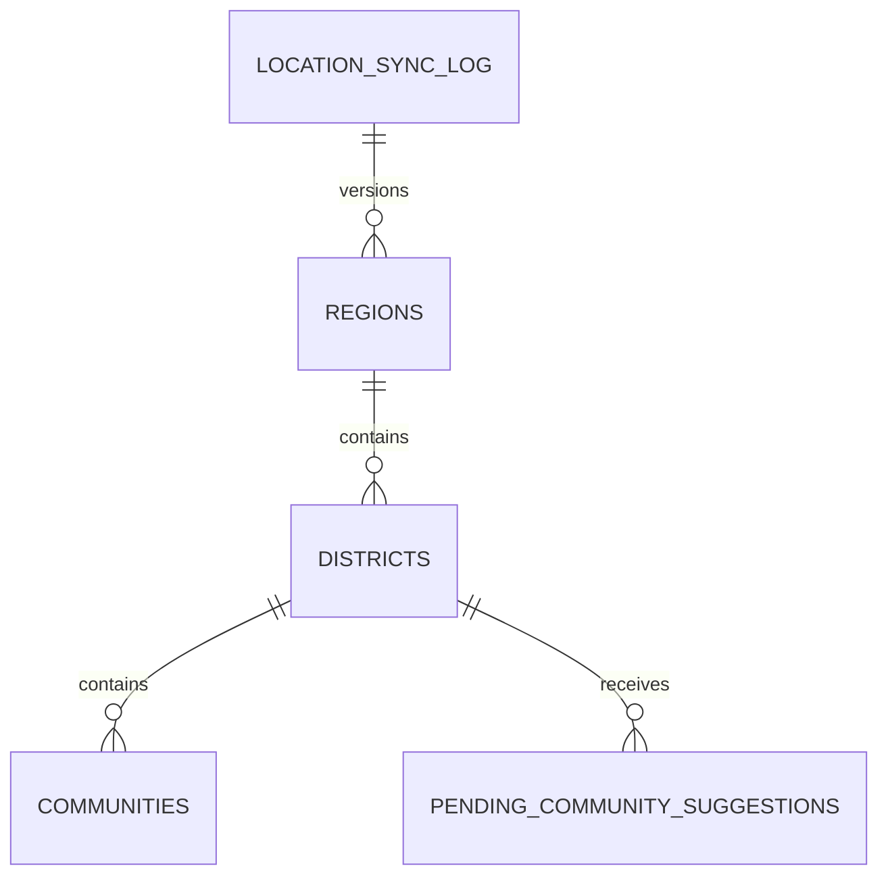

# Location Master Architecture

**Product version:** 1.8.0  
**Language:** British English

## Purpose

The Ghana Administrative Location Master is the authoritative geographic hierarchy for WILMS. Runtime forms, offline registration, reporting, and future GIS work must use local PostgreSQL master data rather than third-party APIs at request time.

## Canonical hierarchy

| Entity | Table | Key rules |
|--------|-------|-----------|
| Region | `regions` | unique `code`, unique `name`, provenance via `source` + `source_id` |
| District | `districts` | unique `(region_id, name)`, category = Metropolitan / Municipal / District |
| Community | `communities` | unique `(district_id, name)`, aliases and optional coordinates |
| Suggestion | `pending_community_suggestions` | never auto-inserts into master data |
| Sync log | `location_sync_log` | records every import run |

## Compatibility model

Operational tables keep their existing text fields and gain nullable FK columns:

- `borrowers.region_id`, `borrowers.district_id`, `borrowers.community_id`
- `groups.community_id`
- `collectors.assigned_region_id`, `collectors.assigned_district_id`, `collectors.assigned_community_id`

This preserves historical references while enabling progressive joins for analytics and territory assignment.

## Runtime principles

1. Neon/PostgreSQL is the source of truth once imported.
2. External datasets are used only during import/synchronisation.
3. Frontend and offline clients cache hierarchy snapshots locally.
4. Community creation is suggestion-driven and reviewed.
5. Imports are idempotent using stable source IDs.
