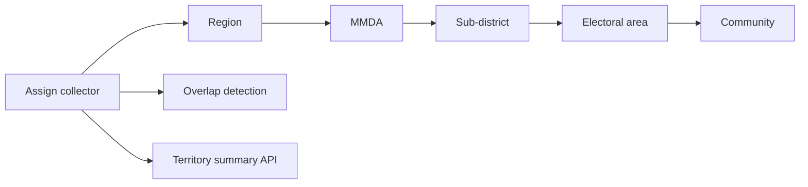

# Territory Management Guide

**Product version:** 1.8.0  
**Language:** British English

## Assignment columns

`assigned_region_id`, `assigned_district_id`, `assigned_sub_district_unit_id`, `assigned_electoral_area_id`, `assigned_community_id` (+ text fallbacks).

## APIs

| Endpoint | Purpose |
|----------|---------|
| `GET /collectors/:id/territory` | Borrower/group density and overlaps for one collector |
| `GET /collectors/territory/overlaps` | Pairwise shared-territory report |

## UI

Collector onboard modal supports region / MMDA selectors and community autocomplete.
