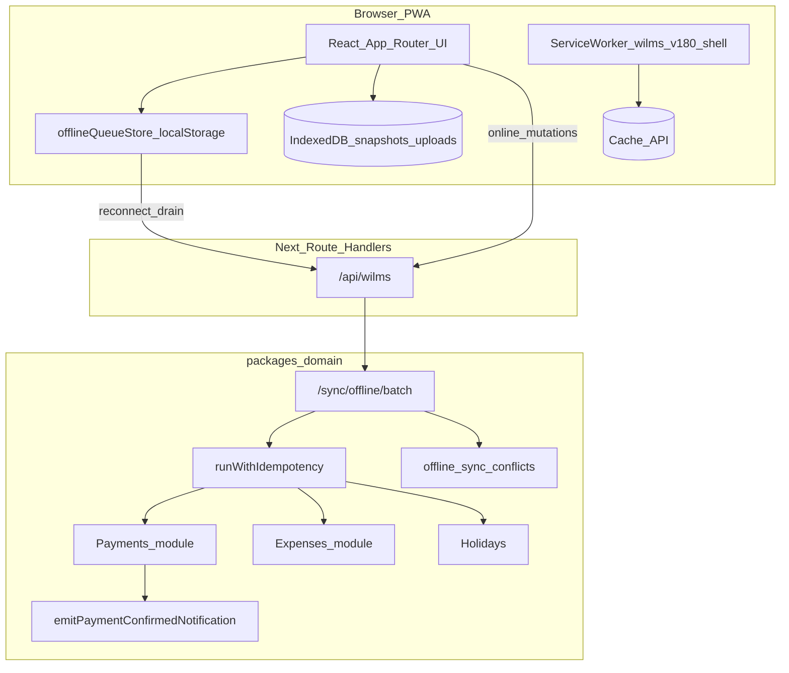
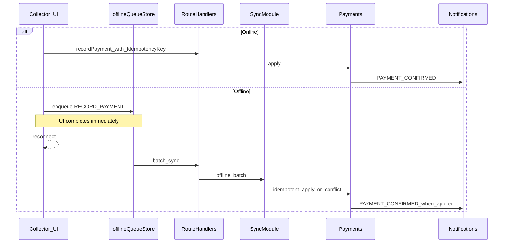

# WILMS Offline Architecture Discovery Report

**Product version:** 1.8.0  
**Sprint branch:** `feature/v1.8.0-offline-first-pwa`  
**Rollback tag:** `v1.8.0-offline-rc1`  
**Phase:** 0 — Architecture discovery (documentation only; no behaviour change in this phase)  
**Language:** British English  

## Executive summary

WILMS already ships a **field-critical offline capability**, not a greenfield offline stack. Collectors can queue payments, expenses, and holiday request creates locally; a custom service worker caches shell routes; IndexedDB holds read snapshots and upload blobs; the domain API ingests offline batches and routes financial conflicts to Approver review.

This report inventories that architecture from the repository and existing documentation. It does **not** claim that enterprise-grade WhatsApp-style offline-first is complete for every module. Residuals called out in v1.8.0 offline reports remain in force: mutation queue durability (localStorage), limited write coverage, and device smoke certification gaps.

**Critical product rule (confirmed in code):** WILMS does **not** use printable payment receipts. The authoritative “receipt” is the **payment confirmation notification** (`PAYMENT_CONFIRMED` via `emitPaymentConfirmedNotification`). Offline design must preserve confirmation events after sync — not introduce PDF/receipt tables.

---

## Evidence sources

| Source | Path |
|--------|------|
| Hub doc | [`docs/offline-architecture.md`](../../docs/offline-architecture.md) |
| v1.8.0 architecture | [`docs/v1.8.0/OFFLINE_ARCHITECTURE_REPORT.md`](../../docs/v1.8.0/OFFLINE_ARCHITECTURE_REPORT.md) |
| v1.8.0 completion | [`docs/v1.8.0/OFFLINE_COMPLETION_REPORT.md`](../../docs/v1.8.0/OFFLINE_COMPLETION_REPORT.md) |
| Certification | [`docs/v1.8.0/certification/OFFLINE_CERTIFICATION_REPORT.md`](../../docs/v1.8.0/certification/OFFLINE_CERTIFICATION_REPORT.md) |
| Sync guide | [`docs/synchronization-guide.md`](../../docs/synchronization-guide.md) |
| Service worker | [`apps/frontend/public/sw.js`](../../apps/frontend/public/sw.js) |
| Mutation queue | [`apps/frontend/src/state/offlineQueueStore.ts`](../../apps/frontend/src/state/offlineQueueStore.ts) |
| Sync handlers | [`apps/frontend/src/lib/offline-queue/`](../../apps/frontend/src/lib/offline-queue/) |
| Domain sync | [`packages/domain/src/modules/sync/`](../../packages/domain/src/modules/sync/) |
| Idempotency | [`packages/domain/src/infrastructure/idempotency/run-with-idempotency.ts`](../../packages/domain/src/infrastructure/idempotency/run-with-idempotency.ts) |
| Feature flags | [`packages/domain/src/config/feature-flags.ts`](../../packages/domain/src/config/feature-flags.ts) |
| Payment confirmation | [`packages/domain/src/infrastructure/notifications/payment-notifications.ts`](../../packages/domain/src/infrastructure/notifications/payment-notifications.ts) |

---

## Current architecture diagram

---

## Layer inventory

### 1. Monorepo runtime

| Piece | Location | Role |
|-------|----------|------|
| Frontend | `apps/frontend` (Next.js App Router) | UI + Route Handlers proxy `/api/wilms` |
| Domain | `packages/domain` | Services, Drizzle/Neon, HTTP app used in-process |
| Optional API | `apps/backend` | Thin adapter (dual-run) |

Preferred local mode uses in-process domain via frontend Route Handlers (`AGENTS.md`).

### 2. Service worker / PWA

| Item | Evidence |
|------|----------|
| Implementation | Hand-rolled `apps/frontend/public/sw.js` — **no** next-pwa / Serwist / Workbox in package manifests |
| Cache name | `wilms-v180-shell` |
| Precache | Shell HTML routes for collector / officer / approver / auditor / admin + icons/manifest |
| Navigation | Network-first for navigations; API/`_next`/`capture` bypass cache |
| Background Sync | Payment sync tag `wilms-payment-sync` + client message bridge |
| Registration | `ServiceWorkerRegistrar`, install banner, iOS prompt, update prompt |

### 3. State-management layers

| Layer | Technology | Offline relevance |
|-------|------------|-------------------|
| Server state | TanStack Query | Collector query persister uses localStorage |
| Mutation queue | Zustand `offlineQueueStore` | Payments, expenses, holiday creates in **localStorage** (`wilms-offline-queue`) |
| Upload queue | IndexedDB `wilms-field-ops` | Photos/attachments |
| Read snapshots | IndexedDB via `offlineSnapshotStore` | Dashboard / notifications SWR-style fallback |
| UI chrome | Zustand theme/shell/ui stores | Online/offline banners and sync panel |

### 4. Mutation queue item types (code)

From `offlineQueueStore.ts`:

- `RECORD_PAYMENT`
- `RECORD_EXPENSE`
- `HOLIDAY_REQUEST_CREATE`

Drain path: `useOfflineQueueSync` → payment / expense / holiday handlers → `offlineSyncService` → domain `/sync/offline/batch` (payments/financial review path as documented).

### 5. Idempotency

| Mechanism | Path |
|-----------|------|
| Frontend money mutations | `apps/frontend/src/utils/financialMutation.ts` |
| Domain wrapper | `runWithIdempotency` + idempotency repository |
| Scopes expansion | Migration `0040_v180_phase33_idempotency_scopes.sql` (expense / admin-fee among others) |
| Offline batch | Queue item `id` used as idempotency key on ingest (per sync service wiring) |

### 6. Feature flags (existing)

`packages/domain/src/config/feature-flags.ts` exposes `WILMS_FLAG_*` for durable queues, require-idempotency, cursor pagination, outbox, tracing, GL dual-write.  
**There is no product flag named `WILMS_OFFLINE_MODE` today.** Phase 4 of this sprint must add an explicit offline boundary without changing default production behaviour.

### 7. Notification / confirmation (“receipt”) path

| Step | Evidence |
|------|----------|
| Emit | `emitPaymentConfirmedNotification` → `notificationType: 'PAYMENT_CONFIRMED'` |
| Channels | SMS, email (subject copy uses “payment receipt” wording), collector in-app |
| PDF receipts | **Not present** — do not invent |

Offline payments must not skip confirmation after successful sync; confirmation remains the authoritative borrower receipt.

---

## Financial write paths (inventory)

| Path | Online | Offline write today | Notes |
|------|--------|---------------------|-------|
| Record payment | Yes | **Queued** | Approver conflict review for financial offline ops |
| Admin fee | Yes | Not listed as durable offline write in hub matrix | Treat as online-only until Phase 1 reclassifies with code proof |
| Reconciliation submit / approve | Yes | Online-only (decisions); conflict UI for queued financial ops | |
| Expenses | Yes | **Queued** | Direct apply when online per hub doc |
| Adjustments / write-offs | Yes | Online-only | |
| Loan disbursement | Yes | Online-only | |
| Pool capital mutations | Yes | Online-only | |

## Read paths (inventory)

| Path | Caching today |
|------|---------------|
| Collector dashboard / borrowers due today | Query + optional snapshots |
| Notifications inbox | IndexedDB snapshot support |
| Reports / exports / executive | Online preferred; shell may open route HTML |
| Documentation portal | Shell route listed in SW precache; content still network-dependent |

## Offline-sensitive pages

| Area | Sensitivity |
|------|-------------|
| Collector dashboard, payment entry, expenses, holidays | High — field connectivity |
| Collector reconciliation | High financial integrity; decisions online-only today |
| Registration officer drafts | Drafts exist server-side; durable offline draft sync not in hub write matrix |
| Approver sync-conflicts | Required for offline payment review |
| Super Admin dashboards / reports | Low for writes; reporting integrity requires online freshness |

---

## Request / financial / sync flow

---

## Synchronisation risks (from repo docs + code shape)

| Risk | Why it matters | Evidence / residual |
|------|----------------|---------------------|
| localStorage mutation queue | Quota, multi-tab races, easier wipe than IndexedDB | Hub architecture table; residual called in planning discussions |
| Duplicate replay | Double collection if idempotency fails | Mitigated by idempotency keys + conflict review for payments |
| Stale borrower / schedule data | Offline reads may drift from holidays/schedules | Read snapshots are not a source of truth for money |
| Notification timing | Borrower confirmation delayed until sync completes | Expected; must remain the receipt path |
| Device certification | Device smoke checklist not fully executed | `OFFLINE_CERTIFICATION_REPORT.md` |
| Expanding write surface too fast | Approvals/registration/reports online-only by design | Completion report scope notes |

---

## Browser capabilities assessment

| Capability | Suitability for WILMS | Notes |
|------------|----------------------|-------|
| Service Worker + Cache API | **In use** | Adequate for shell; navigations network-first limits true offline HTML freshness |
| IndexedDB | **In use** for uploads/snapshots | Preferred durable store for future mutation queue migration |
| Background Sync API | **Partial** | Payment sync tag present; browser support varies |
| Push API | Separate from offline writes | VAPID + subscriptions; prefs default on |
| localStorage | **In use** for mutation queue | Convenient but weaker durability |

---

## IndexedDB suitability

**Already suitable and used** for binary uploads and read snapshots. The primary architectural gap for “true” offline-first durability is moving the **mutation queue** from localStorage → IndexedDB (or equivalent durable store) without changing financial semantics. That is a Phase 2/3 design item, not Phase 0 implementation.

---

## Service worker suitability

The custom SW is the **baseline**, not a candidate for deletion in Phase 0. Migration to Serwist/Workbox is optional later and must not be assumed. Constraints observed in `sw.js`:

- Explicit bypass for `/api/`, `/_next/`, `/capture/`
- Navigate mode bypasses cache (network-first) — shell precache helps repeat visits more than first offline cold start of uncached deep links

---

## Vercel / Next.js App Router considerations

| Constraint | Implication |
|------------|-------------|
| Serverless Route Handlers | Sync must be request/response idempotent; long-lived workers optional via Redis/BullMQ flags |
| Edge vs Node | Domain DB work runs in Node runtime paths used by WILMS today |
| Static asset CDN | Good fit for SW asset caching; HTML still deployment-sensitive (update prompt exists) |
| No durable browser storage on server | All offline durability is client-side until sync succeeds |

---

## Optimistic UI / retry / existing sync behaviour

| Behaviour | Present? | Location |
|-----------|----------|----------|
| Optimistic complete-then-sync for payments/expenses/holidays | Yes | `useRecordPaymentOrQueue`, expense/holiday counterparts |
| Retry / drain on reconnect | Yes | `useOfflineQueueSync`, toasts, sync panel |
| Conflict review UI | Yes | Approver `/approver/sync-conflicts` |
| Offline banner + init overlay | Yes | `OfflineBanner`, `OfflineInitOverlay`, `AppOfflineShell` |

---

## What Phase 0 does **not** change

- No new financial write types  
- No PDF/receipt subsystem  
- No `WILMS_OFFLINE_MODE` flag yet (Phase 4)  
- No claim that full offline-first is implemented  

---

## Risks found (Phase 0)

1. Treating existing offline as incomplete **or** complete without reading residuals — both wrong; it is **partial and production-relevant**.  
2. localStorage queue durability under storage pressure.  
3. Lack of a single kill-switch flag for offline behaviour (`WILMS_OFFLINE_MODE`).  
4. Device-level certification still a backlog item.  
5. Confirmation notifications must remain coupled to successful payment apply after sync.

---

## Recommendation after Phase 0

Proceed to **Phase 1 — Safety and Integration Analysis** (`documentation/offline/SAFETY_AND_INTEGRATION_ANALYSIS.md`), classifying each module as Safe Offline / Safe Cached / Queue Required / Online Only using the inventories above. Prefer a **phased** strategy (later Phase 8 options C/D) over big-bang full offline-first until financial simulation (Phase 7) proves payment queue safety under adversarial conditions.

---

## Next phase

| Item | Value |
|------|-------|
| Branch | `feature/v1.8.0-offline-first-pwa` |
| Tag | `v1.8.0-offline-rc1` |
| This deliverable | `documentation/offline/ARCHITECTURE_DISCOVERY_REPORT.md` |
| Next | Phase 1 safety analysis document only (still no financial write expansion) |
