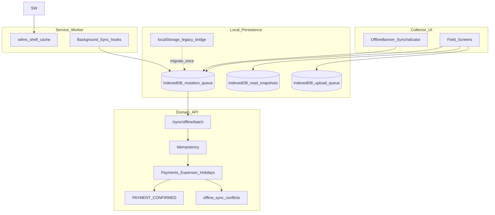
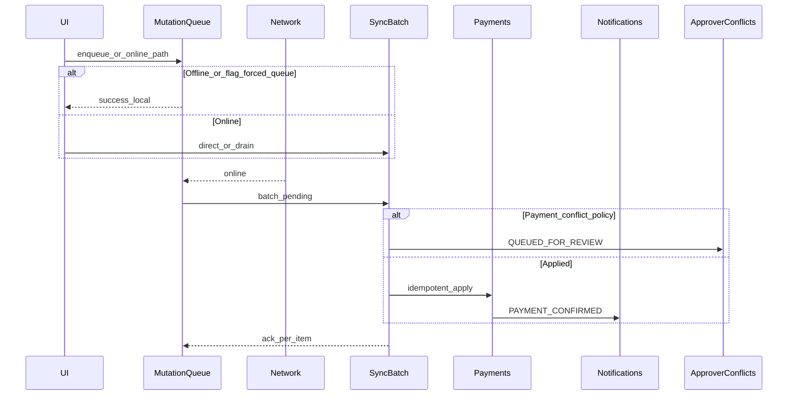

# WILMS Offline Architecture Design

**Product version:** 1.8.0  
**Sprint branch:** `feature/v1.8.0-offline-first-pwa`  
**Rollback tag:** `v1.8.0-offline-rc1`  
**Phase:** 2 — Architecture design (documentation only; no implementation)  
**Language:** British English  
**Depends on:** [`ARCHITECTURE_DISCOVERY_REPORT.md`](./ARCHITECTURE_DISCOVERY_REPORT.md), [`SAFETY_AND_INTEGRATION_ANALYSIS.md`](./SAFETY_AND_INTEGRATION_ANALYSIS.md)

## Executive summary

This design describes the **target** offline-first architecture for WILMS. It builds on the existing custom service worker, localStorage mutation queue, IndexedDB uploads/snapshots, and `/sync/offline/batch` ingest. It does **not** introduce printable receipts. Borrower payment confirmation remains `PAYMENT_CONFIRMED` after successful apply.

The design goal is WhatsApp-like field continuity for Collectors while preserving financial integrity: immediate UI completion, durable local persistence, automatic sync, idempotent replay, and Approver conflict review for payment money paths.

---

## Design principles

1. **Flag-gated** — when offline mode is disabled, behaviour equals today’s production paths.  
2. **No invented write types** — only extend queue coverage after Phase 1 classification and Phase 7 simulation.  
3. **Confirmation is the receipt** — sync must emit existing notification pipeline; no PDF/receipt tables.  
4. **Idempotent by default** — every queued money operation carries a stable idempotency key.  
5. **Conflict visibility** — financial payment conflicts remain Approver-reviewed.  
6. **Harden before expand** — improve durability of the existing three queue types before adding new ones.

---

## Target architecture

---

## IndexedDB layer

| Store | Purpose | Phase |
|-------|---------|-------|
| `mutations` | Durable queue replacing/augmenting `wilms-offline-queue` localStorage | 3D / hardening |
| `snapshots` | Existing dashboard/notifications (and later borrower/group read models) | 3B |
| `uploads` | Existing `wilms-field-ops` photo/attachment blobs | keep |
| `meta` | Schema version, last sync cursor, flag snapshot | 3A |

**Migration rule:** On enable, copy pending localStorage queue items into IndexedDB once; keep dual-read until drained; never drop undrained money items.

---

## Service worker and cache strategy

| Request class | Strategy | Notes |
|---------------|----------|-------|
| Shell assets / precached routes | Cache-first with versioned cache name | Continue `wilms-v180-*` versioning |
| Navigations | Network-first, cache fallback when flag on | Today: navigate bypasses cache — Phase 3A may add offline fallback for known shell routes only |
| `/api/wilms/*` | Network-only | Never cache money responses as truth |
| `/_next/*` | Stale-while-revalidate or cache-first for hashed assets | Align with Next asset hashing |
| `/capture/*` | Network-only | Tokens/security |

**Do not** adopt Serwist/Workbox in this design as a requirement; optional later migration only if justified.

---

## Operation queue

### Item schema (logical)

| Field | Purpose |
|-------|---------|
| `id` | Stable UUID — also idempotency key for batch |
| `type` | `RECORD_PAYMENT` \| `RECORD_EXPENSE` \| `HOLIDAY_REQUEST_CREATE` (+ future only after gates) |
| `payload` | Domain DTO |
| `status` | `pending` \| `syncing` \| `failed` \| `queued_for_review` \| `done` |
| `attempts` | Retry count |
| `createdAt` / `updatedAt` | Diagnostics |
| `lastError` | Operator-visible |

### Allowed types (near term)

Only the three types already in `offline-queue.ts`. Admin fees, reconciliations, registration submit, pools, disbursements, adjustments remain **out of queue**.

---

## Synchronisation engine

**Drain triggers:** reconnect, visibility/focus, Background Sync tag, manual “Sync now”, AppOfflineShell init.

**Ordering:** Preserve per-collector FIFO for payments against the same loan where possible; document when parallelisation is safe (different loans).

---

## Conflict resolution

| Operation | Policy |
|-----------|--------|
| Payment | Existing Approver `offline_sync_conflicts` review before ledger apply (or keep current queued-for-review semantics) |
| Expense | Today: direct apply — design keeps this until Phase 7 decides SoD upgrade |
| Holiday create | Apply on sync; approval remains online |
| Stale schedule / holiday clash | Fail item with operator message; do not invent auto-merge |

---

## Retry strategy

| Attempt band | Behaviour |
|--------------|-----------|
| 1–3 | Immediate / short backoff |
| 4–8 | Exponential backoff (capped) |
| >8 | Mark failed; keep payload; require manual retry |
| 4xx domain business errors | Stop auto-retry; surface message |
| Network errors | Continue backoff |

Idempotency keys must remain stable across retries.

---

## Idempotent replay

- Reuse existing `financialMutation` / `runWithIdempotency` and offline batch key = queue item `id`.  
- Never regenerate keys on retry.  
- Server remains source of truth for “already applied”.

---

## Local persistence and draft recovery

| Concern | Design |
|---------|--------|
| Payment/expense/holiday queue | Durable IndexedDB (target) |
| Registration drafts | Phase 3C: **local-only** draft blob optional; no sync until designed |
| Reconciliation drafts | Phase 3E: local draft only; **no** auto-submit |
| Crash recovery | On boot, rehydrate queue and show banner counts |

---

## Sync indicators and diagnostics

| Surface | Content |
|---------|---------|
| Offline banner | Offline vs online; pending / failed / review counts (existing `OfflineBanner` / sync panel) |
| Sync status panel | Progress, last success, per-type counts |
| Diagnostics (ops) | Queue size, oldest pending age, storage estimate, SW cache version — read-only |

---

## Storage management

- Estimate usage via Storage API when available.  
- Warn before quota exhaustion; never silently drop payment items.  
- Provide “export failed queue for support” (JSON) without secrets (no session tokens).

---

## Feature-flag boundary (design contract for Phase 4)

| Flag | Default | Effect |
|------|---------|--------|
| `WILMS_OFFLINE_MODE` | `false` | When false: no new offline behaviours; existing queue paths may remain as today unless a stricter “legacy offline” subflag is introduced — Phase 4 must define exact parity tests |

Recommended subflags (optional, default off for new work):

- `WILMS_OFFLINE_SHELL_FALLBACK`  
- `WILMS_OFFLINE_READ_CACHE_EXPAND`  
- `WILMS_OFFLINE_QUEUE_IDB`

---

## Explicit non-goals

- PDF / printable receipt subsystem  
- Offline Approver approval of loans  
- Offline reconciliation **decisions** apply  
- Offline loan pool / disbursement / adjustment mutations  
- Silent browser push permission grants  

---

## Risks and open questions (design)

1. Should expenses gain payment-like conflict review? (Phase 7)  
2. Exact parity definition when `WILMS_OFFLINE_MODE=false` vs today’s always-on queue for collectors.  
3. Multi-tab IndexedDB queue coordination (BroadcastChannel).  
4. Navigate network-first vs offline shell fallback UX trade-off.

---

## Next phase

Produce [`PHASED_ROLLOUT_PLAN.md`](./PHASED_ROLLOUT_PLAN.md) mapping this design to 3A–3H with rollback and test gates.
