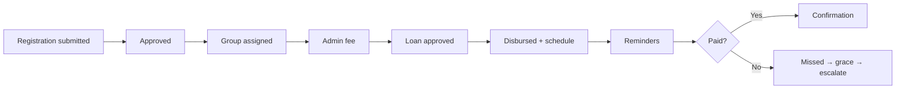

# Borrower Communication Lifecycle

**Product:** WILMS v1.8.0  
**Status:** Hardened in Phase 11

## Channels

SMS · Email · In-app · Push (via existing preference/quiet-hours gates)

Critical delinquency messages use severity that can bypass quiet hours for push/in-app where configured.

## Milestone matrix

| Event | SMS | Email | In-app | Notes |
|-------|-----|-------|--------|-------|
| Registration submitted | Yes | Yes | Officer | `REGISTRATION_SUBMITTED` |
| Registration approved | Yes | Yes | — | Includes next-step copy; group/collector when known |
| Group assigned | Yes | — | Collector + actor | `GROUP_ASSIGNED` |
| Admin fee paid | Existing | Existing | Existing | Payment confirmation path |
| Loan approved | Existing | Existing | Collector | |
| Loan disbursed | Existing | Existing | Collector | Amount released |
| Schedule generated | Yes | — | — | Distinct event `SCHEDULE_GENERATED` (no duplicate `LOAN_DISBURSED` SMS) |
| Reminder (T-1) | Existing scheduler | Existing | Existing | |
| Due today | Existing | Existing | Existing | |
| Missed | Existing | Existing | Existing | Grace messaging ladder |
| Grace ending | Existing | Existing | Existing | |
| Escalated overdue | Existing | Existing | Existing | May bypass quiet hours |
| Payment received | Existing | Existing | Existing | Amount, weeks, balance, next due |

## Diagram (lifecycle)

## Audit

Automated deliveries continue to write message delivery logs; membership and lifecycle actions append audit entries.
