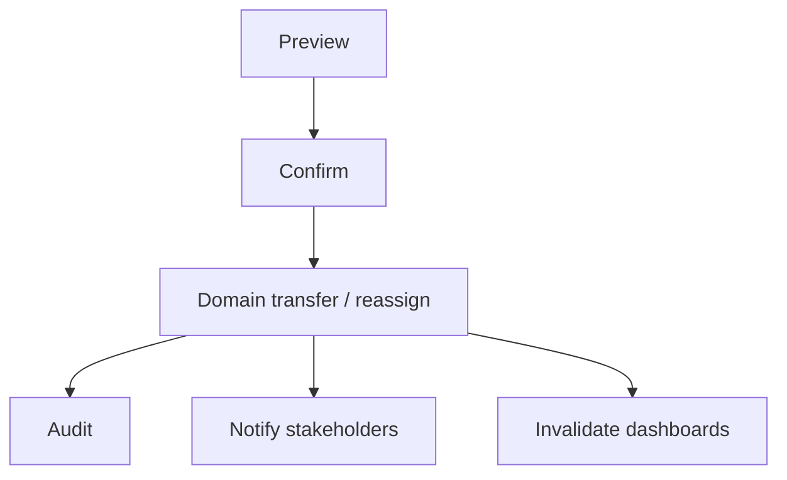

# Operations Reassignment Specification

**Product:** WILMS v1.8.0  
**UI:** `/ops/reassignment` (linked from Operations)

## Group reassignment

1. Preview source → target and reason.
2. Transfer membership (`transferMember`).
3. Update borrower group linkage (`assignBorrowerToGroup`).
4. Notify old/new collectors and actor (in-app).
5. Audit `group.member_transferred`.
6. Invalidate groups, borrowers, dashboards, reports caches on the client.

Active-loan removals still require Super Admin approval path where validation demands it.

## Collector reassignment

1. Preview group and new collector.
2. Update `groups.collectorUserId`.
3. Notify new collector; notify previous collector if different.
4. Audit `group.collector_reassigned`.
5. Refresh operational queries.

## Individual borrower collector change

Borrower-level collector follows group assignment. Move the borrower to the target group (group reassignment) when an individual must change collector.

## Notifications

| Audience | Channel |
|----------|---------|
| Old collector | In-app |
| New collector | In-app (+ email on assign where existing helpers apply) |
| Super Admin / actor | In-app confirmation |
| Borrower | SMS on group assign |

## Diagram

